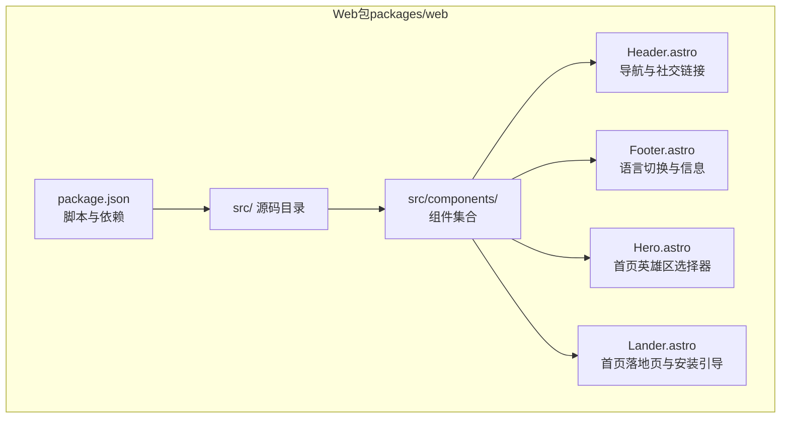
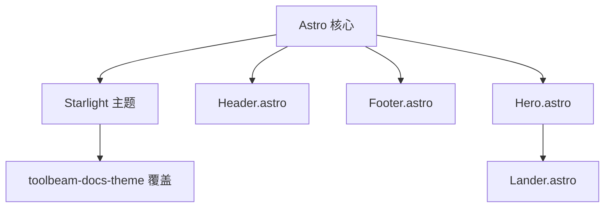
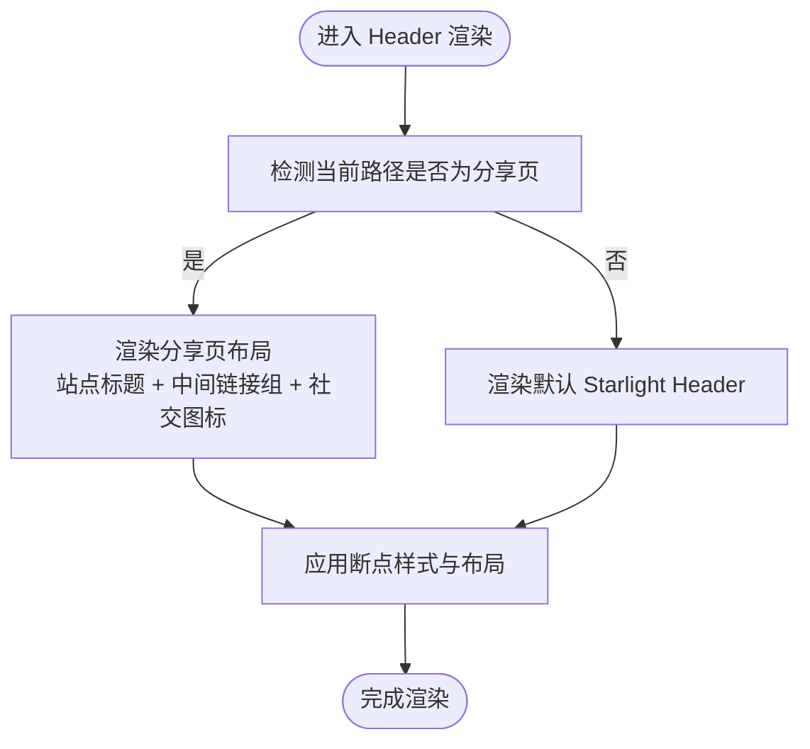
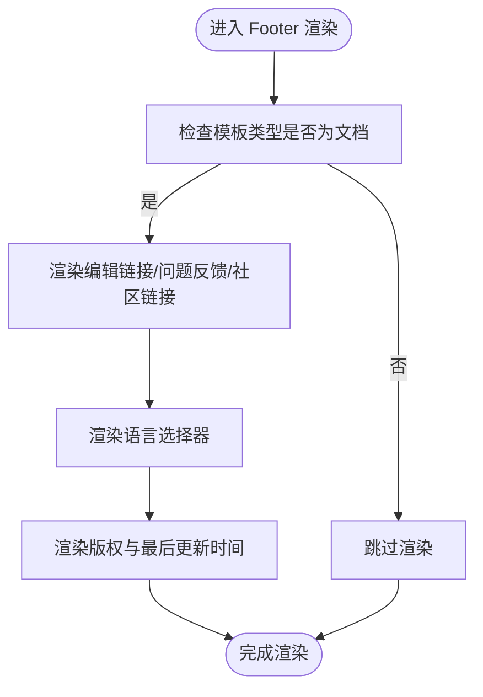
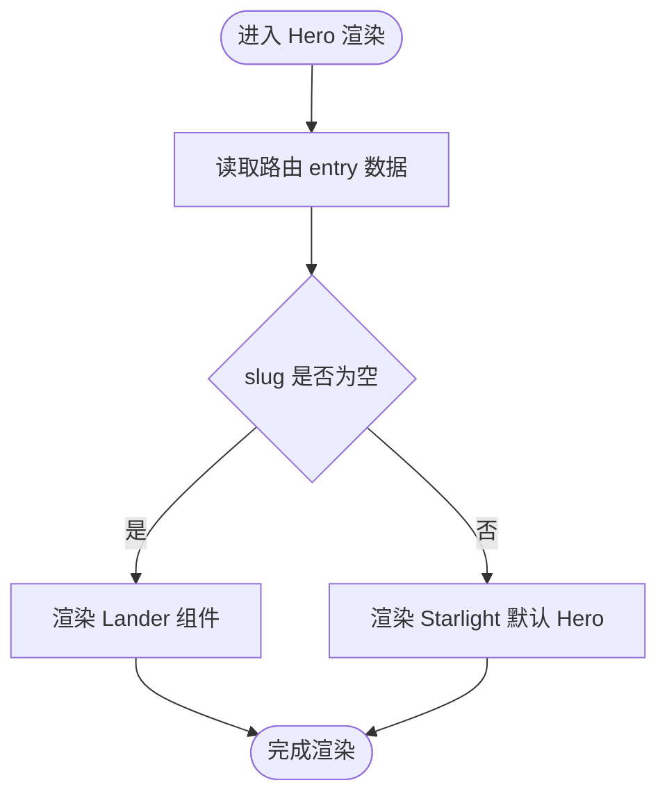
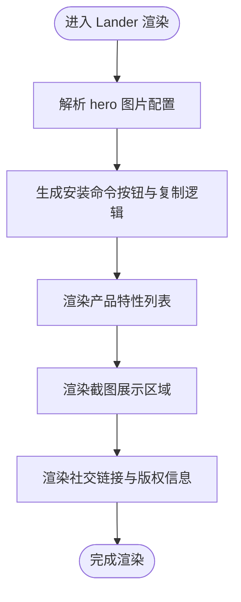
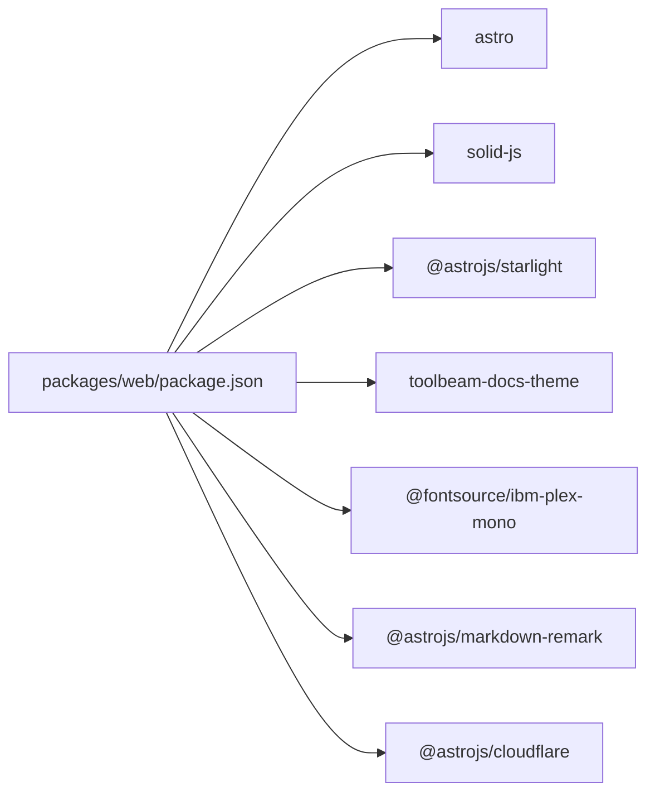

# Web界面

<cite>
**本文引用的文件**
- [packages/web/package.json](file://packages/web/package.json)
- [packages/web/src/components/Header.astro](file://packages/web/src/components/Header.astro)
- [packages/web/src/components/Footer.astro](file://packages/web/src/components/Footer.astro)
- [packages/web/src/components/Hero.astro](file://packages/web/src/components/Hero.astro)
- [packages/web/src/components/Lander.astro](file://packages/web/src/components/Lander.astro)
</cite>

## 目录
1. [简介](#简介)
2. [项目结构](#项目结构)
3. [核心组件](#核心组件)
4. [架构总览](#架构总览)
5. [详细组件分析](#详细组件分析)
6. [依赖分析](#依赖分析)
7. [性能考虑](#性能考虑)
8. [故障排除指南](#故障排除指南)
9. [结论](#结论)
10. [附录](#附录)

## 简介
本文件面向OpenCode的Web界面（网站与文档站点），聚焦于其作为“Web管理面板”的定位与实现形态。当前仓库中的Web包基于Astro与Starlight构建，主要承担官网与文档站点的角色，而非传统意义上的“管理后台”。本文将从系统架构、组件关系、数据流、处理逻辑、集成点、错误处理与性能特性等维度进行深入解析，并结合现有源码给出可操作的部署与优化建议。

## 项目结构
Web界面位于packages/web目录，采用Astro + Starlight的静态站点生成方案，核心由若干Astro组件构成，配合主题与国际化配置，形成统一的头部、页脚与落地页组件体系。

**图示来源**
- [packages/web/package.json:1-44](file://packages/web/package.json#L1-L44)
- [packages/web/src/components/Header.astro:1-137](file://packages/web/src/components/Header.astro#L1-L137)
- [packages/web/src/components/Footer.astro:1-126](file://packages/web/src/components/Footer.astro#L1-L126)
- [packages/web/src/components/Hero.astro:1-12](file://packages/web/src/components/Hero.astro#L1-L12)
- [packages/web/src/components/Lander.astro:1-722](file://packages/web/src/components/Lander.astro#L1-L722)

**章节来源**
- [packages/web/package.json:1-44](file://packages/web/package.json#L1-L44)

## 核心组件
- 导航栏组件（Header.astro）
  - 负责在分享页面与文档页面之间切换显示策略，支持多语言相对路径与社交图标渲染。
  - 使用Starlight默认Header覆盖，结合自定义样式与断点布局。
- 页脚组件（Footer.astro）
  - 提供编辑链接、问题反馈、社区链接与语言选择器，支持国际化时间显示。
- 英雄区组件（Hero.astro）
  - 在首页与非首页使用不同的渲染策略：首页使用Lander，其他页面使用Starlight默认Hero。
- 首页落地页（Lander.astro）
  - 包含产品标题、安装命令复制、特性列表、截图展示与多平台安装入口，具备响应式网格布局与移动端适配。

上述组件共同构成Web界面的UI骨架，负责品牌展示、文档导航与用户引导。

**章节来源**
- [packages/web/src/components/Header.astro:1-137](file://packages/web/src/components/Header.astro#L1-L137)
- [packages/web/src/components/Footer.astro:1-126](file://packages/web/src/components/Footer.astro#L1-L126)
- [packages/web/src/components/Hero.astro:1-12](file://packages/web/src/components/Hero.astro#L1-L12)
- [packages/web/src/components/Lander.astro:1-722](file://packages/web/src/components/Lander.astro#L1-L722)

## 架构总览
Web界面采用“静态站点 + 组件化UI”的架构模式：
- 前端框架：Astro（静态站点生成与组件渲染）
- 文档主题：Starlight（文档站点主题与国际化）
- 主题覆盖：toolbeam-docs-theme（覆盖Header样式）
- 组件组织：以Astro组件为核心，通过虚拟配置与国际化工具注入内容
- 样式与布局：CSS变量与媒体查询实现响应式与暗色模式适配

**图示来源**
- [packages/web/src/components/Header.astro:1-137](file://packages/web/src/components/Header.astro#L1-L137)
- [packages/web/src/components/Hero.astro:1-12](file://packages/web/src/components/Hero.astro#L1-L12)
- [packages/web/src/components/Lander.astro:1-722](file://packages/web/src/components/Lander.astro#L1-L722)

## 详细组件分析

### 导航栏组件（Header.astro）
- 功能要点
  - 基于路由判断是否为分享页面，决定显示策略。
  - 读取Starlight配置与本地化文本，动态生成导航链接与社交图标。
  - 使用媒体查询控制不同断点下的显示行为（隐藏/显示中间组与右侧组）。
- 关键流程
  - 计算当前路径与语言，获取相对URL。
  - 渲染默认Header或自定义布局，注入样式与断点规则。
- 响应式与可访问性
  - 通过CSS变量与断点控制布局，避免长标题溢出。
  - 支持键盘焦点可见性与语义化链接。

**图示来源**
- [packages/web/src/components/Header.astro:1-137](file://packages/web/src/components/Header.astro#L1-L137)

**章节来源**
- [packages/web/src/components/Header.astro:1-137](file://packages/web/src/components/Header.astro#L1-L137)

### 页脚组件（Footer.astro）
- 功能要点
  - 条目模板为文档时渲染编辑链接、问题反馈与社区链接。
  - 集成语言选择器与最后更新时间（国际化日期格式）。
- 关键流程
  - 读取Starlight路由元数据与配置。
  - 根据模板类型条件渲染，注入图标与链接。
- 可维护性
  - 通过国际化键值与配置项解耦文案与社交链接。

**图示来源**
- [packages/web/src/components/Footer.astro:1-126](file://packages/web/src/components/Footer.astro#L1-L126)

**章节来源**
- [packages/web/src/components/Footer.astro:1-126](file://packages/web/src/components/Footer.astro#L1-L126)

### 英雄区组件（Hero.astro）
- 功能要点
  - 首页使用Lander，其他页面使用Starlight默认Hero。
  - 通过slug判断与Astro props传递内容。
- 关键流程
  - 读取Starlight路由entry数据，提取标题与副标题。
  - 根据slug分支渲染不同组件。

**图示来源**
- [packages/web/src/components/Hero.astro:1-12](file://packages/web/src/components/Hero.astro#L1-L12)
- [packages/web/src/components/Lander.astro:1-722](file://packages/web/src/components/Lander.astro#L1-L722)

**章节来源**
- [packages/web/src/components/Hero.astro:1-12](file://packages/web/src/components/Hero.astro#L1-L12)

### 首页落地页（Lander.astro）
- 功能要点
  - 产品标题与标语展示。
  - 安装命令一键复制（支持多平台安装方式）。
  - 特性列表与截图展示，提供多语言文案与链接。
  - 响应式网格布局，移动端堆叠与断点调整。
- 关键流程
  - 解析图片配置（深浅主题或HTML片段）。
  - 生成多平台安装按钮与复制命令。
  - 渲染截图区域与社交媒体链接。
- 交互细节
  - 复制命令按钮在成功后短暂切换视觉状态。
  - 图片懒加载与解码异步优化。

**图示来源**
- [packages/web/src/components/Lander.astro:1-722](file://packages/web/src/components/Lander.astro#L1-L722)

**章节来源**
- [packages/web/src/components/Lander.astro:1-722](file://packages/web/src/components/Lander.astro#L1-L722)

## 依赖分析
- 运行时依赖
  - Astro：静态站点生成与组件运行时。
  - Solid JS：用于交互增强（如复制按钮）。
  - Starlight：文档主题与国际化。
  - toolbeam-docs-theme：覆盖Header样式。
  - 字体与Markdown渲染生态：字体、语法高亮、Markdown解析等。
- 开发依赖
  - TypeScript与类型检查工具链。
- 脚本与构建
  - dev/build/preview等脚本，支持本地开发与预览。

**图示来源**
- [packages/web/package.json:14-42](file://packages/web/package.json#L14-L42)

**章节来源**
- [packages/web/package.json:1-44](file://packages/web/package.json#L1-L44)

## 性能考虑
- 静态站点优势
  - Astro静态生成减少运行时开销，提升首屏速度与缓存命中率。
- 资源优化
  - 图片懒加载与解码异步，降低主线程阻塞。
  - 媒体查询与CSS变量减少重复样式计算。
- 交互优化
  - 复制命令使用异步剪贴板API，成功后短暂提示，避免频繁DOM变更。
- 构建与部署
  - 使用Cloudflare适配部署环境，结合静态资源缓存策略。

[本节为通用性能建议，不直接分析具体文件，故无“章节来源”]

## 故障排除指南
- 页面空白或组件未渲染
  - 检查Starlight配置与虚拟配置导入是否正确。
  - 确认组件路径与Astro运行时可用性。
- 复制命令无效
  - 确保浏览器支持Clipboard API且页面处于HTTPS上下文。
  - 检查按钮事件绑定与DOM结构。
- 响应式布局异常
  - 核对媒体查询断点与CSS变量覆盖顺序。
  - 确认容器宽度与网格布局声明。

[本节为通用排障建议，不直接分析具体文件，故无“章节来源”]

## 结论
OpenCode的Web界面以Astro与Starlight为核心，通过组件化的方式实现了清晰的导航、页脚与首页落地页。尽管当前Web包并非传统“管理后台”，但其组件化架构、响应式设计与国际化能力为后续扩展（如引入管理面板模块）提供了良好基础。建议在保持现有组件体系的前提下，逐步引入新的页面与模块，并沿用现有的样式与交互规范以确保一致性。

[本节为总结性内容，不直接分析具体文件，故无“章节来源”]

## 附录
- 部署与构建
  - 使用提供的脚本进行开发与预览，构建产物可用于静态托管或CDN分发。
- 浏览器兼容性
  - 建议使用现代浏览器；对于较老浏览器，需关注Clipboard API与CSS Grid支持情况。
- 移动端适配
  - 已内置多断点布局与响应式网格，建议在真实设备上验证交互与可读性。

[本节为通用指导，不直接分析具体文件，故无“章节来源”]