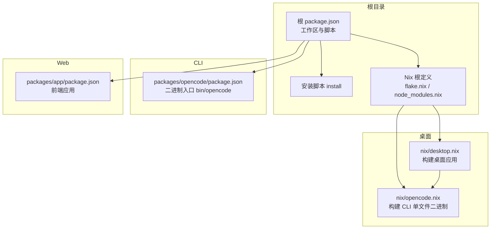
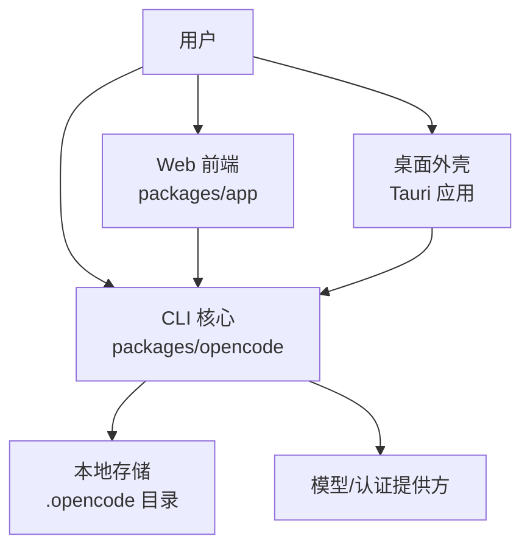
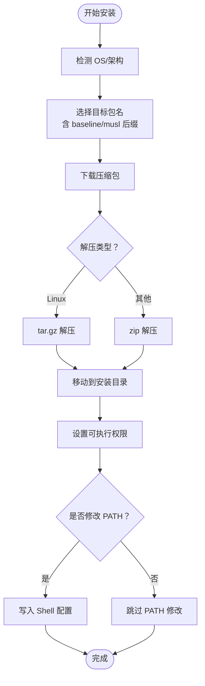
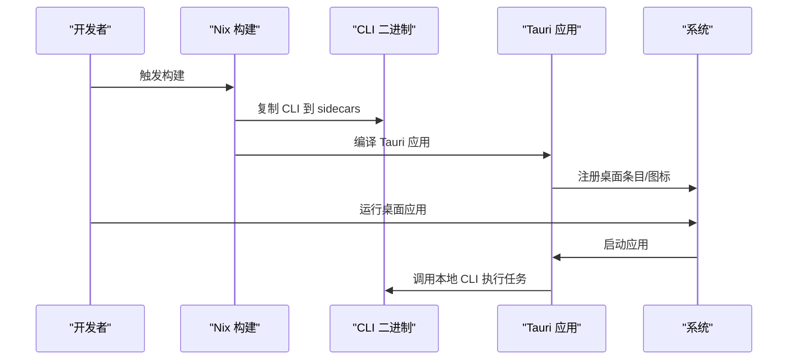
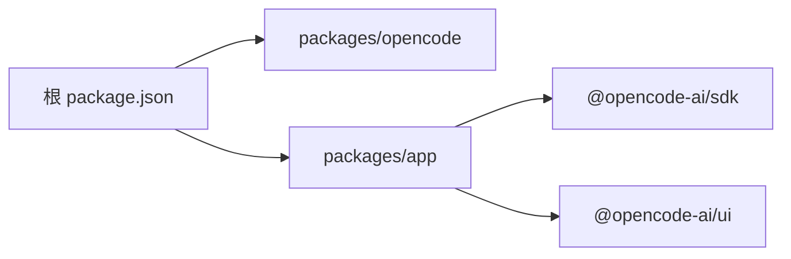

# 多平台支持

<cite>
**本文引用的文件**
- [README.md](file://README.md)
- [package.json](file://package.json)
- [install](file://install)
- [nix/opencode.nix](file://nix/opencode.nix)
- [nix/desktop.nix](file://nix/desktop.nix)
- [packages/opencode/package.json](file://packages/opencode/package.json)
- [packages/app/package.json](file://packages/app/package.json)
</cite>

## 目录
1. [简介](#简介)
2. [项目结构](#项目结构)
3. [核心组件](#核心组件)
4. [架构总览](#架构总览)
5. [详细组件分析](#详细组件分析)
6. [依赖分析](#依赖分析)
7. [性能考虑](#性能考虑)
8. [故障排查指南](#故障排查指南)
9. [结论](#结论)
10. [附录](#附录)

## 简介
本文件系统性介绍 OpenCode 的多平台支持能力，覆盖命令行界面（CLI）、桌面应用程序（Desktop）与 Web 界面（Web）三大平台。内容包括：各平台特性与适用场景、安装与配置方式、平台特定功能、跨平台数据同步与会话保持机制、权限管理、性能与资源占用对比、适用环境建议，以及平台切换与数据迁移最佳实践。

## 项目结构
OpenCode 采用多包工作区组织，核心 CLI 位于 packages/opencode，Web 前端位于 packages/app，桌面应用通过 Nix 构建集成 CLI 并打包为桌面客户端。根级安装脚本与 Nix 包管理器提供统一的安装体验。

图表来源
- [package.json:1-118](file://package.json#L1-L118)
- [packages/opencode/package.json:1-146](file://packages/opencode/package.json#L1-L146)
- [packages/app/package.json:1-74](file://packages/app/package.json#L1-L74)
- [nix/opencode.nix:1-98](file://nix/opencode.nix#L1-L98)
- [nix/desktop.nix:1-101](file://nix/desktop.nix#L1-L101)

章节来源
- [package.json:1-118](file://package.json#L1-L118)
- [README.md:46-142](file://README.md#L46-L142)

## 核心组件
- CLI 命令行界面：提供终端内高效交互，支持多种安装方式（包管理器、Nix、Yolo 脚本），具备自动补全与版本检测能力。
- 桌面应用程序：基于 Tauri/Rust 打包，内置 CLI 可执行文件，提供原生窗口与系统集成功能，适用于需要本地化与离线体验的用户。
- Web 界面：基于 Solid/TS/Vite 的前端应用，适合浏览器访问与快速试用，便于在无本地安装条件下的临时使用。

章节来源
- [README.md:46-118](file://README.md#L46-L118)
- [nix/desktop.nix:26-101](file://nix/desktop.nix#L26-L101)
- [packages/app/package.json:1-74](file://packages/app/package.json#L1-L74)

## 架构总览
OpenCode 的多平台架构以“共享核心 + 平台适配层”为核心设计：CLI 作为统一后端与数据中枢，Web 与桌面通过各自前端或原生外壳调用 CLI 或本地服务，实现一致的数据模型与会话状态。

图表来源
- [packages/opencode/package.json:21-23](file://packages/opencode/package.json#L21-L23)
- [packages/app/package.json:1-74](file://packages/app/package.json#L1-L74)
- [nix/desktop.nix:74-76](file://nix/desktop.nix#L74-L76)

## 详细组件分析

### CLI 命令行界面
- 安装与路径策略
  - 支持 curl 一键安装、包管理器安装（Homebrew、Scoop、Chocolatey、pacman 等）与 Nix 运行。
  - 安装脚本遵循优先级选择安装目录：OPENCODE_INSTALL_DIR > XDG_BIN_DIR > $HOME/bin > 默认 $HOME/.opencode/bin。
  - 自动注入 PATH，支持 Bash/Zsh/Fish 等常见 Shell 的配置文件。
- 版本与下载
  - 自动识别操作系统与 CPU 架构，按需附加 baseline/musl 后缀；Windows 使用 zip，Linux 使用 tar.gz。
  - 支持指定版本下载与校验，非 TTY 环境降级进度显示。
- 功能与扩展
  - 提供自动补全生成与安装，便于交互式使用。
  - 通过二进制入口暴露命令，便于被桌面应用侧车运行。

图表来源
- [install:79-167](file://install#L79-L167)
- [install:327-346](file://install#L327-L346)
- [install:362-439](file://install#L362-L439)

章节来源
- [README.md:46-98](file://README.md#L46-L98)
- [install:10-27](file://install#L10-L27)
- [install:68-98](file://install#L68-L98)
- [install:327-346](file://install#L327-L346)
- [install:362-439](file://install#L362-L439)
- [nix/opencode.nix:51-76](file://nix/opencode.nix#L51-L76)

### 桌面应用程序（Tauri）
- 构建与打包
  - 使用 Rust + Tauri 构建，Nix 将 CLI 二进制作为 sidecar 注入，确保桌面应用可直接调用 CLI。
  - Linux 下通过 wrapGAppsHook4 等工具链满足 GTK/WebKit 等运行时依赖。
- 平台差异
  - 输出程序名在 Linux 上进行重命名与 Desktop 文件修正，避免大小写冲突。
- 适用场景
  - 需要原生窗口、系统托盘、文件关联等本地化体验的用户。

图表来源
- [nix/desktop.nix:68-91](file://nix/desktop.nix#L68-L91)
- [nix/desktop.nix:79-83](file://nix/desktop.nix#L79-L83)

章节来源
- [nix/desktop.nix:26-101](file://nix/desktop.nix#L26-L101)

### Web 界面
- 技术栈与构建
  - 基于 Vite/Solid/TS，提供开发、构建与预览能力；测试包含单元与端到端。
- 适用场景
  - 快速试用、无需本地安装、浏览器即可访问的场景。

章节来源
- [packages/app/package.json:11-24](file://packages/app/package.json#L11-L24)

## 依赖分析
- 工作区与脚本
  - 根 package.json 定义了工作区与常用脚本，如 dev、dev:web、dev:desktop 等，便于在不同平台间切换开发模式。
- CLI 与桌面的依赖关系
  - 桌面应用通过 Nix 将 CLI 二进制作为 sidecar 注入，保证运行时一致性。
- 前端与 SDK
  - Web 前端依赖 SDK/UI 工作区包，形成统一的 UI 与能力抽象。

图表来源
- [package.json:21-27](file://package.json#L21-L27)
- [packages/app/package.json:42-72](file://packages/app/package.json#L42-L72)

章节来源
- [package.json:1-118](file://package.json#L1-L118)
- [packages/app/package.json:1-74](file://packages/app/package.json#L1-L74)

## 性能考虑
- CLI 安装与运行
  - 安装脚本针对不同平台与架构选择最优二进制，减少运行时开销。
  - Nix 构建将 CLI 打包为单文件二进制，便于分发与启动。
- 桌面应用
  - 通过 sidecar 方式复用 CLI，避免重复实现；Linux 运行时依赖通过 Nix 注入，减少环境差异带来的性能波动。
- Web 界面
  - 前端采用按需加载与组件化设计，适合轻量设备快速响应；对大文件处理建议结合 CLI 或桌面应用执行。

章节来源
- [nix/opencode.nix:41-49](file://nix/opencode.nix#L41-L49)
- [nix/desktop.nix:49-64](file://nix/desktop.nix#L49-L64)

## 故障排查指南
- 安装问题
  - 若 PATH 未更新，安装脚本会提示手动添加；也可通过 --no-modify-path 参数禁用自动修改。
  - 在非 TTY 环境或 Windows，进度条降级为标准输出，不影响安装流程。
- 版本与兼容性
  - 安装脚本会检测已安装版本，避免重复安装；支持指定版本下载与校验。
- 运行问题
  - CLI 二进制在不同 CPU/ABI 条件下自动选择 baseline/musl 变体，确保兼容性。
  - 桌面应用在 Linux 上进行名称与 Desktop 条目修正，避免大小写冲突导致的启动失败。

章节来源
- [install:221-235](file://install#L221-L235)
- [install:183-204](file://install#L183-L204)
- [install:362-439](file://install#L362-L439)
- [nix/desktop.nix:88-91](file://nix/desktop.nix#L88-L91)

## 结论
OpenCode 通过统一的 CLI 核心与多平台适配层，实现了 CLI、桌面与 Web 的一致体验。安装脚本与 Nix 构建提供了跨平台的便捷性与可靠性；桌面应用进一步增强本地化体验；Web 界面满足快速试用需求。三者在数据模型与会话状态上保持一致，便于在不同平台间无缝切换。

## 附录

### 各平台特点与适用场景
- CLI
  - 特点：终端高效、可自动化、可被桌面/Web 调用。
  - 场景：日常开发、CI/CD、远程服务器、低资源环境。
- 桌面
  - 特点：原生窗口、系统集成、侧车运行 CLI。
  - 场景：需要本地化体验、离线使用、文件关联与系统托盘。
- Web
  - 特点：浏览器即用、无需安装、快速试用。
  - 场景：临时访问、无本地安装条件、演示与协作。

章节来源
- [README.md:46-118](file://README.md#L46-L118)
- [nix/desktop.nix:26-101](file://nix/desktop.nix#L26-L101)
- [packages/app/package.json:1-74](file://packages/app/package.json#L1-L74)

### 安装方法与配置选项
- CLI 安装
  - 一键脚本、包管理器、Nix 运行。
  - 支持自定义安装目录、XDG 路径、手动 PATH 配置。
- 桌面安装
  - Homebrew cask、Scoop、GitHub Releases。
- Web 访问
  - 浏览器打开官网或本地预览。

章节来源
- [README.md:46-98](file://README.md#L46-L98)
- [README.md:67-84](file://README.md#L67-L84)

### 平台特定功能
- CLI
  - 自动补全、版本检测、进度显示降级。
- 桌面
  - sidecar CLI、Linux 运行时依赖注入、Desktop 条目修正。
- Web
  - 开发/构建/预览脚本、测试套件。

章节来源
- [nix/opencode.nix:71-76](file://nix/opencode.nix#L71-L76)
- [nix/desktop.nix:49-64](file://nix/desktop.nix#L49-L64)
- [packages/app/package.json:11-24](file://packages/app/package.json#L11-L24)

### 跨平台数据同步、会话保持与权限管理
- 数据与会话
  - CLI 与桌面均通过统一的本地存储目录承载配置与缓存；Web 通过浏览器存储或后端持久化（具体取决于部署形态）。
- 权限管理
  - CLI 通过模型提供商与认证 SDK 管理权限；桌面应用继承 CLI 的权限策略；Web 界面遵循相同后端权限模型。
- 同步与一致性
  - 三平台共享同一核心逻辑，确保会话状态与数据模型一致，便于跨平台无缝切换。

章节来源
- [packages/opencode/package.json:58-141](file://packages/opencode/package.json#L58-L141)
- [packages/app/package.json:40-72](file://packages/app/package.json#L40-L72)

### 性能对比与资源占用
- CLI：最小化依赖，启动快，资源占用低。
- 桌面：引入原生外壳与运行时依赖，启动略慢但体验更佳。
- Web：前端按需加载，轻量设备响应快，大文件处理建议结合 CLI/桌面。

章节来源
- [nix/opencode.nix:41-49](file://nix/opencode.nix#L41-L49)
- [nix/desktop.nix:49-64](file://nix/desktop.nix#L49-L64)

### 适用环境建议
- 服务器/容器：优先使用 CLI。
- 桌面办公：优先使用桌面应用。
- 快速试用/演示：使用 Web 界面。

章节来源
- [README.md:46-118](file://README.md#L46-L118)

### 平台切换最佳实践与数据迁移
- 切换建议
  - 从 CLI 切换到桌面：直接运行桌面应用，会话与配置自动复用。
  - 从 Web 切换到 CLI：在项目目录运行 CLI 命令，继续当前会话。
- 数据迁移
  - 三平台共享同一数据模型，迁移时仅需保留默认配置目录；如需迁移自定义配置，复制对应目录至新环境。

章节来源
- [README.md:46-118](file://README.md#L46-L118)
- [nix/opencode.nix:51-76](file://nix/opencode.nix#L51-L76)