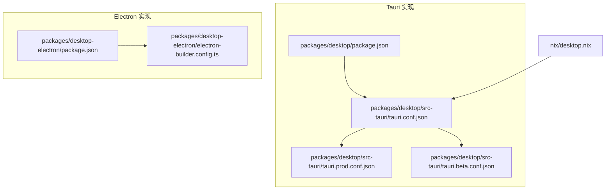
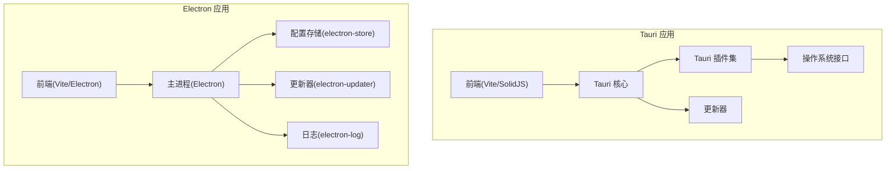
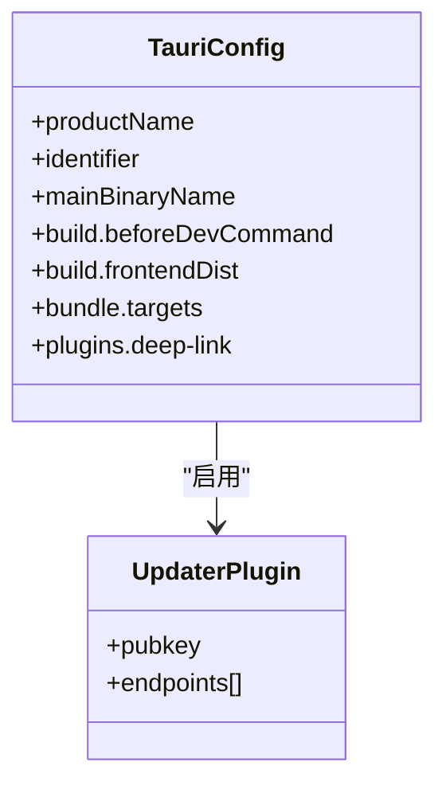
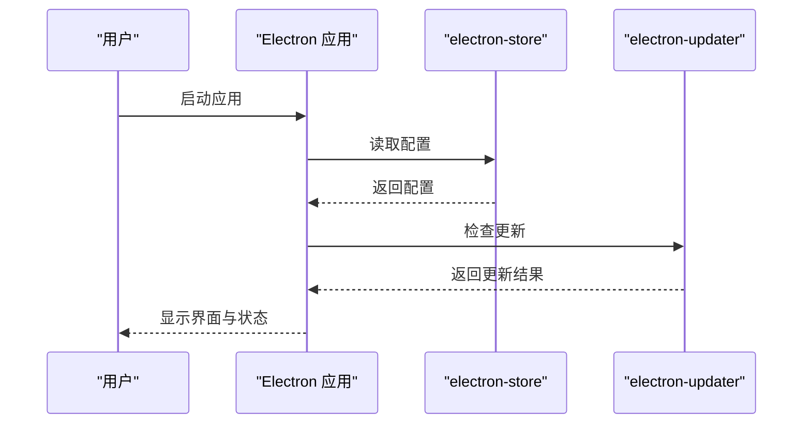
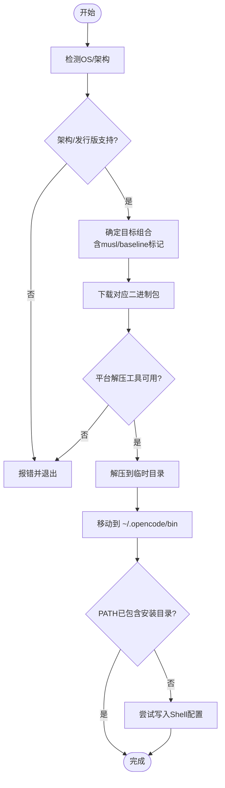

# 桌面应用程序

<cite>
**本文引用的文件**
- [packages/desktop/package.json](file://packages/desktop/package.json)
- [packages/desktop/src-tauri/tauri.conf.json](file://packages/desktop/src-tauri/tauri.conf.json)
- [packages/desktop/src-tauri/tauri.prod.conf.json](file://packages/desktop/src-tauri/tauri.prod.conf.json)
- [packages/desktop/src-tauri/tauri.beta.conf.json](file://packages/desktop/src-tauri/tauri.beta.conf.json)
- [packages/desktop-electron/package.json](file://packages/desktop-electron/package.json)
- [packages/desktop-electron/electron-builder.config.ts](file://packages/desktop-electron/electron-builder.config.ts)
- [nix/desktop.nix](file://nix/desktop.nix)
- [install](file://install)
</cite>

## 目录
1. [简介](#简介)
2. [项目结构](#项目结构)
3. [核心组件](#核心组件)
4. [架构总览](#架构总览)
5. [详细组件分析](#详细组件分析)
6. [依赖关系分析](#依赖关系分析)
7. [性能考虑](#性能考虑)
8. [故障排查指南](#故障排查指南)
9. [结论](#结论)
10. [附录](#附录)

## 简介
本文件面向OpenCode桌面应用程序，提供从安装到使用的全流程说明，覆盖系统要求与兼容性、界面与交互、本地文件访问与系统集成、配置与数据存储、更新机制以及性能优化建议。OpenCode同时提供基于Tauri（Rust）与Electron两种技术栈的桌面实现，分别面向不同平台生态与发布渠道。

## 项目结构
OpenCode桌面应用由两套实现并行维护：
- Tauri 实现：位于 packages/desktop，前端采用Vite+SolidJS，后端通过Tauri桥接系统能力；打包配置在 src-tauri 下，支持多平台分发。
- Electron 实现：位于 packages/desktop-electron，使用electron-vite构建，electron-builder进行打包与分发，支持macOS、Windows、Linux三端。

**图表来源**
- [packages/desktop/package.json:1-45](file://packages/desktop/package.json#L1-L45)
- [packages/desktop/src-tauri/tauri.conf.json:1-63](file://packages/desktop/src-tauri/tauri.conf.json#L1-L63)
- [packages/desktop/src-tauri/tauri.prod.conf.json:1-39](file://packages/desktop/src-tauri/tauri.prod.conf.json#L1-L39)
- [packages/desktop/src-tauri/tauri.beta.conf.json:1-34](file://packages/desktop/src-tauri/tauri.beta.conf.json#L1-L34)
- [packages/desktop-electron/package.json:1-54](file://packages/desktop-electron/package.json#L1-L54)
- [packages/desktop-electron/electron-builder.config.ts:1-98](file://packages/desktop-electron/electron-builder.config.ts#L1-L98)
- [nix/desktop.nix:1-101](file://nix/desktop.nix#L1-L101)

**章节来源**
- [packages/desktop/package.json:1-45](file://packages/desktop/package.json#L1-L45)
- [packages/desktop/src-tauri/tauri.conf.json:1-63](file://packages/desktop/src-tauri/tauri.conf.json#L1-L63)
- [packages/desktop-electron/package.json:1-54](file://packages/desktop-electron/package.json#L1-L54)
- [packages/desktop-electron/electron-builder.config.ts:1-98](file://packages/desktop-electron/electron-builder.config.ts#L1-L98)
- [nix/desktop.nix:1-101](file://nix/desktop.nix#L1-L101)

## 核心组件
- 前端框架与状态：SolidJS + @solid-primitives/storage，提供响应式UI与本地持久化。
- 系统能力桥接：
  - Tauri：@tauri-apps/api 及插件集合（clipboard-manager、deep-link、dialog、opener、os、notification、process、shell、store、updater、http、window-state）。
  - Electron：electron-store、electron-updater、electron-window-state、electron-log 等。
- 构建与打包：
  - Tauri：Vite 前端 + Tauri CLI，支持多目标（deb、rpm、dmg、nsis、app），可生成更新产物。
  - Electron：electron-vite + electron-builder，按通道（dev/beta/prod）输出不同产品名与签名配置。
- 安装器与分发：统一的 Bash 安装脚本，自动识别平台与架构，下载对应二进制并写入 PATH。

**章节来源**
- [packages/desktop/package.json:15-35](file://packages/desktop/package.json#L15-L35)
- [packages/desktop/package.json:36-43](file://packages/desktop/package.json#L36-L43)
- [packages/desktop/src-tauri/tauri.conf.json:55-61](file://packages/desktop/src-tauri/tauri.conf.json#L55-L61)
- [packages/desktop-electron/package.json:26-41](file://packages/desktop-electron/package.json#L26-L41)
- [packages/desktop-electron/package.json:42-52](file://packages/desktop-electron/package.json#L42-L52)
- [packages/desktop-electron/electron-builder.config.ts:9-60](file://packages/desktop-electron/electron-builder.config.ts#L9-L60)
- [install:103-110](file://install#L103-L110)

## 架构总览
下图展示OpenCode桌面应用在不同技术栈下的整体架构与关键模块：

**图表来源**
- [packages/desktop/package.json:15-35](file://packages/desktop/package.json#L15-L35)
- [packages/desktop/src-tauri/tauri.conf.json:55-61](file://packages/desktop/src-tauri/tauri.conf.json#L55-L61)
- [packages/desktop-electron/package.json:26-41](file://packages/desktop-electron/package.json#L26-L41)
- [packages/desktop-electron/electron-builder.config.ts:9-60](file://packages/desktop-electron/electron-builder.config.ts#L9-L60)

## 详细组件分析

### Tauri 组件分析
- 配置与打包
  - 开发与构建：通过 tauri.conf.json 指定开发URL、构建命令与前端产物目录。
  - 多平台打包：支持 deb、rpm、dmg、nsis、app；Linux需额外GTK/WebKit等运行时库。
  - 更新：生产配置启用 createUpdaterArtifacts，并配置公钥与GitHub发布端点。
- 插件能力
  - deep-link：注册自定义协议“opencode”，用于系统内跳转与外部调用。
  - store：跨会话持久化键值数据。
  - window-state：窗口位置与尺寸恢复。
  - updater：基于GitHub Releases的自动更新。
  - 其他：clipboard、dialog、opener、os、process、shell、http 等系统集成能力。

**图表来源**
- [packages/desktop/src-tauri/tauri.conf.json:1-63](file://packages/desktop/src-tauri/tauri.conf.json#L1-L63)
- [packages/desktop/src-tauri/tauri.prod.conf.json:32-37](file://packages/desktop/src-tauri/tauri.prod.conf.json#L32-L37)

**章节来源**
- [packages/desktop/src-tauri/tauri.conf.json:7-12](file://packages/desktop/src-tauri/tauri.conf.json#L7-L12)
- [packages/desktop/src-tauri/tauri.conf.json:35-54](file://packages/desktop/src-tauri/tauri.conf.json#L35-L54)
- [packages/desktop/src-tauri/tauri.prod.conf.json:6-37](file://packages/desktop/src-tauri/tauri.prod.conf.json#L6-L37)
- [packages/desktop/src-tauri/tauri.beta.conf.json:5-33](file://packages/desktop/src-tauri/tauri.beta.conf.json#L5-L33)

### Electron 组件分析
- 构建与打包
  - electron-builder 配置按通道（dev/beta/prod）设置产品名、应用ID、图标、签名与发布仓库。
  - macOS 启用 Hardened Runtime、Notarize；Windows 使用 NSIS 安装器；Linux 支持 AppImage、deb、rpm。
- 主进程与存储
  - electron-store 负责配置持久化；electron-updater 提供自动更新；electron-log 记录日志。
- 协议与资源
  - 注册自定义协议“opencode”；extraResources 包含CLI与原生模块。

**图表来源**
- [packages/desktop-electron/electron-builder.config.ts:62-95](file://packages/desktop-electron/electron-builder.config.ts#L62-L95)
- [packages/desktop-electron/package.json:34-37](file://packages/desktop-electron/package.json#L34-L37)

**章节来源**
- [packages/desktop-electron/electron-builder.config.ts:9-60](file://packages/desktop-electron/electron-builder.config.ts#L9-L60)
- [packages/desktop-electron/electron-builder.config.ts:62-95](file://packages/desktop-electron/electron-builder.config.ts#L62-L95)
- [packages/desktop-electron/package.json:26-41](file://packages/desktop-electron/package.json#L26-L41)

### 安装器与分发流程
安装器根据操作系统与架构选择合适的二进制包，支持musl与baseline变体，并在Linux上检测解压工具与AVX2支持，最终将可执行文件写入用户目录并尝试写入 PATH。

**图表来源**
- [install:79-110](file://install#L79-L110)
- [install:117-181](file://install#L117-L181)
- [install:327-346](file://install#L327-L346)
- [install:362-439](file://install#L362-L439)

**章节来源**
- [install:10-27](file://install#L10-L27)
- [install:79-110](file://install#L79-L110)
- [install:117-181](file://install#L117-L181)
- [install:327-346](file://install#L327-L346)
- [install:362-439](file://install#L362-L439)

## 依赖关系分析
- 技术栈耦合
  - Tauri：前端与系统能力通过Rust层桥接，依赖Tauri CLI与插件生态。
  - Electron：主进程与渲染进程通过IPC通信，依赖electron-builder与相关Node模块。
- 平台依赖
  - Linux：需要GTK4、WebKit、GStreamer等运行时库；Nix构建脚本显式声明。
  - macOS：Hardened Runtime与Notarize；自定义协议与权限清单。
  - Windows：NSIS安装器与图标资源。

**图表来源**
- [packages/desktop/package.json:15-35](file://packages/desktop/package.json#L15-L35)
- [packages/desktop/src-tauri/tauri.conf.json:55-61](file://packages/desktop/src-tauri/tauri.conf.json#L55-L61)
- [packages/desktop-electron/package.json:26-41](file://packages/desktop-electron/package.json#L26-L41)
- [nix/desktop.nix:50-64](file://nix/desktop.nix#L50-L64)

**章节来源**
- [nix/desktop.nix:50-64](file://nix/desktop.nix#L50-L64)
- [packages/desktop/src-tauri/tauri.conf.json:35-54](file://packages/desktop/src-tauri/tauri.conf.json#L35-L54)
- [packages/desktop-electron/electron-builder.config.ts:28-60](file://packages/desktop-electron/electron-builder.config.ts#L28-L60)

## 性能考虑
- 启动与内存
  - 优先使用轻量级窗口状态插件恢复窗口尺寸与位置，减少重复计算。
  - 将大型资源（如CLI侧车程序）置于独立二进制，避免捆绑在主进程启动时加载。
- I/O与网络
  - 使用系统通知与剪贴板插件替代轮询，降低CPU占用。
  - 对网络请求进行缓存与去抖，避免频繁刷新。
- 平台差异
  - Linux：确保运行时库齐全，避免动态链接失败导致的启动异常。
  - macOS：启用硬安全策略，减少沙箱外I/O带来的性能损耗。
  - Windows：合理配置安装器选项，避免不必要的文件写入。

## 故障排查指南
- 安装失败
  - 确认系统满足架构与发行版要求；Linux需具备 tar/unzip 工具。
  - 若无AVX2或musl环境，安装器会自动选择baseline或musl变体，请检查下载链接与版本号。
- 启动问题
  - Tauri：检查Rust运行时与GTK/WebKit依赖是否齐全；查看系统权限与沙箱设置。
  - Electron：确认主进程入口与资源路径正确；查看日志输出定位错误。
- 更新失败
  - 检查网络连通性与GitHub Releases可达性；核对公钥与端点配置。
- 权限与集成
  - 自定义协议“opencode”需在系统中注册；若无法唤起，请重新安装或检查默认处理程序。

**章节来源**
- [install:117-181](file://install#L117-L181)
- [packages/desktop/src-tauri/tauri.prod.conf.json:32-37](file://packages/desktop/src-tauri/tauri.prod.conf.json#L32-L37)
- [packages/desktop-electron/electron-builder.config.ts:38-59](file://packages/desktop-electron/electron-builder.config.ts#L38-L59)

## 结论
OpenCode桌面应用通过Tauri与Electron两条路径实现了跨平台分发与系统深度集成。其安装器自动化程度高，支持多架构与发行版变体；更新机制完善，结合平台原生打包工具实现稳定交付。建议在部署前验证平台依赖与权限配置，以获得最佳体验。

## 附录

### 系统要求与兼容性
- Windows
  - 支持 x64；安装器通过NSIS安装器进行安装。
- macOS
  - 支持 x64 与 arm64（含Rosetta回退）；启用Hardened Runtime与Notarize。
- Linux
  - 支持 x64 与 arm64；需GTK4、WebKit、GStreamer等运行时库；支持AppImage、deb、rpm。

**章节来源**
- [install:81-110](file://install#L81-L110)
- [nix/desktop.nix:50-64](file://nix/desktop.nix#L50-L64)
- [packages/desktop/src-tauri/tauri.conf.json:35-54](file://packages/desktop/src-tauri/tauri.conf.json#L35-L54)
- [packages/desktop-electron/electron-builder.config.ts:55-59](file://packages/desktop-electron/electron-builder.config.ts#L55-L59)

### 用户界面与交互
- 界面布局
  - 基于SolidJS的现代UI，支持主题与国际化；窗口状态插件保障用户体验一致性。
- 导航与交互
  - 通过深链协议“opencode”与系统集成，支持外部唤起与快捷操作。
- 系统集成
  - 剪贴板、对话框、系统外壳、通知、进程与HTTP等能力通过插件提供。

**章节来源**
- [packages/desktop/package.json:18-34](file://packages/desktop/package.json#L18-L34)
- [packages/desktop/src-tauri/tauri.conf.json:55-61](file://packages/desktop/src-tauri/tauri.conf.json#L55-L61)

### 配置管理、数据存储与更新机制
- 配置与存储
  - Tauri：使用store插件进行键值持久化；可通过window-state恢复窗口状态。
  - Electron：使用electron-store保存用户偏好与状态。
- 更新机制
  - Tauri：生产配置启用更新产物并指向GitHub Releases的JSON端点。
  - Electron：按通道配置发布仓库，支持自动更新。

**章节来源**
- [packages/desktop/src-tauri/tauri.prod.conf.json:6-37](file://packages/desktop/src-tauri/tauri.prod.conf.json#L6-L37)
- [packages/desktop-electron/electron-builder.config.ts:62-95](file://packages/desktop-electron/electron-builder.config.ts#L62-L95)

### 安装指南（Windows、macOS、Linux）
- Windows
  - 使用安装器下载对应二进制并执行NSIS安装器；完成后可在终端运行可执行文件。
- macOS
  - 使用安装器下载.dmg镜像并挂载安装；如遇安全提示，请在系统设置中允许。
- Linux
  - 使用安装器下载AppImage/deb/rpm并安装；确保具备必要运行时库。

**章节来源**
- [install:171-181](file://install#L171-L181)
- [packages/desktop/src-tauri/tauri.conf.json:35-54](file://packages/desktop/src-tauri/tauri.conf.json#L35-L54)
- [packages/desktop-electron/electron-builder.config.ts:38-59](file://packages/desktop-electron/electron-builder.config.ts#L38-L59)