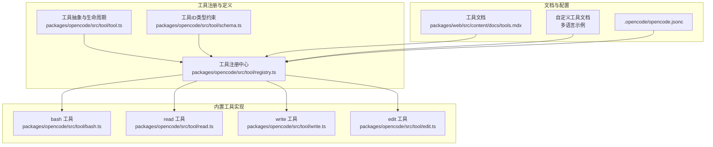
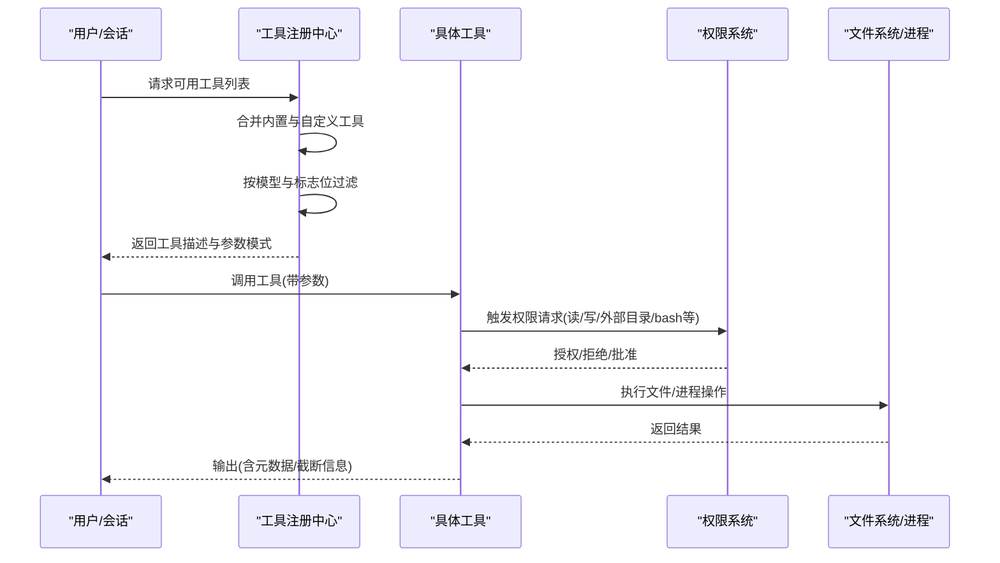
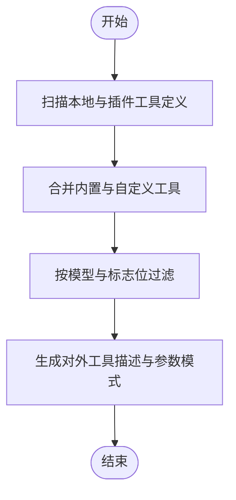
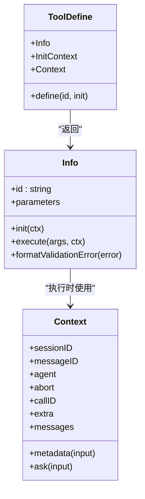
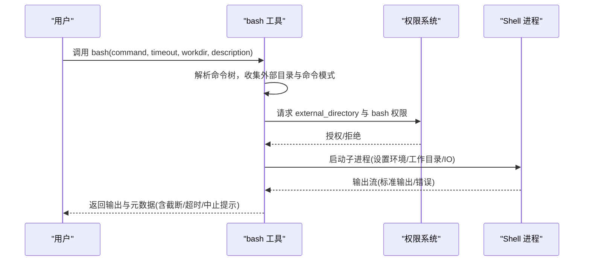
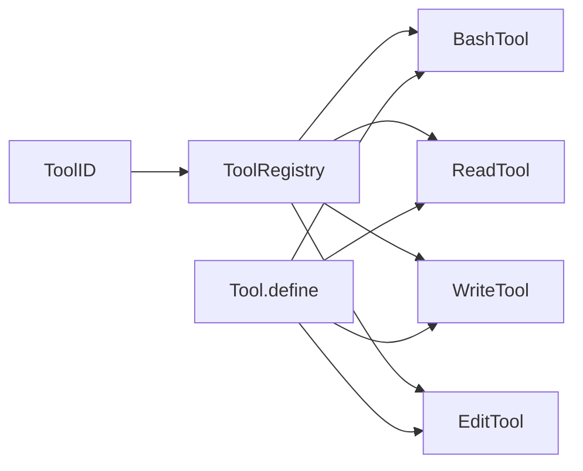

# 内置工具

<cite>
**本文引用的文件**
- [packages/opencode/src/tool/registry.ts](file://packages/opencode/src/tool/registry.ts)
- [packages/opencode/src/tool/tool.ts](file://packages/opencode/src/tool/tool.ts)
- [packages/opencode/src/tool/bash.ts](file://packages/opencode/src/tool/bash.ts)
- [packages/opencode/src/tool/read.ts](file://packages/opencode/src/tool/read.ts)
- [packages/opencode/src/tool/write.ts](file://packages/opencode/src/tool/write.ts)
- [packages/opencode/src/tool/edit.ts](file://packages/opencode/src/tool/edit.ts)
- [packages/opencode/src/tool/schema.ts](file://packages/opencode/src/tool/schema.ts)
- [packages/web/src/content/docs/tools.mdx](file://packages/web/src/content/docs/tools.mdx)
- [packages/web/src/content/docs/ko/custom-tools.mdx](file://packages/web/src/content/docs/ko/custom-tools.mdx)
- [packages/web/src/content/docs/fr/plugins.mdx](file://packages/web/src/content/docs/fr/plugins.mdx)
- [packages/web/src/content/docs/de/plugins.mdx](file://packages/web/src/content/docs/de/plugins.mdx)
- [.opencode/opencode.jsonc](file://.opencode/opencode.jsonc)
</cite>

## 目录
1. [简介](#简介)
2. [项目结构](#项目结构)
3. [核心组件](#核心组件)
4. [架构总览](#架构总览)
5. [详细组件分析](#详细组件分析)
6. [依赖关系分析](#依赖关系分析)
7. [性能与安全特性](#性能与安全特性)
8. [故障排查指南](#故障排查指南)
9. [结论](#结论)
10. [附录：工具清单与使用示例](#附录工具清单与使用示例)

## 简介
本文件系统性梳理 OpenCode 的内置工具体系，覆盖工具分类、功能职责、参数与输入输出格式、权限控制、执行环境、性能与安全特性，以及通过命令行或 API 调用的方式。同时提供最佳实践与常见问题排查建议，帮助开发者与使用者高效、安全地使用内置工具。

## 项目结构
OpenCode 的工具系统由“工具注册中心”统一管理，内置工具在注册中心中集中声明与筛选；同时支持用户自定义工具与插件扩展。关键目录与文件如下：
- 工具注册中心：packages/opencode/src/tool/registry.ts
- 工具抽象与生命周期：packages/opencode/src/tool/tool.ts
- 具体内置工具实现：bash、read、write、edit 等
- 工具 ID 类型约束：packages/opencode/src/tool/schema.ts
- 文档与示例：packages/web/src/content/docs/tools.mdx 及多语言自定义工具文档
- 配置文件：.opencode/opencode.jsonc

**图表来源**
- [packages/opencode/src/tool/registry.ts:1-175](file://packages/opencode/src/tool/registry.ts#L1-L175)
- [packages/opencode/src/tool/tool.ts:1-91](file://packages/opencode/src/tool/tool.ts#L1-L91)
- [packages/opencode/src/tool/bash.ts:1-271](file://packages/opencode/src/tool/bash.ts#L1-L271)
- [packages/opencode/src/tool/read.ts:1-294](file://packages/opencode/src/tool/read.ts#L1-L294)
- [packages/opencode/src/tool/write.ts:1-85](file://packages/opencode/src/tool/write.ts#L1-L85)
- [packages/opencode/src/tool/edit.ts:1-669](file://packages/opencode/src/tool/edit.ts#L1-L669)
- [packages/web/src/content/docs/tools.mdx:1-57](file://packages/web/src/content/docs/tools.mdx#L1-L57)
- [.opencode/opencode.jsonc:1-19](file://.opencode/opencode.jsonc#L1-L19)

**章节来源**
- [packages/opencode/src/tool/registry.ts:1-175](file://packages/opencode/src/tool/registry.ts#L1-L175)
- [packages/opencode/src/tool/tool.ts:1-91](file://packages/opencode/src/tool/tool.ts#L1-L91)
- [packages/web/src/content/docs/tools.mdx:1-57](file://packages/web/src/content/docs/tools.mdx#L1-L57)
- [.opencode/opencode.jsonc:1-19](file://.opencode/opencode.jsonc#L1-L19)

## 核心组件
- 工具注册中心：负责扫描本地与插件提供的工具定义，合并内置工具与自定义工具，按模型能力与标志位过滤可用工具，并生成对外暴露的工具描述与参数模式。
- 工具抽象：定义工具的生命周期（初始化、参数校验、执行、元数据与截断处理），并提供统一的错误格式化与输出截断策略。
- 工具 ID 类型约束：对工具 ID 进行品牌化类型约束，确保工具标识的唯一性与可追踪性。
- 权限与安全：工具在执行前会触发权限请求，如读取、编辑、外部目录访问、bash 执行等，均需获得授权或满足白名单策略。
- 截断与输出：对工具输出进行最大行数与字节数限制，避免大体量输出影响会话性能与上下文窗口。

**章节来源**
- [packages/opencode/src/tool/registry.ts:35-175](file://packages/opencode/src/tool/registry.ts#L35-L175)
- [packages/opencode/src/tool/tool.ts:8-91](file://packages/opencode/src/tool/tool.ts#L8-L91)
- [packages/opencode/src/tool/schema.ts:1-18](file://packages/opencode/src/tool/schema.ts#L1-L18)

## 架构总览
下图展示了工具从注册到对外暴露、再到执行时的调用链路与权限交互：

**图表来源**
- [packages/opencode/src/tool/registry.ts:132-173](file://packages/opencode/src/tool/registry.ts#L132-L173)
- [packages/opencode/src/tool/tool.ts:49-91](file://packages/opencode/src/tool/tool.ts#L49-L91)
- [packages/opencode/src/tool/bash.ts:145-160](file://packages/opencode/src/tool/bash.ts#L145-L160)
- [packages/opencode/src/tool/read.ts:45-50](file://packages/opencode/src/tool/read.ts#L45-L50)
- [packages/opencode/src/tool/write.ts:34-42](file://packages/opencode/src/tool/write.ts#L34-L42)

## 详细组件分析

### 工具注册中心（ToolRegistry）
- 功能要点
  - 扫描本地与插件工具定义，构建自定义工具集合
  - 统一注册内置工具（如 bash、read、write、edit、webfetch、codesearch、websearch、skill、apply_patch、lsp、plan 等）
  - 基于模型提供商与标志位动态启用/禁用特定工具
  - 对外暴露工具描述与参数模式，支持插件扩展点
- 关键流程
  - 初始化：扫描配置目录下的工具文件与插件导出的工具
  - 过滤：根据模型能力与实验性开关决定是否包含某些工具
  - 定义：将工具定义转换为对外可见的结构（描述、参数模式）

**图表来源**
- [packages/opencode/src/tool/registry.ts:38-126](file://packages/opencode/src/tool/registry.ts#L38-L126)

**章节来源**
- [packages/opencode/src/tool/registry.ts:35-175](file://packages/opencode/src/tool/registry.ts#L35-L175)

### 工具抽象与生命周期（Tool.define）
- 功能要点
  - 定义工具的初始化上下文、执行上下文（会话ID、消息ID、中止信号、元数据回调、权限请求）
  - 参数校验：基于 Zod 模式进行入参校验，支持自定义错误格式化
  - 输出截断：默认对输出进行最大行数与字节数限制，避免超长输出
  - 元数据：支持在执行过程中更新元数据（如进度、描述、诊断等）
- 错误处理
  - 参数不合法时抛出明确错误提示
  - 工具内部异常会被捕获并包装为可读错误

**图表来源**
- [packages/opencode/src/tool/tool.ts:8-91](file://packages/opencode/src/tool/tool.ts#L8-L91)

**章节来源**
- [packages/opencode/src/tool/tool.ts:8-91](file://packages/opencode/src/tool/tool.ts#L8-L91)

### bash 工具
- 功能概述
  - 在项目工作目录中执行 shell 命令，支持超时、工作目录切换、描述性元数据
  - 解析命令树以识别潜在的外部目录访问与命令模式，提前请求权限
  - 支持中止与超时终止，输出包含元数据（如退出码、描述、截断提示）
- 输入参数
  - command: 必填，待执行的 shell 命令字符串
  - timeout: 可选，毫秒级超时，默认值受实验性标志控制
  - workdir: 可选，工作目录，默认为项目根目录
  - description: 可选，简短描述（5-10词），用于元数据与用户提示
- 输出格式
  - title: 描述性标题
  - output: 命令输出文本
  - metadata: 包含输出片段、退出码、描述、截断标记等
- 权限与安全
  - 通过解析命令树识别可能的外部目录访问与危险命令，提前请求权限
  - 支持中止与超时，避免长时间运行或阻塞
- 性能与限制
  - 输出受最大行数与字节限制，元数据也有限制长度
  - 默认超时时间可通过实验性标志调整

**图表来源**
- [packages/opencode/src/tool/bash.ts:55-271](file://packages/opencode/src/tool/bash.ts#L55-L271)

**章节来源**
- [packages/opencode/src/tool/bash.ts:55-271](file://packages/opencode/src/tool/bash.ts#L55-L271)

### read 工具
- 功能概述
  - 读取文件或目录内容，支持偏移与行数限制，自动检测二进制与图片/PDF
  - 对目录列出条目，对文件按行读取并进行长度与字节限制
  - 自动请求读取权限，支持外部目录访问检查
- 输入参数
  - filePath: 必填，绝对路径或相对项目根的路径
  - offset: 可选，起始行号（1-indexed）
  - limit: 可选，最大读取行数（默认2000）
- 输出格式
  - title: 相对于工作树的路径
  - output: 文件/目录内容或预览
  - metadata: 包含预览、截断标记、已加载指令文件等
- 权限与安全
  - 请求 read 权限，必要时请求外部目录访问
  - 对二进制文件直接拒绝读取
- 性能与限制
  - 单行最大长度限制与总字节上限，超出则截断并提示继续读取

**章节来源**
- [packages/opencode/src/tool/read.ts:21-294](file://packages/opencode/src/tool/read.ts#L21-L294)

### write 工具
- 功能概述
  - 将内容写入指定文件，计算差异并请求编辑权限
  - 写入后触发文件事件与 LSP 诊断检查，输出诊断摘要
- 输入参数
  - content: 必填，写入内容
  - filePath: 必填，绝对路径
- 输出格式
  - title: 相对于工作树的路径
  - output: 成功消息与诊断摘要
  - metadata: 包含诊断、文件路径、是否存在
- 权限与安全
  - 请求 edit 权限，必要时请求外部目录访问
- 性能与限制
  - 诊断数量有限制，避免过多诊断影响输出可读性

**章节来源**
- [packages/opencode/src/tool/write.ts:19-85](file://packages/opencode/src/tool/write.ts#L19-L85)

### edit 工具
- 功能概述
  - 在文件中替换旧文本为新文本，支持多种匹配策略（精确、去空白、块锚定、换行规范化、缩进灵活、转义规范化、边界修剪、上下文感知、多处替换）
  - 计算差异并请求编辑权限，写入后触发文件事件与 LSP 诊断检查
- 输入参数
  - filePath: 必填，绝对路径
  - oldString: 必填，待替换文本
  - newString: 必填，替换文本（必须与旧文本不同）
  - replaceAll: 可选，是否替换全部（默认 false）
- 输出格式
  - title: 相对于工作树的路径
  - output: 成功消息与诊断摘要
  - metadata: 包含差异、文件差异统计、诊断
- 权限与安全
  - 请求 edit 权限，必要时请求外部目录访问
- 性能与限制
  - 多种匹配策略提升成功率，但复杂度较高；建议提供足够上下文以确保唯一匹配

**章节来源**
- [packages/opencode/src/tool/edit.ts:36-168](file://packages/opencode/src/tool/edit.ts#L36-L168)

## 依赖关系分析
- 工具注册中心依赖各内置工具模块与插件导出的工具定义
- 工具抽象为所有工具提供统一的生命周期与参数校验
- 工具 ID 类型约束保证工具标识的品牌化与可追踪性
- 权限系统贯穿工具执行前后，保障文件系统与进程执行的安全边界

**图表来源**
- [packages/opencode/src/tool/registry.ts:1-34](file://packages/opencode/src/tool/registry.ts#L1-L34)
- [packages/opencode/src/tool/tool.ts:1-7](file://packages/opencode/src/tool/tool.ts#L1-L7)
- [packages/opencode/src/tool/schema.ts:1-18](file://packages/opencode/src/tool/schema.ts#L1-L18)

**章节来源**
- [packages/opencode/src/tool/registry.ts:1-34](file://packages/opencode/src/tool/registry.ts#L1-L34)
- [packages/opencode/src/tool/tool.ts:1-7](file://packages/opencode/src/tool/tool.ts#L1-L7)
- [packages/opencode/src/tool/schema.ts:1-18](file://packages/opencode/src/tool/schema.ts#L1-L18)

## 性能与安全特性
- 性能
  - 输出截断：内置工具默认对输出进行最大行数与字节限制，避免超大输出影响会话性能
  - 超时控制：bash 工具支持超时，防止长时间运行
  - 诊断限制：write 与 edit 工具对诊断数量进行限制，避免输出膨胀
- 安全
  - 权限请求：读取、编辑、外部目录访问、bash 执行均需授权
  - 命令解析：bash 工具解析命令树以识别潜在风险，提前请求权限
  - 二进制保护：read 工具拒绝读取二进制文件
  - 中止机制：支持中止信号，及时终止危险或长时间任务

[本节为通用性能与安全讨论，无需特定文件引用]

## 故障排查指南
- 参数校验失败
  - 现象：调用工具时报错，提示参数不符合预期
  - 处理：检查参数类型与必填项，参考工具参数模式
- 权限被拒绝
  - 现象：工具请求权限被拒绝
  - 处理：在配置中调整权限策略，或在会话中批准
- 外部目录访问受限
  - 现象：尝试访问项目根之外的路径被拒绝
  - 处理：在权限配置中允许相应目录或模式
- bash 超时或中止
  - 现象：命令执行超时或被中止
  - 处理：缩短命令范围、增加超时、或拆分为多个小命令
- 二进制文件无法读取
  - 现象：read 工具报错提示无法读取二进制文件
  - 处理：改用其他方式获取二进制文件信息或下载链接
- 编辑冲突或多匹配
  - 现象：edit 工具找不到或匹配到多个位置
  - 处理：提供更多上下文或启用 replaceAll

**章节来源**
- [packages/opencode/src/tool/tool.ts:58-70](file://packages/opencode/src/tool/tool.ts#L58-L70)
- [packages/opencode/src/tool/bash.ts:145-160](file://packages/opencode/src/tool/bash.ts#L145-L160)
- [packages/opencode/src/tool/read.ts:144-146](file://packages/opencode/src/tool/read.ts#L144-L146)
- [packages/opencode/src/tool/edit.ts:662-668](file://packages/opencode/src/tool/edit.ts#L662-L668)

## 结论
OpenCode 的内置工具体系以统一的注册中心与抽象层为核心，结合严格的权限控制与输出截断策略，在保证安全性的同时提供了强大的文件系统与进程执行能力。通过清晰的参数模式与元数据反馈，用户可以高效地完成文件读写、代码编辑与命令执行等任务。配合自定义工具与插件扩展，可进一步满足复杂场景需求。

[本节为总结性内容，无需特定文件引用]

## 附录：工具清单与使用示例

### 工具分类与职责
- 文件操作类
  - read：读取文件或目录，支持偏移与行数限制
  - write：写入文件并计算差异，触发诊断检查
  - edit：在文件中替换文本，支持多种匹配策略
- 系统工具类
  - bash：在项目环境中执行 shell 命令，支持超时与描述性元数据
- 网络工具类
  - webfetch：拉取网页内容（由文档与注册中心可见）
  - websearch：网页搜索（由文档与注册中心可见）
  - codesearch：代码搜索（由文档与注册中心可见）
- 其他工具类
  - skill：技能工具（由文档与注册中心可见）
  - apply_patch：应用补丁（由文档与注册中心可见）
  - lsp：语言服务器工具（实验性）
  - plan/plan_exit：计划工具（实验性）

**章节来源**
- [packages/opencode/src/tool/registry.ts:104-125](file://packages/opencode/src/tool/registry.ts#L104-L125)
- [packages/web/src/content/docs/tools.mdx:42-57](file://packages/web/src/content/docs/tools.mdx#L42-L57)

### 权限配置与执行环境
- 权限配置
  - 使用 permission 字段控制工具行为，支持 allow/deny/ask 三种策略
  - 支持通配符批量控制，例如对 MCP 服务器工具统一要求审批
- 执行环境
  - 工具在项目工作目录中执行，支持切换工作目录
  - bash 工具使用可接受的 shell，支持中止与超时

**章节来源**
- [packages/web/src/content/docs/tools.mdx:16-36](file://packages/web/src/content/docs/tools.mdx#L16-L36)
- [packages/opencode/src/tool/bash.ts:56-57](file://packages/opencode/src/tool/bash.ts#L56-L57)

### 命令行与 API 调用
- 命令行
  - 通过 CLI 会话选择工具并传入参数，工具将自动请求权限并在授权后执行
- API
  - 工具定义与参数模式由注册中心对外暴露，第三方可通过 SDK 或 HTTP 接口调用工具

**章节来源**
- [packages/opencode/src/tool/registry.ts:132-173](file://packages/opencode/src/tool/registry.ts#L132-L173)

### 自定义工具与插件
- 自定义工具
  - 放置于项目 .opencode/tools/ 或全局 ~/.config/opencode/tools/ 目录
  - 使用工具助手定义描述、参数模式与执行函数
- 插件工具
  - 插件可导出 tool 定义，优先级高于内置工具
  - 支持结构化日志与压缩钩子等扩展能力

**章节来源**
- [packages/web/src/content/docs/ko/custom-tools.mdx:16-45](file://packages/web/src/content/docs/ko/custom-tools.mdx#L16-L45)
- [packages/web/src/content/docs/fr/plugins.mdx:281-300](file://packages/web/src/content/docs/fr/plugins.mdx#L281-L300)
- [packages/web/src/content/docs/de/plugins.mdx:289-300](file://packages/web/src/content/docs/de/plugins.mdx#L289-L300)

### 最佳实践
- 提供清晰的描述性元数据（bash 工具的 description 字段）
- 为敏感操作（写入、外部目录访问、命令执行）预留充足权限审批时间
- 使用 read 的 offset/limit 分页读取大文件，避免一次性读取过多
- 在 edit 中提供足够的上下文以确保唯一匹配，必要时启用 replaceAll
- 对 bash 命令进行拆分与超时控制，避免长时间阻塞

[本节为通用最佳实践，无需特定文件引用]