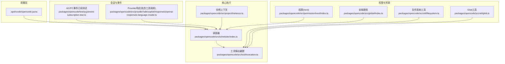
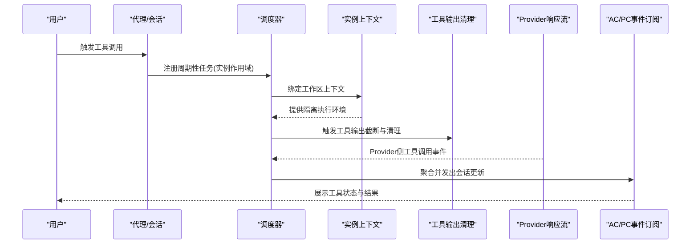
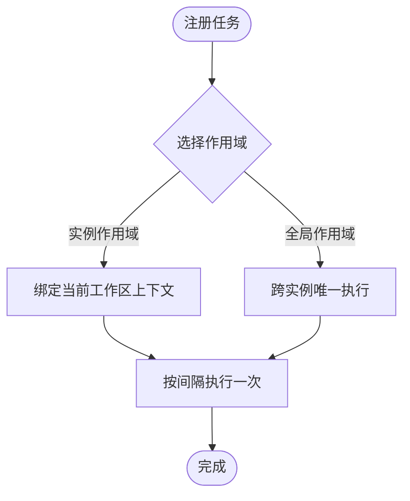
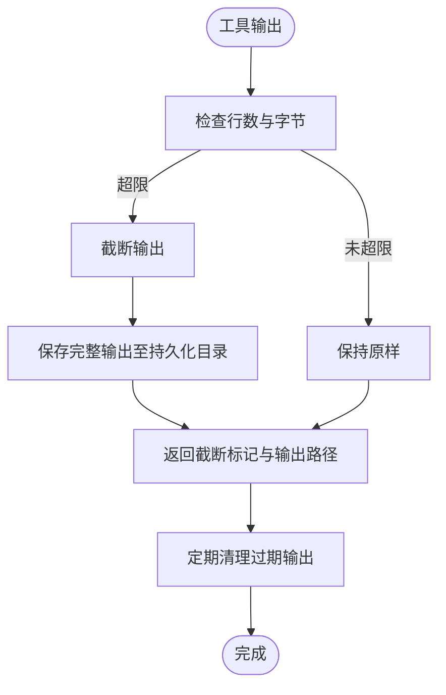
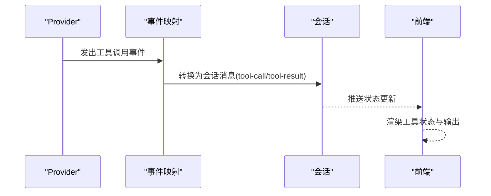
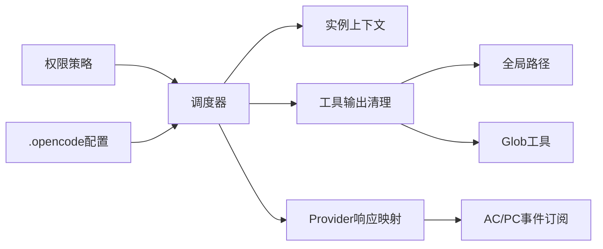

# 工具执行机制

<cite>
**本文引用的文件**
- [README.md](file://README.md)
- [SECURITY.md](file://SECURITY.md)
- [packages/opencode/src/scheduler/index.ts](file://packages/opencode/src/scheduler/index.ts)
- [packages/opencode/test/scheduler.test.ts](file://packages/opencode/test/scheduler.test.ts)
- [packages/opencode/src/tool/truncation.ts](file://packages/opencode/src/tool/truncation.ts)
- [packages/opencode/src/provider/sdk/copilot/responses/openai-responses-language-model.ts](file://packages/opencode/src/provider/sdk/copilot/responses/openai-responses-language-model.ts)
- [packages/opencode/test/acp/event-subscription.test.ts](file://packages/opencode/test/acp/event-subscription.test.ts)
- [packages/opencode/src/project/instance.ts](file://packages/opencode/src/project/instance.ts)
- [packages/opencode/src/permission/next/index.ts](file://packages/opencode/src/permission/next/index.ts)
- [packages/opencode/src/global/index.ts](file://packages/opencode/src/global/index.ts)
- [packages/opencode/src/util/filesystem.ts](file://packages/opencode/src/util/filesystem.ts)
- [packages/opencode/src/util/glob.ts](file://packages/opencode/src/util/glob.ts)
- [packages/opencode/src/tool/schema.ts](file://packages/opencode/src/tool/schema.ts)
- [packages/opencode/src/id/id.ts](file://packages/opencode/src/id/id.ts)
- [.opencode/opencode.jsonc](file://.opencode/opencode.jsonc)
- [packages/opencode/src/account/service.ts](file://packages/opencode/src/account/service.ts)
- [packages/app/src/app.tsx](file://packages/app/src/app.tsx)
</cite>

## 目录
1. [引言](#引言)
2. [项目结构](#项目结构)
3. [核心组件](#核心组件)
4. [架构总览](#架构总览)
5. [详细组件分析](#详细组件分析)
6. [依赖关系分析](#依赖关系分析)
7. [性能考虑](#性能考虑)
8. [故障排查指南](#故障排查指南)
9. [结论](#结论)
10. [附录](#附录)

## 引言
本文件面向OpenCode工具执行机制，系统化阐述其调度算法、并发执行与资源管理、生命周期与状态跟踪、结果聚合、依赖关系与错误传播、回滚机制、监控指标与性能优化、资源限制、调试与故障排查以及安全审计与访问控制。文档以仓库现有源码为依据，结合测试与配置文件进行分析，并通过可视化图示帮助读者建立对整体执行链路的理解。

## 项目结构
OpenCode采用多包（monorepo）组织方式，工具执行相关的关键代码集中在packages/opencode中，包括调度器、工具输出截断清理、会话事件流、权限与全局路径等。此外，配置文件.opencode/opencode.jsonc用于声明工具开关与权限策略；README与SECURITY文档提供了背景与安全定位。

图表来源
- [packages/opencode/src/scheduler/index.ts](file://packages/opencode/src/scheduler/index.ts)
- [packages/opencode/src/project/instance.ts](file://packages/opencode/src/project/instance.ts)
- [packages/opencode/src/tool/truncation.ts](file://packages/opencode/src/tool/truncation.ts)
- [packages/opencode/src/provider/sdk/copilot/responses/openai-responses-language-model.ts](file://packages/opencode/src/provider/sdk/copilot/responses/openai-responses-language-model.ts)
- [packages/opencode/test/acp/event-subscription.test.ts](file://packages/opencode/test/acp/event-subscription.test.ts)
- [packages/opencode/src/permission/next/index.ts](file://packages/opencode/src/permission/next/index.ts)
- [packages/opencode/src/global/index.ts](file://packages/opencode/src/global/index.ts)
- [packages/opencode/src/util/filesystem.ts](file://packages/opencode/src/util/filesystem.ts)
- [packages/opencode/src/util/glob.ts](file://packages/opencode/src/util/glob.ts)
- [.opencode/opencode.jsonc](file://.opencode/opencode.jsonc)

章节来源
- [README.md:1-142](file://README.md#L1-L142)
- [.opencode/opencode.jsonc:1-19](file://.opencode/opencode.jsonc#L1-L19)

## 核心组件
- 调度器：负责周期性任务注册与执行，支持实例作用域与全局作用域，确保任务在不同工作区隔离下正确运行。
- 工具输出截断与清理：对工具输出进行行数与字节限制，并按时间保留策略定期清理临时输出。
- 会话事件流：将Provider侧的工具调用事件转换为统一的会话消息，便于前端展示与状态追踪。
- 权限与资源：通过权限策略与全局路径、文件系统、Glob工具，保障工具执行的边界与可维护性。
- 实例上下文：为每个工作区提供独立的执行环境，隔离任务与状态。

章节来源
- [packages/opencode/src/scheduler/index.ts](file://packages/opencode/src/scheduler/index.ts)
- [packages/opencode/src/tool/truncation.ts:1-40](file://packages/opencode/src/tool/truncation.ts#L1-L40)
- [packages/opencode/src/provider/sdk/copilot/responses/openai-responses-language-model.ts:1007-1100](file://packages/opencode/src/provider/sdk/copilot/responses/openai-responses-language-model.ts#L1007-L1100)
- [packages/opencode/test/acp/event-subscription.test.ts:520-633](file://packages/opencode/test/acp/event-subscription.test.ts#L520-L633)
- [packages/opencode/src/project/instance.ts](file://packages/opencode/src/project/instance.ts)
- [packages/opencode/src/permission/next/index.ts](file://packages/opencode/src/permission/next/index.ts)
- [packages/opencode/src/global/index.ts](file://packages/opencode/src/global/index.ts)
- [packages/opencode/src/util/filesystem.ts](file://packages/opencode/src/util/filesystem.ts)
- [packages/opencode/src/util/glob.ts](file://packages/opencode/src/util/glob.ts)

## 架构总览
OpenCode的工具执行由“调度器-实例上下文-工具输出清理-会话事件流-权限与资源”构成闭环。调度器在实例作用域内注册任务，工具输出经截断与清理后进入会话事件流，权限策略贯穿始终，确保安全可控。

图表来源
- [packages/opencode/src/scheduler/index.ts](file://packages/opencode/src/scheduler/index.ts)
- [packages/opencode/src/project/instance.ts](file://packages/opencode/src/project/instance.ts)
- [packages/opencode/src/tool/truncation.ts:1-40](file://packages/opencode/src/tool/truncation.ts#L1-L40)
- [packages/opencode/src/provider/sdk/copilot/responses/openai-responses-language-model.ts:1007-1100](file://packages/opencode/src/provider/sdk/copilot/responses/openai-responses-language-model.ts#L1007-L1100)
- [packages/opencode/test/acp/event-subscription.test.ts:520-633](file://packages/opencode/test/acp/event-subscription.test.ts#L520-L633)

## 详细组件分析

### 调度器与实例作用域
- 作用域模型：支持实例作用域与全局作用域两种注册模式。实例作用域确保同一工作区内的任务相互隔离；全局作用域用于跨实例的全局清理或维护任务。
- 测试验证：通过测试用例验证实例作用域与全局作用域的行为差异，确保任务在不同工作区独立运行且全局任务仅执行一次。

图表来源
- [packages/opencode/test/scheduler.test.ts:1-48](file://packages/opencode/test/scheduler.test.ts#L1-L48)
- [packages/opencode/src/project/instance.ts](file://packages/opencode/src/project/instance.ts)

章节来源
- [packages/opencode/test/scheduler.test.ts:1-48](file://packages/opencode/test/scheduler.test.ts#L1-L48)
- [packages/opencode/src/project/instance.ts](file://packages/opencode/src/project/instance.ts)

### 工具输出截断与清理
- 截断策略：对工具输出设置最大行数与最大字节数，超过阈值时进行截断，并将完整内容落盘到指定目录，返回截断标记与输出路径以便后续查阅。
- 清理策略：按时间窗口定期扫描并删除过期输出，避免磁盘膨胀。
- 定时任务：通过调度器注册定时任务，周期性执行清理逻辑，保证系统长期稳定运行。

图表来源
- [packages/opencode/src/tool/truncation.ts:1-40](file://packages/opencode/src/tool/truncation.ts#L1-L40)
- [packages/opencode/src/scheduler/index.ts](file://packages/opencode/src/scheduler/index.ts)
- [packages/opencode/src/global/index.ts](file://packages/opencode/src/global/index.ts)
- [packages/opencode/src/util/glob.ts](file://packages/opencode/src/util/glob.ts)

章节来源
- [packages/opencode/src/tool/truncation.ts:1-40](file://packages/opencode/src/tool/truncation.ts#L1-L40)

### 会话事件流与状态聚合
- Provider事件映射：将Provider侧的工具调用事件转换为统一的会话消息类型，包括工具输入开始、工具调用、工具结果等，便于前端展示实时状态。
- ACP事件订阅：通过事件订阅测试验证工具调用的生命周期事件（pending、running、update、result），确保状态聚合与展示一致。

图表来源
- [packages/opencode/src/provider/sdk/copilot/responses/openai-responses-language-model.ts:1007-1100](file://packages/opencode/src/provider/sdk/copilot/responses/openai-responses-language-model.ts#L1007-L1100)
- [packages/opencode/test/acp/event-subscription.test.ts:520-633](file://packages/opencode/test/acp/event-subscription.test.ts#L520-L633)

章节来源
- [packages/opencode/src/provider/sdk/copilot/responses/openai-responses-language-model.ts:1007-1100](file://packages/opencode/src/provider/sdk/copilot/responses/openai-responses-language-model.ts#L1007-L1100)
- [packages/opencode/test/acp/event-subscription.test.ts:520-633](file://packages/opencode/test/acp/event-subscription.test.ts#L520-L633)

### 生命周期管理、状态跟踪与结果聚合
- 生命周期：从任务注册、实例上下文绑定、工具执行、输出截断、事件映射到最终结果聚合，形成完整的生命周期闭环。
- 状态跟踪：通过事件流与测试用例验证状态变化（pending → running → update → result），确保前端能够实时反映工具执行状态。
- 结果聚合：将工具调用结果与文本流合并，形成统一的会话消息，便于后续分析与展示。

章节来源
- [packages/opencode/test/acp/event-subscription.test.ts:520-633](file://packages/opencode/test/acp/event-subscription.test.ts#L520-L633)
- [packages/opencode/src/provider/sdk/copilot/responses/openai-responses-language-model.ts:1007-1100](file://packages/opencode/src/provider/sdk/copilot/responses/openai-responses-language-model.ts#L1007-L1100)

### 依赖关系处理、错误传播与回滚机制
- 依赖关系：调度器依赖实例上下文提供隔离执行环境；工具输出清理依赖全局路径与Glob工具进行扫描与清理；权限策略贯穿于工具执行的各个阶段。
- 错误传播：会话事件流中包含工具执行中断的错误文本，便于上层感知并进行错误处理。
- 回滚机制：当前代码未显式实现工具执行的自动回滚，但可通过事件流与状态跟踪在上层实现手动回滚或重试策略。

章节来源
- [packages/opencode/src/scheduler/index.ts](file://packages/opencode/src/scheduler/index.ts)
- [packages/opencode/src/project/instance.ts](file://packages/opencode/src/project/instance.ts)
- [packages/opencode/src/util/glob.ts](file://packages/opencode/src/util/glob.ts)
- [packages/opencode/src/permission/next/index.ts](file://packages/opencode/src/permission/next/index.ts)
- [packages/opencode/test/session/message-v2.test.ts:767-817](file://packages/opencode/test/session/message-v2.test.ts#L767-L817)

### 并发执行与资源管理
- 并发控制：在应用层存在无界并发的使用场景，需谨慎评估工具执行的并发度，避免资源争用与性能抖动。
- 资源管理：通过工具输出截断与清理策略控制磁盘占用；通过权限策略限制工具的读写与执行范围。

章节来源
- [packages/app/src/app.tsx:160](file://packages/app/src/app.tsx#L160)
- [packages/opencode/src/tool/truncation.ts:1-40](file://packages/opencode/src/tool/truncation.ts#L1-L40)
- [packages/opencode/src/permission/next/index.ts](file://packages/opencode/src/permission/next/index.ts)

### 监控指标、性能优化与资源限制
- 监控指标：建议围绕任务执行次数、平均耗时、失败率、输出大小分布、清理命中率等建立指标体系。
- 性能优化：合理设置任务间隔、限制工具输出规模、启用异步清理、减少不必要的事件推送。
- 资源限制：通过行数与字节上限、时间保留策略、权限白名单等方式限制资源消耗。

章节来源
- [packages/opencode/src/tool/truncation.ts:1-40](file://packages/opencode/src/tool/truncation.ts#L1-L40)
- [packages/opencode/src/permission/next/index.ts](file://packages/opencode/src/permission/next/index.ts)

### 调试方法、故障排查与性能分析
- 调试方法：利用事件订阅测试观察工具状态变化；通过会话消息中的错误文本定位问题；结合实例上下文确认作用域隔离是否正常。
- 故障排查：若出现工具执行被中断，检查会话消息中的错误文本；核对权限策略是否允许相应操作；确认输出清理任务是否正常运行。
- 性能分析：统计任务执行耗时与输出大小，识别热点工具与异常峰值；评估并发度与资源占用的关系。

章节来源
- [packages/opencode/test/acp/event-subscription.test.ts:520-633](file://packages/opencode/test/acp/event-subscription.test.ts#L520-L633)
- [packages/opencode/test/session/message-v2.test.ts:767-817](file://packages/opencode/test/session/message-v2.test.ts#L767-L817)
- [packages/opencode/src/project/instance.ts](file://packages/opencode/src/project/instance.ts)

### 安全审计与访问控制
- 访问控制：通过权限策略限制工具的读取、编辑、执行等能力，避免越权操作。
- 安全定位：根据安全文档，OpenCode在本地运行，提供强大的工具集（如shell执行、文件操作、网络访问），需严格控制权限与输出。
- 配置开关：工具开关由配置文件控制，可在全局层面禁用特定工具。

章节来源
- [SECURITY.md:12](file://SECURITY.md#L12)
- [packages/opencode/src/permission/next/index.ts](file://packages/opencode/src/permission/next/index.ts)
- [.opencode/opencode.jsonc:14-18](file://.opencode/opencode.jsonc#L14-L18)

## 依赖关系分析
- 组件耦合：调度器与实例上下文强耦合，确保任务在正确的执行环境中运行；工具输出清理依赖全局路径与Glob工具；会话事件流依赖Provider响应映射。
- 外部依赖：文件系统与Glob工具用于清理与扫描；权限策略用于访问控制；配置文件用于工具开关与权限声明。

图表来源
- [packages/opencode/src/scheduler/index.ts](file://packages/opencode/src/scheduler/index.ts)
- [packages/opencode/src/project/instance.ts](file://packages/opencode/src/project/instance.ts)
- [packages/opencode/src/tool/truncation.ts:1-40](file://packages/opencode/src/tool/truncation.ts#L1-L40)
- [packages/opencode/src/global/index.ts](file://packages/opencode/src/global/index.ts)
- [packages/opencode/src/util/glob.ts](file://packages/opencode/src/util/glob.ts)
- [packages/opencode/src/provider/sdk/copilot/responses/openai-responses-language-model.ts:1007-1100](file://packages/opencode/src/provider/sdk/copilot/responses/openai-responses-language-model.ts#L1007-L1100)
- [packages/opencode/test/acp/event-subscription.test.ts:520-633](file://packages/opencode/test/acp/event-subscription.test.ts#L520-L633)
- [packages/opencode/src/permission/next/index.ts](file://packages/opencode/src/permission/next/index.ts)
- [.opencode/opencode.jsonc:14-18](file://.opencode/opencode.jsonc#L14-L18)

章节来源
- [packages/opencode/src/scheduler/index.ts](file://packages/opencode/src/scheduler/index.ts)
- [packages/opencode/src/tool/truncation.ts:1-40](file://packages/opencode/src/tool/truncation.ts#L1-L40)
- [packages/opencode/src/provider/sdk/copilot/responses/openai-responses-language-model.ts:1007-1100](file://packages/opencode/src/provider/sdk/copilot/responses/openai-responses-language-model.ts#L1007-L1100)
- [packages/opencode/test/acp/event-subscription.test.ts:520-633](file://packages/opencode/test/acp/event-subscription.test.ts#L520-L633)
- [packages/opencode/src/permission/next/index.ts](file://packages/opencode/src/permission/next/index.ts)
- [.opencode/opencode.jsonc:14-18](file://.opencode/opencode.jsonc#L14-L18)

## 性能考虑
- 任务调度：合理设置任务间隔，避免过于频繁的周期性任务导致CPU与IO压力。
- 输出管理：通过截断与清理策略控制磁盘占用，避免长时间运行导致空间不足。
- 并发度：在应用层存在无界并发的使用场景，建议在工具执行层面引入队列与限流，防止资源争用。
- 事件推送：减少不必要的事件推送，降低前端渲染压力。

## 故障排查指南
- 工具执行中断：检查会话消息中的错误文本，确认权限策略与工作区上下文是否正确。
- 输出异常：核查工具输出截断与清理策略是否生效，确认全局路径与Glob扫描是否正常。
- 作用域问题：验证实例上下文是否正确绑定，确保任务在预期的工作区范围内执行。

章节来源
- [packages/opencode/test/session/message-v2.test.ts:767-817](file://packages/opencode/test/session/message-v2.test.ts#L767-L817)
- [packages/opencode/src/tool/truncation.ts:1-40](file://packages/opencode/src/tool/truncation.ts#L1-L40)
- [packages/opencode/src/project/instance.ts](file://packages/opencode/src/project/instance.ts)

## 结论
OpenCode的工具执行机制以调度器为核心，结合实例上下文、工具输出截断与清理、会话事件流与权限策略，形成了安全、可控且可观测的执行闭环。通过合理的并发控制、资源限制与监控指标，可进一步提升系统的稳定性与性能。对于回滚与更复杂的依赖处理，可在上层通过事件流与状态跟踪实现。

## 附录
- 配置参考：.opencode/opencode.jsonc中声明了工具开关与权限策略，可用于快速调整工具可用性与访问范围。
- 安全提示：根据安全文档，OpenCode在本地运行并提供强大工具集，务必严格控制权限与输出，避免潜在风险。

章节来源
- [.opencode/opencode.jsonc:1-19](file://.opencode/opencode.jsonc#L1-L19)
- [SECURITY.md:12](file://SECURITY.md#L12)