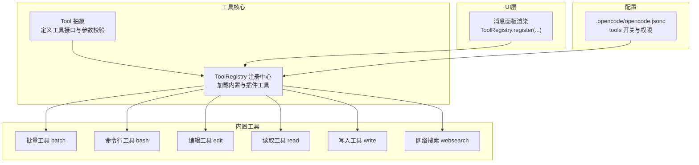
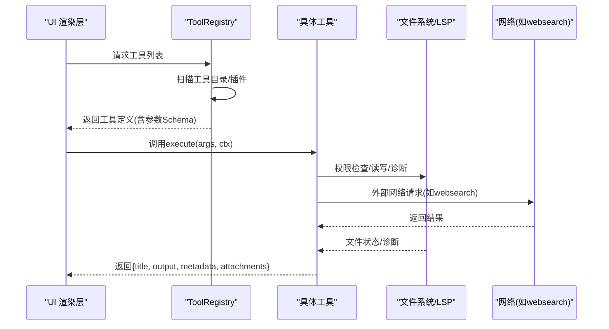
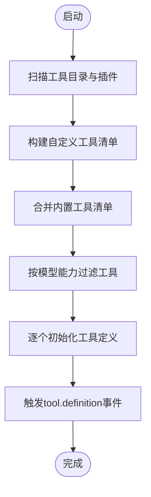
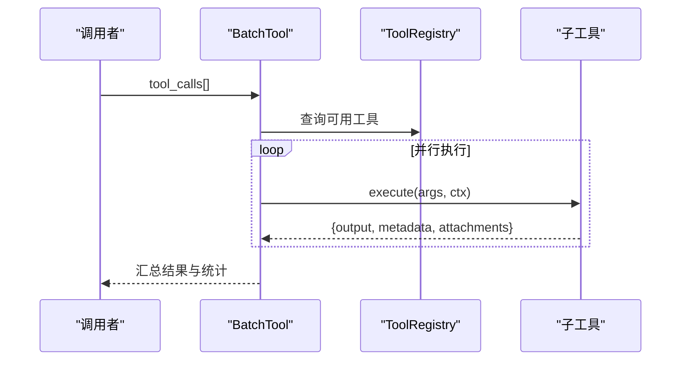
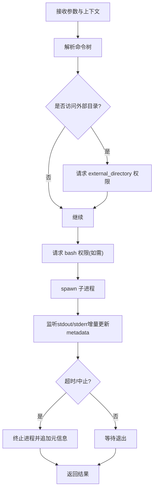
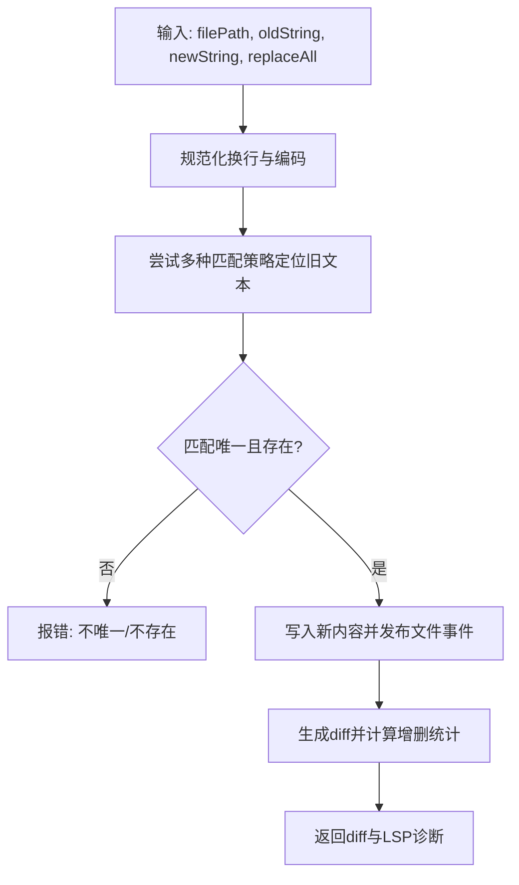
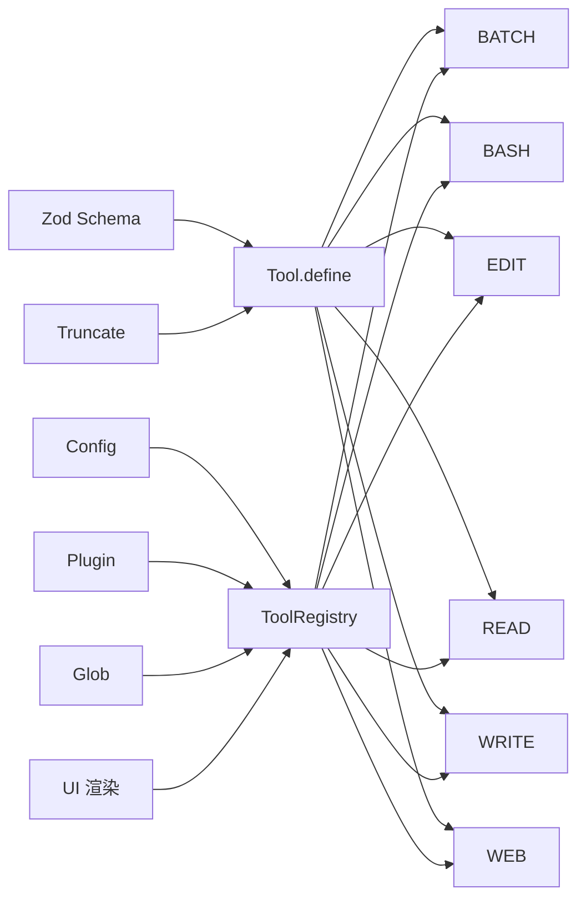

# 工具系统

<cite>
**本文引用的文件**
- [packages/opencode/src/tool/tool.ts](file://packages/opencode/src/tool/tool.ts)
- [packages/opencode/src/tool/registry.ts](file://packages/opencode/src/tool/registry.ts)
- [packages/opencode/src/tool/batch.ts](file://packages/opencode/src/tool/batch.ts)
- [packages/opencode/src/tool/bash.ts](file://packages/opencode/src/tool/bash.ts)
- [packages/opencode/src/tool/edit.ts](file://packages/opencode/src/tool/edit.ts)
- [packages/opencode/src/tool/read.ts](file://packages/opencode/src/tool/read.ts)
- [packages/opencode/src/tool/write.ts](file://packages/opencode/src/tool/write.ts)
- [packages/opencode/src/tool/websearch.ts](file://packages/opencode/src/tool/websearch.ts)
- [.opencode/opencode.jsonc](file://.opencode/opencode.jsonc)
- [packages/ui/src/components/message-part.tsx](file://packages/ui/src/components/message-part.tsx)
</cite>

## 目录
1. [简介](#简介)
2. [项目结构](#项目结构)
3. [核心组件](#核心组件)
4. [架构总览](#架构总览)
5. [详细组件分析](#详细组件分析)
6. [依赖关系分析](#依赖关系分析)
7. [性能考量](#性能考量)
8. [故障排查指南](#故障排查指南)
9. [结论](#结论)
10. [附录](#附录)

## 简介
本文件面向OpenCode的工具系统，系统性阐述工具的定义、注册与执行机制，覆盖内置工具的功能分类、参数配置与使用方法；同时给出自定义工具的开发流程、API接口与最佳实践，并解释并行执行、错误处理与结果聚合机制。最后提供调试技巧、性能优化与安全注意事项，以及工具生态扩展与社区贡献指南。

## 项目结构
OpenCode的工具系统主要位于packages/opencode/src/tool目录下，围绕统一的工具抽象与注册中心组织。UI层通过ToolRegistry.register在消息面板中渲染各类工具输出。配置层面，.opencode/opencode.jsonc用于控制工具开关与权限策略。



**图表来源**
- [packages/opencode/src/tool/tool.ts:1-91](file://packages/opencode/src/tool/tool.ts#L1-L91)
- [packages/opencode/src/tool/registry.ts:1-175](file://packages/opencode/src/tool/registry.ts#L1-L175)
- [packages/ui/src/components/message-part.tsx:1429-2139](file://packages/ui/src/components/message-part.tsx#L1429-L2139)
- [.opencode/opencode.jsonc:14-18](file://.opencode/opencode.jsonc#L14-L18)

**章节来源**
- [packages/opencode/src/tool/registry.ts:35-175](file://packages/opencode/src/tool/registry.ts#L35-L175)
- [.opencode/opencode.jsonc:14-18](file://.opencode/opencode.jsonc#L14-L18)

## 核心组件
- 工具抽象与参数校验：Tool.define封装了工具的初始化、参数Schema校验、执行包装与输出截断逻辑，确保调用方无需重复处理参数验证与结果格式化。
- 工具注册中心：ToolRegistry负责扫描本地工具文件与插件工具，合并内置工具清单，按模型能力动态过滤可用工具，并触发工具定义扩展事件。
- UI渲染适配：UI层通过ToolRegistry.register为每类工具提供渲染器，将工具执行结果以用户可读的形式展示。

关键要点：
- 参数Schema由Zod定义，执行前自动校验，异常时可定制格式化错误信息。
- 输出截断由Truncate模块统一处理，避免超大数据影响LLM上下文。
- 工具执行上下文包含会话、消息、代理、中止信号等，便于权限请求与状态更新。

**章节来源**
- [packages/opencode/src/tool/tool.ts:8-91](file://packages/opencode/src/tool/tool.ts#L8-L91)
- [packages/opencode/src/tool/registry.ts:35-175](file://packages/opencode/src/tool/registry.ts#L35-L175)

## 架构总览
工具系统采用“抽象定义 + 注册中心 + 动态加载 + UI渲染”的分层架构。注册中心在运行时扫描工具目录与插件，构建工具清单；工具执行时进行参数校验、权限请求、并发控制与结果聚合；UI层根据工具类型渲染不同视图。



**图表来源**
- [packages/opencode/src/tool/registry.ts:99-175](file://packages/opencode/src/tool/registry.ts#L99-L175)
- [packages/opencode/src/tool/tool.ts:49-91](file://packages/opencode/src/tool/tool.ts#L49-L91)
- [packages/opencode/src/tool/websearch.ts:65-151](file://packages/opencode/src/tool/websearch.ts#L65-L151)

## 详细组件分析

### 工具抽象与生命周期（Tool.define）
- 初始化：支持同步或异步返回工具定义，内部对execute进行包装，统一执行参数校验与输出截断。
- 参数校验：使用Zod Schema，若工具提供formatValidationError可定制错误提示。
- 执行上下文：包含会话ID、消息ID、代理标识、中止信号、额外元数据、历史消息、metadata回调与ask权限请求方法。
- 结果规范：统一返回title、output、metadata与可选附件；若工具已自行截断则跳过二次截断。

```mermaid
classDiagram
class Tool_Info {
+id : string
+init(ctx?) : Promise<{
description : string
parameters : ZodType
execute(args, ctx) : Promise<Result>
formatValidationError?(error) : string
}>
}
class Tool_Context {
+sessionID : string
+messageID : string
+agent : string
+abort : AbortSignal
+callID? : string
+extra? : map
+messages : MessageV2[]
+metadata(input) : void
+ask(request) : Promise<void>
}
Tool_Info --> Tool_Context : "执行时传入"
```

**图表来源**
- [packages/opencode/src/tool/tool.ts:28-47](file://packages/opencode/src/tool/tool.ts#L28-L47)
- [packages/opencode/src/tool/tool.ts:13-27](file://packages/opencode/src/tool/tool.ts#L13-L27)

**章节来源**
- [packages/opencode/src/tool/tool.ts:8-91](file://packages/opencode/src/tool/tool.ts#L8-L91)

### 工具注册中心（ToolRegistry）
- 自动发现：扫描Config.directories()下的tool与tools目录中的*.js/*.ts文件，动态import并注册为工具。
- 插件集成：遍历Plugin.list()，将插件导出的tool定义转换为Tool.Info并注册。
- 工具筛选：按ProviderID/ModelID动态启用/禁用特定工具（如websearch/codesearch、apply_patch、edit/write）。
- 定义扩展：触发tool.definition事件允许外部监听器修改描述与参数Schema。



**图表来源**
- [packages/opencode/src/tool/registry.ts:38-175](file://packages/opencode/src/tool/registry.ts#L38-L175)

**章节来源**
- [packages/opencode/src/tool/registry.ts:35-175](file://packages/opencode/src/tool/registry.ts#L35-L175)

### 内置工具一览与参数配置

#### 批量工具（batch）
- 功能：并行执行多个工具调用，限制最多25次调用，记录每个子调用的状态与耗时，聚合成功/失败统计与附件。
- 关键点：禁止在batch内嵌套batch；对不可用工具抛出明确错误；对超出上限的调用标记为错误并计入统计。
- 输出：包含成功/失败计数、工具名列表与详情数组，并汇总成功调用的附件。



**图表来源**
- [packages/opencode/src/tool/batch.ts:33-183](file://packages/opencode/src/tool/batch.ts#L33-L183)

**章节来源**
- [packages/opencode/src/tool/batch.ts:9-183](file://packages/opencode/src/tool/batch.ts#L9-L183)

#### 命令行工具（bash）
- 功能：在受控工作目录下执行Shell命令，支持超时、中止、权限请求与输出流实时更新。
- 安全：解析命令树，识别可能的路径变更与外部目录访问，必要时请求权限；Windows/Linux行为差异处理。
- 输出：实时更新metadata.output，支持超时/中止元信息注入；最终返回标题、输出与退出码等元数据。
- 配置：默认超时可通过实验性标志调整；输出最大长度限制。



**图表来源**
- [packages/opencode/src/tool/bash.ts:78-271](file://packages/opencode/src/tool/bash.ts#L78-L271)

**章节来源**
- [packages/opencode/src/tool/bash.ts:55-271](file://packages/opencode/src/tool/bash.ts#L55-L271)

#### 编辑工具（edit）
- 功能：在文件中查找旧字符串并替换为新字符串，支持多策略匹配与唯一性约束；生成diff并上报LSP诊断。
- 安全：严格路径检查与外部目录权限请求；对多处匹配或找不到的情况给出明确错误。
- 输出：返回diff、文件前后内容摘要与LSP错误提示；支持仅替换第一个或全部替换。



**图表来源**
- [packages/opencode/src/tool/edit.ts:44-168](file://packages/opencode/src/tool/edit.ts#L44-L168)

**章节来源**
- [packages/opencode/src/tool/edit.ts:36-168](file://packages/opencode/src/tool/edit.ts#L36-L168)

#### 读取工具（read）
- 功能：读取文件或目录内容，支持偏移与限制；对图片/PDF进行预览；二进制文件检测与拒绝。
- 安全：请求read权限；对目录列出条目并排序；对文件按行读取并截断长行与字节上限。
- 输出：返回路径、类型、内容与预览；对超出部分给出续读建议；对指令提示进行拼接。

**章节来源**
- [packages/opencode/src/tool/read.ts:21-233](file://packages/opencode/src/tool/read.ts#L21-L233)

#### 写入工具（write）
- 功能：直接写入文件，生成diff并上报LSP诊断；对目标文件存在性与时间戳进行一致性检查。
- 安全：请求edit权限；写入后发布文件事件并刷新LSP诊断。
- 输出：返回写入结果与诊断信息；对项目中其他文件的诊断进行限制数量输出。

**章节来源**
- [packages/opencode/src/tool/write.ts:19-85](file://packages/opencode/src/tool/write.ts#L19-L85)

#### 网络搜索工具（websearch）
- 功能：通过MCP服务发起搜索请求，支持类型、结果数量与上下文长度等参数；解析SSE响应获取第一条结果。
- 安全：请求websearch权限；设置超时保护；对异常进行统一错误处理。
- 输出：返回第一条搜索结果文本与标题；无结果时提示改用其他查询。

**章节来源**
- [packages/opencode/src/tool/websearch.ts:40-151](file://packages/opencode/src/tool/websearch.ts#L40-L151)

### UI渲染适配（ToolRegistry.register）
- UI层通过多次ToolRegistry.register为不同工具名注册渲染器，将工具执行结果以卡片、代码块、文件diff等形式呈现。
- 典型场景：bash输出带复制按钮与ANSI清理；edit输出diff与诊断；todowrite显示任务进度等。

**章节来源**
- [packages/ui/src/components/message-part.tsx:1429-2139](file://packages/ui/src/components/message-part.tsx#L1429-L2139)

## 依赖关系分析
- 工具抽象依赖Zod进行参数校验，依赖Truncate进行输出截断。
- 注册中心依赖Config/Plugin/Glob等模块进行工具发现与插件集成。
- 具体工具依赖文件系统、LSP、Shell、网络等外部能力。
- UI层依赖注册中心提供的工具定义与渲染器。



**图表来源**
- [packages/opencode/src/tool/tool.ts:1-91](file://packages/opencode/src/tool/tool.ts#L1-L91)
- [packages/opencode/src/tool/registry.ts:1-175](file://packages/opencode/src/tool/registry.ts#L1-L175)

**章节来源**
- [packages/opencode/src/tool/tool.ts:1-91](file://packages/opencode/src/tool/tool.ts#L1-L91)
- [packages/opencode/src/tool/registry.ts:1-175](file://packages/opencode/src/tool/registry.ts#L1-L175)

## 性能考量
- 并发与批处理：批量工具支持并行执行，但有上限与错误兜底；建议合理拆分任务，避免单次过多并发导致资源争用。
- 输出截断：统一的截断策略避免大输出污染上下文；工具自身也可选择跳过二次截断。
- I/O与网络：读取工具对文件大小与行数进行限制；网络搜索设置超时；命令行工具设置默认超时与中止信号。
- LSP与文件锁：编辑/写入工具在关键路径上加锁并触发生态，减少竞态与无效重算。

[本节为通用指导，不直接分析具体文件]

## 故障排查指南
- 参数校验失败：检查工具Schema与调用参数，关注formatValidationError提供的友好提示。
- 权限被拒：确认外部目录/文件/网络/命令行等权限请求是否满足；必要时调整配置或交互授权。
- 超时与中止：命令行工具支持超时与中止；检查AbortSignal传播与超时阈值。
- 批量工具错误：核对工具名是否在可用列表、是否超过上限、是否存在不允许的工具；查看统计与失败详情。
- 网络搜索异常：检查网络连通与超时设置；确认websearch权限已授权。

**章节来源**
- [packages/opencode/src/tool/tool.ts:58-87](file://packages/opencode/src/tool/tool.ts#L58-L87)
- [packages/opencode/src/tool/batch.ts:133-183](file://packages/opencode/src/tool/batch.ts#L133-L183)
- [packages/opencode/src/tool/websearch.ts:95-151](file://packages/opencode/src/tool/websearch.ts#L95-L151)

## 结论
OpenCode工具系统以统一抽象与注册中心为核心，结合严格的参数校验、权限请求与输出截断，提供了安全、可控且可扩展的工具执行框架。内置工具覆盖文件操作、命令行、网络搜索与批量执行等常见场景；UI层通过注册机制实现多样化渲染。开发者可基于Tool.define快速实现自定义工具，并通过插件与配置灵活接入生态。

[本节为总结，不直接分析具体文件]

## 附录

### 自定义工具开发流程
- 定义工具：使用Tool.define(id, init)，在init中返回description、parameters与execute。
- 参数Schema：使用Zod定义，确保调用前自动校验；可提供formatValidationError定制错误文案。
- 执行上下文：利用ctx.ask请求权限，使用ctx.metadata更新中间状态，使用attachments传递文件附件。
- 注册与发现：将工具导出至tool/tools目录下的*.ts/.js文件，或通过插件tool字段暴露；重启后自动被注册中心加载。
- 最佳实践：尽量短小单一职责；对可能的外部访问请求权限；对大输出进行截断或分页；提供清晰的title与metadata。

**章节来源**
- [packages/opencode/src/tool/tool.ts:49-91](file://packages/opencode/src/tool/tool.ts#L49-L91)
- [packages/opencode/src/tool/registry.ts:38-87](file://packages/opencode/src/tool/registry.ts#L38-L87)

### 配置与权限
- 工具开关：.opencode/opencode.jsonc的tools字段可用于控制某些工具的启用状态。
- 权限策略：工具执行期间通过ctx.ask请求权限，UI层根据权限策略决定是否放行。

**章节来源**
- [.opencode/opencode.jsonc:14-18](file://.opencode/opencode.jsonc#L14-L18)

### 生态扩展与贡献
- 插件工具：在插件的tool字段导出工具定义，注册中心将自动合并到工具清单。
- 社区贡献：遵循工具Schema与权限设计原则，提交PR时附带README与测试用例；优先保证安全性与可复现性。

[本节为通用指导，不直接分析具体文件]