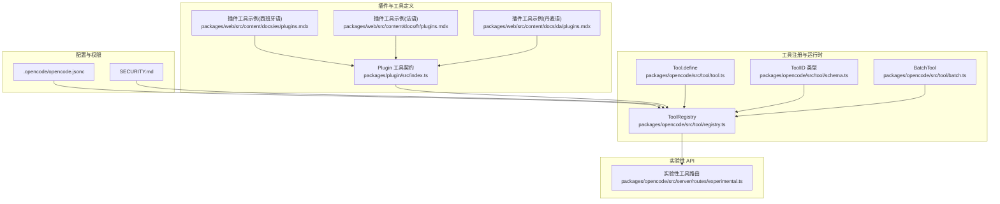
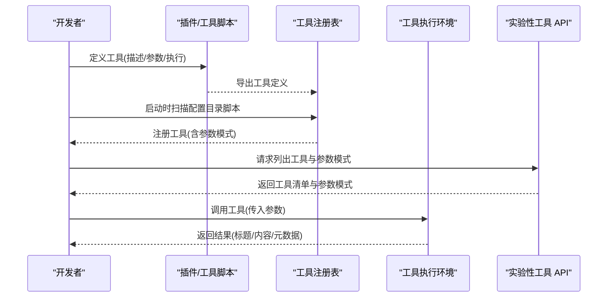
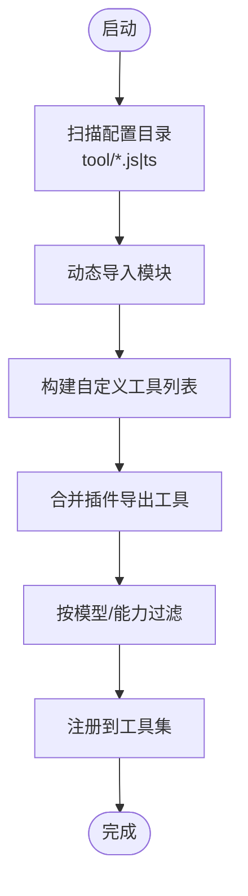
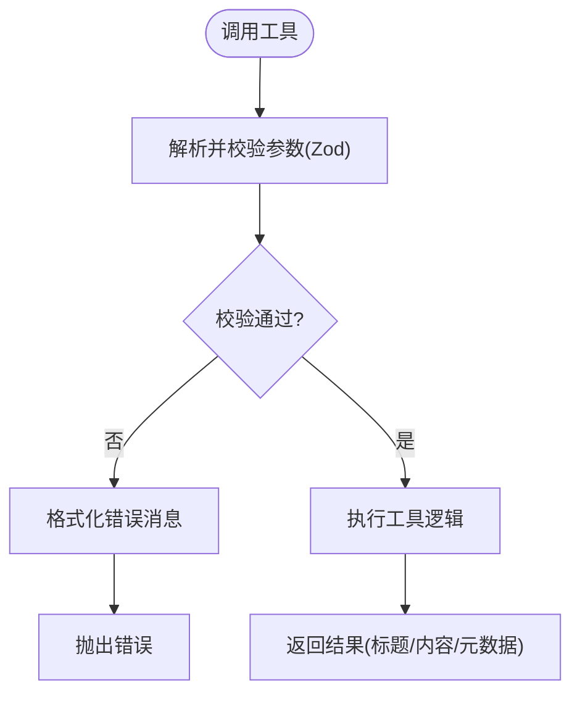
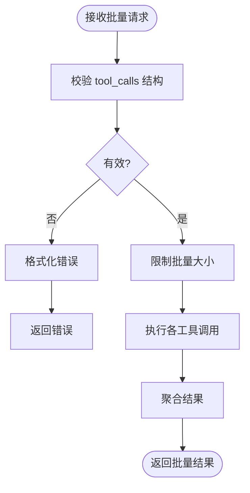
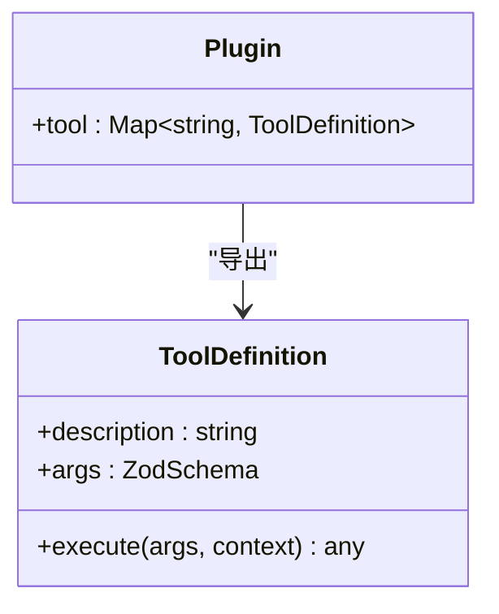
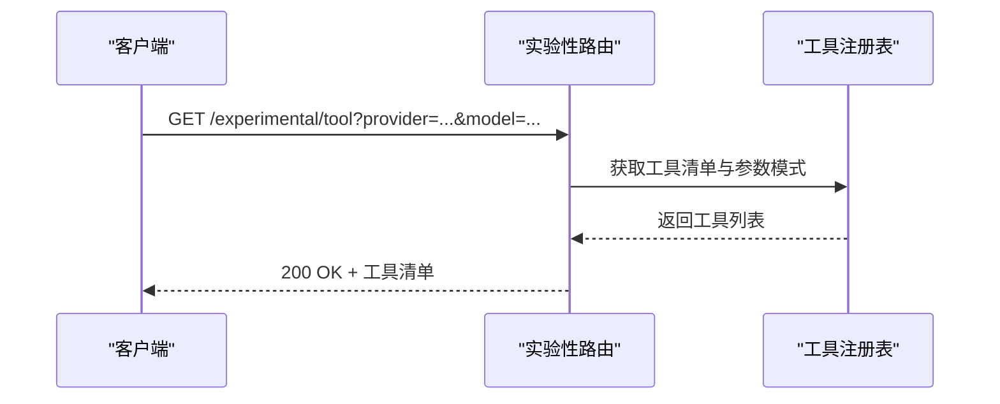
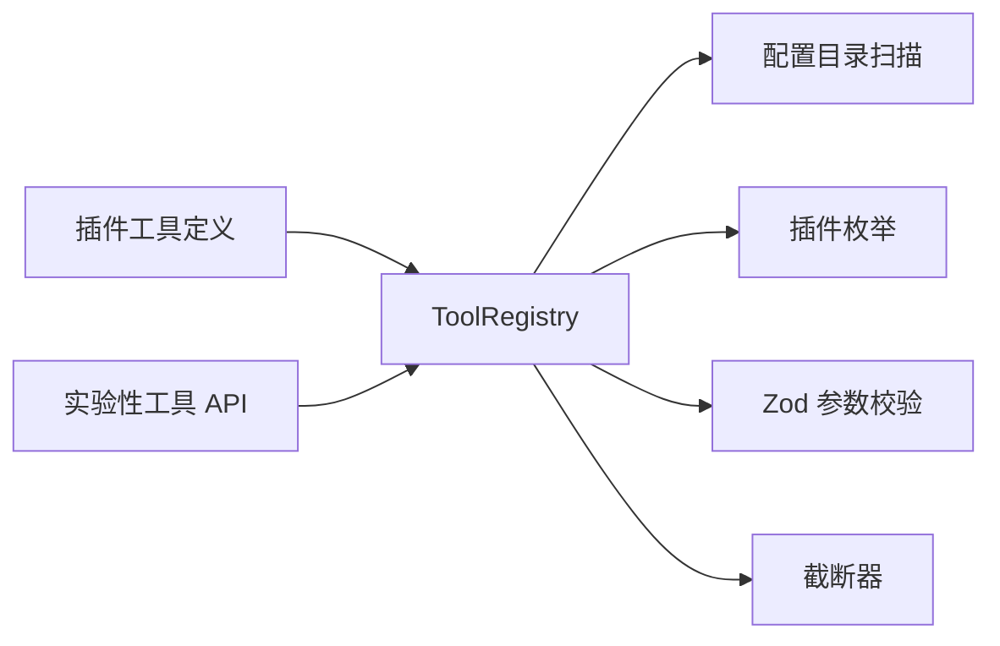

# 自定义工具开发

<cite>
**本文引用的文件**
- [README.md](file://README.md)
- [.opencode/opencode.jsonc](file://.opencode/opencode.jsonc)
- [.opencode/env.d.ts](file://.opencode/env.d.ts)
- [packages/opencode/src/tool/registry.ts](file://packages/opencode/src/tool/registry.ts)
- [packages/opencode/src/tool/tool.ts](file://packages/opencode/src/tool/tool.ts)
- [packages/opencode/src/tool/batch.ts](file://packages/opencode/src/tool/batch.ts)
- [packages/opencode/src/tool/schema.ts](file://packages/opencode/src/tool/schema.ts)
- [packages/opencode/src/server/routes/experimental.ts](file://packages/opencode/src/server/routes/experimental.ts)
- [packages/plugin/src/index.ts](file://packages/plugin/src/index.ts)
- [packages/web/src/content/docs/es/plugins.mdx](file://packages/web/src/content/docs/es/plugins.mdx)
- [packages/web/src/content/docs/fr/plugins.mdx](file://packages/web/src/content/docs/fr/plugins.mdx)
- [packages/web/src/content/docs/da/plugins.mdx](file://packages/web/src/content/docs/da/plugins.mdx)
- [SECURITY.md](file://SECURITY.md)
</cite>

## 目录
1. [简介](#简介)
2. [项目结构](#项目结构)
3. [核心组件](#核心组件)
4. [架构总览](#架构总览)
5. [详细组件分析](#详细组件分析)
6. [依赖关系分析](#依赖关系分析)
7. [性能考量](#性能考量)
8. [故障排查指南](#故障排查指南)
9. [结论](#结论)
10. [附录](#附录)

## 简介
本指南面向希望在 OpenCode 中开发与集成“自定义工具”的开发者，覆盖从工具定义、参数校验、执行与返回、到注册、权限与安全、调试与日志、以及打包分发与版本管理的全流程。OpenCode 提供两类扩展入口：插件（Plugin）与本地工具脚本（位于配置目录下的 tool/tools 脚本），二者均可向系统注册工具，并由工具注册表统一管理与暴露给模型调用。

## 项目结构
OpenCode 的工具生态主要分布在以下位置：
- 插件与工具定义：packages/plugin/src/index.ts 定义了插件与工具的类型契约；文档示例展示了如何通过插件导出自定义工具。
- 工具注册与加载：packages/opencode/src/tool/registry.ts 负责扫描配置目录中的工具脚本与插件导出的工具，构建可用工具列表。
- 工具基元与参数校验：packages/opencode/src/tool/tool.ts 提供工具定义与参数校验逻辑；packages/opencode/src/tool/schema.ts 定义工具 ID 的类型与约束。
- 批量工具：packages/opencode/src/tool/batch.ts 展示了复杂参数与批量执行的实现方式。
- 实验性工具 API：packages/opencode/src/server/routes/experimental.ts 暴露列出工具与参数模式的接口。
- 配置与权限：.opencode/opencode.jsonc 提供工具开关与权限配置；SECURITY.md 描述安全模型与隔离边界。

**图表来源**
- [packages/opencode/src/tool/registry.ts:35-126](file://packages/opencode/src/tool/registry.ts#L35-L126)
- [packages/opencode/src/tool/tool.ts:49-72](file://packages/opencode/src/tool/tool.ts#L49-L72)
- [packages/opencode/src/tool/batch.ts:9-37](file://packages/opencode/src/tool/batch.ts#L9-L37)
- [packages/opencode/src/tool/schema.ts:1-17](file://packages/opencode/src/tool/schema.ts#L1-L17)
- [packages/plugin/src/index.ts:151-153](file://packages/plugin/src/index.ts#L151-L153)
- [packages/web/src/content/docs/es/plugins.mdx:282-301](file://packages/web/src/content/docs/es/plugins.mdx#L282-L301)
- [packages/web/src/content/docs/fr/plugins.mdx:281-299](file://packages/web/src/content/docs/fr/plugins.mdx#L281-L299)
- [packages/web/src/content/docs/da/plugins.mdx:295-300](file://packages/web/src/content/docs/da/plugins.mdx#L295-L300)
- [packages/opencode/src/server/routes/experimental.ts:37-81](file://packages/opencode/src/server/routes/experimental.ts#L37-L81)
- [.opencode/opencode.jsonc:14-18](file://.opencode/opencode.jsonc#L14-L18)
- [SECURITY.md:15-19](file://SECURITY.md#L15-L19)

**章节来源**
- [packages/opencode/src/tool/registry.ts:35-126](file://packages/opencode/src/tool/registry.ts#L35-L126)
- [packages/plugin/src/index.ts:151-153](file://packages/plugin/src/index.ts#L151-L153)
- [packages/web/src/content/docs/es/plugins.mdx:282-301](file://packages/web/src/content/docs/es/plugins.mdx#L282-L301)
- [packages/web/src/content/docs/fr/plugins.mdx:281-299](file://packages/web/src/content/docs/fr/plugins.mdx#L281-L299)
- [packages/web/src/content/docs/da/plugins.mdx:295-300](file://packages/web/src/content/docs/da/plugins.mdx#L295-L300)
- [packages/opencode/src/server/routes/experimental.ts:37-81](file://packages/opencode/src/server/routes/experimental.ts#L37-L81)
- [.opencode/opencode.jsonc:14-18](file://.opencode/opencode.jsonc#L14-L18)
- [SECURITY.md:15-19](file://SECURITY.md#L15-L19)

## 核心组件
- 工具注册表（ToolRegistry）
  - 职责：扫描配置目录下的工具脚本与插件导出的工具，构建可用工具集合；按模型与客户端能力过滤工具；统一注入上下文（工作目录、工作树）并进行输出截断。
  - 关键点：支持从本地脚本与插件两种来源加载工具；优先级：插件工具覆盖同名内置工具。
- 工具定义与参数校验（Tool.define）
  - 职责：封装工具的描述、参数模式（Zod）、执行函数与错误格式化；在执行前对参数进行严格校验；允许工具自行处理截断或交由系统统一处理。
- 工具 ID 类型（ToolID）
  - 职责：为工具 ID 提供类型安全与标识符生成辅助。
- 批量工具（BatchTool）
  - 职责：支持并发批量调用多个工具，提供更友好的参数校验错误格式化。
- 插件工具契约（Plugin 工具）
  - 职责：通过插件导出工具定义，包括描述、参数模式与执行函数；可被注册表统一纳入工具集。
- 实验性工具 API
  - 职责：提供列出工具与参数模式的接口，便于调试与自动化集成。

**章节来源**
- [packages/opencode/src/tool/registry.ts:35-126](file://packages/opencode/src/tool/registry.ts#L35-L126)
- [packages/opencode/src/tool/tool.ts:49-72](file://packages/opencode/src/tool/tool.ts#L49-L72)
- [packages/opencode/src/tool/schema.ts:1-17](file://packages/opencode/src/tool/schema.ts#L1-L17)
- [packages/opencode/src/tool/batch.ts:9-37](file://packages/opencode/src/tool/batch.ts#L9-L37)
- [packages/plugin/src/index.ts:151-153](file://packages/plugin/src/index.ts#L151-L153)
- [packages/opencode/src/server/routes/experimental.ts:37-81](file://packages/opencode/src/server/routes/experimental.ts#L37-L81)

## 架构总览
下图展示工具从定义到注册、执行与返回的整体流程，以及与插件、配置与服务端 API 的交互。

**图表来源**
- [packages/opencode/src/tool/registry.ts:38-87](file://packages/opencode/src/tool/registry.ts#L38-L87)
- [packages/plugin/src/index.ts:151-153](file://packages/plugin/src/index.ts#L151-L153)
- [packages/opencode/src/server/routes/experimental.ts:37-81](file://packages/opencode/src/server/routes/experimental.ts#L37-L81)

## 详细组件分析

### 工具注册表（ToolRegistry）
- 加载来源
  - 本地脚本：扫描配置目录中 tool/tools 下的 js/ts 文件，动态导入并注册。
  - 插件：遍历已加载插件，合并其导出的 tool 字段。
- 上下文注入
  - 将工作目录与工作树注入到插件工具上下文中，确保工具可感知项目根路径。
- 过滤与能力开关
  - 基于模型提供商与能力标志位过滤工具（如 codesearch/websearch、apply_patch、edit/write 等）。
- 输出截断
  - 统一调用截断器以避免超长输出影响会话与成本。

**图表来源**
- [packages/opencode/src/tool/registry.ts:38-126](file://packages/opencode/src/tool/registry.ts#L38-L126)

**章节来源**
- [packages/opencode/src/tool/registry.ts:35-126](file://packages/opencode/src/tool/registry.ts#L35-L126)

### 工具定义与参数校验（Tool.define）
- 参数模式：使用 Zod 定义工具输入参数，执行前自动校验。
- 错误格式化：可自定义 formatValidationError，将原始校验错误转换为更易读的提示。
- 截断处理：若工具自身已处理截断，则跳过系统统一截断；否则由系统统一处理。

**图表来源**
- [packages/opencode/src/tool/tool.ts:55-72](file://packages/opencode/src/tool/tool.ts#L55-L72)

**章节来源**
- [packages/opencode/src/tool/tool.ts:49-72](file://packages/opencode/src/tool/tool.ts#L49-L72)

### 批量工具（BatchTool）
- 功能：支持一次提交多个工具调用，按顺序或并发执行。
- 参数校验：对 tool_calls 数组进行严格校验，并提供清晰的错误格式化。
- 并发限制：限制最大批量数量，避免资源耗尽。

**图表来源**
- [packages/opencode/src/tool/batch.ts:9-37](file://packages/opencode/src/tool/batch.ts#L9-L37)

**章节来源**
- [packages/opencode/src/tool/batch.ts:9-37](file://packages/opencode/src/tool/batch.ts#L9-L37)

### 插件工具（Plugin 工具）
- 工具定义：通过插件导出的 tool 字典，每个键对应一个工具定义。
- 参数模式：使用工具助手提供的 schema 构建 Zod 模式。
- 执行上下文：工具执行时可访问工作目录与工作树等上下文信息。
- 优先级：插件工具与内置工具同名时，插件工具优先。

**图表来源**
- [packages/plugin/src/index.ts:151-153](file://packages/plugin/src/index.ts#L151-L153)

**章节来源**
- [packages/plugin/src/index.ts:151-153](file://packages/plugin/src/index.ts#L151-L153)
- [packages/web/src/content/docs/es/plugins.mdx:282-301](file://packages/web/src/content/docs/es/plugins.mdx#L282-L301)
- [packages/web/src/content/docs/fr/plugins.mdx:281-299](file://packages/web/src/content/docs/fr/plugins.mdx#L281-L299)
- [packages/web/src/content/docs/da/plugins.mdx:295-300](file://packages/web/src/content/docs/da/plugins.mdx#L295-L300)

### 实验性工具 API
- 列出工具：返回工具 ID、描述与参数模式，便于前端或外部系统集成。
- 查询参数：需提供 provider 与 model，以便根据模型能力过滤工具。

**图表来源**
- [packages/opencode/src/server/routes/experimental.ts:37-81](file://packages/opencode/src/server/routes/experimental.ts#L37-L81)

**章节来源**
- [packages/opencode/src/server/routes/experimental.ts:37-81](file://packages/opencode/src/server/routes/experimental.ts#L37-L81)

## 依赖关系分析
- 工具注册表依赖：
  - 配置目录扫描与插件枚举，用于发现工具来源。
  - 工具定义与参数校验（Zod），用于参数约束与错误格式化。
  - 截断器，用于统一输出长度控制。
- 插件工具依赖：
  - 插件契约定义，确保工具定义符合规范。
- 实验性 API 依赖：
  - 工具注册表，用于查询当前可用工具与参数模式。

**图表来源**
- [packages/opencode/src/tool/registry.ts:38-126](file://packages/opencode/src/tool/registry.ts#L38-L126)
- [packages/plugin/src/index.ts:151-153](file://packages/plugin/src/index.ts#L151-L153)
- [packages/opencode/src/server/routes/experimental.ts:37-81](file://packages/opencode/src/server/routes/experimental.ts#L37-L81)

**章节来源**
- [packages/opencode/src/tool/registry.ts:38-126](file://packages/opencode/src/tool/registry.ts#L38-L126)
- [packages/plugin/src/index.ts:151-153](file://packages/plugin/src/index.ts#L151-L153)
- [packages/opencode/src/server/routes/experimental.ts:37-81](file://packages/opencode/src/server/routes/experimental.ts#L37-L81)

## 性能考量
- 参数校验开销：Zod 校验在每次工具调用前执行，建议保持参数模式简洁且必要字段明确，减少深层嵌套。
- 批量工具：合理设置批量上限，避免并发过高导致资源争用。
- 输出截断：统一截断可降低上下文长度与成本，建议在工具内部也做必要的内容裁剪。
- 工具过滤：根据模型提供商与能力标志位提前过滤不适用工具，减少无效调用。

## 故障排查指南
- 参数校验失败
  - 现象：调用时报错，提示参数不符合预期。
  - 排查：检查工具定义中的参数模式；利用 formatValidationError 提供更清晰的错误信息。
  - 参考：[packages/opencode/src/tool/tool.ts:58-69](file://packages/opencode/src/tool/tool.ts#L58-L69)
- 工具未出现
  - 现象：工具未出现在可用列表。
  - 排查：确认工具是否来自插件导出或配置目录脚本；检查文件命名与导出结构；确认插件已正确加载。
  - 参考：[packages/opencode/src/tool/registry.ts:41-60](file://packages/opencode/src/tool/registry.ts#L41-L60)
- 权限与安全
  - 现象：工具执行被拒绝或存在安全风险。
  - 排查：了解 OpenCode 不提供沙箱隔离，权限系统仅作为 UX 提示；如需强隔离，请在容器或虚拟机中运行。
  - 参考：[SECURITY.md:15-19](file://SECURITY.md#L15-L19)
- 日志记录
  - 建议：使用插件提供的结构化日志接口进行记录，便于问题定位与审计。
  - 参考：[packages/web/src/content/docs/es/plugins.mdx:317-334](file://packages/web/src/content/docs/es/plugins.mdx#L317-L334)

**章节来源**
- [packages/opencode/src/tool/tool.ts:58-69](file://packages/opencode/src/tool/tool.ts#L58-L69)
- [packages/opencode/src/tool/registry.ts:41-60](file://packages/opencode/src/tool/registry.ts#L41-L60)
- [SECURITY.md:15-19](file://SECURITY.md#L15-L19)
- [packages/web/src/content/docs/es/plugins.mdx:317-334](file://packages/web/src/content/docs/es/plugins.mdx#L317-L334)

## 结论
OpenCode 为自定义工具提供了清晰的扩展路径：通过插件或本地脚本定义工具，借助工具注册表统一加载与暴露，结合参数校验与输出截断保障稳定性与性能。配合实验性 API 与权限配置，开发者可以快速构建、测试与集成工具，并在需要时采用更强的安全隔离方案。

## 附录

### 工具开发流程（从定义到注册与测试）
- 定义工具
  - 使用插件导出工具字典，或在配置目录编写 tool/*.ts/js 脚本导出工具定义。
  - 参考：[packages/plugin/src/index.ts:151-153](file://packages/plugin/src/index.ts#L151-L153)，[packages/web/src/content/docs/es/plugins.mdx:282-301](file://packages/web/src/content/docs/es/plugins.mdx#L282-L301)
- 参数验证与返回格式
  - 使用 Zod 定义参数模式；在工具内部返回标准结构（标题、内容、元数据）。
  - 参考：[packages/opencode/src/tool/tool.ts:49-72](file://packages/opencode/src/tool/tool.ts#L49-L72)
- 注册与发现
  - 启动时自动扫描配置目录与插件；可通过实验性 API 获取工具清单与参数模式。
  - 参考：[packages/opencode/src/tool/registry.ts:38-87](file://packages/opencode/src/tool/registry.ts#L38-L87)，[packages/opencode/src/server/routes/experimental.ts:37-81](file://packages/opencode/src/server/routes/experimental.ts#L37-L81)
- 测试与调试
  - 使用实验性 API 列出工具与参数模式；在插件中使用结构化日志记录。
  - 参考：[packages/opencode/src/server/routes/experimental.ts:37-81](file://packages/opencode/src/server/routes/experimental.ts#L37-L81)，[packages/web/src/content/docs/es/plugins.mdx:317-334](file://packages/web/src/content/docs/es/plugins.mdx#L317-L334)

**章节来源**
- [packages/plugin/src/index.ts:151-153](file://packages/plugin/src/index.ts#L151-L153)
- [packages/web/src/content/docs/es/plugins.mdx:282-301](file://packages/web/src/content/docs/es/plugins.mdx#L282-L301)
- [packages/opencode/src/tool/tool.ts:49-72](file://packages/opencode/src/tool/tool.ts#L49-L72)
- [packages/opencode/src/tool/registry.ts:38-87](file://packages/opencode/src/tool/registry.ts#L38-L87)
- [packages/opencode/src/server/routes/experimental.ts:37-81](file://packages/opencode/src/server/routes/experimental.ts#L37-L81)

### 多语言工具开发示例思路
- TypeScript（推荐）
  - 在插件中使用工具助手定义工具，利用 Zod 模式与结构化返回。
  - 参考：[packages/web/src/content/docs/es/plugins.mdx:282-301](file://packages/web/src/content/docs/es/plugins.mdx#L282-L301)
- Python
  - 通过插件或外部进程调用的方式桥接 Python 工具；在插件中以 JSON 形式传递参数与接收结果。
  - 注意：需在插件中处理参数序列化/反序列化与错误传播。
- Shell
  - 通过插件或外部脚本执行命令；在插件中拼装命令行参数并捕获输出与退出码。
  - 注意：避免直接拼接用户输入，防止命令注入；必要时进行白名单校验。

### 权限控制、沙箱执行与安全机制
- 权限控制
  - 权限系统主要用于 UX 提示，帮助用户意识到潜在高风险操作；实际执行仍依赖用户确认。
  - 参考：[SECURITY.md:15-19](file://SECURITY.md#L15-L19)
- 沙箱执行
  - OpenCode 不提供沙箱隔离；如需强隔离，建议在容器或虚拟机中运行。
  - 参考：[SECURITY.md:15-19](file://SECURITY.md#L15-L19)
- 服务器模式
  - 开启服务器模式需设置认证口令；未设置时默认无认证（带警告）。
  - 参考：[SECURITY.md:21-23](file://SECURITY.md#L21-L23)

**章节来源**
- [SECURITY.md:15-19](file://SECURITY.md#L15-L19)

### 调试技巧、错误处理与日志记录
- 调试技巧
  - 使用实验性工具 API 获取工具清单与参数模式，核对工具是否正确注册。
  - 参考：[packages/opencode/src/server/routes/experimental.ts:37-81](file://packages/opencode/src/server/routes/experimental.ts#L37-L81)
- 错误处理
  - 在工具定义中提供 formatValidationError，将 Zod 错误映射为可读提示。
  - 参考：[packages/opencode/src/tool/tool.ts:23-32](file://packages/opencode/src/tool/tool.ts#L23-L32)
- 日志记录
  - 使用插件提供的结构化日志接口记录服务、级别与附加信息。
  - 参考：[packages/web/src/content/docs/es/plugins.mdx:317-334](file://packages/web/src/content/docs/es/plugins.mdx#L317-L334)

**章节来源**
- [packages/opencode/src/server/routes/experimental.ts:37-81](file://packages/opencode/src/server/routes/experimental.ts#L37-L81)
- [packages/opencode/src/tool/tool.ts:23-32](file://packages/opencode/src/tool/tool.ts#L23-L32)
- [packages/web/src/content/docs/es/plugins.mdx:317-334](file://packages/web/src/content/docs/es/plugins.mdx#L317-L334)

### 工具打包、分发与版本管理最佳实践
- 分发方式
  - 通过插件形式发布，便于随 OpenCode 版本升级而更新。
  - 或将工具脚本放置于配置目录，结合版本化的配置仓库管理。
- 版本管理
  - 使用 Git 对 .opencode 目录进行版本控制；在不同分支或标签维护不同工具集。
  - 参考：[README.md:46-62](file://README.md#L46-L62)
- 兼容性
  - 依据模型提供商与能力标志位适配工具可用性；避免在不支持的模型上启用特定工具。
  - 参考：[packages/opencode/src/tool/registry.ts:142-155](file://packages/opencode/src/tool/registry.ts#L142-L155)

**章节来源**
- [README.md:46-62](file://README.md#L46-L62)
- [packages/opencode/src/tool/registry.ts:142-155](file://packages/opencode/src/tool/registry.ts#L142-L155)