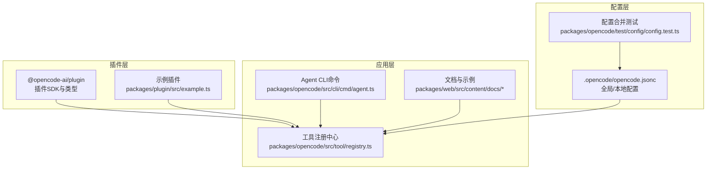
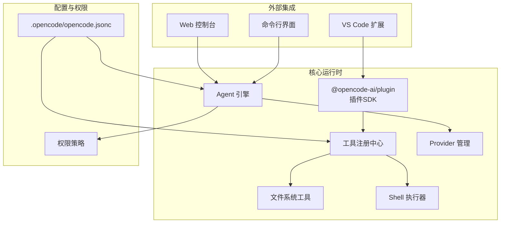
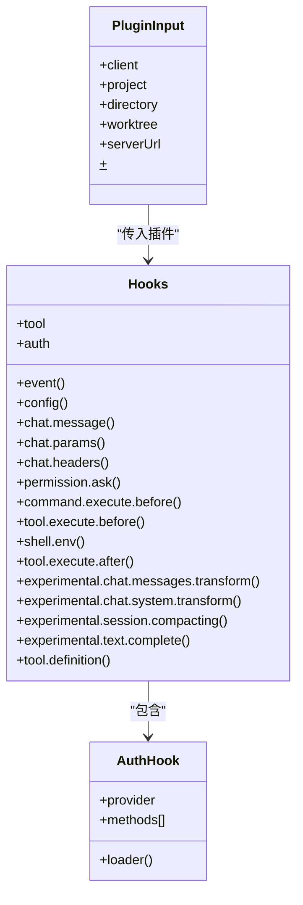
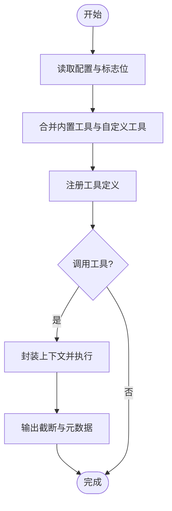
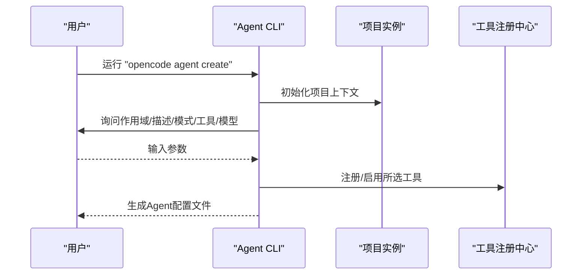
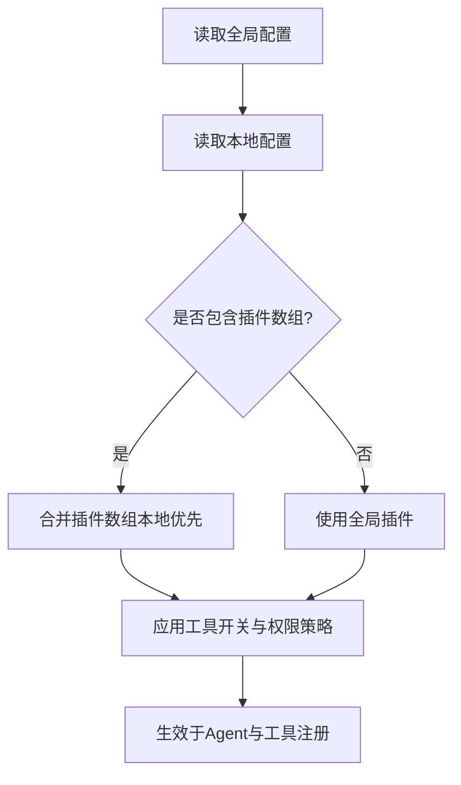
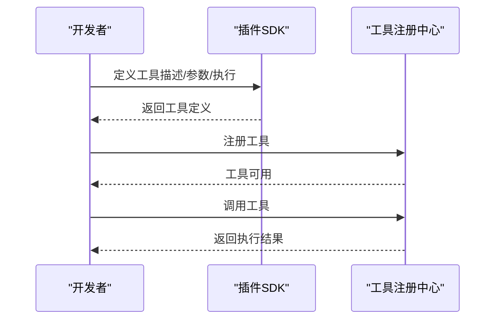
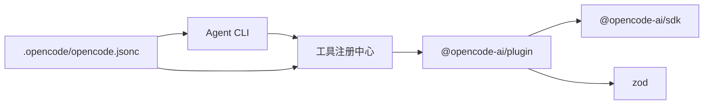

# 内置插件功能

<cite>
**本文引用的文件**
- [.opencode/opencode.jsonc](file://.opencode/opencode.jsonc)
- [packages/plugin/src/index.ts](file://packages/plugin/src/index.ts)
- [packages/plugin/src/example.ts](file://packages/plugin/src/example.ts)
- [packages/plugin/package.json](file://packages/plugin/package.json)
- [packages/opencode/src/cli/cmd/agent.ts](file://packages/opencode/src/cli/cmd/agent.ts)
- [packages/opencode/src/tool/registry.ts](file://packages/opencode/src/tool/registry.ts)
- [packages/web/src/content/docs/custom-tools.mdx](file://packages/web/src/content/docs/custom-tools.mdx)
- [packages/web/src/content/docs/de/agents.mdx](file://packages/web/src/content/docs/de/agents.mdx)
- [packages/web/src/content/docs/es/agents.mdx](file://packages/web/src/content/docs/es/agents.mdx)
- [packages/web/src/content/docs/tr/agents.mdx](file://packages/web/src/content/docs/tr/agents.mdx)
- [packages/web/src/content/docs/bs/agents.mdx](file://packages/web/src/content/docs/bs/agents.mdx)
- [packages/sdk/js/src/gen/types.gen.ts](file://packages/sdk/js/src/gen/types.gen.ts)
- [packages/opencode/test/config/config.test.ts](file://packages/opencode/test/config/config.test.ts)
- [packages/opencode/src/agent/agent.ts](file://packages/opencode/src/agent/agent.ts)
- [packages/opencode/src/provider/provider.ts](file://packages/opencode/src/provider/provider.ts)
- [packages/opencode/src/util/filesystem.ts](file://packages/opencode/src/util/filesystem.ts)
- [packages/opencode/src/project/instance.ts](file://packages/opencode/src/project/instance.ts)
- [packages/opencode/src/global.ts](file://packages/opencode/src/global.ts)
- [packages/opencode/src/cli/ui.ts](file://packages/opencode/src/cli/ui.ts)
- [packages/opencode/src/agent/agent.ts](file://packages/opencode/src/agent/agent.ts)
- [packages/opencode/src/provider/provider.ts](file://packages/opencode/src/provider/provider.ts)
- [packages/opencode/src/util/filesystem.ts](file://packages/opencode/src/util/filesystem.ts)
- [packages/opencode/src/project/instance.ts](file://packages/opencode/src/project/instance.ts)
- [packages/opencode/src/global.ts](file://packages/opencode/src/global.ts)
- [packages/opencode/src/cli/ui.ts](file://packages/opencode/src/cli/ui.ts)
</cite>

## 目录
1. [简介](#简介)
2. [项目结构](#项目结构)
3. [核心组件](#核心组件)
4. [架构总览](#架构总览)
5. [详细组件分析](#详细组件分析)
6. [依赖分析](#依赖分析)
7. [性能考虑](#性能考虑)
8. [故障排除指南](#故障排除指南)
9. [结论](#结论)
10. [附录](#附录)

## 简介
本文件面向OpenCode内置插件功能的使用者与维护者，系统化阐述插件体系的架构、内置工具插件、命令插件与系统插件的职责与协作方式，提供配置参数详解、使用示例与最佳实践，并给出性能与兼容性说明以及故障排除建议。OpenCode通过统一的插件接口扩展能力，内置工具涵盖文件系统操作、文本处理、网络访问、任务编排等；命令插件用于CLI交互与自动化；系统插件负责事件钩子、权限控制、会话与消息处理等。

## 项目结构
OpenCode的插件生态主要由以下部分组成：
- 插件SDK与类型定义：位于 packages/plugin，提供插件接口、工具定义与钩子（hooks）规范
- 内置工具注册中心：位于 packages/opencode/src/tool/registry.ts，集中管理内置工具与自定义工具
- CLI代理与工具创建：位于 packages/opencode/src/cli/cmd/agent.ts，支持交互式创建Agent及选择可用工具
- 文档与示例：位于 packages/web/src/content/docs，包含工具与Agent的使用说明与示例
- 全局与本地配置：位于 .opencode/opencode.jsonc，控制工具开关、权限与插件加载策略
- 测试用例：位于 packages/opencode/test/config/config.test.ts，验证全局与本地配置合并行为

图表来源
- [packages/plugin/src/index.ts:1-235](file://packages/plugin/src/index.ts#L1-L235)
- [packages/plugin/src/example.ts:1-18](file://packages/plugin/src/example.ts#L1-L18)
- [packages/opencode/src/tool/registry.ts:70-114](file://packages/opencode/src/tool/registry.ts#L70-L114)
- [packages/opencode/src/cli/cmd/agent.ts:1-90](file://packages/opencode/src/cli/cmd/agent.ts#L1-L90)
- [.opencode/opencode.jsonc:1-19](file://.opencode/opencode.jsonc#L1-L19)
- [packages/opencode/test/config/config.test.ts:852-887](file://packages/opencode/test/config/config.test.ts#L852-L887)

章节来源
- [packages/plugin/src/index.ts:1-235](file://packages/plugin/src/index.ts#L1-L235)
- [packages/opencode/src/tool/registry.ts:70-114](file://packages/opencode/src/tool/registry.ts#L70-L114)
- [packages/opencode/src/cli/cmd/agent.ts:1-90](file://packages/opencode/src/cli/cmd/agent.ts#L1-L90)
- [.opencode/opencode.jsonc:1-19](file://.opencode/opencode.jsonc#L1-L19)
- [packages/opencode/test/config/config.test.ts:852-887](file://packages/opencode/test/config/config.test.ts#L852-L887)

## 核心组件
- 插件接口与钩子（Hooks）
  - 插件通过统一的 Plugin 类型导出，可挂载事件、配置、工具、认证、聊天参数与消息处理等钩子
  - 钩子覆盖范围包括：事件监听、配置变更、工具执行前后、权限询问、聊天参数与头部、Shell环境变量注入、实验性消息与系统提示词转换、会话压缩定制、文本补全、工具定义增强等
- 工具注册中心
  - 负责聚合内置工具与自定义工具，按需启用/禁用，支持问题工具与问答工具的条件注册
  - 提供工具注册与查询能力，确保工具在会话中可被调用
- CLI Agent 创建
  - 支持交互式创建Agent，选择作用域（全局/项目）、描述、模式（primary/subagent/all）、工具集合与模型
  - 工具集合默认包含 bash、read、write、edit、list、glob、grep、webfetch、task、todowrite、todoread 等
- 配置与权限
  - 全局与本地配置可合并，支持插件数组合并、工具开关、权限策略与MCP配置占位
  - Agent配置支持模式、隐藏、权限白名单/黑名单、推理强度、文本冗长度等高级选项

章节来源
- [packages/plugin/src/index.ts:148-234](file://packages/plugin/src/index.ts#L148-L234)
- [packages/opencode/src/tool/registry.ts:70-114](file://packages/opencode/src/tool/registry.ts#L70-L114)
- [packages/opencode/src/cli/cmd/agent.ts:17-57](file://packages/opencode/src/cli/cmd/agent.ts#L17-L57)
- [.opencode/opencode.jsonc:1-19](file://.opencode/opencode.jsonc#L1-L19)
- [packages/web/src/content/docs/de/agents.mdx:31-68](file://packages/web/src/content/docs/de/agents.mdx#L31-L68)
- [packages/web/src/content/docs/es/agents.mdx:490-549](file://packages/web/src/content/docs/es/agents.mdx#L490-L549)
- [packages/web/src/content/docs/tr/agents.mdx:640-686](file://packages/web/src/content/docs/tr/agents.mdx#L640-L686)
- [packages/web/src/content/docs/bs/agents.mdx:151-207](file://packages/web/src/content/docs/bs/agents.mdx#L151-L207)

## 架构总览
OpenCode插件架构以“插件SDK + 工具注册中心 + CLI/文档 + 配置”为核心，形成从定义到执行、从配置到权限控制的完整闭环。

图表来源
- [packages/plugin/src/index.ts:1-235](file://packages/plugin/src/index.ts#L1-L235)
- [packages/opencode/src/tool/registry.ts:70-114](file://packages/opencode/src/tool/registry.ts#L70-L114)
- [packages/opencode/src/agent/agent.ts](file://packages/opencode/src/agent/agent.ts)
- [packages/opencode/src/provider/provider.ts](file://packages/opencode/src/provider/provider.ts)
- [.opencode/opencode.jsonc:1-19](file://.opencode/opencode.jsonc#L1-L19)

## 详细组件分析

### 插件SDK与钩子（Hooks）
- 插件类型与上下文
  - PluginInput 提供客户端、项目信息、工作目录、服务器URL与Shell执行器
  - Hooks 定义了事件、配置、工具、认证、聊天参数与头部、权限询问、命令/工具执行前后、Shell环境注入、实验性消息与系统提示词转换、会话压缩定制、文本补全、工具定义增强等钩子
- 认证钩子
  - 支持OAuth与API两种授权方式，允许插件定义输入表单、授权回调与结果解析
- 实验性能力
  - 消息与系统提示词转换、会话压缩定制、文本补全等，便于深度定制LLM交互体验

图表来源
- [packages/plugin/src/index.ts:26-234](file://packages/plugin/src/index.ts#L26-L234)

章节来源
- [packages/plugin/src/index.ts:20-234](file://packages/plugin/src/index.ts#L20-L234)

### 工具注册中心与内置工具
- 内置工具集合
  - 包含 bash、read、write、edit、list、glob、grep、webfetch、task、todowrite、todoread 等
  - 可根据标志位启用/禁用问题工具与问答工具
- 注册与查询
  - 将工具定义包装为统一格式，注入会话上下文后执行
  - 支持自定义工具注册与覆盖

图表来源
- [packages/opencode/src/tool/registry.ts:70-114](file://packages/opencode/src/tool/registry.ts#L70-L114)

章节来源
- [packages/opencode/src/tool/registry.ts:70-114](file://packages/opencode/src/tool/registry.ts#L70-L114)

### CLI Agent 创建与工具选择
- 交互式Agent创建
  - 支持选择作用域（全局/项目）、描述、模式（primary/subagent/all）、工具集合与模型
  - 工具集合默认包含 bash、read、write、edit、list、glob、grep、webfetch、task、todowrite、todoread
- 非交互模式
  - 通过命令行参数直接指定路径、描述、模式与工具列表

图表来源
- [packages/opencode/src/cli/cmd/agent.ts:58-90](file://packages/opencode/src/cli/cmd/agent.ts#L58-L90)

章节来源
- [packages/opencode/src/cli/cmd/agent.ts:17-57](file://packages/opencode/src/cli/cmd/agent.ts#L17-L57)
- [packages/opencode/src/cli/cmd/agent.ts:58-90](file://packages/opencode/src/cli/cmd/agent.ts#L58-L90)

### 配置与权限策略
- 配置合并
  - 全局与本地配置可同时存在，插件数组会合并，本地优先级更高
- 工具与权限
  - tools 字段可控制特定工具的开关
  - agent 配置支持模式、隐藏、权限白名单/黑名单、推理强度、文本冗长度等
- 权限系统
  - 对bash、文件编辑等高风险操作采用“询问”策略，非沙箱隔离，仅作为UX防护

图表来源
- [packages/opencode/test/config/config.test.ts:852-887](file://packages/opencode/test/config/config.test.ts#L852-L887)
- [.opencode/opencode.jsonc:14-18](file://.opencode/opencode.jsonc#L14-L18)
- [packages/web/src/content/docs/de/agents.mdx:31-68](file://packages/web/src/content/docs/de/agents.mdx#L31-L68)
- [packages/web/src/content/docs/es/agents.mdx:490-549](file://packages/web/src/content/docs/es/agents.mdx#L490-L549)
- [packages/web/src/content/docs/tr/agents.mdx:640-686](file://packages/web/src/content/docs/tr/agents.mdx#L640-L686)
- [packages/web/src/content/docs/bs/agents.mdx:151-207](file://packages/web/src/content/docs/bs/agents.mdx#L151-L207)

章节来源
- [packages/opencode/test/config/config.test.ts:852-887](file://packages/opencode/test/config/config.test.ts#L852-L887)
- [.opencode/opencode.jsonc:1-19](file://.opencode/opencode.jsonc#L1-L19)
- [packages/web/src/content/docs/de/agents.mdx:31-68](file://packages/web/src/content/docs/de/agents.mdx#L31-L68)
- [packages/web/src/content/docs/es/agents.mdx:490-549](file://packages/web/src/content/docs/es/agents.mdx#L490-L549)
- [packages/web/src/content/docs/tr/agents.mdx:640-686](file://packages/web/src/content/docs/tr/agents.mdx#L640-L686)
- [packages/web/src/content/docs/bs/agents.mdx:151-207](file://packages/web/src/content/docs/bs/agents.mdx#L151-L207)

### 示例插件与自定义工具
- 示例插件
  - 展示如何通过 tool() 定义一个自定义工具，包含描述、参数与执行逻辑
- 自定义工具开发
  - 使用 tool.schema 定义参数类型（基于 Zod），或直接返回普通对象
  - 工具可访问会话上下文，进行文件系统操作、网络请求或业务逻辑处理

图表来源
- [packages/plugin/src/example.ts:1-18](file://packages/plugin/src/example.ts#L1-L18)
- [packages/web/src/content/docs/custom-tools.mdx:89-148](file://packages/web/src/content/docs/custom-tools.mdx#L89-L148)

章节来源
- [packages/plugin/src/example.ts:1-18](file://packages/plugin/src/example.ts#L1-L18)
- [packages/web/src/content/docs/custom-tools.mdx:89-148](file://packages/web/src/content/docs/custom-tools.mdx#L89-L148)

## 依赖分析
- 组件耦合
  - 插件SDK与工具注册中心强耦合，插件通过SDK暴露工具定义，注册中心统一调度
  - CLI与Agent引擎耦合，CLI负责配置生成，Agent引擎负责执行与权限控制
  - 配置系统贯穿全局与本地，影响工具开关与Agent行为
- 外部依赖
  - @opencode-ai/plugin 依赖 @opencode-ai/sdk 与 zod
  - CLI命令依赖项目实例、文件系统与UI模块

图表来源
- [packages/plugin/package.json:18-27](file://packages/plugin/package.json#L18-L27)
- [packages/plugin/src/index.ts:1-13](file://packages/plugin/src/index.ts#L1-L13)
- [packages/opencode/src/tool/registry.ts:70-114](file://packages/opencode/src/tool/registry.ts#L70-L114)
- [packages/opencode/src/cli/cmd/agent.ts:1-90](file://packages/opencode/src/cli/cmd/agent.ts#L1-L90)
- [.opencode/opencode.jsonc:1-19](file://.opencode/opencode.jsonc#L1-L19)

章节来源
- [packages/plugin/package.json:1-29](file://packages/plugin/package.json#L1-L29)
- [packages/plugin/src/index.ts:1-13](file://packages/plugin/src/index.ts#L1-L13)
- [packages/opencode/src/tool/registry.ts:70-114](file://packages/opencode/src/tool/registry.ts#L70-L114)
- [packages/opencode/src/cli/cmd/agent.ts:1-90](file://packages/opencode/src/cli/cmd/agent.ts#L1-L90)
- [.opencode/opencode.jsonc:1-19](file://.opencode/opencode.jsonc#L1-L19)

## 性能考虑
- 工具执行与输出截断
  - 工具执行结果会进行截断处理，避免超长输出影响会话性能
- 会话压缩与消息转换
  - 提供实验性钩子定制会话压缩提示与消息转换，有助于降低上下文开销
- 模型与推理强度
  - Agent配置支持推理强度与文本冗长度，可在准确性与性能间权衡

章节来源
- [packages/opencode/src/tool/registry.ts:70-84](file://packages/opencode/src/tool/registry.ts#L70-L84)
- [packages/plugin/src/index.ts:200-234](file://packages/plugin/src/index.ts#L200-L234)
- [packages/web/src/content/docs/tr/agents.mdx:640-656](file://packages/web/src/content/docs/tr/agents.mdx#L640-L656)

## 故障排除指南
- 工具未生效
  - 检查 tools 开关与权限策略，确认工具已在配置中启用且未被权限拦截
- Agent无法启动或报错
  - 确认 agent 配置模式与权限设置，检查是否误设为 subagent 或权限不足
- 插件未加载
  - 检查全局与本地配置的插件数组合并逻辑，确认本地配置优先级
- 权限询问频繁
  - 调整权限策略，对bash与文件写入类工具设置“允许”或“始终询问”策略
- 输出过长导致性能问题
  - 启用工具输出截断，或调整Agent推理强度与文本冗长度

章节来源
- [.opencode/opencode.jsonc:14-18](file://.opencode/opencode.jsonc#L14-L18)
- [packages/web/src/content/docs/de/agents.mdx:31-68](file://packages/web/src/content/docs/de/agents.mdx#L31-L68)
- [packages/web/src/content/docs/es/agents.mdx:490-549](file://packages/web/src/content/docs/es/agents.mdx#L490-L549)
- [packages/opencode/test/config/config.test.ts:852-887](file://packages/opencode/test/config/config.test.ts#L852-L887)

## 结论
OpenCode的内置插件体系通过统一的SDK与钩子机制，将工具、Agent、配置与权限有机整合。内置工具覆盖文件系统、网络与任务编排等场景，CLI提供便捷的Agent创建流程，配置与权限策略保障安全可控。通过实验性钩子与会话压缩能力，系统在灵活性与性能之间取得平衡。建议在生产环境中结合权限策略与输出截断，合理配置Agent推理强度与工具集合，以获得稳定高效的开发体验。

## 附录
- 常用快捷键与命令
  - 列出可用模型、命令、Agent，切换Agent与模型，清空/粘贴/提交输入等
- 最佳实践
  - 优先使用权限白名单，谨慎授予bash与文件写入权限
  - 为复杂任务拆分Agent，利用任务工具进行多步骤编排
  - 在文档与示例指引下开发自定义工具，保持命名唯一性

章节来源
- [packages/sdk/js/src/gen/types.gen.ts:898-975](file://packages/sdk/js/src/gen/types.gen.ts#L898-L975)