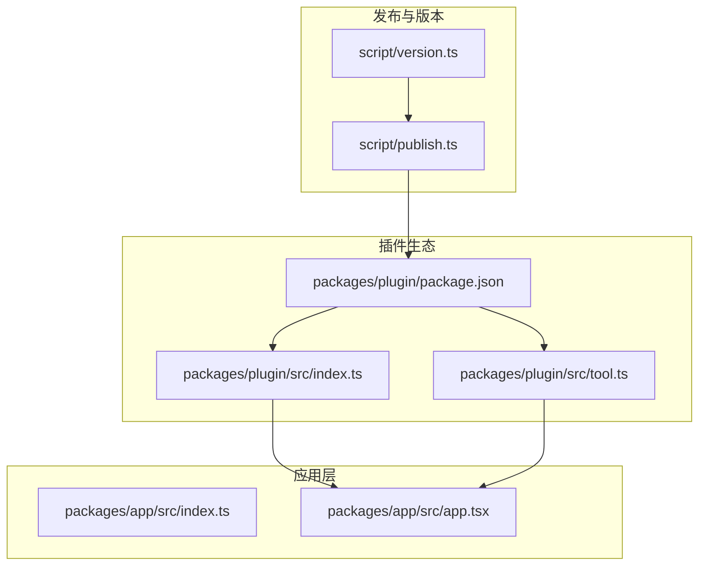
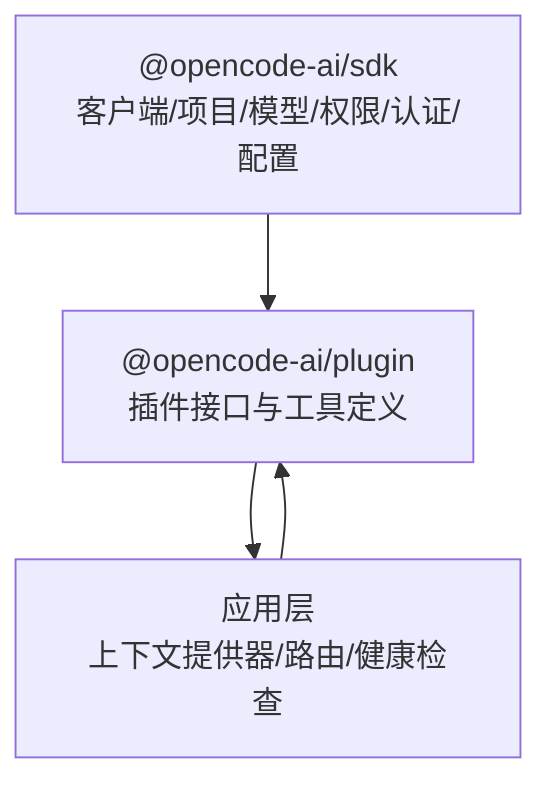
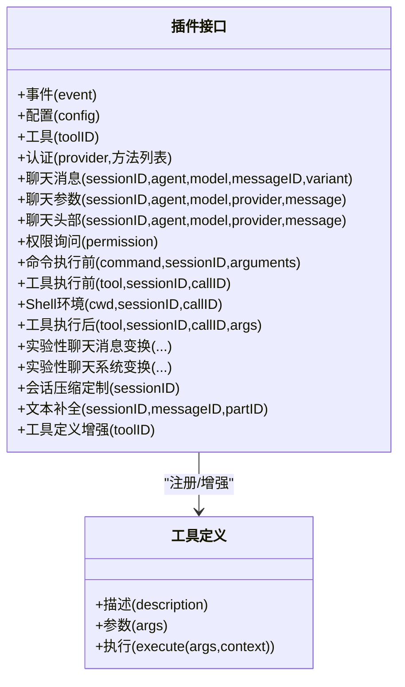
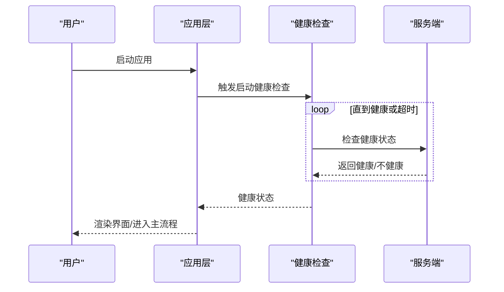
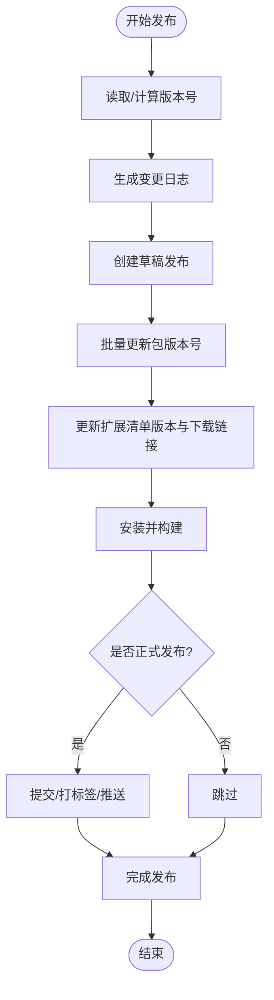
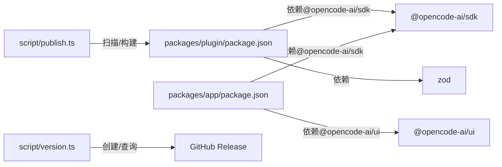

# 插件市场与分发

<cite>
**本文引用的文件**
- [README.md](file://README.md)
- [packages/plugin/package.json](file://packages/plugin/package.json)
- [packages/plugin/src/index.ts](file://packages/plugin/src/index.ts)
- [packages/plugin/src/tool.ts](file://packages/plugin/src/tool.ts)
- [packages/app/src/index.ts](file://packages/app/src/index.ts)
- [packages/app/src/app.tsx](file://packages/app/src/app.tsx)
- [script/publish.ts](file://script/publish.ts)
- [script/version.ts](file://script/version.ts)
</cite>

## 目录
1. [简介](#简介)
2. [项目结构](#项目结构)
3. [核心组件](#核心组件)
4. [架构总览](#架构总览)
5. [详细组件分析](#详细组件分析)
6. [依赖分析](#依赖分析)
7. [性能考虑](#性能考虑)
8. [故障排除指南](#故障排除指南)
9. [结论](#结论)
10. [附录](#附录)

## 简介
本文件面向 OpenCode 插件生态与分发机制，聚焦以下主题：
- 插件市场与分发架构：如何通过 SDK、插件接口与应用层集成实现插件能力扩展与运行时注入。
- 插件索引与搜索：基于工具定义与钩子扩展的可发现性与检索路径。
- 发布流程、审核与质量保障：版本统一、自动化构建与发布脚本。
- 分发渠道、版本管理与更新通知：跨平台安装与更新策略。
- 依赖管理、冲突解决与兼容性检查：工作区依赖与版本约束。
- 使用指南、搜索技巧与评价体系：面向用户的插件商店操作建议。
- 下载、安装与卸载：多平台安装方式与卸载指引。

## 项目结构
OpenCode 采用多包（monorepo）组织方式，插件相关的核心位于 packages/plugin；应用层入口在 packages/app；发布与版本管理由 script 目录下的脚本负责。

**图表来源**
- [packages/plugin/package.json:1-29](file://packages/plugin/package.json#L1-L29)
- [packages/plugin/src/index.ts:1-235](file://packages/plugin/src/index.ts#L1-L235)
- [packages/plugin/src/tool.ts:1-39](file://packages/plugin/src/tool.ts#L1-L39)
- [packages/app/src/index.ts:1-6](file://packages/app/src/index.ts#L1-L6)
- [packages/app/src/app.tsx:1-200](file://packages/app/src/app.tsx#L1-L200)
- [script/publish.ts:1-87](file://script/publish.ts#L1-L87)
- [script/version.ts:1-35](file://script/version.ts#L1-L35)

**章节来源**
- [packages/plugin/package.json:1-29](file://packages/plugin/package.json#L1-L29)
- [packages/plugin/src/index.ts:1-235](file://packages/plugin/src/index.ts#L1-L235)
- [packages/plugin/src/tool.ts:1-39](file://packages/plugin/src/tool.ts#L1-L39)
- [packages/app/src/index.ts:1-6](file://packages/app/src/index.ts#L1-L6)
- [packages/app/src/app.tsx:1-200](file://packages/app/src/app.tsx#L1-L200)
- [script/publish.ts:1-87](file://script/publish.ts#L1-L87)
- [script/version.ts:1-35](file://script/version.ts#L1-L35)

## 核心组件
- 插件接口与钩子（Hooks）：定义事件、配置、工具、认证、聊天参数与消息处理等扩展点，支持对会话、模型调用、权限请求、命令执行、工具执行、Shell 环境等进行前后置拦截与修改。
- 工具定义（ToolDefinition）：通过 schema 校验与执行函数组合，提供可被 LLM 调用的原子能力，并支持元数据与交互提示。
- 应用层集成：应用通过上下文提供器与路由组织，承载插件能力的渲染与交互；同时具备健康检查与连接门控逻辑，确保服务可用性。
- 发布与版本：统一版本号替换、多包构建、GitHub Release 创建与标签推送、以及最终发布脚本的串联执行。

**章节来源**
- [packages/plugin/src/index.ts:148-235](file://packages/plugin/src/index.ts#L148-L235)
- [packages/plugin/src/tool.ts:29-39](file://packages/plugin/src/tool.ts#L29-L39)
- [packages/app/src/app.tsx:163-200](file://packages/app/src/app.tsx#L163-L200)
- [script/publish.ts:37-84](file://script/publish.ts#L37-L84)
- [script/version.ts:7-26](file://script/version.ts#L7-L26)

## 架构总览
OpenCode 插件生态以“SDK + 插件接口 + 应用层”三层协作：
- SDK 提供客户端、项目、模型、权限、认证、配置等抽象。
- 插件通过 Hooks 注入到运行时生命周期中，覆盖事件、聊天参数、工具执行、Shell 环境等。
- 应用层负责 UI 渲染、上下文提供、路由与健康检查，承载插件能力的展示与交互。

**图表来源**
- [packages/plugin/src/index.ts:1-13](file://packages/plugin/src/index.ts#L1-L13)
- [packages/plugin/src/index.ts:148-235](file://packages/plugin/src/index.ts#L148-L235)
- [packages/app/src/app.tsx:163-200](file://packages/app/src/app.tsx#L163-L200)

## 详细组件分析

### 插件接口与钩子体系
- 钩子类型涵盖事件、配置、工具、认证、聊天消息与参数、权限请求、命令与工具执行前后、Shell 环境注入、实验性消息与系统提示变换、会话压缩定制、文本补全、工具定义增强等。
- 认证钩子支持 OAuth 与 API 两种授权方式，允许自定义提示、条件与回调，返回访问令牌或密钥，并支持刷新与过期时间。
- 工具定义通过 schema 校验参数，执行函数返回字符串输出，支持元数据记录与用户交互提示。

**图表来源**
- [packages/plugin/src/index.ts:148-235](file://packages/plugin/src/index.ts#L148-L235)
- [packages/plugin/src/tool.ts:29-39](file://packages/plugin/src/tool.ts#L29-L39)

**章节来源**
- [packages/plugin/src/index.ts:37-235](file://packages/plugin/src/index.ts#L37-L235)
- [packages/plugin/src/tool.ts:1-39](file://packages/plugin/src/tool.ts#L1-L39)

### 应用层集成与健康检查
- 应用层通过多级 Provider 组织全局状态与上下文，包括设置、权限、布局、通知、模型、命令、高亮、终端、文件、提示、评论等。
- 连接门控（ConnectionGate）对服务器健康进行阻塞式或后台式检查，非 HTTP 连接有宽限期，超时则切换为后台模式，避免启动卡顿。
- 路由懒加载与错误边界提升用户体验与稳定性。

**图表来源**
- [packages/app/src/app.tsx:163-189](file://packages/app/src/app.tsx#L163-L189)

**章节来源**
- [packages/app/src/app.tsx:1-200](file://packages/app/src/app.tsx#L1-L200)

### 发布流程与版本管理
- 版本脚本：自动计算版本号，生成变更日志，创建 GitHub Draft Release 并输出发布信息。
- 发布脚本：批量更新各包版本号，更新扩展清单版本与下载链接，执行安装与构建，按需提交/打标签/推送，最终发布各子包与插件脚本。
- 与 README 的安装与下载信息配合，形成从开发到发布的闭环。

**图表来源**
- [script/version.ts:7-26](file://script/version.ts#L7-L26)
- [script/publish.ts:37-84](file://script/publish.ts#L37-L84)

**章节来源**
- [script/version.ts:1-35](file://script/version.ts#L1-L35)
- [script/publish.ts:1-87](file://script/publish.ts#L1-L87)
- [README.md:46-98](file://README.md#L46-L98)

## 依赖分析
- 插件包依赖 SDK 与 zod，导出入口指向插件入口与工具模块，便于应用层按需引入。
- 应用层依赖 UI、SDK、UI 组件库、工具集与 SolidJS 生态，形成前端渲染与交互基础。
- 发布脚本依赖 @opencode-ai/script 与 Bun，通过 glob 扫描与正则替换实现版本统一更新。

**图表来源**
- [packages/plugin/package.json:18-27](file://packages/plugin/package.json#L18-L27)
- [packages/app/package.json:40-72](file://packages/app/package.json#L40-L72)
- [script/publish.ts:37-58](file://script/publish.ts#L37-L58)
- [script/version.ts:16-26](file://script/version.ts#L16-L26)

**章节来源**
- [packages/plugin/package.json:1-29](file://packages/plugin/package.json#L1-L29)
- [packages/app/package.json:1-74](file://packages/app/package.json#L1-L74)
- [script/publish.ts:1-87](file://script/publish.ts#L1-L87)
- [script/version.ts:1-35](file://script/version.ts#L1-L35)

## 性能考虑
- 插件钩子应避免重型同步操作，优先异步与缓存策略，减少对主线程的影响。
- 工具执行前后的参数校验与输出归一化可降低重复计算成本。
- 应用层健康检查设置合理的超时与宽限期，避免启动阶段阻塞。
- 发布脚本中的批量版本更新与构建应并行化，缩短发布周期。

## 故障排除指南
- 插件未生效：确认插件已正确导出并被应用层引入；检查钩子注册顺序与上下文提供器是否完整。
- 认证失败：核对 OAuth/ API 授权流程的提示字段与回调逻辑；验证返回的访问令牌与过期时间。
- 工具执行异常：检查参数 schema 校验与执行函数返回值；利用元数据记录辅助定位问题。
- 应用无法启动：查看健康检查日志，确认服务端可达性；必要时切换为后台检查模式。
- 发布失败：检查版本号生成与 GitHub 权限；确认草稿发布与标签推送流程。

**章节来源**
- [packages/plugin/src/index.ts:37-146](file://packages/plugin/src/index.ts#L37-L146)
- [packages/plugin/src/tool.ts:29-39](file://packages/plugin/src/tool.ts#L29-L39)
- [packages/app/src/app.tsx:163-189](file://packages/app/src/app.tsx#L163-L189)
- [script/publish.ts:60-74](file://script/publish.ts#L60-L74)
- [script/version.ts:16-26](file://script/version.ts#L16-L26)

## 结论
OpenCode 插件生态以清晰的接口与钩子体系为核心，结合应用层上下文与健康检查机制，实现了可扩展、可观测且易维护的插件运行时。发布与版本管理脚本确保了多包一致性与跨平台分发的可靠性。未来可在插件市场索引与搜索、审核与质量保障、依赖冲突与兼容性检查等方面进一步完善，以提升开发者与用户的插件体验。

## 附录

### 插件市场与分发使用指南
- 安装与下载
  - CLI 安装：参考安装说明，选择合适的包管理器或直接脚本安装。
  - 桌面应用：从发行页或官网下载对应平台安装包。
  - 多平台安装目录优先级：自定义安装目录 > XDG 目录 > 用户 bin > 默认回退目录。
- 搜索技巧
  - 利用工具定义与钩子扩展点进行能力检索；通过聊天参数与系统提示变换增强检索效果。
  - 在应用层的命令面板与路由中查找插件相关入口。
- 评价体系
  - 建议在插件清单中提供描述、作者、版本与兼容性信息；通过变更日志与发布说明记录改进点。
- 下载、安装与卸载
  - 下载：从官方渠道获取最新版本安装包。
  - 安装：遵循平台安装说明；桌面应用可通过包管理器或直接安装。
  - 卸载：移除安装目录与相关配置；桌面应用可使用包管理器卸载。

**章节来源**
- [README.md:46-98](file://README.md#L46-L98)