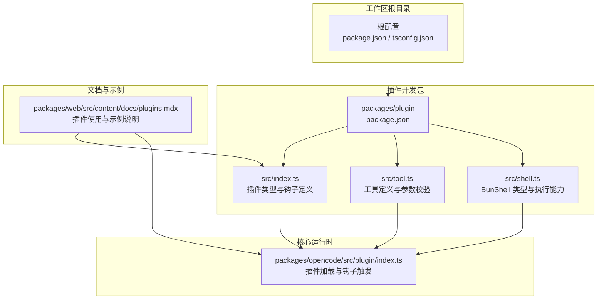
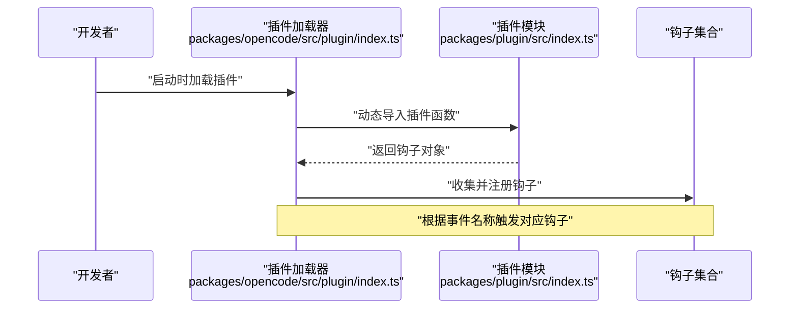
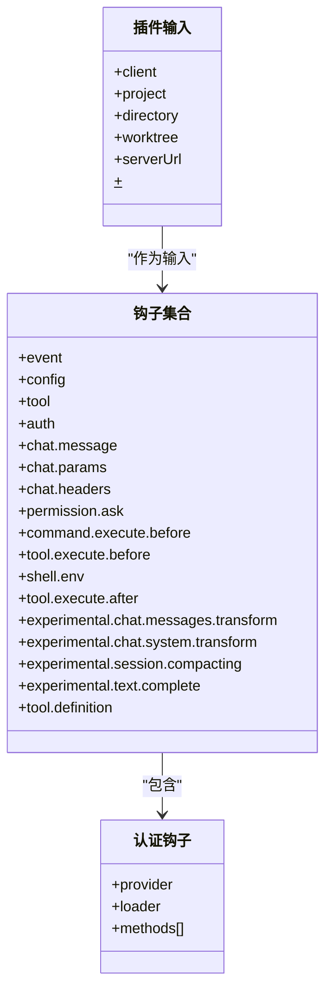
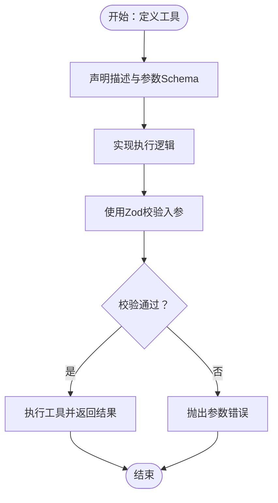
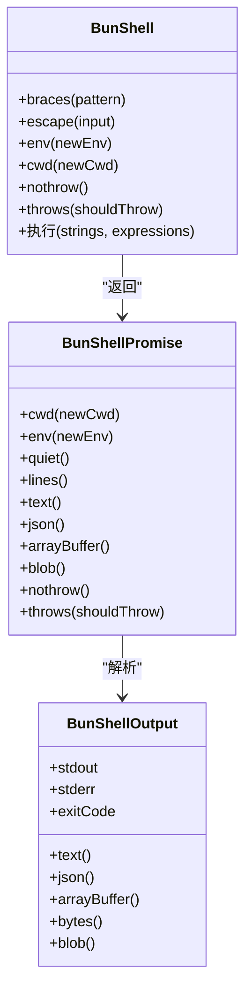
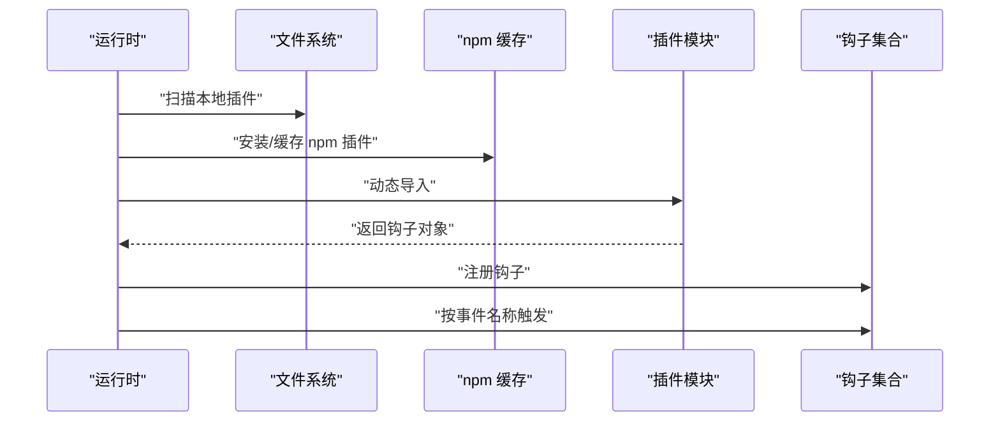
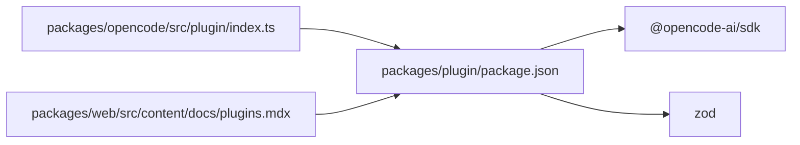

# 插件开发指南

<cite>
**本文引用的文件**
- [README.md](file://README.md)
- [CONTRIBUTING.md](file://CONTRIBUTING.md)
- [packages/plugin/package.json](file://packages/plugin/package.json)
- [packages/plugin/src/index.ts](file://packages/plugin/src/index.ts)
- [packages/plugin/src/tool.ts](file://packages/plugin/src/tool.ts)
- [packages/plugin/src/shell.ts](file://packages/plugin/src/shell.ts)
- [packages/opencode/src/plugin/index.ts](file://packages/opencode/src/plugin/index.ts)
- [packages/web/src/content/docs/plugins.mdx](file://packages/web/src/content/docs/plugins.mdx)
</cite>

## 目录
1. [简介](#简介)
2. [项目结构](#项目结构)
3. [核心组件](#核心组件)
4. [架构总览](#架构总览)
5. [详细组件分析](#详细组件分析)
6. [依赖关系分析](#依赖关系分析)
7. [性能考虑](#性能考虑)
8. [故障排查指南](#故障排查指南)
9. [结论](#结论)
10. [附录](#附录)

## 简介
本指南面向希望基于 OpenCode 开发插件的开发者，系统讲解插件开发环境搭建、工具链配置、项目模板使用；深入解释插件 API 接口、事件监听机制与生命周期钩子函数；提供最佳实践、代码规范与测试策略；并通过从简单工具插件到复杂功能插件的实现案例帮助快速上手；最后覆盖调试技巧、性能优化、错误处理以及打包发布与版本管理流程。

## 项目结构
OpenCode 采用多包工作区（monorepo）组织方式，插件体系位于 packages/plugin，核心运行时在 packages/opencode 中加载与调度插件。文档与示例位于 packages/web 的文档内容中。

图表来源
- [packages/plugin/package.json:1-29](file://packages/plugin/package.json#L1-L29)
- [packages/plugin/src/index.ts:1-235](file://packages/plugin/src/index.ts#L1-L235)
- [packages/plugin/src/tool.ts:1-39](file://packages/plugin/src/tool.ts#L1-L39)
- [packages/plugin/src/shell.ts:1-137](file://packages/plugin/src/shell.ts#L1-L137)
- [packages/opencode/src/plugin/index.ts:89-132](file://packages/opencode/src/plugin/index.ts#L89-L132)
- [packages/web/src/content/docs/plugins.mdx:1-219](file://packages/web/src/content/docs/plugins.mdx#L1-L219)

章节来源
- [README.md:1-142](file://README.md#L1-L142)
- [CONTRIBUTING.md:32-157](file://CONTRIBUTING.md#L32-L157)
- [packages/plugin/package.json:1-29](file://packages/plugin/package.json#L1-L29)

## 核心组件
- 插件类型与上下文：插件通过导出一个异步函数接收上下文对象，返回钩子集合，用于订阅事件与修改行为。
- 工具定义：通过工具工厂函数声明工具描述、参数 Schema 与执行逻辑，支持 Zod 参数校验。
- Shell 执行：提供 BunShell 类型与 Promise 化的输出读取能力，便于在插件中安全地执行命令与读取结果。
- 钩子系统：涵盖事件、配置、认证、聊天消息、权限请求、命令与工具执行前后、Shell 环境、实验性会话压缩与文本补全等钩子。

章节来源
- [packages/plugin/src/index.ts:1-235](file://packages/plugin/src/index.ts#L1-L235)
- [packages/plugin/src/tool.ts:1-39](file://packages/plugin/src/tool.ts#L1-L39)
- [packages/plugin/src/shell.ts:1-137](file://packages/plugin/src/shell.ts#L1-L137)

## 架构总览
下图展示了插件在 OpenCode 中的加载与调用流程：运行时扫描本地或 npm 插件，动态导入模块，收集钩子并按需触发。

图表来源
- [packages/opencode/src/plugin/index.ts:89-132](file://packages/opencode/src/plugin/index.ts#L89-L132)
- [packages/plugin/src/index.ts:35-35](file://packages/plugin/src/index.ts#L35-L35)

## 详细组件分析

### 插件 API 与生命周期钩子
- 插件入口：导出一个异步函数，接收客户端、项目信息、工作目录、工作树根路径与 Shell 实例，返回钩子对象。
- 钩子类型：包括事件、配置、工具、认证、聊天消息、聊天参数与头部、权限请求、命令与工具执行前后、Shell 环境、实验性消息与系统提示词变换、会话压缩、文本补全、工具定义等。
- 认证钩子：支持 OAuth 与 API 两种授权方式，可定义提示字段与回调，返回访问令牌或密钥。

图表来源
- [packages/plugin/src/index.ts:26-35](file://packages/plugin/src/index.ts#L26-L35)
- [packages/plugin/src/index.ts:148-234](file://packages/plugin/src/index.ts#L148-L234)
- [packages/plugin/src/index.ts:37-103](file://packages/plugin/src/index.ts#L37-L103)

章节来源
- [packages/plugin/src/index.ts:1-235](file://packages/plugin/src/index.ts#L1-L235)

### 工具定义与参数校验
- 工具工厂：通过工具工厂函数声明工具描述、参数 Schema 与执行逻辑，返回工具定义对象。
- 参数校验：使用 Zod Schema 对入参进行严格校验，确保传入参数符合预期。
- 上下文能力：工具执行上下文提供会话 ID、消息 ID、代理、项目目录、工作树根、AbortSignal、元数据注入与权限询问等能力。

图表来源
- [packages/plugin/src/tool.ts:29-39](file://packages/plugin/src/tool.ts#L29-L39)
- [packages/plugin/src/tool.ts:3-20](file://packages/plugin/src/tool.ts#L3-L20)

章节来源
- [packages/plugin/src/tool.ts:1-39](file://packages/plugin/src/tool.ts#L1-L39)

### Shell 执行与输出读取
- 模板字符串执行：通过模板字符串语法执行命令，支持表达式注入与流式输出。
- 输出读取：提供文本、JSON、ArrayBuffer、Blob 等多种读取方式，支持静默模式与异常控制。
- 环境与工作目录：支持设置默认环境变量与工作目录，便于隔离与复现。

图表来源
- [packages/plugin/src/shell.ts:10-137](file://packages/plugin/src/shell.ts#L10-L137)

章节来源
- [packages/plugin/src/shell.ts:1-137](file://packages/plugin/src/shell.ts#L1-L137)

### 插件加载与钩子触发
- 加载流程：运行时扫描本地与 npm 插件，动态导入模块，捕获加载失败并上报错误。
- 触发机制：按事件名遍历已注册钩子，依次调用，允许对输出进行修改。

图表来源
- [packages/opencode/src/plugin/index.ts:89-132](file://packages/opencode/src/plugin/index.ts#L89-L132)

章节来源
- [packages/opencode/src/plugin/index.ts:89-132](file://packages/opencode/src/plugin/index.ts#L89-L132)

### 使用与示例（来自文档）
- 插件加载方式：支持本地文件与 npm 包两种方式，本地插件放置于项目级与全局配置目录，npm 插件通过配置文件声明。
- 示例场景：文档提供了发送通知、转义命令等示例，展示如何在工具执行前后钩子中修改参数或行为。

章节来源
- [packages/web/src/content/docs/plugins.mdx:1-219](file://packages/web/src/content/docs/plugins.mdx#L1-L219)

## 依赖关系分析
- 插件包依赖 SDK 与 Zod，提供类型安全与参数校验能力。
- 运行时负责插件发现、动态导入与钩子注册，形成松耦合的扩展机制。

图表来源
- [packages/plugin/package.json:18-27](file://packages/plugin/package.json#L18-L27)
- [packages/opencode/src/plugin/index.ts:89-132](file://packages/opencode/src/plugin/index.ts#L89-L132)
- [packages/web/src/content/docs/plugins.mdx:1-219](file://packages/web/src/content/docs/plugins.mdx#L1-L219)

章节来源
- [packages/plugin/package.json:1-29](file://packages/plugin/package.json#L1-L29)
- [packages/opencode/src/plugin/index.ts:89-132](file://packages/opencode/src/plugin/index.ts#L89-L132)

## 性能考虑
- 避免在钩子中执行阻塞操作，优先使用异步与流式读取。
- 合理使用 Shell 静默模式与异常控制，减少不必要的输出与错误开销。
- 在工具执行前进行参数校验，尽早失败以降低无效执行成本。
- 利用工作树根路径生成稳定相对路径，避免重复计算与路径拼接开销。

## 故障排查指南
- 插件加载失败：检查插件路径与 npm 缓存状态，确认模块导出与类型定义正确。
- 钩子未触发：确认事件名称与钩子键一致，检查运行时是否已注册钩子。
- Shell 执行异常：使用 nothrow/throws 控制异常行为，结合输出读取方法定位问题。
- 调试建议：参考贡献指南中的调试方法，优先使用独立启动与断点附加的方式进行定位。

章节来源
- [CONTRIBUTING.md:158-188](file://CONTRIBUTING.md#L158-L188)
- [packages/opencode/src/plugin/index.ts:95-104](file://packages/opencode/src/plugin/index.ts#L95-L104)

## 结论
OpenCode 的插件体系通过清晰的类型定义、灵活的钩子机制与强大的 Shell 执行能力，为开发者提供了高扩展性的平台。遵循本文档的开发流程、最佳实践与调试策略，可高效构建从简单工具到复杂功能的各类插件。

## 附录

### 开发环境搭建与工具链
- 运行环境：Bun 1.3+，Node 版本由工作区配置管理。
- 启动与开发：在仓库根目录安装依赖后，可通过开发命令启动服务、Web 应用或桌面应用。
- 生成 SDK：当 API 或 SDK 发生变更时，运行生成脚本以更新 SDK 与相关文件。

章节来源
- [CONTRIBUTING.md:34-157](file://CONTRIBUTING.md#L34-L157)

### 插件开发最佳实践
- 保持单一职责：每个插件聚焦特定领域或任务。
- 明确事件边界：仅订阅必要事件，避免过度干预。
- 参数校验前置：使用 Zod Schema 提升健壮性。
- 可观测性：在关键路径记录日志与元数据，便于排障。
- 兼容性：遵循实验性钩子的稳定性约定，避免强依赖未公开 API。

### 测试策略
- 单元测试：针对工具执行与参数校验编写测试用例。
- 集成测试：模拟钩子触发与 Shell 执行，验证端到端行为。
- 回归测试：在 SDK 或运行时升级后回归插件功能。

### 打包、发布与版本管理
- 包结构：插件包导出入口与工具模块，构建产物包含 dist 目录。
- 发布流程：遵循语义化版本与工作区依赖管理，发布前进行类型检查与构建验证。

章节来源
- [packages/plugin/package.json:7-17](file://packages/plugin/package.json#L7-L17)