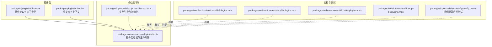
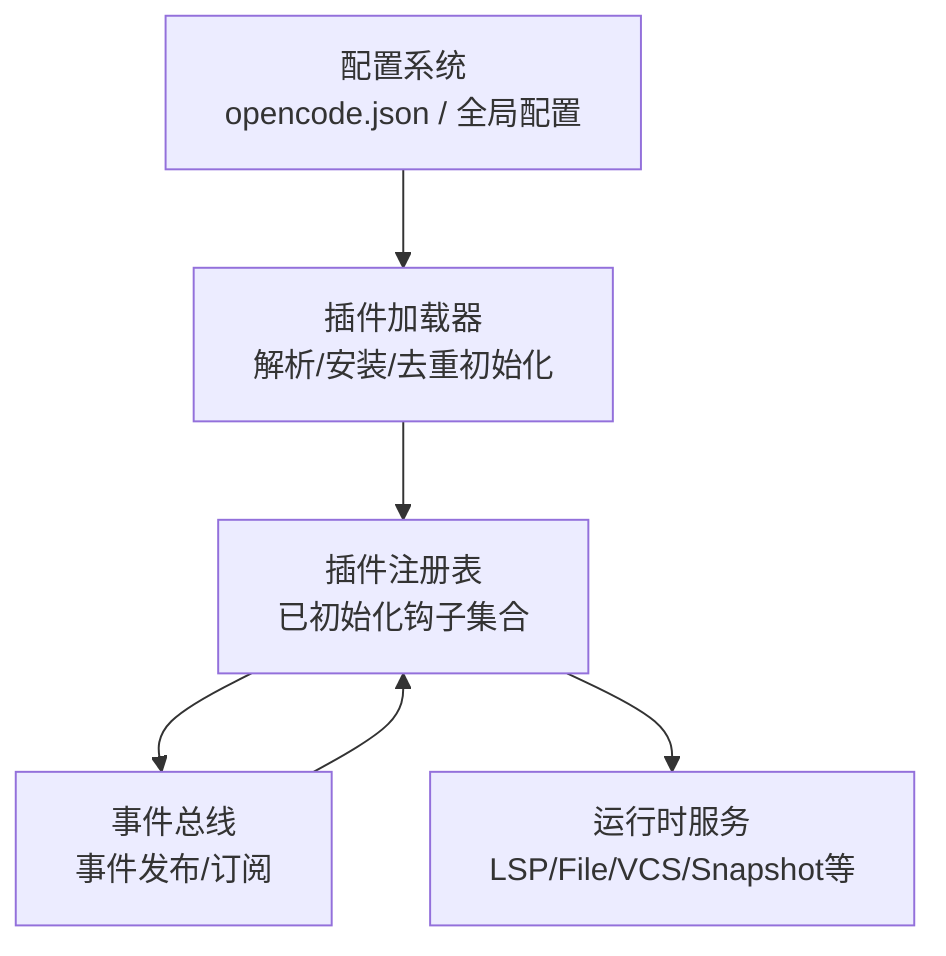
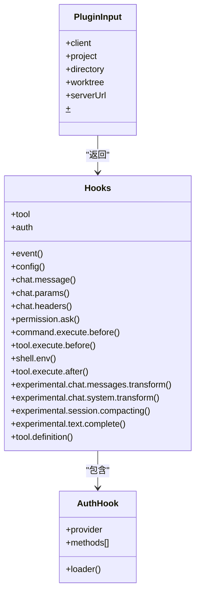
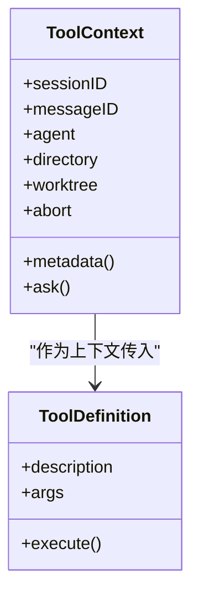
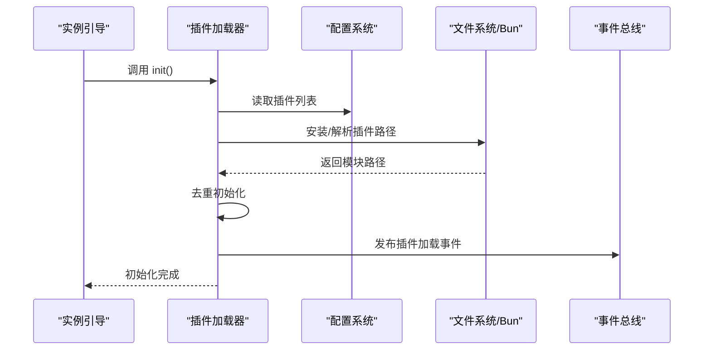
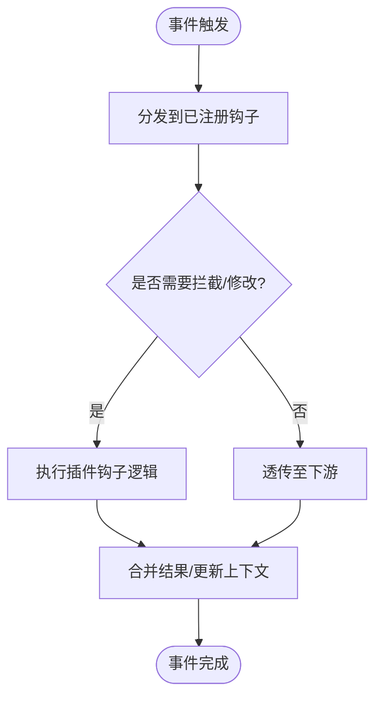
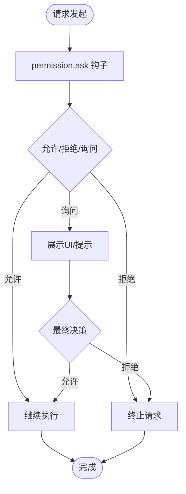
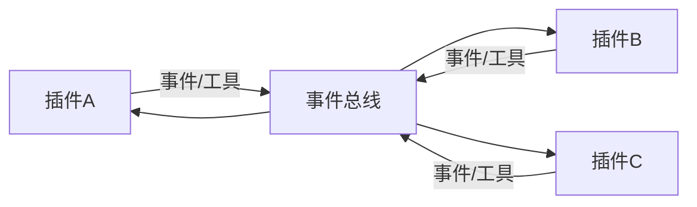
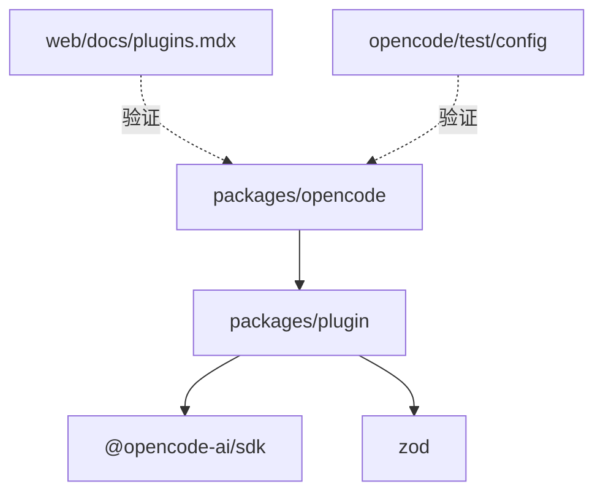

# 插件架构设计

<cite>
**本文引用的文件**
- [packages/plugin/src/index.ts](file://packages/plugin/src/index.ts)
- [packages/plugin/src/tool.ts](file://packages/plugin/src/tool.ts)
- [packages/opencode/src/plugin/index.ts](file://packages/opencode/src/plugin/index.ts)
- [packages/opencode/src/project/bootstrap.ts](file://packages/opencode/src/project/bootstrap.ts)
- [packages/web/src/content/docs/de/plugins.mdx](file://packages/web/src/content/docs/de/plugins.mdx)
- [packages/web/src/content/docs/fr/plugins.mdx](file://packages/web/src/content/docs/fr/plugins.mdx)
- [packages/web/src/content/docs/ko/plugins.mdx](file://packages/web/src/content/docs/ko/plugins.mdx)
- [packages/web/src/content/docs/pt-br/plugins.mdx](file://packages/web/src/content/docs/pt-br/plugins.mdx)
- [packages/opencode/test/config/config.test.ts](file://packages/opencode/test/config/config.test.ts)
</cite>

## 目录
1. [引言](#引言)
2. [项目结构](#项目结构)
3. [核心组件](#核心组件)
4. [架构总览](#架构总览)
5. [详细组件分析](#详细组件分析)
6. [依赖关系分析](#依赖关系分析)
7. [性能考虑](#性能考虑)
8. [故障排除指南](#故障排除指南)
9. [结论](#结论)
10. [附录](#附录)

## 引言
本文件面向OpenCode插件系统的架构设计，围绕插件加载器、插件生命周期、注册表与依赖注入、事件驱动架构、沙箱隔离与安全边界、权限控制策略、插件间通信与消息传递、状态共享等主题进行系统化阐述。通过多维度的架构图与流程图，帮助开发者快速理解插件系统的内部工作机制，并提供实践指导与排障建议。

## 项目结构
OpenCode采用Monorepo组织方式，插件系统位于独立包中，核心运行时在opencode包中实现。插件包提供插件接口定义与工具能力，运行时负责加载、初始化与生命周期管理。

**图表来源**
- [packages/plugin/src/index.ts:1-235](file://packages/plugin/src/index.ts#L1-L235)
- [packages/plugin/src/tool.ts:1-39](file://packages/plugin/src/tool.ts#L1-L39)
- [packages/opencode/src/plugin/index.ts:31-91](file://packages/opencode/src/plugin/index.ts#L31-L91)
- [packages/opencode/src/project/bootstrap.ts:16-33](file://packages/opencode/src/project/bootstrap.ts#L16-L33)
- [packages/web/src/content/docs/de/plugins.mdx:41-73](file://packages/web/src/content/docs/de/plugins.mdx#L41-L73)
- [packages/web/src/content/docs/fr/plugins.mdx:42-68](file://packages/web/src/content/docs/fr/plugins.mdx#L42-L68)
- [packages/web/src/content/docs/ko/plugins.mdx:41-68](file://packages/web/src/content/docs/ko/plugins.mdx#L41-L68)
- [packages/web/src/content/docs/pt-br/plugins.mdx:41-72](file://packages/web/src/content/docs/pt-br/plugins.mdx#L41-L72)
- [packages/opencode/test/config/config.test.ts:852-887](file://packages/opencode/test/config/config.test.ts#L852-L887)

**章节来源**
- [packages/plugin/src/index.ts:1-235](file://packages/plugin/src/index.ts#L1-L235)
- [packages/plugin/src/tool.ts:1-39](file://packages/plugin/src/tool.ts#L1-L39)
- [packages/opencode/src/plugin/index.ts:31-91](file://packages/opencode/src/plugin/index.ts#L31-L91)
- [packages/opencode/src/project/bootstrap.ts:16-33](file://packages/opencode/src/project/bootstrap.ts#L16-L33)
- [packages/web/src/content/docs/de/plugins.mdx:41-73](file://packages/web/src/content/docs/de/plugins.mdx#L41-L73)
- [packages/web/src/content/docs/fr/plugins.mdx:42-68](file://packages/web/src/content/docs/fr/plugins.mdx#L42-L68)
- [packages/web/src/content/docs/ko/plugins.mdx:41-68](file://packages/web/src/content/docs/ko/plugins.mdx#L41-L68)
- [packages/web/src/content/docs/pt-br/plugins.mdx:41-72](file://packages/web/src/content/docs/pt-br/plugins.mdx#L41-L72)
- [packages/opencode/test/config/config.test.ts:852-887](file://packages/opencode/test/config/config.test.ts#L852-L887)

## 核心组件
- 插件接口与钩子类型：定义插件函数签名、输入输出契约、事件钩子集合与权限控制接口。
- 工具定义与上下文：提供工具执行的描述、参数校验、执行上下文与元数据回调。
- 插件加载器：负责解析配置、安装依赖、去重初始化、事件分发与错误处理。
- 实例引导：在应用启动时触发插件初始化，确保各子系统按序就绪。

**章节来源**
- [packages/plugin/src/index.ts:20-235](file://packages/plugin/src/index.ts#L20-L235)
- [packages/plugin/src/tool.ts:3-39](file://packages/plugin/src/tool.ts#L3-L39)
- [packages/opencode/src/plugin/index.ts:31-91](file://packages/opencode/src/plugin/index.ts#L31-L91)
- [packages/opencode/src/project/bootstrap.ts:16-33](file://packages/opencode/src/project/bootstrap.ts#L16-L33)

## 架构总览
OpenCode插件系统采用“接口定义 + 运行时加载 + 事件驱动”的架构模式。插件以模块形式导出函数，运行时按配置顺序加载并初始化，通过钩子扩展系统行为；事件总线用于跨插件通信与状态广播。

**图表来源**
- [packages/opencode/src/plugin/index.ts:31-91](file://packages/opencode/src/plugin/index.ts#L31-L91)
- [packages/opencode/src/project/bootstrap.ts:16-33](file://packages/opencode/src/project/bootstrap.ts#L16-L33)

## 详细组件分析

### 插件接口与钩子类型
- 插件函数签名：接收统一输入对象并返回钩子集合，便于运行时统一调度。
- 钩子类型覆盖：事件、配置、工具、认证、聊天参数与头部、权限询问、命令/工具执行前后、Shell环境、实验性消息与系统提示词转换、会话压缩定制、文本补全、工具定义修改等。
- 认证钩子：支持OAuth与API两种授权方式，提供动态提示与回调结果处理。
- 权限控制：通过“permission.ask”钩子允许插件对敏感操作进行拦截与决策。

**图表来源**
- [packages/plugin/src/index.ts:26-35](file://packages/plugin/src/index.ts#L26-L35)
- [packages/plugin/src/index.ts:148-235](file://packages/plugin/src/index.ts#L148-L235)
- [packages/plugin/src/index.ts:37-103](file://packages/plugin/src/index.ts#L37-L103)

**章节来源**
- [packages/plugin/src/index.ts:26-35](file://packages/plugin/src/index.ts#L26-L35)
- [packages/plugin/src/index.ts:148-235](file://packages/plugin/src/index.ts#L148-L235)
- [packages/plugin/src/index.ts:37-103](file://packages/plugin/src/index.ts#L37-L103)

### 工具定义与上下文
- 工具上下文：提供会话、消息、代理、工作目录、工作树根、Abort信号与元数据回调、权限询问等能力。
- 工具声明：通过工具工厂函数声明描述、参数Schema与执行逻辑，使用Zod进行参数校验。
- 执行流程：运行时在工具调用前后触发钩子，允许插件对参数、输出与元信息进行拦截与增强。

**图表来源**
- [packages/plugin/src/tool.ts:3-27](file://packages/plugin/src/tool.ts#L3-L27)
- [packages/plugin/src/tool.ts:29-39](file://packages/plugin/src/tool.ts#L29-L39)

**章节来源**
- [packages/plugin/src/tool.ts:3-27](file://packages/plugin/src/tool.ts#L3-L27)
- [packages/plugin/src/tool.ts:29-39](file://packages/plugin/src/tool.ts#L29-L39)

### 插件加载器与生命周期
- 初始化入口：在实例引导阶段调用插件初始化，确保在其他子系统之前完成。
- 加载顺序：全局配置 → 项目配置 → 全局插件目录 → 项目插件目录；同名重复包仅加载一次，本地与npm同名插件分别加载。
- 依赖安装：npm插件通过Bun自动安装并缓存；本地插件直接从目录加载。
- 去重与初始化：对同模块的命名导出与默认导出进行去重，避免重复初始化。
- 错误处理：安装失败时发布错误事件并记录日志，不影响其他插件加载。

**图表来源**
- [packages/opencode/src/project/bootstrap.ts:16-33](file://packages/opencode/src/project/bootstrap.ts#L16-L33)
- [packages/opencode/src/plugin/index.ts:31-91](file://packages/opencode/src/plugin/index.ts#L31-L91)

**章节来源**
- [packages/opencode/src/project/bootstrap.ts:16-33](file://packages/opencode/src/project/bootstrap.ts#L16-L33)
- [packages/opencode/src/plugin/index.ts:31-91](file://packages/opencode/src/plugin/index.ts#L31-L91)
- [packages/web/src/content/docs/de/plugins.mdx:46-64](file://packages/web/src/content/docs/de/plugins.mdx#L46-L64)
- [packages/web/src/content/docs/fr/plugins.mdx:46-64](file://packages/web/src/content/docs/fr/plugins.mdx#L46-L64)
- [packages/web/src/content/docs/ko/plugins.mdx:46-64](file://packages/web/src/content/docs/ko/plugins.mdx#L46-L64)
- [packages/web/src/content/docs/pt-br/plugins.mdx:46-64](file://packages/web/src/content/docs/pt-br/plugins.mdx#L46-L64)

### 事件驱动架构与消息传递
- 事件钩子：插件可通过事件钩子订阅系统事件，实现对全局状态变化的响应。
- 消息与参数钩子：在聊天消息生成、参数与HTTP头构建阶段提供拦截与修改能力。
- 实验性钩子：支持消息转换、系统提示词转换、会话压缩定制、文本补全增强与工具定义修改，便于高级扩展。
- 通信机制：通过事件总线实现插件间松耦合通信；工具执行前后钩子提供细粒度协作点。

**图表来源**
- [packages/plugin/src/index.ts:148-235](file://packages/plugin/src/index.ts#L148-L235)

**章节来源**
- [packages/plugin/src/index.ts:148-235](file://packages/plugin/src/index.ts#L148-L235)

### 权限控制与安全边界
- 权限询问钩子：在敏感操作前触发，允许插件决定“询问/拒绝/允许”，形成可插拔的安全边界。
- 认证钩子：支持OAuth与API两种授权方式，提供动态提示与回调，保障凭据安全获取与存储。
- Shell环境钩子：允许插件在执行外部命令前注入/限制环境变量，降低越权风险。
- 沙箱隔离：通过Bun运行时与模块化加载，限制插件对宿主进程的直接访问；结合权限与认证钩子形成多层安全控制。

**图表来源**
- [packages/plugin/src/index.ts:179-179](file://packages/plugin/src/index.ts#L179-L179)
- [packages/plugin/src/index.ts:37-103](file://packages/plugin/src/index.ts#L37-L103)
- [packages/plugin/src/index.ts:188-191](file://packages/plugin/src/index.ts#L188-L191)

**章节来源**
- [packages/plugin/src/index.ts:179-179](file://packages/plugin/src/index.ts#L179-L179)
- [packages/plugin/src/index.ts:37-103](file://packages/plugin/src/index.ts#L37-L103)
- [packages/plugin/src/index.ts:188-191](file://packages/plugin/src/index.ts#L188-L191)

### 插件间通信与状态共享
- 事件总线：插件通过事件钩子订阅/发布消息，实现跨插件解耦通信。
- 工具定义共享：通过工具钩子暴露能力，其他插件可组合使用。
- 状态共享：通过实验性钩子（如消息/系统提示词转换）在不同插件间传递与转换状态，保持一致性。

**图表来源**
- [packages/plugin/src/index.ts:148-235](file://packages/plugin/src/index.ts#L148-L235)

**章节来源**
- [packages/plugin/src/index.ts:148-235](file://packages/plugin/src/index.ts#L148-L235)

## 依赖关系分析
- 插件包依赖SDK与Zod，提供类型安全与参数校验。
- 运行时依赖配置系统、事件总线与实例引导，确保插件在正确时机加载。
- 文档与测试验证加载顺序、去重与配置合并行为。

**图表来源**
- [packages/plugin/src/index.ts:18-20](file://packages/plugin/src/index.ts#L18-L20)
- [packages/plugin/src/tool.ts:1](file://packages/plugin/src/tool.ts#L1)
- [packages/opencode/src/plugin/index.ts:31-91](file://packages/opencode/src/plugin/index.ts#L31-L91)
- [packages/web/src/content/docs/de/plugins.mdx:46-64](file://packages/web/src/content/docs/de/plugins.mdx#L46-L64)
- [packages/opencode/test/config/config.test.ts:852-887](file://packages/opencode/test/config/config.test.ts#L852-L887)

**章节来源**
- [packages/plugin/src/index.ts:18-20](file://packages/plugin/src/index.ts#L18-L20)
- [packages/plugin/src/tool.ts:1](file://packages/plugin/src/tool.ts#L1)
- [packages/opencode/src/plugin/index.ts:31-91](file://packages/opencode/src/plugin/index.ts#L31-L91)
- [packages/web/src/content/docs/de/plugins.mdx:46-64](file://packages/web/src/content/docs/de/plugins.mdx#L46-L64)
- [packages/opencode/test/config/config.test.ts:852-887](file://packages/opencode/test/config/config.test.ts#L852-L887)

## 性能考虑
- 插件加载顺序与去重：避免重复初始化与依赖安装，减少启动时间。
- 缓存策略：npm包安装后缓存，提升二次启动速度。
- 并发初始化：在保证顺序的前提下尽量并发加载与初始化，缩短冷启动时间。
- 钩子执行成本：建议在钩子中避免阻塞操作，必要时使用异步与超时控制。

## 故障排除指南
- 插件安装失败：检查网络与权限，查看错误事件与日志；确认包名与版本格式正确。
- 插件未生效：确认配置文件中的插件列表与加载顺序；验证去重逻辑是否导致重复导出被跳过。
- 权限被拒绝：检查“permission.ask”钩子逻辑与用户交互；确认认证凭据有效。
- 事件未触发：确认事件钩子注册与事件总线订阅是否正确；核对事件名称与上下文。

**章节来源**
- [packages/opencode/src/plugin/index.ts:70-82](file://packages/opencode/src/plugin/index.ts#L70-L82)
- [packages/opencode/test/config/config.test.ts:852-887](file://packages/opencode/test/config/config.test.ts#L852-L887)

## 结论
OpenCode插件系统通过清晰的接口定义、可靠的加载器与生命周期管理、完善的事件驱动与权限控制机制，实现了高扩展性与安全性。开发者可基于钩子体系与工具能力快速扩展系统行为，同时通过安全边界与权限控制保障运行时稳定与合规。

## 附录
- 插件开发参考文档：多语言文档说明了安装方式、加载顺序与开发规范。
- 配置合并测试：验证全局与本地配置的合并行为，确保插件列表正确汇聚。

**章节来源**
- [packages/web/src/content/docs/de/plugins.mdx:46-73](file://packages/web/src/content/docs/de/plugins.mdx#L46-L73)
- [packages/web/src/content/docs/fr/plugins.mdx:46-68](file://packages/web/src/content/docs/fr/plugins.mdx#L46-L68)
- [packages/web/src/content/docs/ko/plugins.mdx:46-68](file://packages/web/src/content/docs/ko/plugins.mdx#L46-L68)
- [packages/web/src/content/docs/pt-br/plugins.mdx:46-72](file://packages/web/src/content/docs/pt-br/plugins.mdx#L46-L72)
- [packages/opencode/test/config/config.test.ts:852-887](file://packages/opencode/test/config/config.test.ts#L852-L887)