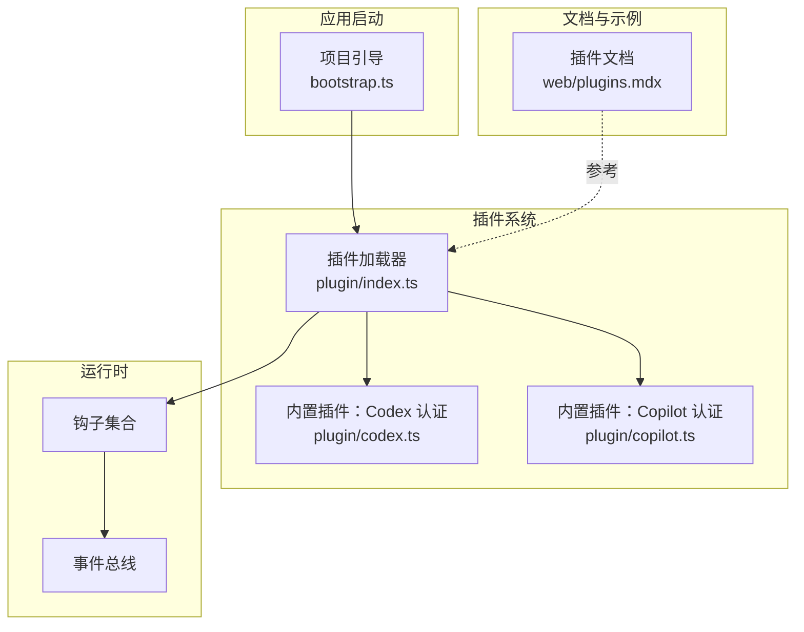
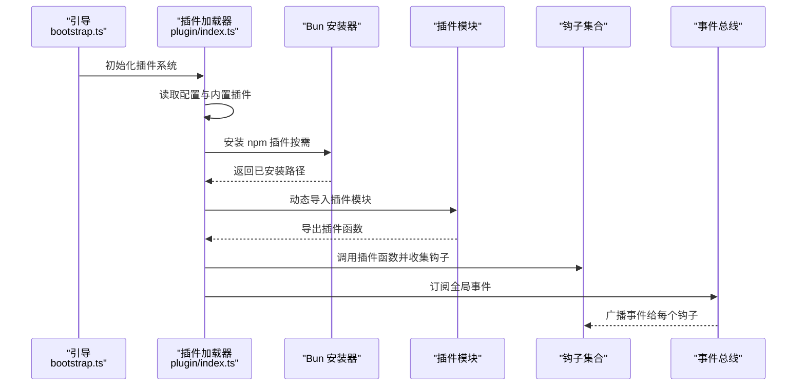
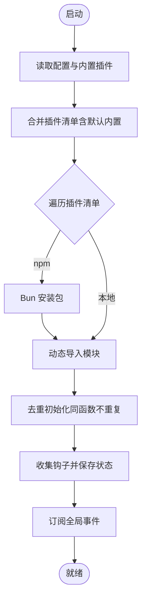
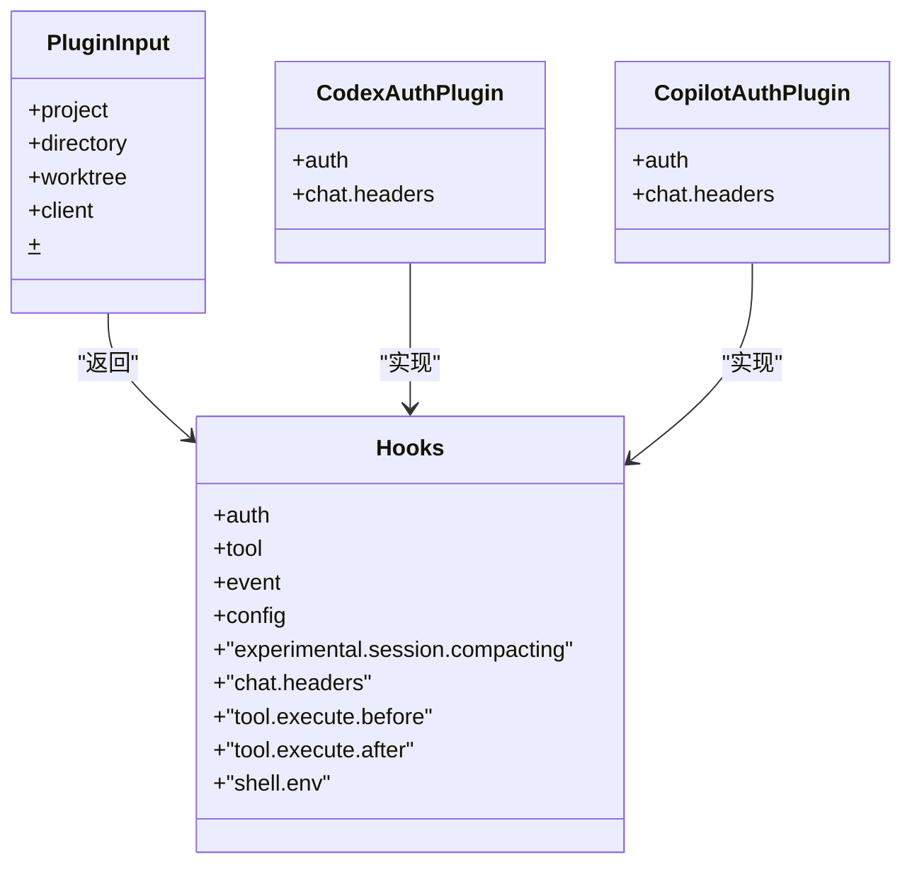
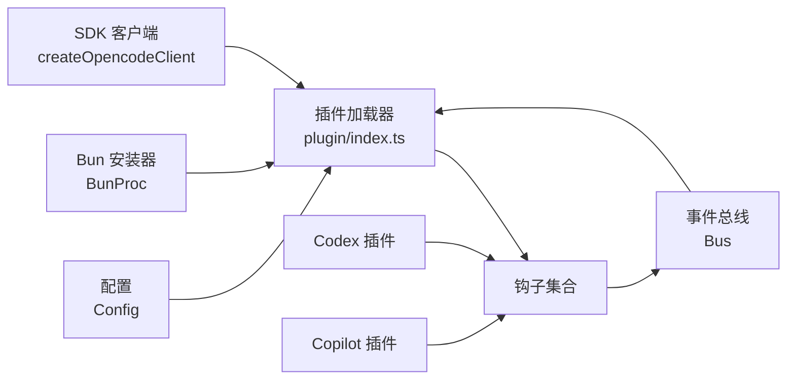

# 插件生态系统

<cite>
**本文引用的文件**
- [packages/plugin/package.json](file://packages/plugin/package.json)
- [packages/opencode/src/plugin/index.ts](file://packages/opencode/src/plugin/index.ts)
- [packages/opencode/src/plugin/codex.ts](file://packages/opencode/src/plugin/codex.ts)
- [packages/opencode/src/plugin/copilot.ts](file://packages/opencode/src/plugin/copilot.ts)
- [packages/opencode/src/project/bootstrap.ts](file://packages/opencode/src/project/bootstrap.ts)
- [packages/web/src/content/docs/plugins.mdx](file://packages/web/src/content/docs/plugins.mdx)
- [packages/opencode/test/cli/plugin-auth-picker.test.ts](file://packages/opencode/test/cli/plugin-auth-picker.test.ts)
- [packages/strategy-front/src/components/chat/permission-panel.tsx](file://packages/strategy-front/src/components/chat/permission-panel.tsx)
</cite>

## 目录
1. [简介](#简介)
2. [项目结构](#项目结构)
3. [核心组件](#核心组件)
4. [架构总览](#架构总览)
5. [组件详解](#组件详解)
6. [依赖关系分析](#依赖关系分析)
7. [性能考量](#性能考量)
8. [故障排查指南](#故障排查指南)
9. [结论](#结论)
10. [附录](#附录)

## 简介
本文件面向 OpenCode 的插件开发者与使用者，系统性阐述插件生态的整体架构、加载机制与生命周期管理；详解插件开发 API、事件系统与扩展点；介绍内置认证插件（如 Codex、Copilot）的功能与用法；说明安全机制、权限控制与沙箱隔离策略；并提供最佳实践、调试技巧与发布流程建议，以及插件市场与分发机制的说明。

## 项目结构
OpenCode 将插件系统拆分为“运行时加载器”“内置认证插件”“文档与示例”等模块，并通过统一的插件输入上下文与钩子接口对外暴露能力。关键位置如下：
- 运行时加载器：负责从配置与本地目录加载插件，安装 npm 包，初始化钩子并订阅全局事件。
- 内置认证插件：封装第三方服务（如 OpenAI Codex、GitHub Copilot）的授权与请求转发逻辑。
- 文档与示例：提供插件安装、加载顺序、事件列表与多种使用示例。
- 权限与安全：通过权限面板与工具调用前钩子实现最小授权与访问控制。

图表来源
- [packages/opencode/src/project/bootstrap.ts:16-33](file://packages/opencode/src/project/bootstrap.ts#L16-L33)
- [packages/opencode/src/plugin/index.ts:16-150](file://packages/opencode/src/plugin/index.ts#L16-L150)
- [packages/opencode/src/plugin/codex.ts:353-628](file://packages/opencode/src/plugin/codex.ts#L353-L628)
- [packages/opencode/src/plugin/copilot.ts:21-347](file://packages/opencode/src/plugin/copilot.ts#L21-L347)
- [packages/web/src/content/docs/plugins.mdx:1-390](file://packages/web/src/content/docs/plugins.mdx#L1-L390)

章节来源
- [packages/opencode/src/project/bootstrap.ts:16-33](file://packages/opencode/src/project/bootstrap.ts#L16-L33)
- [packages/opencode/src/plugin/index.ts:16-150](file://packages/opencode/src/plugin/index.ts#L16-L150)
- [packages/web/src/content/docs/plugins.mdx:1-390](file://packages/web/src/content/docs/plugins.mdx#L1-L390)

## 核心组件
- 插件加载器（Plugin Loader）
  - 负责读取配置、安装/加载内置与外部插件、去重初始化、触发钩子与订阅事件。
  - 支持 npm 包与本地文件两种来源，按固定顺序合并加载。
- 钩子接口（Hooks）
  - 插件通过导出函数返回钩子对象，覆盖事件处理、工具扩展、认证适配、会话压缩等能力。
- 插件输入上下文（PluginInput）
  - 暴露项目信息、工作目录、工作树、SDK 客户端、Bun Shell API 等运行时资源。
- 内置认证插件
  - Codex：封装 OpenAI Codex 的 OAuth 授权、设备码流程与请求头改写。
  - Copilot：封装 GitHub Copilot 的 OAuth 授权、企业版域名解析与请求头注入。
- 事件系统
  - 全局事件总线订阅所有事件，逐个钩子广播，支持命令、文件、消息、权限、服务器、会话、工具、TUI 等事件类型。
- 权限与安全
  - 通过权限面板与工具执行前钩子进行最小授权与访问控制，避免敏感文件或危险操作。

章节来源
- [packages/opencode/src/plugin/index.ts:16-150](file://packages/opencode/src/plugin/index.ts#L16-L150)
- [packages/opencode/src/plugin/codex.ts:353-628](file://packages/opencode/src/plugin/codex.ts#L353-L628)
- [packages/opencode/src/plugin/copilot.ts:21-347](file://packages/opencode/src/plugin/copilot.ts#L21-L347)
- [packages/web/src/content/docs/plugins.mdx:142-210](file://packages/web/src/content/docs/plugins.mdx#L142-L210)
- [packages/strategy-front/src/components/chat/permission-panel.tsx:12-33](file://packages/strategy-front/src/components/chat/permission-panel.tsx#L12-L33)

## 架构总览
下图展示插件系统从启动到运行的关键交互：引导阶段初始化插件系统，加载器按顺序合并来源并安装/导入插件，生成钩子集合；事件总线将全局事件广播给各钩子；内置认证插件在请求阶段对第三方服务进行授权与请求改写。

图表来源
- [packages/opencode/src/project/bootstrap.ts:16-33](file://packages/opencode/src/project/bootstrap.ts#L16-L33)
- [packages/opencode/src/plugin/index.ts:56-104](file://packages/opencode/src/plugin/index.ts#L56-L104)
- [packages/opencode/src/plugin/index.ts:140-148](file://packages/opencode/src/plugin/index.ts#L140-L148)

## 组件详解

### 插件加载器与生命周期
- 加载顺序
  - 全局配置 → 项目配置 → 全局插件目录 → 项目插件目录
  - 同名同版本 npm 包仅加载一次；本地与 npm 名称相似的插件可分别加载
- 初始化流程
  - 创建客户端、收集输入上下文
  - 优先加载内置插件（直接导入）
  - 合并默认内置包列表（可禁用）
  - 安装/导入用户配置中的 npm 插件，动态导入模块并去重初始化
  - 收集钩子并保存状态
- 生命周期触发
  - 触发钩子：按名称顺序调用对应钩子
  - 事件订阅：订阅全局事件，向每个钩子广播

图表来源
- [packages/opencode/src/plugin/index.ts:56-104](file://packages/opencode/src/plugin/index.ts#L56-L104)
- [packages/opencode/src/plugin/index.ts:112-127](file://packages/opencode/src/plugin/index.ts#L112-L127)
- [packages/opencode/src/plugin/index.ts:140-148](file://packages/opencode/src/plugin/index.ts#L140-L148)

章节来源
- [packages/opencode/src/plugin/index.ts:16-150](file://packages/opencode/src/plugin/index.ts#L16-L150)
- [packages/web/src/content/docs/plugins.mdx:54-64](file://packages/web/src/content/docs/plugins.mdx#L54-L64)

### 插件开发 API 与扩展点
- 插件函数签名
  - 接收 PluginInput 上下文，返回 Hooks 对象
- 常用钩子
  - 事件钩子：event
  - 配置钩子：config
  - 工具钩子：tool
  - 认证钩子：auth（提供 provider、loader、methods）
  - 会话压缩钩子：experimental.session.compacting
  - 头部注入钩子：chat.headers
  - 工具执行前后钩子：tool.execute.before / after
  - Shell 环境钩子：shell.env
- 类型与工具
  - 使用 @opencode-ai/plugin 提供的类型与工具（如 tool 定义）

章节来源
- [packages/web/src/content/docs/plugins.mdx:67-138](file://packages/web/src/content/docs/plugins.mdx#L67-L138)
- [packages/web/src/content/docs/plugins.mdx:142-210](file://packages/web/src/content/docs/plugins.mdx#L142-L210)
- [packages/plugin/package.json:11-14](file://packages/plugin/package.json#L11-L14)

### 事件系统与扩展点
- 事件类型
  - 命令、文件、安装、LSP、消息、权限、服务器、会话、Todo、Shell、工具、TUI 等
- 事件传播
  - 全局事件总线将事件依次传递给每个钩子的 event 钩子
- 实战示例
  - 在事件中发送通知、注入环境变量、限制读取 .env 文件、自定义工具等

章节来源
- [packages/web/src/content/docs/plugins.mdx:142-210](file://packages/web/src/content/docs/plugins.mdx#L142-L210)
- [packages/web/src/content/docs/plugins.mdx:212-390](file://packages/web/src/content/docs/plugins.mdx#L212-L390)

### 内置认证插件：Codex 与 Copilot
- Codex 插件
  - 提供 OAuth 授权（浏览器与无头模式）、设备码轮询、PKCE、状态校验、回调处理
  - 请求改写：移除假密钥头、注入真实访问令牌、设置 ChatGPT-Account-Id、重写到 Codex 端点
  - 模型过滤与成本归零（订阅包含）
- Copilot 插件
  - 支持 GitHub.com 与 GitHub Enterprise（域名解析）
  - 设备码授权流程与轮询间隔处理
  - 请求头注入：x-initiator、User-Agent、Openai-Intent、Copilot-Vision-Request 等
  - 企业版与公共版 provider 标识区分

图表来源
- [packages/opencode/src/plugin/codex.ts:353-628](file://packages/opencode/src/plugin/codex.ts#L353-L628)
- [packages/opencode/src/plugin/copilot.ts:21-347](file://packages/opencode/src/plugin/copilot.ts#L21-L347)

章节来源
- [packages/opencode/src/plugin/codex.ts:353-628](file://packages/opencode/src/plugin/codex.ts#L353-L628)
- [packages/opencode/src/plugin/copilot.ts:21-347](file://packages/opencode/src/plugin/copilot.ts#L21-L347)

### 安全机制、权限控制与沙箱隔离
- 权限面板
  - 展示工具请求的权限与范围，支持一次性或永久授权
- 最小授权与访问控制
  - 通过工具执行前钩子拦截敏感操作（如禁止读取 .env）
- 认证插件的安全要点
  - Codex：移除假密钥头，注入真实访问令牌，组织级账号 ID 注入
  - Copilot：注入 x-initiator 与 User-Agent，按场景注入 Copilot-Vision-Request
- 沙箱与隔离
  - 插件在 Bun 环境中运行，受限于配置与钩子约束；建议避免直接系统调用与文件写入

章节来源
- [packages/strategy-front/src/components/chat/permission-panel.tsx:12-33](file://packages/strategy-front/src/components/chat/permission-panel.tsx#L12-L33)
- [packages/web/src/content/docs/plugins.mdx:243-257](file://packages/web/src/content/docs/plugins.mdx#L243-L257)
- [packages/opencode/src/plugin/codex.ts:420-498](file://packages/opencode/src/plugin/codex.ts#L420-L498)
- [packages/opencode/src/plugin/copilot.ts:122-141](file://packages/opencode/src/plugin/copilot.ts#L122-L141)

### 插件开发最佳实践
- 使用 TypeScript 与类型安全的钩子定义
- 通过 client.app.log 进行结构化日志记录
- 利用工具钩子扩展能力，避免与内置工具冲突
- 在工具执行前钩子中进行最小授权与输入校验
- 使用事件钩子实现非侵入式行为扩展

章节来源
- [packages/web/src/content/docs/plugins.mdx:126-138](file://packages/web/src/content/docs/plugins.mdx#L126-L138)
- [packages/web/src/content/docs/plugins.mdx:317-335](file://packages/web/src/content/docs/plugins.mdx#L317-L335)
- [packages/web/src/content/docs/plugins.mdx:278-314](file://packages/web/src/content/docs/plugins.mdx#L278-L314)

### 调试技巧
- 启动时自动安装依赖并缓存至本地缓存目录
- 使用事件钩子输出调试信息
- 在工具执行前后钩子中打印输入输出以定位问题
- 通过权限面板确认授权状态与范围

章节来源
- [packages/web/src/content/docs/plugins.mdx:46-51](file://packages/web/src/content/docs/plugins.mdx#L46-L51)
- [packages/web/src/content/docs/plugins.mdx:218-233](file://packages/web/src/content/docs/plugins.mdx#L218-L233)

### 发布流程与插件市场
- npm 包发布
  - 在配置中声明插件包名，启动时由 Bun 自动安装
  - 本地插件可直接放置于全局或项目插件目录
- 插件市场
  - 可在生态页面浏览可用插件
- 依赖管理
  - 本地插件可通过配置目录内的 package.json 声明依赖

章节来源
- [packages/web/src/content/docs/plugins.mdx:29-43](file://packages/web/src/content/docs/plugins.mdx#L29-L43)
- [packages/web/src/content/docs/plugins.mdx:74-87](file://packages/web/src/content/docs/plugins.mdx#L74-L87)

## 依赖关系分析
- 插件加载器依赖配置、事件总线、Bun 安装器与 SDK 客户端
- 内置认证插件依赖安装信息、模型与 Provider Schema
- 文档与测试用例支撑插件生态的正确性与可用性

图表来源
- [packages/opencode/src/plugin/index.ts:35-46](file://packages/opencode/src/plugin/index.ts#L35-L46)
- [packages/opencode/src/plugin/index.ts:66-104](file://packages/opencode/src/plugin/index.ts#L66-L104)
- [packages/opencode/src/plugin/codex.ts:1-10](file://packages/opencode/src/plugin/codex.ts#L1-L10)
- [packages/opencode/src/plugin/copilot.ts:1-5](file://packages/opencode/src/plugin/copilot.ts#L1-L5)

章节来源
- [packages/opencode/src/plugin/index.ts:16-150](file://packages/opencode/src/plugin/index.ts#L16-L150)
- [packages/opencode/test/cli/plugin-auth-picker.test.ts:18-49](file://packages/opencode/test/cli/plugin-auth-picker.test.ts#L18-L49)

## 性能考量
- 插件加载顺序与去重：避免重复初始化与重复安装，减少启动时间
- 事件广播：按序串行触发，建议在钩子中尽量轻量处理
- 认证请求：Codex/Copilot 的轮询与刷新应合理设置超时与重试
- 依赖安装：利用本地缓存目录，避免重复下载

## 故障排查指南
- 插件安装失败
  - 检查网络与缓存目录权限
  - 查看错误事件发布与日志
- 插件加载失败
  - 确认导出函数返回的是钩子对象
  - 检查命名导出与默认导出是否重复导致去重误判
- 认证失败
  - Codex：检查 PKCE、状态校验与回调 URL
  - Copilot：检查企业域名解析与设备码轮询间隔
- 权限被拒
  - 检查权限面板的授权范围与提示信息

章节来源
- [packages/opencode/src/plugin/index.ts:70-82](file://packages/opencode/src/plugin/index.ts#L70-L82)
- [packages/opencode/src/plugin/index.ts:95-103](file://packages/opencode/src/plugin/index.ts#L95-L103)
- [packages/opencode/src/plugin/codex.ts:247-351](file://packages/opencode/src/plugin/codex.ts#L247-L351)
- [packages/opencode/src/plugin/copilot.ts:184-299](file://packages/opencode/src/plugin/copilot.ts#L184-L299)

## 结论
OpenCode 的插件生态以“统一输入上下文 + 钩子接口 + 事件总线”为核心，结合内置认证插件与严格的权限控制，提供了灵活、可扩展且安全的扩展能力。通过规范的加载顺序、去重初始化与事件广播机制，开发者可以快速构建高质量插件；同时，内置的权限面板与工具钩子前置校验，有效降低了安全风险。

## 附录
- 快速开始
  - 在配置中声明 npm 插件或在本地插件目录编写插件
  - 使用事件钩子与工具钩子扩展功能
  - 通过 client.app.log 输出结构化日志
- 参考文档
  - 插件文档与示例：见 web 文档插件页
  - 插件包导出入口：见 @opencode-ai/plugin 包的导出字段

章节来源
- [packages/web/src/content/docs/plugins.mdx:1-390](file://packages/web/src/content/docs/plugins.mdx#L1-L390)
- [packages/plugin/package.json:11-14](file://packages/plugin/package.json#L11-L14)