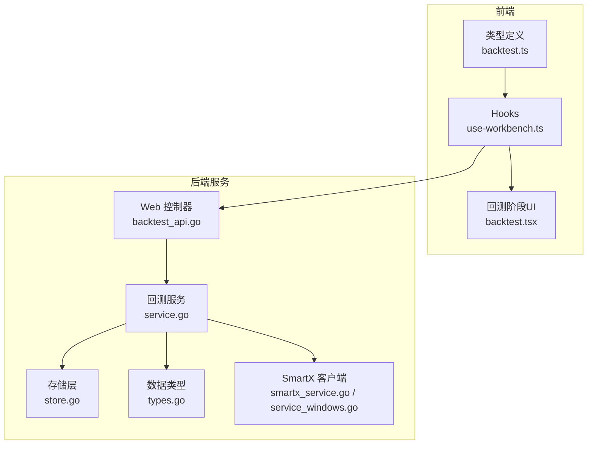
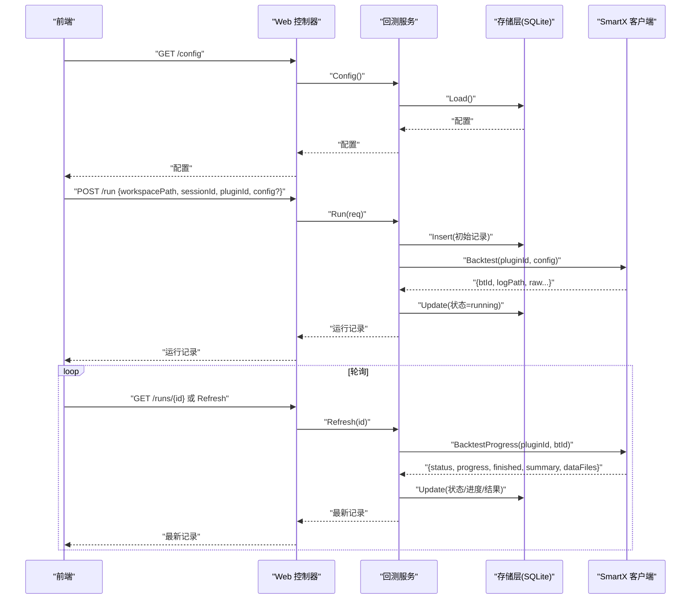
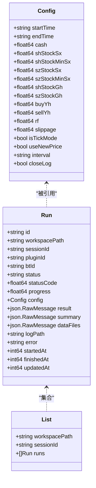
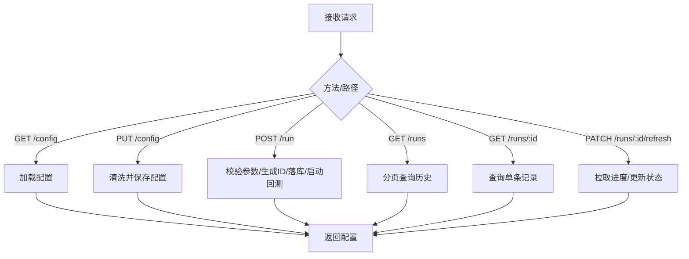
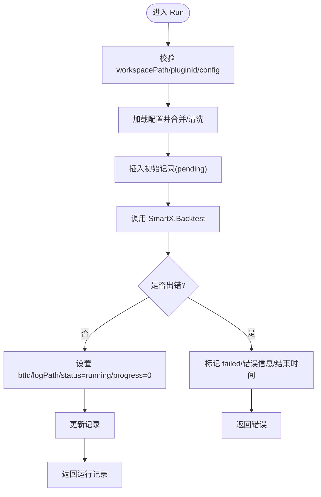
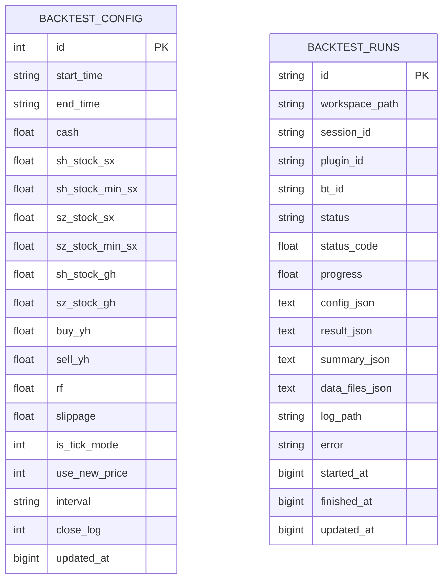
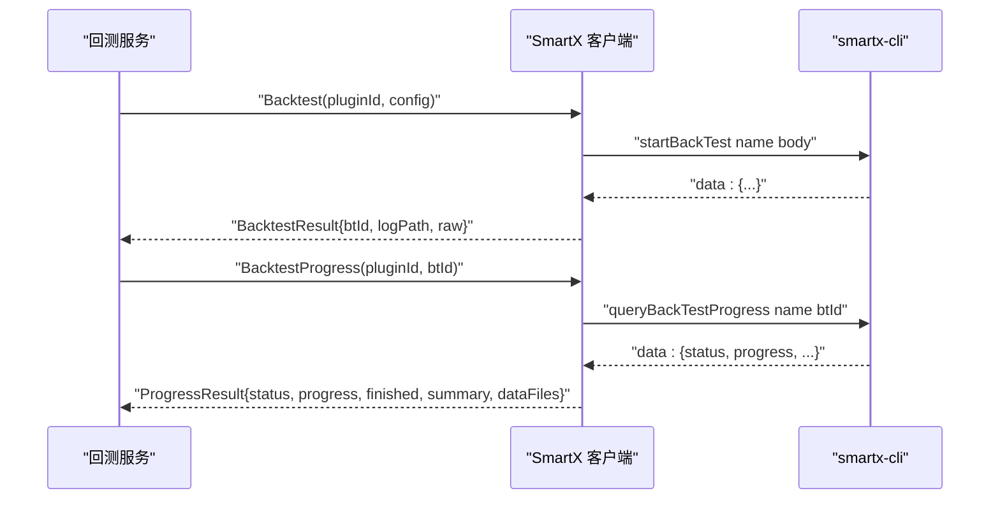
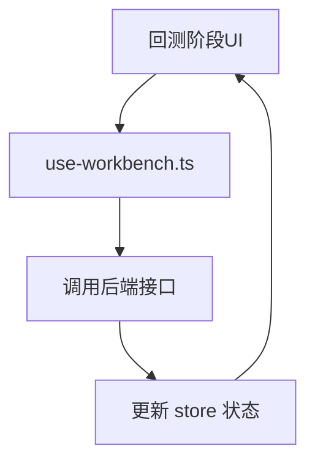
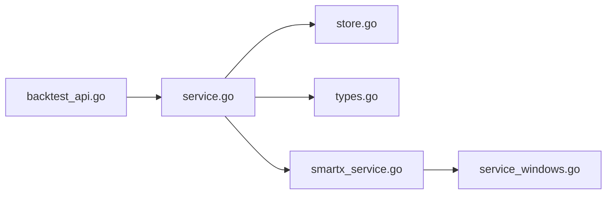

# 智能回测系统

<cite>
**本文引用的文件**   
- [README.md](file://README.md)
- [package.json](file://package.json)
- [service.go](file://packages/strategy-service/internal/backtest/service.go)
- [store.go](file://packages/strategy-service/internal/backtest/store.go)
- [types.go](file://packages/strategy-service/internal/backtest/types.go)
- [backtest_api.go](file://packages/strategy-service/internal/web/backtest_api.go)
- [smartx_service.go](file://packages/strategy-service/internal/smartx/service.go)
- [smartx_service_windows.go](file://packages/strategy-service/internal/smartx/service_windows.go)
- [use-workbench.ts](file://packages/strategy-front/src/components/workbench/hooks/use-workbench.ts)
- [backtest.ts](file://packages/strategy-front/src/types/backtest.ts)
- [backtest.tsx](file://packages/strategy-front/src/components/workbench/features/stage/backtest.tsx)
</cite>

## 目录
1. [简介](#简介)
2. [项目结构](#项目结构)
3. [核心组件](#核心组件)
4. [架构总览](#架构总览)
5. [详细组件分析](#详细组件分析)
6. [依赖关系分析](#依赖关系分析)
7. [性能与可靠性](#性能与可靠性)
8. [故障排查指南](#故障排查指南)
9. [结论](#结论)
10. [附录](#附录)

## 简介
本仓库包含一个“智能回测系统”的完整实现，覆盖前端工作区、后端服务与策略执行桥接层。系统通过 Web API 暴露回测配置与运行能力，持久化配置与运行记录，并通过 SmartX 扩展（CLI）驱动实际的回测引擎，最终将结果与进度同步到前端界面，形成端到端的回测闭环。

## 项目结构
- 前端（React + TypeScript）
  - 类型定义：统一前后端数据契约
  - Hooks：聚合状态、调用 API、映射状态
  - 组件：回测阶段 UI 与按钮交互
- 后端（Go + Gin）
  - Web 层：HTTP 路由与请求绑定
  - 业务层：回测服务编排、参数清洗、任务生命周期管理
  - 存储层：SQLite 持久化配置与运行记录
  - 集成层：SmartX 客户端封装，负责启动/查询回测任务
- 顶层工程配置
  - 包管理与脚本：构建、开发、发布等

**图表来源** 
- [backtest_api.go:1-87](file://packages/strategy-service/internal/web/backtest_api.go#L1-L87)
- [service.go:1-230](file://packages/strategy-service/internal/backtest/service.go#L1-L230)
- [store.go:1-171](file://packages/strategy-service/internal/backtest/store.go#L1-L171)
- [types.go:1-67](file://packages/strategy-service/internal/backtest/types.go#L1-L67)
- [smartx_service.go:1-393](file://packages/strategy-service/internal/smartx/service.go#L1-L393)
- [smartx_service_windows.go:1-115](file://packages/strategy-service/internal/smartx/service_windows.go#L1-L115)
- [use-workbench.ts:1-31](file://packages/strategy-front/src/components/workbench/hooks/use-workbench.ts#L1-L31)
- [backtest.ts:1-52](file://packages/strategy-front/src/types/backtest.ts#L1-L52)
- [backtest.tsx:79-95](file://packages/strategy-front/src/components/workbench/features/stage/backtest.tsx#L79-L95)

**章节来源**
- [README.md:1-142](file://README.md#L1-L142)
- [package.json:1-118](file://package.json#L1-L118)

## 核心组件
- 回测配置与运行模型
  - 配置项涵盖时间区间、资金、手续费、过户费、印花税、无风险利率、滑点、K线周期、日志开关等
  - 运行记录包含状态机（待处理/运行中/完成/失败）、进度、结果摘要、数据文件清单、错误信息、时间戳等
- Web API
  - 获取/保存回测配置
  - 启动回测、列出历史、查询单条记录、刷新进度
- 存储层
  - SQLite 持久化配置与运行记录，提供插入、更新、查询、列表能力
- SmartX 集成
  - 通过 CLI 启动/查询回测任务，解析输出并返回结构化结果与进度

**章节来源**
- [types.go:1-67](file://packages/strategy-service/internal/backtest/types.go#L1-L67)
- [backtest_api.go:1-87](file://packages/strategy-service/internal/web/backtest_api.go#L1-L87)
- [store.go:1-171](file://packages/strategy-service/internal/backtest/store.go#L1-L171)
- [smartx_service.go:1-393](file://packages/strategy-service/internal/smartx/service.go#L1-L393)

## 架构总览
系统采用分层架构：前端通过 REST API 与后端交互；后端服务编排业务逻辑，访问数据库并调用 SmartX 客户端；SmartX 客户端通过本地进程与策略平台通信，驱动回测执行与进度上报。

**图表来源** 
- [backtest_api.go:1-87](file://packages/strategy-service/internal/web/backtest_api.go#L1-L87)
- [service.go:90-188](file://packages/strategy-service/internal/backtest/service.go#L90-L188)
- [store.go:53-133](file://packages/strategy-service/internal/backtest/store.go#L53-L133)
- [smartx_service.go:128-180](file://packages/strategy-service/internal/smartx/service.go#L128-L180)

## 详细组件分析

### 数据模型与类型契约
- 后端 Config/Run/List 等结构体定义了回测配置与运行记录的字段与约束
- 前端 BacktestConfig/BacktestRun/BacktestList 与后端一一对应，保证前后端一致

**图表来源** 
- [types.go:1-67](file://packages/strategy-service/internal/backtest/types.go#L1-L67)

**章节来源**
- [types.go:1-67](file://packages/strategy-service/internal/backtest/types.go#L1-L67)
- [backtest.ts:1-52](file://packages/strategy-front/src/types/backtest.ts#L1-L52)

### Web API 层
- GET /config：读取并返回当前回测配置
- PUT /config：保存回测配置（含默认值与校验）
- POST /run：创建回测任务，落库后启动 SmartX 回测
- GET /runs：按工作区/会话分页查询历史
- GET /runs/:id：查询单条记录
- PATCH /runs/:id/refresh：拉取进度并更新状态

**图表来源** 
- [backtest_api.go:1-87](file://packages/strategy-service/internal/web/backtest_api.go#L1-L87)

**章节来源**
- [backtest_api.go:1-87](file://packages/strategy-service/internal/web/backtest_api.go#L1-L87)

### 回测服务层
- 配置加载与清理：从数据库加载配置，应用默认值与边界检查
- 任务启动：校验必填字段，写入初始记录，调用 SmartX 启动回测，设置 running 状态
- 进度刷新：根据 btId 拉取进度，计算完成标志，更新状态码、进度、结果摘要与数据文件清单

**图表来源** 
- [service.go:90-151](file://packages/strategy-service/internal/backtest/service.go#L90-L151)

**章节来源**
- [service.go:28-71](file://packages/strategy-service/internal/backtest/service.go#L28-L71)
- [service.go:90-188](file://packages/strategy-service/internal/backtest/service.go#L90-L188)

### 存储层
- 配置表：唯一主键行，支持 upsert 更新
- 运行记录表：JSON 字段存储配置、结果、摘要、数据文件清单；支持按工作区/会话分页查询
- 安全与健壮性：对空 JSON 进行兜底为 "{}"，布尔值以整型存取

**图表来源** 
- [store.go:38-133](file://packages/strategy-service/internal/backtest/store.go#L38-L133)

**章节来源**
- [store.go:15-51](file://packages/strategy-service/internal/backtest/store.go#L15-L51)
- [store.go:53-133](file://packages/strategy-service/internal/backtest/store.go#L53-L133)
- [store.go:135-171](file://packages/strategy-service/internal/backtest/store.go#L135-L171)

### SmartX 集成层
- 通过本地进程（Windows 使用 conpty）与 smartx-cli 交互
- 命令封装：启动回测、查询进度、状态检测、输出清洗与 JSON 提取
- 超时控制与错误传播

**图表来源** 
- [smartx_service.go:128-180](file://packages/strategy-service/internal/smartx/service.go#L128-L180)
- [smartx_service_windows.go:58-83](file://packages/strategy-service/internal/smartx/service_windows.go#L58-L83)

**章节来源**
- [smartx_service.go:18-75](file://packages/strategy-service/internal/smartx/service.go#L18-L75)
- [smartx_service.go:128-180](file://packages/strategy-service/internal/smartx/service.go#L128-L180)
- [smartx_service_windows.go:1-115](file://packages/strategy-service/internal/smartx/service_windows.go#L1-L115)

### 前端集成
- 类型定义：与后端保持一致的字段与枚举
- Hooks：聚合回测状态、历史、进度事件，并将后端状态映射为 UI 状态
- 组件：回测阶段展示与“重新运行”按钮

**图表来源** 
- [use-workbench.ts:140-158](file://packages/strategy-front/src/components/workbench/hooks/use-workbench.ts#L140-L158)
- [backtest.tsx:79-95](file://packages/strategy-front/src/components/workbench/features/stage/backtest.tsx#L79-L95)
- [backtest.ts:1-52](file://packages/strategy-front/src/types/backtest.ts#L1-L52)

**章节来源**
- [use-workbench.ts:140-158](file://packages/strategy-front/src/components/workbench/hooks/use-workbench.ts#L140-L158)
- [backtest.tsx:79-95](file://packages/strategy-front/src/components/workbench/features/stage/backtest.tsx#L79-L95)
- [backtest.ts:1-52](file://packages/strategy-front/src/types/backtest.ts#L1-L52)

## 依赖关系分析
- 模块耦合
  - Web 控制器仅依赖 Service 与 Store，职责单一
  - Service 组合 Store 与 SmartX 客户端，承担编排与状态机
  - Store 仅依赖数据库抽象，屏蔽 SQL 细节
  - SmartX 客户端封装平台差异（Windows/Darwin），向上提供统一接口
- 外部依赖
  - Gin 作为 HTTP 框架
  - SQLite 作为轻量级持久化
  - 本地进程（conpty）用于 Windows 下与 smartx-cli 交互

**图表来源** 
- [backtest_api.go:1-87](file://packages/strategy-service/internal/web/backtest_api.go#L1-L87)
- [service.go:1-71](file://packages/strategy-service/internal/backtest/service.go#L1-L71)
- [store.go:1-51](file://packages/strategy-service/internal/backtest/store.go#L1-L51)
- [types.go:1-67](file://packages/strategy-service/internal/backtest/types.go#L1-L67)
- [smartx_service.go:1-75](file://packages/strategy-service/internal/smartx/service.go#L1-L75)
- [smartx_service_windows.go:1-115](file://packages/strategy-service/internal/smartx/service_windows.go#L1-L115)

**章节来源**
- [package.json:1-118](file://package.json#L1-L118)

## 性能与可靠性
- 配置清洗与默认值：避免非法输入导致异常，提升鲁棒性
- 进度轮询与幂等：刷新接口在已完成/失败时直接返回，减少无效开销
- 资源隔离：SmartX 客户端通过独立进程与 CLI 交互，避免阻塞主服务
- 建议优化
  - 增加并发限制与队列，防止大量并行回测造成资源争用
  - 引入缓存层（如最近一次进度）以减少频繁轮询
  - 对大 JSON 字段（result/summary/dataFiles）考虑分片或对象存储

[本节为通用指导，不直接分析具体文件]

## 故障排查指南
- 常见错误定位
  - 缺少必填字段：startTime/endTime/workspacePath/pluginId
  - SmartX 响应异常：未找到 data 段、JSON 不完整或无效
  - 数据库不可用：连接失败或记录不存在
- 排查步骤
  - 查看 Web 层返回的错误码与消息
  - 检查 Service 层日志（上下文、参数、状态变更）
  - 确认 SmartX 客户端输出（原始文本与解析后的 JSON）
  - 验证数据库表结构与数据完整性

**章节来源**
- [service.go:153-188](file://packages/strategy-service/internal/backtest/service.go#L153-L188)
- [smartx_service.go:308-342](file://packages/strategy-service/internal/smartx/service.go#L308-L342)
- [store.go:94-133](file://packages/strategy-service/internal/backtest/store.go#L94-L133)

## 结论
该智能回测系统以清晰的分层架构实现了从前端到后端的完整回测流程，具备可配置的参数体系、稳定的状态机与可靠的持久化机制。通过 SmartX 客户端与本地 CLI 的解耦设计，系统在可扩展性与可维护性方面表现良好。后续可在并发控制、进度缓存与大结果存储等方面进一步优化。

[本节为总结性内容，不直接分析具体文件]

## 附录
- 关键 API 一览
  - GET /config：获取回测配置
  - PUT /config：保存回测配置
  - POST /run：启动回测
  - GET /runs：查询历史
  - GET /runs/:id：查询单条记录
  - PATCH /runs/:id/refresh：刷新进度

**章节来源**
- [backtest_api.go:1-87](file://packages/strategy-service/internal/web/backtest_api.go#L1-L87)