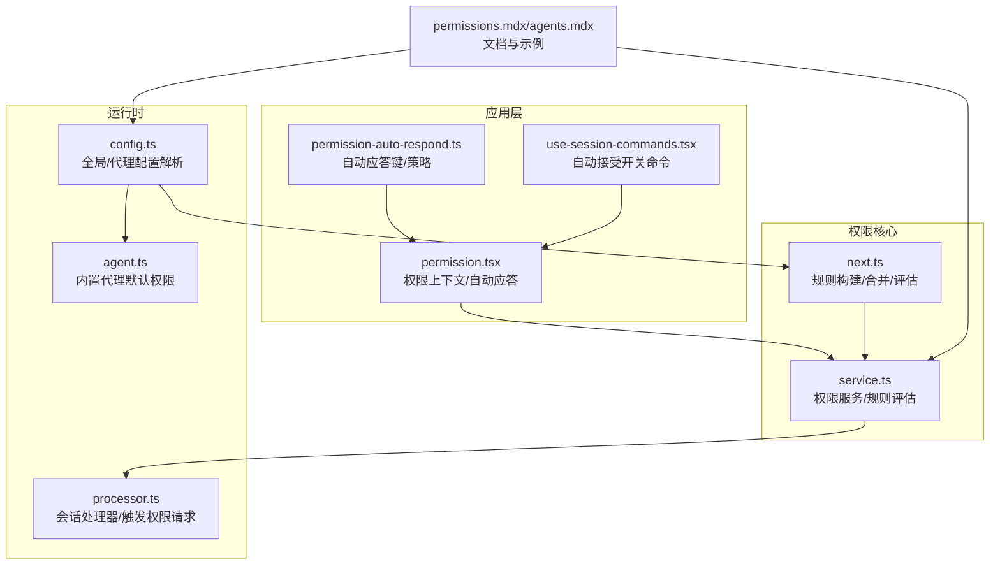
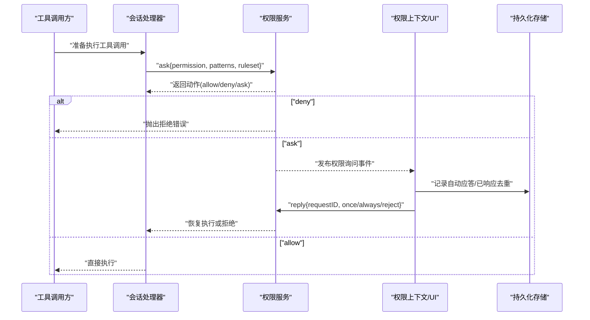
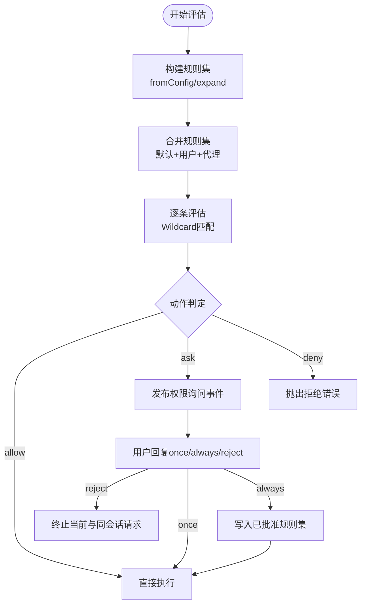
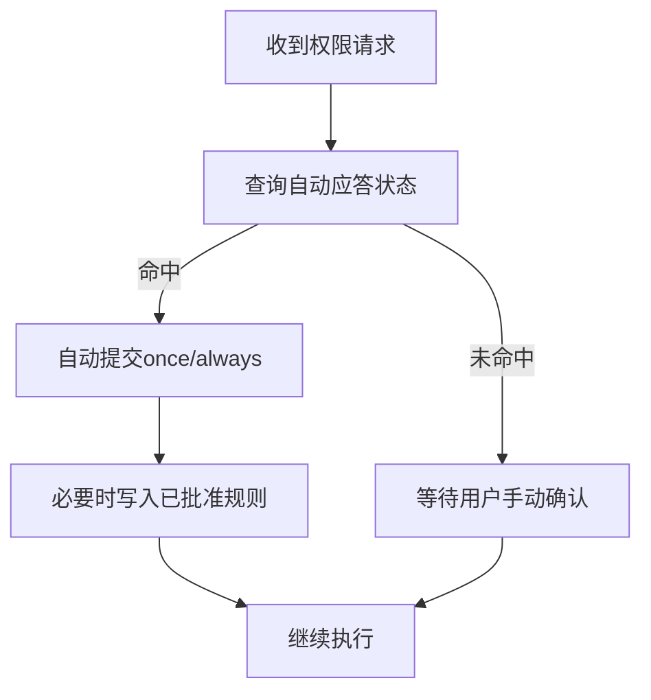
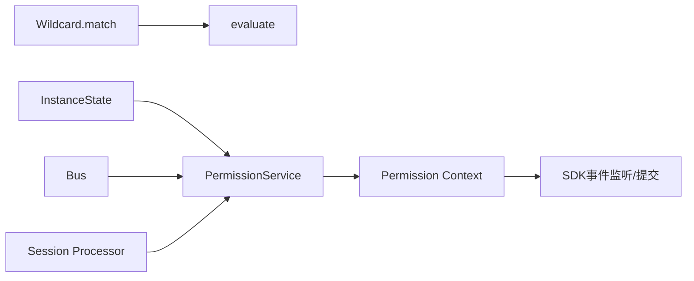

# 权限控制

<cite>
**本文引用的文件**
- [SECURITY.md](file://SECURITY.md)
- [next.ts](file://packages/opencode/src/permission/next.ts)
- [service.ts](file://packages/opencode/src/permission/service.ts)
- [permission.tsx](file://packages/app/src/context/permission.tsx)
- [permission-auto-respond.ts](file://packages/app/src/context/permission-auto-respond.ts)
- [use-session-commands.tsx](file://packages/app/src/pages/session/use-session-commands.tsx)
- [config.ts](file://packages/opencode/src/config/config.ts)
- [agent.ts](file://packages/opencode/src/agent/agent.ts)
- [processor.ts](file://packages/opencode/src/session/processor.ts)
- [permissions.mdx](file://packages/web/src/content/docs/permissions.mdx)
- [agents.mdx](file://packages/web/src/content/docs/agents.mdx)
</cite>

## 目录
1. [简介](#简介)
2. [项目结构](#项目结构)
3. [核心组件](#核心组件)
4. [架构总览](#架构总览)
5. [详细组件分析](#详细组件分析)
6. [依赖关系分析](#依赖关系分析)
7. [性能考量](#性能考量)
8. [故障排查指南](#故障排查指南)
9. [结论](#结论)
10. [附录](#附录)

## 简介
本文件面向OpenCode的权限控制系统，围绕基于工具（工具名）的权限模型与RBAC思想进行系统化说明。OpenCode采用“工具级权限 + 规则集合并 + 通配符匹配 + 用户交互确认”的方式实现本地代理的访问控制，覆盖文件系统读写、命令执行、网络访问、任务编排等能力，并通过会话维度支持自动应答与批量放行。

根据项目安全声明，OpenCode不提供沙箱隔离，服务器模式需显式启用并设置认证；因此权限控制更偏向于“用户知情与可控”，而非“强制隔离”。本文将从权限模型、规则定义、评估流程、自动应答、审计事件、安全最佳实践等方面展开。

## 项目结构
与权限控制直接相关的关键模块分布如下：
- 权限服务与规则：packages/opencode/src/permission/*
- 权限上下文与自动应答：packages/app/src/context/permission*.ts
- 会话处理器与权限触发点：packages/opencode/src/session/processor.ts
- 配置与代理默认权限：packages/opencode/src/config/config.ts, packages/opencode/src/agent/agent.ts
- 文档与示例：packages/web/src/content/docs/permissions.mdx, packages/web/src/content/docs/agents.mdx
- 安全声明：SECURITY.md

图表来源
- [service.ts:130-256](file://packages/opencode/src/permission/service.ts#L130-L256)
- [next.ts:17-94](file://packages/opencode/src/permission/next.ts#L17-L94)
- [permission.tsx:47-278](file://packages/app/src/context/permission.tsx#L47-L278)
- [permission-auto-respond.ts:1-52](file://packages/app/src/context/permission-auto-respond.ts#L1-L52)
- [use-session-commands.tsx:386-402](file://packages/app/src/pages/session/use-session-commands.tsx#L386-L402)
- [processor.ts:166-198](file://packages/opencode/src/session/processor.ts#L166-L198)
- [config.ts:738-809](file://packages/opencode/src/config/config.ts#L738-L809)
- [agent.ts:111-228](file://packages/opencode/src/agent/agent.ts#L111-L228)
- [permissions.mdx:1-238](file://packages/web/src/content/docs/permissions.mdx#L1-L238)
- [agents.mdx:468-541](file://packages/web/src/content/docs/agents.mdx#L468-L541)

章节来源
- [service.ts:1-266](file://packages/opencode/src/permission/service.ts#L1-L266)
- [next.ts:1-94](file://packages/opencode/src/permission/next.ts#L1-L94)
- [permission.tsx:1-278](file://packages/app/src/context/permission.tsx#L1-L278)
- [permission-auto-respond.ts:1-52](file://packages/app/src/context/permission-auto-respond.ts#L1-L52)
- [use-session-commands.tsx:386-402](file://packages/app/src/pages/session/use-session-commands.tsx#L386-L402)
- [processor.ts:166-198](file://packages/opencode/src/session/processor.ts#L166-L198)
- [config.ts:738-809](file://packages/opencode/src/config/config.ts#L738-L809)
- [agent.ts:111-228](file://packages/opencode/src/agent/agent.ts#L111-L228)
- [permissions.mdx:1-238](file://packages/web/src/content/docs/permissions.mdx#L1-L238)
- [agents.mdx:468-541](file://packages/web/src/content/docs/agents.mdx#L468-L541)

## 核心组件
- 权限服务（PermissionService）
  - 负责权限请求的发布、等待与回复处理，维护待处理队列与已批准规则集。
  - 支持“允许/拒绝/询问”三态，拒绝时返回具体规则集合以便提示。
- 规则与评估（PermissionNext）
  - 将配置转换为规则集，支持多规则集合并与最后匹配规则生效。
  - 支持通配符匹配与家目录展开，用于外部目录与路径规则。
- 应用上下文（Permission Context）
  - 维护自动应答状态、会话链路继承、批量放行持久化。
  - 监听权限事件并自动提交“一次性/总是/拒绝”响应。
- 会话处理器（Session Processor）
  - 在工具调用前触发权限检查，对重复调用触发“循环调用”保护。
- 配置与代理（Config & Agent）
  - 全局与代理维度的权限配置解析与默认值合并。
  - 内置代理提供默认权限集，支持按工具/路径粒度覆盖。

章节来源
- [service.ts:122-256](file://packages/opencode/src/permission/service.ts#L122-L256)
- [next.ts:17-94](file://packages/opencode/src/permission/next.ts#L17-L94)
- [permission.tsx:47-278](file://packages/app/src/context/permission.tsx#L47-L278)
- [processor.ts:166-198](file://packages/opencode/src/session/processor.ts#L166-L198)
- [config.ts:738-809](file://packages/opencode/src/config/config.ts#L738-L809)
- [agent.ts:111-228](file://packages/opencode/src/agent/agent.ts#L111-L228)

## 架构总览
OpenCode的权限控制以“工具名 + 模式/输入匹配 + 规则集评估”为核心，结合会话生命周期与UI交互完成授权闭环。

图表来源
- [service.ts:148-246](file://packages/opencode/src/permission/service.ts#L148-L246)
- [permission.tsx:120-171](file://packages/app/src/context/permission.tsx#L120-L171)
- [processor.ts:166-198](file://packages/opencode/src/session/processor.ts#L166-L198)

## 详细组件分析

### 权限模型与规则
- 工具级权限键
  - 包括但不限于：read、edit（覆盖write/patch/multiedit）、glob、grep、list、bash、task、skill、lsp、todoread/todowrite、webfetch、websearch/codesearch、external_directory、doom_loop。
- 动作三态
  - allow：无需确认直接执行
  - ask：弹窗请求用户确认（一次性/总是/拒绝）
  - deny：直接阻止
- 规则语法
  - 全局规则：permission: "ask"/"allow"/"deny"
  - 工具对象规则：permission.<tool>: { "<pattern>": "allow"/"ask"/"deny", ... }
  - 通配符：*、? 等简单通配
  - 外部目录：external_directory 用于跨工作区路径访问
  - 默认行为：未配置时多数工具默认允许，doom_loop 与 external_directory 默认 ask；read 对 .env 类文件默认拒绝
- 规则合并与优先级
  - 后匹配规则覆盖先前规则；同一工具下按最后匹配规则生效
  - 支持多规则集合并（如默认集 + 用户集 + 代理集）

章节来源
- [permissions.mdx:12-146](file://packages/web/src/content/docs/permissions.mdx#L12-L146)
- [service.ts:22-36](file://packages/opencode/src/permission/service.ts#L22-L36)
- [next.ts:47-79](file://packages/opencode/src/permission/next.ts#L47-L79)

### 权限评估与执行流程
- 规则构建
  - fromConfig：将配置对象转换为规则集，支持字符串与对象两种语法
  - expand：对 ~、$HOME 进行展开，便于 external_directory 等路径规则
- 规则评估
  - evaluate：按工具名与输入模式进行通配匹配，取最后一条匹配规则；若无匹配，默认 ask
- 执行路径
  - 会话处理器在工具调用前发起 ask 请求
  - 若为 allow，直接执行；若为 ask，发布事件给UI；若为 deny，抛出错误
  - 用户选择后通过 reply 回复，可能批量写入“总是”规则

图表来源
- [next.ts:47-79](file://packages/opencode/src/permission/next.ts#L47-L79)
- [service.ts:258-265](file://packages/opencode/src/permission/service.ts#L258-L265)
- [service.ts:148-246](file://packages/opencode/src/permission/service.ts#L148-L246)

章节来源
- [next.ts:17-94](file://packages/opencode/src/permission/next.ts#L17-L94)
- [service.ts:122-256](file://packages/opencode/src/permission/service.ts#L122-L256)

### 自动应答与会话继承
- 自动应答键
  - 会话级键：sessionID 或 directory/sessionID 组合
  - 目录级键：directoryAcceptKey(directory)
- 会话继承
  - 依据会话父子关系向上查找最近的自动应答状态
- 去重与容量
  - 记录最近一次响应时间与上限，避免无限增长

图表来源
- [permission.tsx:120-171](file://packages/app/src/context/permission.tsx#L120-L171)
- [permission-auto-respond.ts:41-51](file://packages/app/src/context/permission-auto-respond.ts#L41-L51)

章节来源
- [permission.tsx:47-278](file://packages/app/src/context/permission.tsx#L47-L278)
- [permission-auto-respond.ts:1-52](file://packages/app/src/context/permission-auto-respond.ts#L1-L52)

### 会话与命令集成
- 权限命令
  - 提供“开启/关闭自动接受”命令，支持按会话或按目录级别切换
- 循环调用保护
  - 当同一工具连续三次相同输入时，触发 doom_loop 权限请求，防止死循环

章节来源
- [use-session-commands.tsx:386-402](file://packages/app/src/pages/session/use-session-commands.tsx#L386-L402)
- [processor.ts:166-198](file://packages/opencode/src/session/processor.ts#L166-L198)

### 配置与代理默认权限
- 全局配置
  - 支持远程、全局、自定义、项目、.opencode目录、内联配置的多源合并
  - 旧版 tools 配置兼容并映射到 permission
- 代理默认权限
  - 内置通用/探索/总结等代理提供默认权限集，支持用户覆盖
  - 外部目录白名单可按路径精确放行

章节来源
- [config.ts:738-809](file://packages/opencode/src/config/config.ts#L738-L809)
- [agent.ts:111-228](file://packages/opencode/src/agent/agent.ts#L111-L228)
- [permissions.mdx:89-125](file://packages/web/src/content/docs/permissions.mdx#L89-L125)

## 依赖关系分析
- 权限服务依赖
  - 通配符匹配：Wildcard.match
  - 实例状态：InstanceState（持久化已批准规则）
  - 事件总线：Bus（发布/订阅权限事件）
- 应用层依赖
  - SDK事件监听与权限响应提交
  - 持久化存储（autoAccept、已响应去重）
- 会话处理器依赖
  - 权限服务 ask/reply/list
  - 会话ID/消息ID等上下文信息

图表来源
- [service.ts:130-256](file://packages/opencode/src/permission/service.ts#L130-L256)
- [permission.tsx:162-171](file://packages/app/src/context/permission.tsx#L162-L171)

章节来源
- [service.ts:1-266](file://packages/opencode/src/permission/service.ts#L1-L266)
- [permission.tsx:1-278](file://packages/app/src/context/permission.tsx#L1-L278)

## 性能考量
- 规则评估复杂度
  - 规则集扁平合并后按最后匹配规则扫描，整体为 O(N)；建议合理组织规则顺序，避免过多通配导致匹配开销
- 事件与去重
  - 已响应请求使用 Map 去重并限制容量，避免内存膨胀
- I/O与持久化
  - 已批准规则集仅在用户选择“总是”时追加，避免频繁写盘

## 故障排查指南
- 常见问题
  - 拒绝错误：检查 deny 规则与工具/模式匹配是否过宽
  - 误触发 ask：确认规则顺序，确保更具体的规则在后
  - 外部目录访问失败：确认 external_directory 规则与路径展开
  - 自动应答无效：检查会话继承键与目录级自动应答状态
- 排查步骤
  - 查看权限事件：确认 ask 是否被发布
  - 检查规则集：打印合并后的规则集，定位最后匹配规则
  - 验证通配符：确认模式与输入是否匹配
  - 审核自动应答：确认 session/directory 键状态

章节来源
- [service.ts:154-163](file://packages/opencode/src/permission/service.ts#L154-L163)
- [service.ts:185-246](file://packages/opencode/src/permission/service.ts#L185-L246)
- [permission.tsx:120-171](file://packages/app/src/context/permission.tsx#L120-L171)

## 结论
OpenCode的权限控制以“工具名 + 通配符 + 最后匹配规则”为核心，结合会话生命周期与UI交互，形成“可感知、可控制、可审计”的本地代理权限体系。由于不提供沙箱隔离，建议配合容器/虚拟机运行与最小权限原则，确保安全边界。

## 附录

### RBAC与权限模型设计要点
- 角色维度
  - 用户：通过目录/会话键控制自动应答与批量放行
  - 代理：内置默认权限，支持按工具/路径覆盖
- 权限分级
  - 文件系统：read/edit/glob/grep/list
  - 命令执行：bash
  - 网络访问：webfetch/websearch/codesearch
  - 任务编排：task
  - 安全保护：external_directory/doom_loop
- 权限组合
  - 规则集合并：默认集 + 用户集 + 代理集
  - 模式匹配：工具名与输入模式双维度匹配
- 权限验证流程
  - ask → UI确认 → reply → 允许/拒绝/批量放行

章节来源
- [permissions.mdx:128-146](file://packages/web/src/content/docs/permissions.mdx#L128-L146)
- [agent.ts:111-228](file://packages/opencode/src/agent/agent.ts#L111-L228)
- [service.ts:258-265](file://packages/opencode/src/permission/service.ts#L258-L265)

### 权限配置示例与最佳实践
- 示例参考
  - 全局 ask + bash 允许 + edit 拒绝
  - 外部目录仅允许个人项目路径
  - 代理维度针对特定命令设置 allow/ask/deny
- 最佳实践
  - 使用“先通配后具体”的规则顺序
  - 严格限制 external_directory 范围
  - 仅在可信路径启用编辑权限
  - 启用自动应答前充分测试规则
  - 定期审查已批准规则集

章节来源
- [permissions.mdx:22-125](file://packages/web/src/content/docs/permissions.mdx#L22-L125)
- [agents.mdx:468-541](file://packages/web/src/content/docs/agents.mdx#L468-L541)

### 安全声明与合规要点
- 不提供沙箱隔离，服务器模式需显式启用并设置认证
- 服务器访问、沙箱逃逸、LLM数据处理、外部MCP服务器行为等不在项目安全边界内
- 报告安全问题遵循项目指引

章节来源
- [SECURITY.md:1-48](file://SECURITY.md#L1-L48)