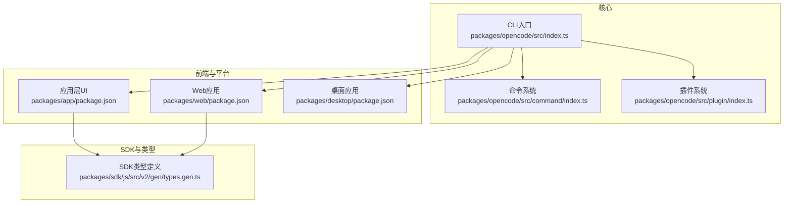
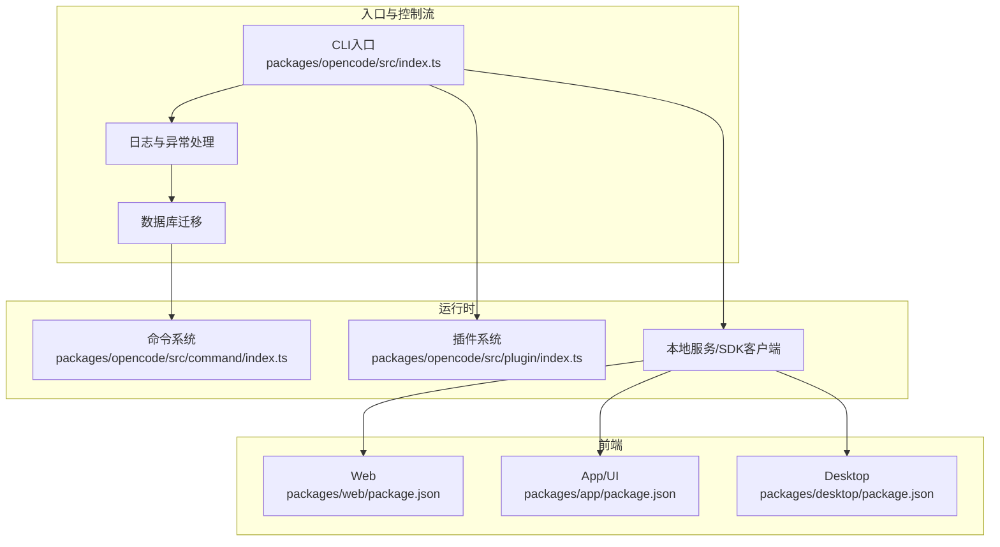
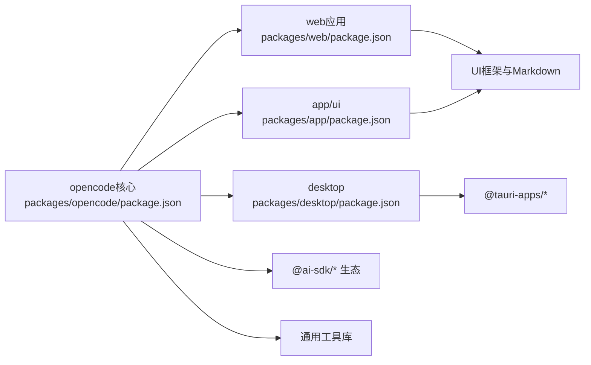

# 核心功能特性

<cite>
**本文引用的文件**
- [README.md](file://README.md)
- [AGENTS.md](file://AGENTS.md)
- [packages/opencode/src/index.ts](file://packages/opencode/src/index.ts)
- [packages/opencode/src/command/index.ts](file://packages/opencode/src/command/index.ts)
- [packages/opencode/src/plugin/index.ts](file://packages/opencode/src/plugin/index.ts)
- [packages/opencode/package.json](file://packages/opencode/package.json)
- [packages/app/package.json](file://packages/app/package.json)
- [packages/web/package.json](file://packages/web/package.json)
- [packages/desktop/package.json](file://packages/desktop/package.json)
- [packages/sdk/js/src/v2/gen/types.gen.ts](file://packages/sdk/js/src/v2/gen/types.gen.ts)
- [packages/app/src/context/global-sync/bootstrap.ts](file://packages/app/src/context/global-sync/bootstrap.ts)
- [packages/app/src/context/global-sync/session-trim.ts](file://packages/app/src/context/global-sync/session-trim.ts)
- [packages/web/src/content/docs/server.mdx](file://packages/web/src/content/docs/server.mdx)
- [packages/web/src/content/docs/fr/plugins.mdx](file://packages/web/src/content/docs/fr/plugins.mdx)
- [packages/web/src/components/Lander.astro](file://packages/web/src/components/Lander.astro)
</cite>

## 目录
1. [简介](#简介)
2. [项目结构](#项目结构)
3. [核心组件](#核心组件)
4. [架构总览](#架构总览)
5. [详细组件分析](#详细组件分析)
6. [依赖分析](#依赖分析)
7. [性能考虑](#性能考虑)
8. [故障排查指南](#故障排查指南)
9. [结论](#结论)
10. [附录](#附录)

## 简介
本文件聚焦OpenCode项目的核心功能特性，围绕以下主题展开：AI代理系统（build agent与plan agent）、多平台支持（CLI命令行、桌面应用、Web界面）、插件生态系统与工具系统、会话管理与权限控制、模型提供商集成，并结合具体使用场景与案例，说明这些能力如何提升开发者效率。

## 项目结构
OpenCode采用多包（monorepo）组织方式，核心入口位于packages/opencode，同时提供Web前端、桌面端、应用层UI与SDK等模块。整体结构强调“终端优先”的TUI体验，同时通过客户端/服务端架构支持多前端形态。

图表来源
- [packages/opencode/src/index.ts:1-214](file://packages/opencode/src/index.ts#L1-L214)
- [packages/opencode/src/command/index.ts:1-152](file://packages/opencode/src/command/index.ts#L1-L152)
- [packages/opencode/src/plugin/index.ts:1-150](file://packages/opencode/src/plugin/index.ts#L1-L150)
- [packages/web/package.json:1-44](file://packages/web/package.json#L1-L44)
- [packages/app/package.json:1-74](file://packages/app/package.json#L1-L74)
- [packages/desktop/package.json:1-45](file://packages/desktop/package.json#L1-L45)
- [packages/sdk/js/src/v2/gen/types.gen.ts:3278-3344](file://packages/sdk/js/src/v2/gen/types.gen.ts#L3278-L3344)

章节来源
- [packages/opencode/src/index.ts:1-214](file://packages/opencode/src/index.ts#L1-L214)
- [packages/opencode/src/command/index.ts:1-152](file://packages/opencode/src/command/index.ts#L1-L152)
- [packages/opencode/src/plugin/index.ts:1-150](file://packages/opencode/src/plugin/index.ts#L1-L150)
- [packages/web/package.json:1-44](file://packages/web/package.json#L1-L44)
- [packages/app/package.json:1-74](file://packages/app/package.json#L1-L74)
- [packages/desktop/package.json:1-45](file://packages/desktop/package.json#L1-L45)
- [packages/sdk/js/src/v2/gen/types.gen.ts:3278-3344](file://packages/sdk/js/src/v2/gen/types.gen.ts#L3278-L3344)

## 核心组件
- CLI与命令系统：负责解析参数、初始化日志与数据库迁移、注册各类子命令（运行、生成、会话、模型、导出导入等），并统一错误处理与退出策略。
- 命令与提示词：将内置命令、MCP提示词与技能（Skill）统一封装为可调用的“命令”，支持模板化与参数占位符提示。
- 插件系统：支持内置与外部插件加载，提供钩子（Hooks）机制，贯穿配置、事件、工具等生命周期；具备安装失败与加载失败的容错与通知。
- 多平台前端：Web端（Astro + Solid）、应用层UI（Solid + Tauri风格生态）、桌面端（Tauri）三者共享核心SDK与会话/权限模型。
- 会话与权限：通过SDK类型定义与Web文档接口，明确会话消息、权限请求与响应、问题列表等交互契约。

章节来源
- [packages/opencode/src/index.ts:50-167](file://packages/opencode/src/index.ts#L50-L167)
- [packages/opencode/src/command/index.ts:12-152](file://packages/opencode/src/command/index.ts#L12-L152)
- [packages/opencode/src/plugin/index.ts:16-150](file://packages/opencode/src/plugin/index.ts#L16-L150)
- [packages/sdk/js/src/v2/gen/types.gen.ts:3278-3344](file://packages/sdk/js/src/v2/gen/types.gen.ts#L3278-L3344)

## 架构总览
OpenCode采用“CLI/前端（Web/App/Desktop）+ 服务端（本地HTTP）+ 插件/工具系统”的分层架构。CLI作为入口负责初始化与命令路由；前端通过SDK与本地服务通信；插件系统在运行期注入能力；会话与权限通过统一的API契约管理。

图表来源
- [packages/opencode/src/index.ts:38-123](file://packages/opencode/src/index.ts#L38-L123)
- [packages/opencode/src/command/index.ts:12-152](file://packages/opencode/src/command/index.ts#L12-L152)
- [packages/opencode/src/plugin/index.ts:24-110](file://packages/opencode/src/plugin/index.ts#L24-L110)
- [packages/web/package.json:1-44](file://packages/web/package.json#L1-L44)
- [packages/app/package.json:1-74](file://packages/app/package.json#L1-L74)
- [packages/desktop/package.json:1-45](file://packages/desktop/package.json#L1-L45)

## 详细组件分析

### AI代理系统：Build Agent与Plan Agent
- 角色定位
  - Build Agent：默认全权限代理，适合开发工作，具备所有工具访问能力。
  - Plan Agent：只读代理，禁止文件编辑，默认拒绝执行bash命令，需要权限确认后才可运行，适合探索未知代码库或规划变更。
  - General子代理：用于复杂检索与多步任务，可通过消息中@general触发。
- 切换与调用
  - 在会话中通过Tab键在主代理间切换；也可通过@提及方式直接调用特定代理。
- 安全与可控
  - Plan Agent默认限制高风险操作，降低误操作风险；Build Agent则面向高效开发。

章节来源
- [README.md:100-114](file://README.md#L100-L114)
- [packages/web/src/content/docs/ko/agents.mdx:16-35](file://packages/web/src/content/docs/ko/agents.mdx#L16-L35)

### 多平台支持：CLI、桌面应用、Web界面
- CLI命令行
  - 提供安装、账户、模型、会话、调试、统计、导出导入、GitHub/PR、数据库等丰富命令，覆盖从环境准备到日常运维的全流程。
  - 支持Shell自动补全与严格参数校验，错误时输出帮助信息。
- 桌面应用（BETA）
  - 提供macOS、Windows、Linux多平台安装包与包管理器安装方式；支持Cask与包管理器一键安装。
- Web界面
  - 基于Astro + Solid构建，强调原生TUI体验与可主题化设计；支持LSP自动加载、多会话并行、可分享链接等特性。
  - 官网落地页列举了“原生TUI”“LSP启用”“多会话”“可分享链接”等亮点。

章节来源
- [README.md:46-98](file://README.md#L46-L98)
- [README.md:67-83](file://README.md#L67-L83)
- [packages/web/src/components/Lander.astro:73-100](file://packages/web/src/components/Lander.astro#L73-L100)
- [packages/opencode/src/index.ts:126-147](file://packages/opencode/src/index.ts#L126-L147)

### 插件生态系统与工具系统
- 插件加载与钩子
  - 内置插件（如Codex/Copilot/GitLab认证）与外部插件（npm包或file://路径）统一加载；对安装失败与加载失败进行记录与会话级错误通知。
  - 插件通过Hooks暴露能力，支持config、event、tool等钩子；trigger函数按顺序调用各插件钩子，实现链式扩展。
- 工具系统
  - 插件可注册自定义工具（tool），工具具备描述、Zod参数模式与执行函数；与内置工具共存，同名插件工具优先。
  - 插件还可注入环境变量、参与会话压缩等上下文处理。
- 典型用法
  - 注入环境变量以增强工具可用性；
  - 自定义工具封装项目特定脚本或API调用；
  - 通过事件钩子监听会话状态变化并触发后续动作。

章节来源
- [packages/opencode/src/plugin/index.ts:16-150](file://packages/opencode/src/plugin/index.ts#L16-L150)
- [packages/web/src/content/docs/fr/plugins.mdx:265-313](file://packages/web/src/content/docs/fr/plugins.mdx#L265-L313)

### 会话管理与权限控制
- 会话与消息
  - 通过SDK类型定义明确会话消息的输入/输出结构，支持文本、文件、子任务等Part类型；提供消息列表、发送、删除等API。
- 权限请求与响应
  - 会话内可发起权限请求（如工具调用、外部目录访问等），由用户在前端确认；支持“记住”选项以便后续自动放行。
- 问题与待办
  - 会话可关联问题（Questions）与待办（Todos），前端根据当前会话优先展示其问题，嵌套场景下向上追溯最近的问题。
- 会话修剪与归档
  - 基于时间窗口与权限保留策略，定期修剪历史会话，保持资源占用合理。

章节来源
- [packages/sdk/js/src/v2/gen/types.gen.ts:3278-3344](file://packages/sdk/js/src/v2/gen/types.gen.ts#L3278-L3344)
- [packages/web/src/content/docs/server.mdx:167-176](file://packages/web/src/content/docs/server.mdx#L167-L176)
- [packages/app/src/context/global-sync/bootstrap.ts:154-186](file://packages/app/src/context/global-sync/bootstrap.ts#L154-L186)
- [packages/app/src/context/global-sync/session-trim.ts:35-56](file://packages/app/src/context/global-sync/session-trim.ts#L35-L56)

### 模型提供商集成
- 多模型提供商支持
  - 通过@ai-sdk系列包集成多家模型提供商（Anthropic、OpenAI、Google、Azure、Groq、Mistral、Cerebras、Perplexity等），并支持OpenRouter等网关。
- Provider-agnostic设计
  - 项目强调“非绑定任何提供商”，可自由选择模型与供应商，便于随模型演进与成本下降调整策略。
- LSP与模型协同
  - 自动加载适配LLM的LSP，提升代码理解与生成质量。

章节来源
- [packages/opencode/package.json:58-140](file://packages/opencode/package.json#L58-L140)
- [README.md:129-137](file://README.md#L129-L137)
- [packages/web/src/components/Lander.astro:84-90](file://packages/web/src/components/Lander.astro#L84-L90)

### 使用场景与案例
- 快速探索与规划
  - 场景：接手新项目，需要先分析代码结构与潜在风险。
  - 方案：使用Plan Agent进行只读分析，避免误改；必要时@general执行多步检索与总结。
- 高效开发与迭代
  - 场景：已有清晰方案，需要快速落地实现。
  - 方案：使用Build Agent，直接编辑文件、执行命令、调用工具，提升迭代速度。
- 跨平台协作
  - 场景：团队成员使用不同平台（终端、桌面、Web）协作。
  - 方案：通过可分享链接共享会话，跨端一致体验；桌面端提供更丰富的交互能力。
- 扩展与自动化
  - 场景：项目需要定制工具或流程自动化。
  - 方案：编写插件工具，注入环境变量，监听事件钩子，实现与现有工作流无缝衔接。
- 权限与安全
  - 场景：在共享或CI环境中运行，需最小权限原则。
  - 方案：默认使用Plan Agent，对高风险操作进行权限确认；仅在必要时授予Build Agent权限。

## 依赖分析
OpenCode在核心包中声明了大量AI SDK与工具依赖，涵盖多模型提供商与通用工具库；前端包分别聚焦Web与应用层UI生态；桌面端基于Tauri生态整合系统能力。

图表来源
- [packages/opencode/package.json:58-140](file://packages/opencode/package.json#L58-L140)
- [packages/web/package.json:14-36](file://packages/web/package.json#L14-L36)
- [packages/app/package.json:40-72](file://packages/app/package.json#L40-L72)
- [packages/desktop/package.json:15-35](file://packages/desktop/package.json#L15-L35)

章节来源
- [packages/opencode/package.json:58-140](file://packages/opencode/package.json#L58-L140)
- [packages/web/package.json:14-36](file://packages/web/package.json#L14-L36)
- [packages/app/package.json:40-72](file://packages/app/package.json#L40-L72)
- [packages/desktop/package.json:15-35](file://packages/desktop/package.json#L15-L35)

## 性能考虑
- 数据库迁移与启动开销
  - 首次运行进行SQLite迁移，CLI提供进度反馈；建议在CI或自动化环境中预热以减少首次延迟。
- 插件加载与并发
  - 插件安装与加载可能阻塞启动；建议将高频插件置于内置列表或提前缓存，避免重复安装。
- 前端渲染与会话修剪
  - 对历史会话进行时间窗口修剪，结合权限保留策略，平衡存储与查询性能。
- 模型调用与网络
  - 多Provider并行调用时注意超时与重试策略；在弱网环境下优先选择低延迟Provider。

## 故障排查指南
- CLI错误处理
  - 未捕获异常与未处理Promise拒绝会被统一记录并输出到日志文件；错误格式化后在终端显示。
- 插件安装/加载失败
  - 记录失败原因并通过会话事件发布错误；检查插件路径、版本与网络连通性。
- 权限请求未响应
  - 确认前端已弹出权限请求；若未出现，检查会话状态与权限钩子是否正确触发。
- 会话消息API异常
  - 参考SDK类型定义与Web文档接口，核对请求体字段（如parts、model、tools等）与路径参数。

章节来源
- [packages/opencode/src/index.ts:38-48](file://packages/opencode/src/index.ts#L38-L48)
- [packages/opencode/src/index.ts:170-207](file://packages/opencode/src/index.ts#L170-L207)
- [packages/opencode/src/plugin/index.ts:70-103](file://packages/opencode/src/plugin/index.ts#L70-L103)
- [packages/web/src/content/docs/server.mdx:167-176](file://packages/web/src/content/docs/server.mdx#L167-L176)

## 结论
OpenCode通过“终端优先”的CLI入口、多前端形态（Web/App/Desktop）、可扩展的插件系统与工具体系、严谨的会话与权限管理，以及对多模型提供商的开放集成，形成一套完整且灵活的AI编程代理平台。Build Agent与Plan Agent的差异化设计满足从探索到落地的不同阶段需求；多平台支持确保开发者在不同场景下都能获得一致高效的体验；插件与工具系统进一步降低定制门槛，显著提升开发效率。

## 附录
- 关键术语
  - Agent：AI代理，分为主代理与子代理，承担不同职责。
  - Command：可调用的命令，包含模板与参数提示。
  - Hook：插件生命周期钩子，支持配置、事件与工具注入。
  - Session：一次对话或任务的上下文容器，包含消息、权限与问题。
  - MCP：模型上下文协议（Model Context Protocol）相关能力。
- 相关文档与示例
  - 代理类型与使用方式参见Web文档。
  - 插件工具与钩子示例参见多语言文档。
  - 会话消息与权限API参见Web文档与SDK类型定义。