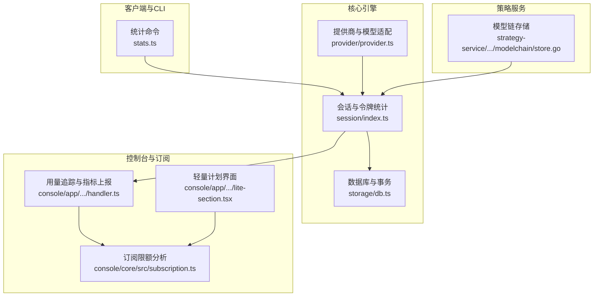
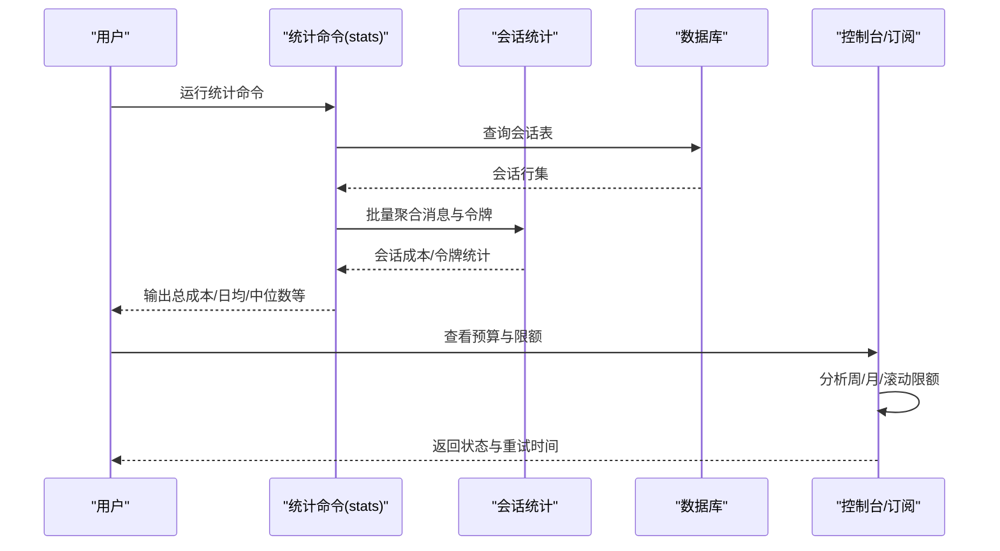
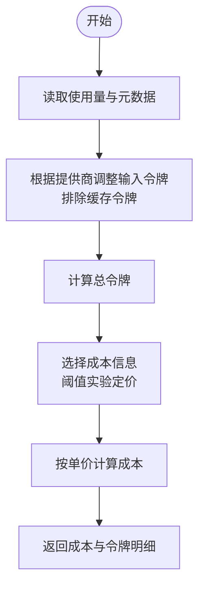
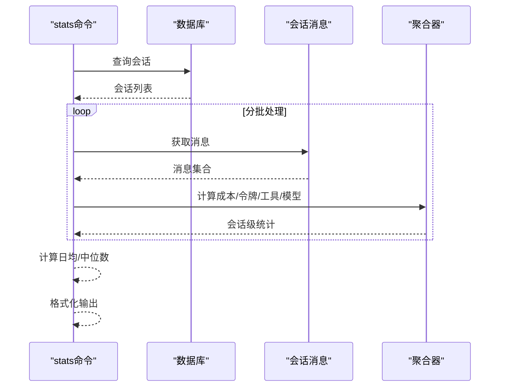
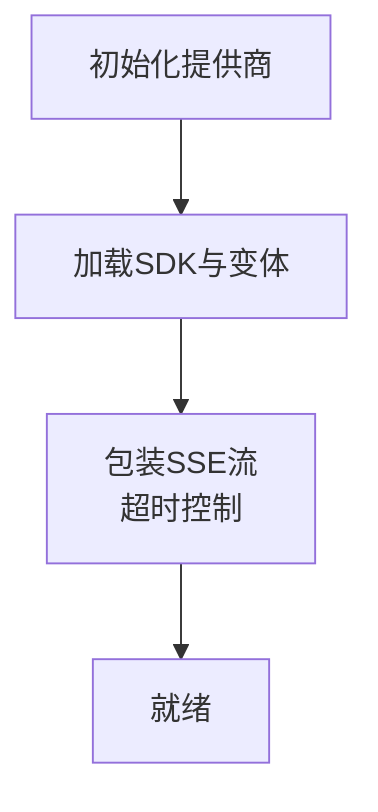
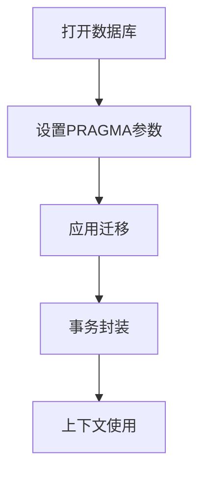
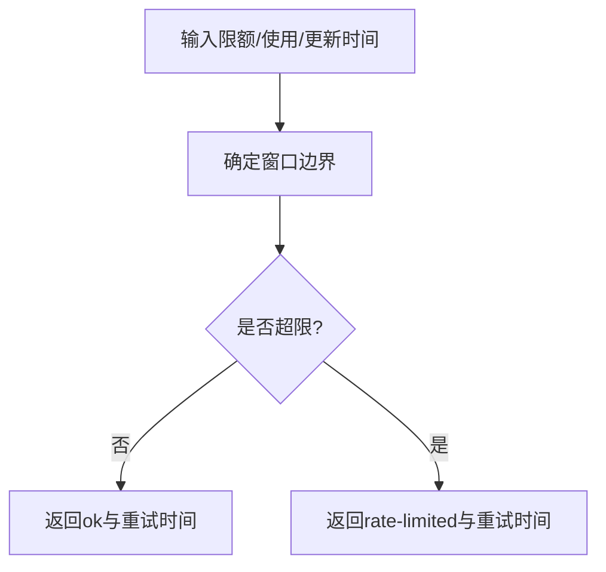
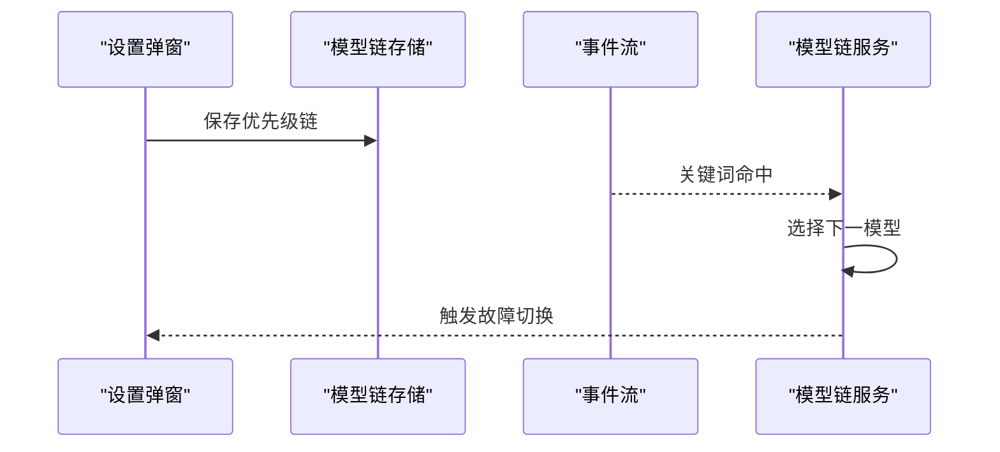
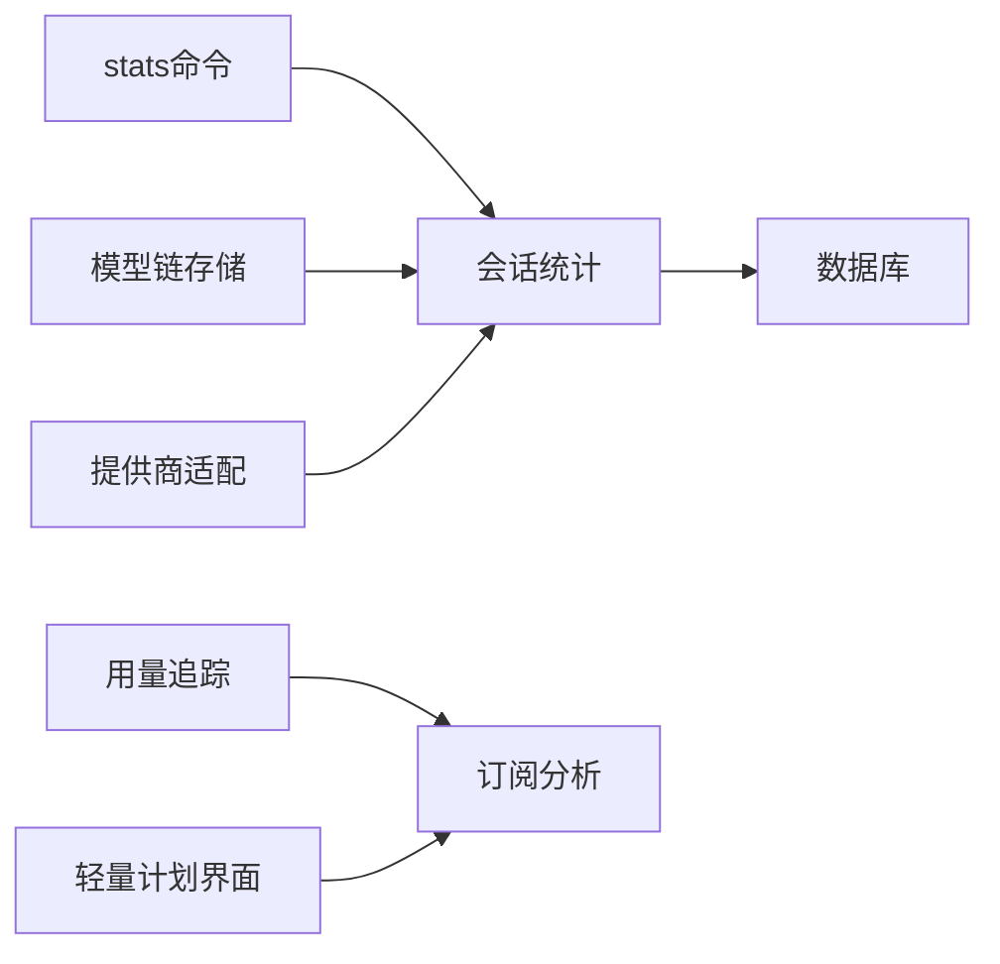

# 性能优化与成本控制

<cite>
**本文档引用的文件**
- [README.md](file://README.md)
- [stats.ts](file://packages/opencode/src/cli/cmd/stats.ts)
- [index.ts](file://packages/opencode/src/session/index.ts)
- [provider.ts](file://packages/opencode/src/provider/provider.ts)
- [db.ts](file://packages/opencode/src/storage/db.ts)
- [handler.ts](file://packages/console/app/src/routes/zen/util/handler.ts)
- [subscription.ts](file://packages/console/core/src/subscription.ts)
- [lite-section.tsx](file://packages/console/app/src/routes/workspace/[id]/go/lite-section.tsx)
- [compaction.test.ts](file://packages/opencode/test/session/compaction.test.ts)
- [embed-session-model-chain-design.md](file://memory-bank/embed-session-model-chain-design.md)
- [activeContext.md](file://memory-bank/activeContext.md)
- [store.go](file://packages/strategy-service/internal/modelchain/store.go)
</cite>

## 目录
1. [简介](#简介)
2. [项目结构](#项目结构)
3. [核心组件](#核心组件)
4. [架构总览](#架构总览)
5. [详细组件分析](#详细组件分析)
6. [依赖关系分析](#依赖关系分析)
7. [性能考量](#性能考量)
8. [故障排查指南](#故障排查指南)
9. [结论](#结论)
10. [附录](#附录)

## 简介
本指南面向OpenCode模型提供商的性能优化与成本控制，围绕以下主题展开：
- 模型选择策略与链式模型优先级
- 批量处理与并发控制
- 缓存机制与令牌统计
- API调用优化与连接池管理
- 成本分析工具、使用量统计与预算控制
- 性能基准测试、延迟优化与吞吐量提升
- 不同场景的最佳实践与配置建议

## 项目结构
OpenCode采用多包架构，核心与性能相关的模块主要分布在以下位置：
- 会话与令牌统计：packages/opencode/src/session
- 提供商与模型适配：packages/opencode/src/provider
- 统计命令与CLI：packages/opencode/src/cli/cmd/stats.ts
- 数据库与事务：packages/opencode/src/storage/db.ts
- 控制台与订阅限额：packages/console/core/src/subscription.ts、packages/console/app/src/routes/zen/util/handler.ts
- 模型链与故障切换：packages/strategy-service/internal/modelchain/store.go
- 设计文档与进度：memory-bank/embed-session-model-chain-design.md、memory-bank/activeContext.md

图表来源
- [stats.ts:1-411](file://packages/opencode/src/cli/cmd/stats.ts#L1-L411)
- [index.ts:800-894](file://packages/opencode/src/session/index.ts#L800-L894)
- [provider.ts:1-200](file://packages/opencode/src/provider/provider.ts#L1-L200)
- [db.ts:1-172](file://packages/opencode/src/storage/db.ts#L1-L172)
- [handler.ts:602-934](file://packages/console/app/src/routes/zen/util/handler.ts#L602-L934)
- [subscription.ts:79-155](file://packages/console/core/src/subscription.ts#L79-L155)
- [lite-section.tsx:27-63](file://packages/console/app/src/routes/workspace/[id]/go/lite-section.tsx#L27-L63)
- [store.go:1-57](file://packages/strategy-service/internal/modelchain/store.go#L1-L57)

章节来源
- [README.md:1-142](file://README.md#L1-L142)

## 核心组件
- 会话与令牌统计：负责计算输入/输出/推理/缓存读写令牌，以及基于模型定价的成本估算。
- 提供商与模型适配：统一管理多家模型提供商SDK，支持变体与自定义加载器。
- 统计命令：聚合会话数据，输出总成本、日均成本、平均会话令牌数、中位数等指标。
- 数据库与事务：SQLite WAL模式、事务封装、迁移与参数优化。
- 订阅限额与预算控制：按周/月/滚动窗口分析使用量，触发限流与重试时间提示。
- 模型链与故障切换：持久化模型优先级，事件驱动的故障转移。

章节来源
- [index.ts:800-894](file://packages/opencode/src/session/index.ts#L800-L894)
- [provider.ts:1-200](file://packages/opencode/src/provider/provider.ts#L1-L200)
- [stats.ts:1-411](file://packages/opencode/src/cli/cmd/stats.ts#L1-L411)
- [db.ts:1-172](file://packages/opencode/src/storage/db.ts#L1-L172)
- [subscription.ts:79-155](file://packages/console/core/src/subscription.ts#L79-L155)
- [handler.ts:602-934](file://packages/console/app/src/routes/zen/util/handler.ts#L602-L934)

## 架构总览
OpenCode在“会话—令牌—成本—限额”的闭环中实现性能与成本控制：
- 会话层收集消息与使用量，标准化令牌与成本
- 统计命令与控制台接口进行聚合与可视化
- 订阅模块按策略评估限额并反馈重试时间
- 模型链与故障切换保障稳定性与吞吐

图表来源
- [stats.ts:95-307](file://packages/opencode/src/cli/cmd/stats.ts#L95-L307)
- [index.ts:800-894](file://packages/opencode/src/session/index.ts#L800-L894)
- [subscription.ts:79-155](file://packages/console/core/src/subscription.ts#L79-L155)

## 详细组件分析

### 组件A：令牌与成本计算
- 功能要点
  - 标准化令牌：区分输入、输出、推理、缓存读写
  - 适配不同提供商的令牌报告差异（如Anthropic不包含缓存令牌）
  - 成本计算：按模型定价（输入/输出/缓存读写/推理）每百万分之一计费
  - 特殊定价：超过阈值时采用实验性定价
- 关键流程

图表来源
- [index.ts:800-894](file://packages/opencode/src/session/index.ts#L800-L894)

章节来源
- [index.ts:800-894](file://packages/opencode/src/session/index.ts#L800-L894)
- [compaction.test.ts:250-347](file://packages/opencode/test/session/compaction.test.ts#L250-L347)

### 组件B：统计命令与批量聚合
- 功能要点
  - 支持按天数、项目过滤
  - 分批处理大量会话，避免内存峰值
  - 聚合消息数量、令牌、成本、工具使用、模型使用
  - 输出概览、成本与令牌、模型使用、工具使用
- 关键流程

图表来源
- [stats.ts:95-307](file://packages/opencode/src/cli/cmd/stats.ts#L95-L307)

章节来源
- [stats.ts:1-411](file://packages/opencode/src/cli/cmd/stats.ts#L1-L411)

### 组件C：提供商与模型适配
- 功能要点
  - 内置多家模型提供商SDK
  - 自定义加载器与变体支持
  - SSE超时包装与流控制
- 关键流程

图表来源
- [provider.ts:50-107](file://packages/opencode/src/provider/provider.ts#L50-L107)

章节来源
- [provider.ts:1-200](file://packages/opencode/src/provider/provider.ts#L1-L200)

### 组件D：数据库与事务
- 功能要点
  - WAL模式、同步策略、busy_timeout、缓存大小、外键约束
  - 事务封装与上下文注入
  - 迁移与版本控制
- 关键流程

图表来源
- [db.ts:83-172](file://packages/opencode/src/storage/db.ts#L83-L172)

章节来源
- [db.ts:1-172](file://packages/opencode/src/storage/db.ts#L1-L172)

### 组件E：订阅限额与预算控制
- 功能要点
  - 周/月/滚动窗口限额分析
  - 使用百分比与重试时间计算
  - 控制台界面展示限额状态
- 关键流程

图表来源
- [subscription.ts:79-155](file://packages/console/core/src/subscription.ts#L79-L155)
- [lite-section.tsx:27-63](file://packages/console/app/src/routes/workspace/[id]/go/lite-section.tsx#L27-L63)

章节来源
- [subscription.ts:79-155](file://packages/console/core/src/subscription.ts#L79-L155)
- [lite-section.tsx:27-63](file://packages/console/app/src/routes/workspace/[id]/go/lite-section.tsx#L27-L63)

### 组件F：模型链与故障切换
- 功能要点
  - 持久化模型优先级链
  - 事件驱动的故障切换
  - 前后端双重防御截断
- 关键流程

图表来源
- [store.go:1-57](file://packages/strategy-service/internal/modelchain/store.go#L1-L57)
- [embed-session-model-chain-design.md:176-181](file://memory-bank/embed-session-model-chain-design.md#L176-L181)
- [activeContext.md:59-78](file://memory-bank/activeContext.md#L59-L78)

章节来源
- [store.go:1-57](file://packages/strategy-service/internal/modelchain/store.go#L1-L57)
- [embed-session-model-chain-design.md:176-181](file://memory-bank/embed-session-model-chain-design.md#L176-L181)
- [activeContext.md:59-78](file://memory-bank/activeContext.md#L59-L78)

## 依赖关系分析
- 会话统计依赖数据库读取与消息聚合
- 统计命令依赖会话统计与数据库
- 控制台订阅分析依赖限额配置与使用数据
- 模型链存储依赖本地数据库
- 提供商适配与会话统计相互独立但共同影响成本

图表来源
- [stats.ts:95-307](file://packages/opencode/src/cli/cmd/stats.ts#L95-L307)
- [index.ts:800-894](file://packages/opencode/src/session/index.ts#L800-L894)
- [db.ts:1-172](file://packages/opencode/src/storage/db.ts#L1-L172)
- [handler.ts:602-934](file://packages/console/app/src/routes/zen/util/handler.ts#L602-L934)
- [subscription.ts:79-155](file://packages/console/core/src/subscription.ts#L79-L155)
- [store.go:1-57](file://packages/strategy-service/internal/modelchain/store.go#L1-L57)
- [provider.ts:1-200](file://packages/opencode/src/provider/provider.ts#L1-L200)

章节来源
- [stats.ts:1-411](file://packages/opencode/src/cli/cmd/stats.ts#L1-L411)
- [index.ts:800-894](file://packages/opencode/src/session/index.ts#L800-L894)
- [db.ts:1-172](file://packages/opencode/src/storage/db.ts#L1-L172)
- [handler.ts:602-934](file://packages/console/app/src/routes/zen/util/handler.ts#L602-L934)
- [subscription.ts:79-155](file://packages/console/core/src/subscription.ts#L79-L155)
- [store.go:1-57](file://packages/strategy-service/internal/modelchain/store.go#L1-L57)
- [provider.ts:1-200](file://packages/opencode/src/provider/provider.ts#L1-L200)

## 性能考量
- 批量处理与并发
  - 统计命令采用分批聚合，避免单次处理过多会话导致内存峰值
  - 数据库使用WAL模式与合理的busy_timeout，提升并发读写稳定性
- 缓存与令牌
  - 标准化缓存读写令牌，避免重复计费与误判
  - 对不同提供商的令牌报告差异进行适配，确保成本计算准确
- API与连接
  - SSE流超时包装，防止长时间阻塞
  - 提供商SDK按需加载与变体支持，减少不必要的初始化开销
- 模型链与吞吐
  - 模型链持久化与事件驱动切换，降低失败重试成本
  - 前后端双重防御截断，避免无效链长度带来的性能损耗

## 故障排查指南
- 统计命令耗时过长
  - 检查会话数量与分批大小，必要时缩小时间范围或项目过滤
  - 确认数据库连接与WAL模式配置
- 成本计算异常
  - 核对模型定价与阈值实验定价开关
  - 检查提供商令牌报告差异（如Anthropic/Bedrock）
- 订阅限额频繁触发
  - 调整周/月/滚动窗口限额或使用周期
  - 结合重试时间提示，错峰调用
- 模型链切换失败
  - 检查模型链存储一致性与事件流监听
  - 确认前后端截断逻辑与优先级链有效性

章节来源
- [stats.ts:151-153](file://packages/opencode/src/cli/cmd/stats.ts#L151-L153)
- [db.ts:89-94](file://packages/opencode/src/storage/db.ts#L89-L94)
- [index.ts:816-836](file://packages/opencode/src/session/index.ts#L816-L836)
- [subscription.ts:79-155](file://packages/console/core/src/subscription.ts#L79-L155)
- [store.go:32-57](file://packages/strategy-service/internal/modelchain/store.go#L32-L57)

## 结论
通过标准化令牌与成本计算、分批聚合统计、数据库WAL优化、订阅限额分析与模型链故障切换，OpenCode在保证稳定性的同时实现了可观的性能与成本控制收益。建议在生产环境中结合实际负载与预算策略，持续优化模型链优先级、调整统计窗口与限额阈值，并利用CLI与控制台工具进行监控与预警。

## 附录
- 最佳实践
  - 使用模型链与故障切换提升吞吐与稳定性
  - 合理设置统计命令的时间范围与项目过滤，避免全量扫描
  - 开启WAL模式并调优busy_timeout与缓存大小
  - 基于中位数与日均成本制定预算与告警阈值
- 配置建议
  - 模型链优先级不超过上限，避免过度复杂化
  - 订阅限额按业务周期设定滚动窗口与重试时间
  - 对高成本模型启用阈值实验定价，降低大输入场景成本