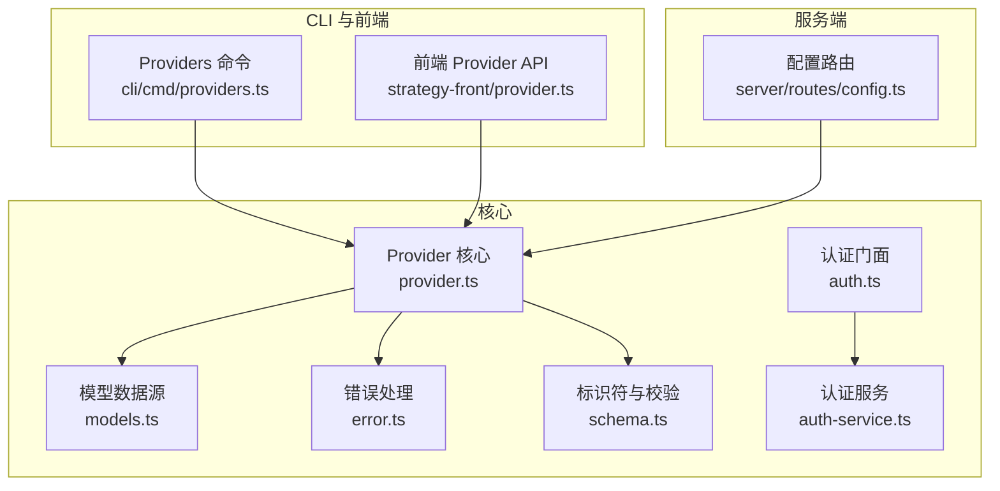
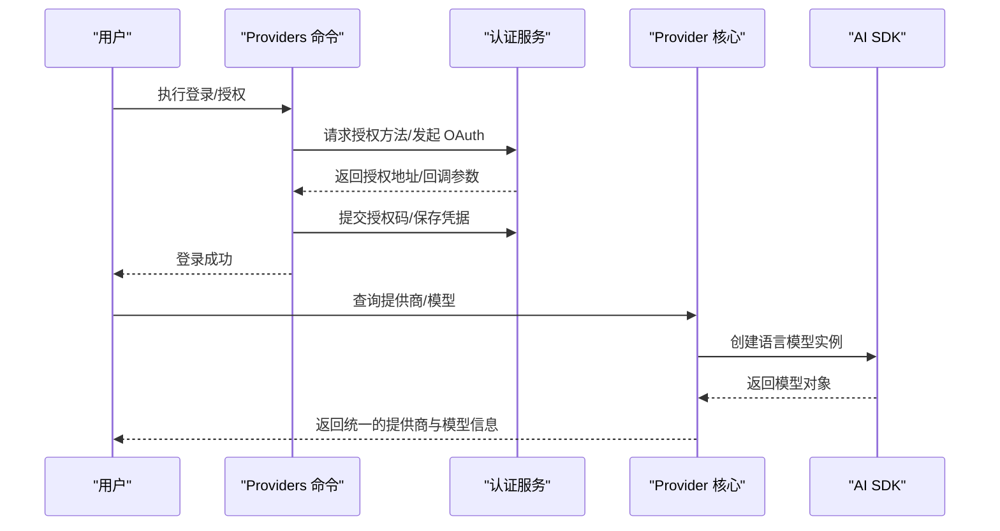
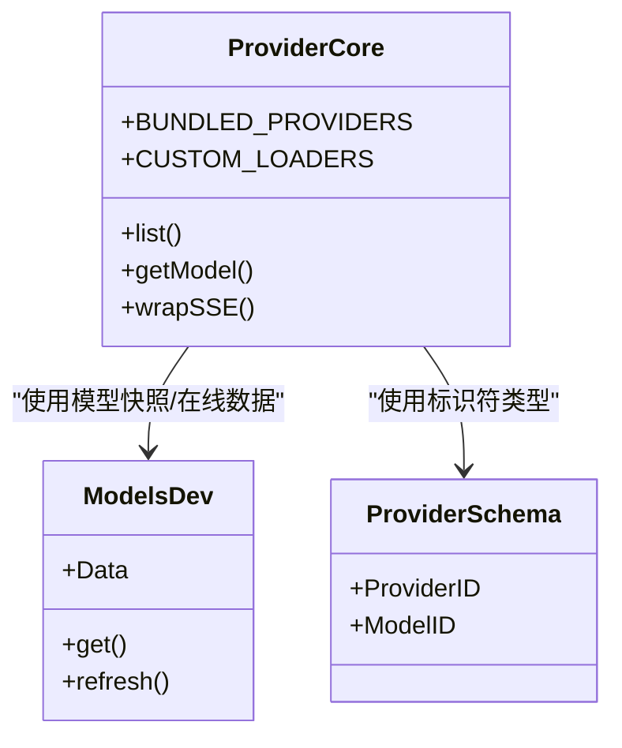
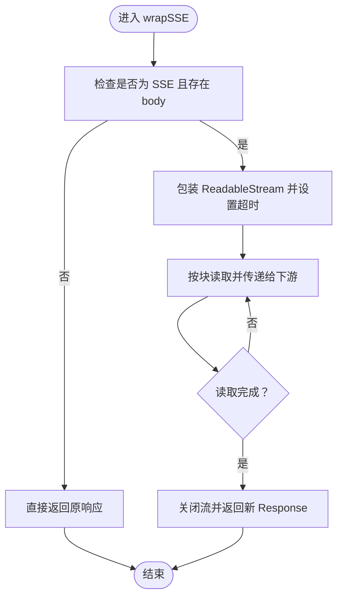
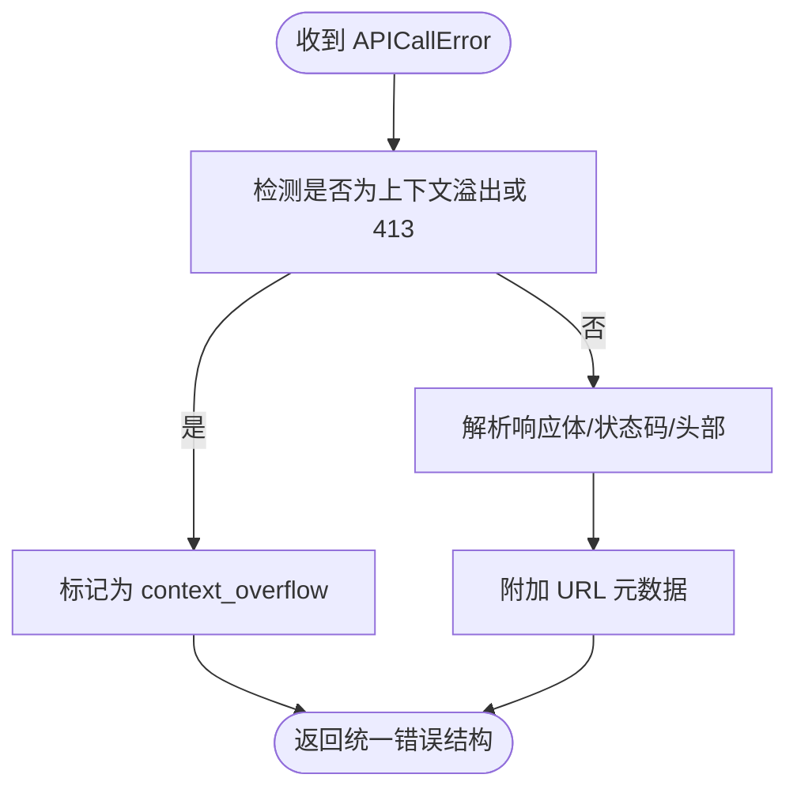
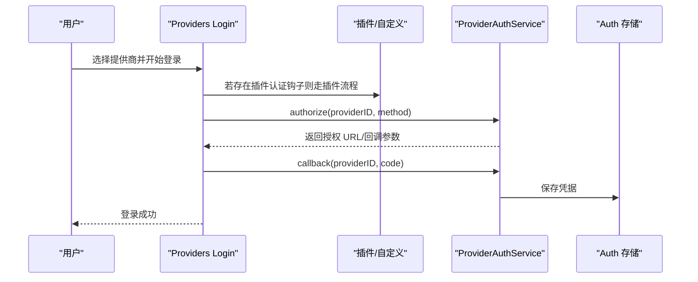
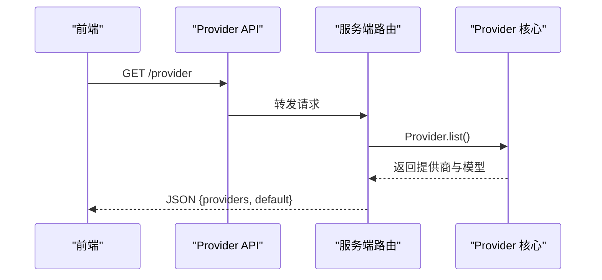
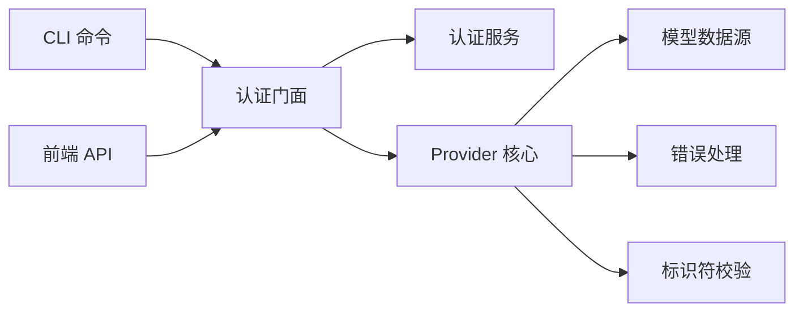

# 提供商集成指南

<cite>
**本文档引用的文件**
- [packages/opencode/src/provider/provider.ts](file://packages/opencode/src/provider/provider.ts)
- [packages/opencode/src/provider/models.ts](file://packages/opencode/src/provider/models.ts)
- [packages/opencode/src/provider/error.ts](file://packages/opencode/src/provider/error.ts)
- [packages/opencode/src/provider/schema.ts](file://packages/opencode/src/provider/schema.ts)
- [packages/opencode/src/provider/auth.ts](file://packages/opencode/src/provider/auth.ts)
- [packages/opencode/src/provider/auth-service.ts](file://packages/opencode/src/provider/auth-service.ts)
- [packages/opencode/src/cli/cmd/providers.ts](file://packages/opencode/src/cli/cmd/providers.ts)
- [packages/opencode/src/server/routes/config.ts](file://packages/opencode/src/server/routes/config.ts)
- [packages/strategy-front/src/api/modules/provider.ts](file://packages/strategy-front/src/api/modules/provider.ts)
- [packages/web/src/content/docs/providers.mdx](file://packages/web/src/content/docs/providers.mdx)
- [packages/opencode/test/provider/provider.test.ts](file://packages/opencode/test/provider/provider.test.ts)
</cite>

## 目录
1. [简介](#简介)
2. [项目结构](#项目结构)
3. [核心组件](#核心组件)
4. [架构总览](#架构总览)
5. [详细组件分析](#详细组件分析)
6. [依赖关系分析](#依赖关系分析)
7. [性能考虑](#性能考虑)
8. [故障排除指南](#故障排除指南)
9. [结论](#结论)
10. [附录](#附录)

## 简介
本指南面向希望在 OpenCode 中集成新的 AI 提供商（如 OpenAI、Anthropic、Google 等）的开发者。文档从抽象层设计、统一请求/响应格式与错误处理机制入手，系统讲解新提供商的接入流程（接口实现、配置模板、测试方法），并覆盖性能监控、速率限制与故障恢复策略，最后给出最佳实践与参考路径。

## 项目结构
OpenCode 的提供商集成主要分布在以下模块：
- 核心提供商逻辑：提供模型发现、提供商加载、认证与错误解析等能力
- CLI 与前端 API：提供登录、授权、配置列表等用户交互入口
- 配置与路由：暴露统一的配置查询与提供商信息接口
- 测试用例：验证配置合并、模型获取、上下文限制等行为

**图表来源**
- [packages/opencode/src/provider/provider.ts:1-120](file://packages/opencode/src/provider/provider.ts#L1-L120)
- [packages/opencode/src/provider/models.ts:1-133](file://packages/opencode/src/provider/models.ts#L1-L133)
- [packages/opencode/src/provider/error.ts:1-192](file://packages/opencode/src/provider/error.ts#L1-L192)
- [packages/opencode/src/provider/schema.ts:1-39](file://packages/opencode/src/provider/schema.ts#L1-L39)
- [packages/opencode/src/provider/auth.ts:1-57](file://packages/opencode/src/provider/auth.ts#L1-L57)
- [packages/opencode/src/provider/auth-service.ts:76-168](file://packages/opencode/src/provider/auth-service.ts#L76-L168)
- [packages/opencode/src/cli/cmd/providers.ts:195-476](file://packages/opencode/src/cli/cmd/providers.ts#L195-L476)
- [packages/strategy-front/src/api/modules/provider.ts:1-43](file://packages/strategy-front/src/api/modules/provider.ts#L1-L43)
- [packages/opencode/src/server/routes/config.ts:43-92](file://packages/opencode/src/server/routes/config.ts#L43-L92)

**章节来源**
- [packages/opencode/src/provider/provider.ts:1-120](file://packages/opencode/src/provider/provider.ts#L1-L120)
- [packages/opencode/src/cli/cmd/providers.ts:195-476](file://packages/opencode/src/cli/cmd/providers.ts#L195-L476)
- [packages/strategy-front/src/api/modules/provider.ts:1-43](file://packages/strategy-front/src/api/modules/provider.ts#L1-L43)
- [packages/opencode/src/server/routes/config.ts:43-92](file://packages/opencode/src/server/routes/config.ts#L43-L92)

## 核心组件
- 抽象层与模型发现
  - 提供商注册表与自定义加载器：通过内置映射与自定义加载器实现对多 SDK 的统一接入
  - 模型数据源：支持本地快照、构建时内嵌快照与在线拉取
- 统一请求/响应格式
  - 使用 AI SDK 规范化模型调用；对 SSE 超时进行包装与中断控制
- 错误处理机制
  - 上下文溢出检测、通用错误解析、流式错误解析
- 认证与授权
  - CLI 登录流程、OAuth 授权回调、API Key 存储
- 配置与路由
  - 提供商列表与默认模型查询、配置更新

**章节来源**
- [packages/opencode/src/provider/provider.ts:109-132](file://packages/opencode/src/provider/provider.ts#L109-L132)
- [packages/opencode/src/provider/models.ts:84-133](file://packages/opencode/src/provider/models.ts#L84-L133)
- [packages/opencode/src/provider/error.ts:6-192](file://packages/opencode/src/provider/error.ts#L6-L192)
- [packages/opencode/src/provider/auth.ts:17-57](file://packages/opencode/src/provider/auth.ts#L17-L57)
- [packages/opencode/src/server/routes/config.ts:62-92](file://packages/opencode/src/server/routes/config.ts#L62-L92)

## 架构总览
OpenCode 通过“提供商抽象层 + 模型数据源 + 认证门面 + CLI/前端接入”的分层设计，实现对多家 AI 提供商的一致接入与管理。

**图表来源**
- [packages/opencode/src/cli/cmd/providers.ts:250-476](file://packages/opencode/src/cli/cmd/providers.ts#L250-L476)
- [packages/opencode/src/provider/auth-service.ts:99-168](file://packages/opencode/src/provider/auth-service.ts#L99-L168)
- [packages/opencode/src/provider/provider.ts:147-210](file://packages/opencode/src/provider/provider.ts#L147-L210)

## 详细组件分析

### 抽象层设计与提供商注册
- 内置提供商映射：将提供商 ID 映射到对应的 SDK 创建函数，支持多种官方与兼容 SDK
- 自定义加载器：针对特定提供商（如 Anthropic、OpenAI、Azure、Amazon Bedrock 等）提供选项、变量注入与模型选择逻辑
- 模型 ID 规范化：通过品牌类型与 Zod 校验确保 ProviderID/ModelID 的一致性

**图表来源**
- [packages/opencode/src/provider/provider.ts:109-210](file://packages/opencode/src/provider/provider.ts#L109-L210)
- [packages/opencode/src/provider/models.ts:84-133](file://packages/opencode/src/provider/models.ts#L84-L133)
- [packages/opencode/src/provider/schema.ts:6-39](file://packages/opencode/src/provider/schema.ts#L6-L39)

**章节来源**
- [packages/opencode/src/provider/provider.ts:109-210](file://packages/opencode/src/provider/provider.ts#L109-L210)
- [packages/opencode/src/provider/schema.ts:6-39](file://packages/opencode/src/provider/schema.ts#L6-L39)

### 统一请求/响应格式与 SSE 超时处理
- 对 SSE 流进行超时包装，避免长时间无数据导致的阻塞
- 将读取超时转换为可取消的中断，便于上层重试或降级

**图表来源**
- [packages/opencode/src/provider/provider.ts:61-107](file://packages/opencode/src/provider/provider.ts#L61-L107)

**章节来源**
- [packages/opencode/src/provider/provider.ts:61-107](file://packages/opencode/src/provider/provider.ts#L61-L107)

### 错误处理机制
- 上下文溢出识别：基于正则与状态码判断输入超出模型上下文窗口
- 通用错误解析：优先提取响应体中的 message/error 字段，HTML 错误页提供友好提示
- 流式错误解析：针对流式错误类型（如 context_length_exceeded、insufficient_quota）进行分类与降级

**图表来源**
- [packages/opencode/src/provider/error.ts:168-190](file://packages/opencode/src/provider/error.ts#L168-L190)

**章节来源**
- [packages/opencode/src/provider/error.ts:6-192](file://packages/opencode/src/provider/error.ts#L6-L192)

### 认证与授权流程
- CLI 登录：支持插件提供商与自定义提供商，自动选择登录方式（OAuth 或 API Key）
- OAuth 授权：生成授权链接、等待回调、保存刷新令牌或访问令牌
- 认证门面：对外暴露 methods/authorize/callback/api 等方法，屏蔽底层实现细节

**图表来源**
- [packages/opencode/src/cli/cmd/providers.ts:19-166](file://packages/opencode/src/cli/cmd/providers.ts#L19-L166)
- [packages/opencode/src/provider/auth-service.ts:99-168](file://packages/opencode/src/provider/auth-service.ts#L99-L168)
- [packages/opencode/src/provider/auth.ts:28-51](file://packages/opencode/src/provider/auth.ts#L28-L51)

**章节来源**
- [packages/opencode/src/cli/cmd/providers.ts:250-476](file://packages/opencode/src/cli/cmd/providers.ts#L250-L476)
- [packages/opencode/src/provider/auth.ts:17-57](file://packages/opencode/src/provider/auth.ts#L17-L57)
- [packages/opencode/src/provider/auth-service.ts:76-168](file://packages/opencode/src/provider/auth-service.ts#L76-L168)

### 配置与路由
- 列出配置提供商与默认模型：统一返回提供商信息与默认模型 ID
- 前端 API：提供列表、认证、发现、设置与移除等操作
- CLI 与前端协同：通过统一的 Provider API 完成配置同步与状态展示

**图表来源**
- [packages/strategy-front/src/api/modules/provider.ts:5-43](file://packages/strategy-front/src/api/modules/provider.ts#L5-L43)
- [packages/opencode/src/server/routes/config.ts:62-92](file://packages/opencode/src/server/routes/config.ts#L62-L92)

**章节来源**
- [packages/strategy-front/src/api/modules/provider.ts:1-43](file://packages/strategy-front/src/api/modules/provider.ts#L1-L43)
- [packages/opencode/src/server/routes/config.ts:43-92](file://packages/opencode/src/server/routes/config.ts#L43-L92)

## 依赖关系分析
- Provider 核心依赖模型数据源（models.dev 快照/在线）、环境变量、认证存储与配置
- CLI 与前端 API 作为入口，最终调用 Provider 核心与认证服务
- 错误处理独立于具体提供商，通过统一接口向上抛出

**图表来源**
- [packages/opencode/src/cli/cmd/providers.ts:195-476](file://packages/opencode/src/cli/cmd/providers.ts#L195-L476)
- [packages/strategy-front/src/api/modules/provider.ts:1-43](file://packages/strategy-front/src/api/modules/provider.ts#L1-L43)
- [packages/opencode/src/provider/provider.ts:1-120](file://packages/opencode/src/provider/provider.ts#L1-L120)

**章节来源**
- [packages/opencode/src/provider/provider.ts:1-120](file://packages/opencode/src/provider/provider.ts#L1-L120)

## 性能考虑
- 模型数据缓存与定时刷新：本地快照优先，构建时内嵌快照作为回退，定期从远端拉取
- SSE 超时控制：避免长时间无数据导致的资源占用
- 配置合并与深拷贝：减少重复初始化开销，提升启动速度
- 速率限制与使用分析：结合订阅与 IP 限流策略，保障服务稳定性

**章节来源**
- [packages/opencode/src/provider/models.ts:84-133](file://packages/opencode/src/provider/models.ts#L84-L133)
- [packages/opencode/src/provider/provider.ts:61-107](file://packages/opencode/src/provider/provider.ts#L61-L107)
- [packages/console/core/src/subscription.ts:44-155](file://packages/console/core/src/subscription.ts#L44-L155)

## 故障排除指南
- 上下文溢出：当输入超过模型上下文窗口时，系统会识别并返回统一错误类型，建议缩短输入或切换更长上下文的模型
- 代理/网关错误：遇到 401/403 等网关拦截时，检查认证令牌有效性与权限设置
- 配置问题：确认 opencode.json 中的提供商 ID、npm 包、baseURL、API Key 等配置项正确
- CLI 登录失败：检查插件认证方法、授权回调与凭据存储状态

**章节来源**
- [packages/opencode/src/provider/error.ts:168-190](file://packages/opencode/src/provider/error.ts#L168-L190)
- [packages/web/src/content/docs/providers.mdx:1830-1892](file://packages/web/src/content/docs/providers.mdx#L1830-L1892)

## 结论
通过抽象层设计与统一的错误处理机制，OpenCode 能够以最小成本集成新的 AI 提供商，并为用户提供一致的配置与使用体验。遵循本文档的最佳实践，开发者可以快速完成提供商的接入、测试与运维。

## 附录

### 新提供商集成流程
- 实现自定义加载器：在自定义加载器中定义提供商选项、变量注入与模型选择逻辑
- 配置模板：在 opencode.json 中声明 npm 包、名称、baseURL、API Key 与模型清单
- 测试方法：编写单元测试验证配置合并、模型获取与上下文限制行为
- 文档与示例：参考现有提供商的配置与注释，补充必要的使用说明

**章节来源**
- [packages/opencode/src/provider/provider.ts:147-210](file://packages/opencode/src/provider/provider.ts#L147-L210)
- [packages/web/src/content/docs/providers.mdx:1830-1892](file://packages/web/src/content/docs/providers.mdx#L1830-L1892)
- [packages/opencode/test/provider/provider.test.ts:260-306](file://packages/opencode/test/provider/provider.test.ts#L260-L306)