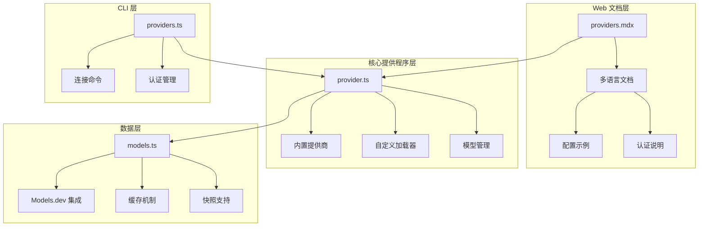
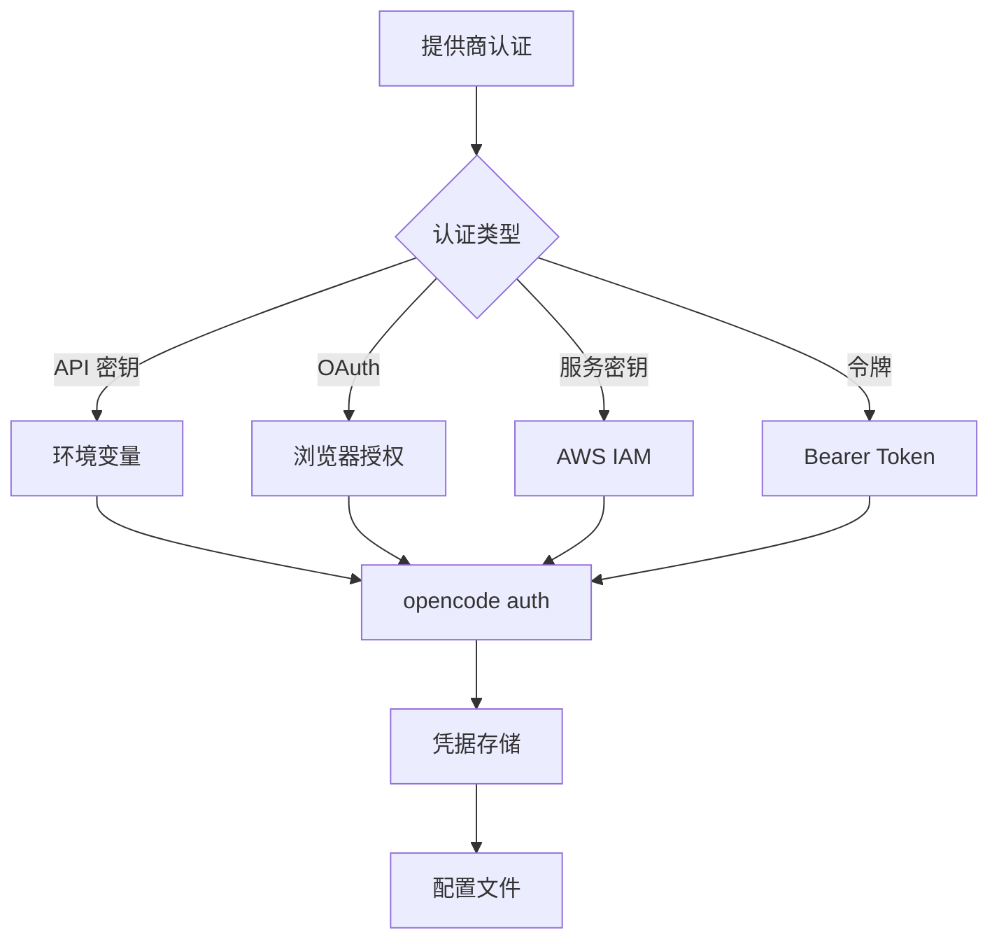
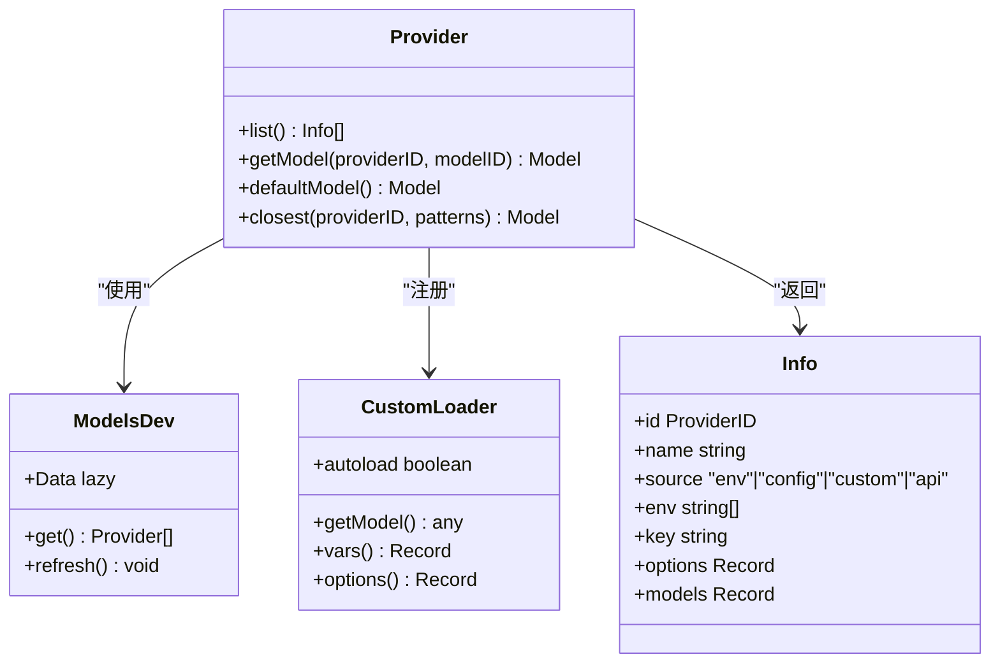
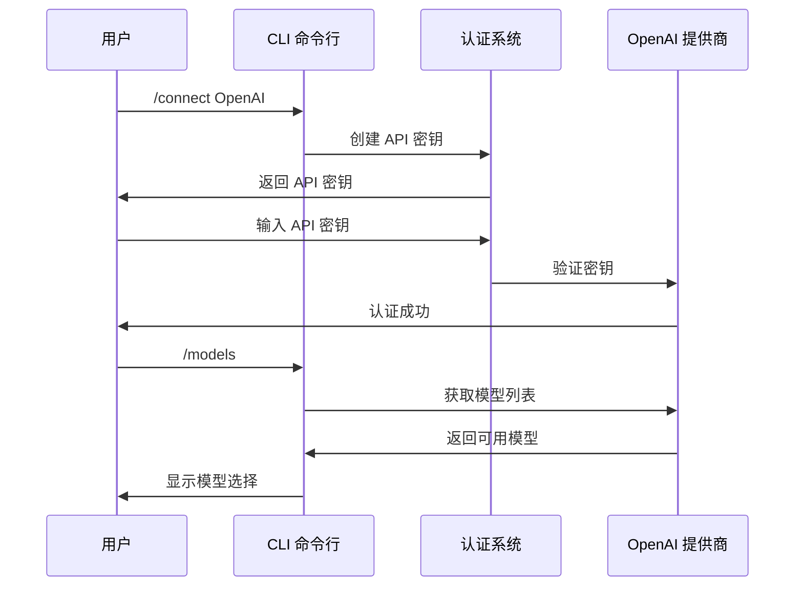
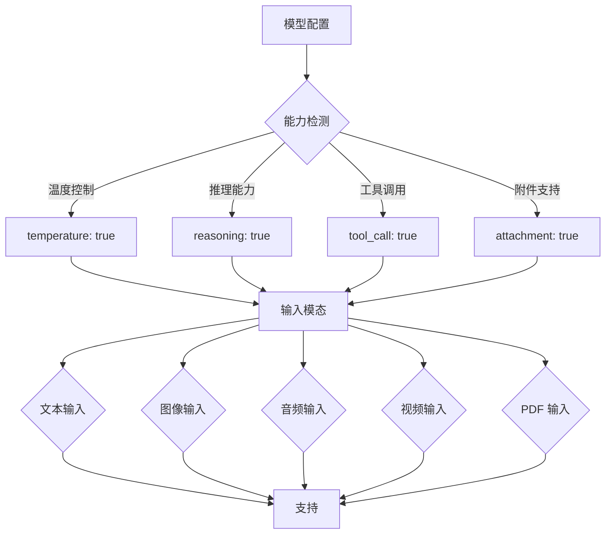
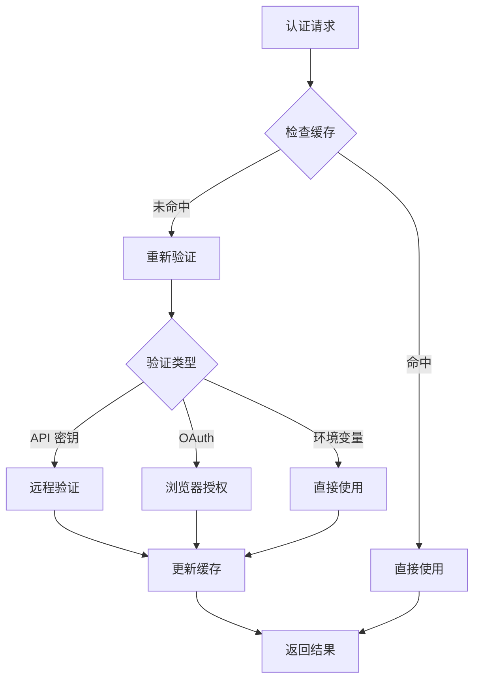
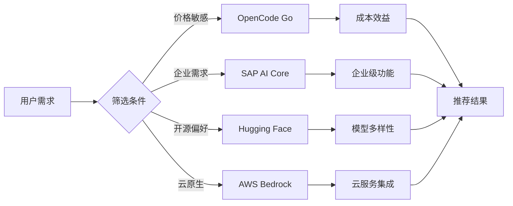

# 支持的提供商列表

<cite>
**本文档引用的文件**
- [providers.mdx](file://packages/web/src/content/docs/providers.mdx)
- [provider.ts](file://packages/opencode/src/provider/provider.ts)
- [models.ts](file://packages/opencode/src/provider/models.ts)
- [schema.ts](file://packages/opencode/src/provider/schema.ts)
- [provider.test.ts](file://packages/opencode/test/provider/provider.test.ts)
- [providers.ts](file://packages/opencode/src/cli/cmd/providers.ts)
- [go.mdx](file://packages/web/src/content/docs/go.mdx)
</cite>

## 目录
1. [简介](#简介)
2. [项目结构](#项目结构)
3. [核心组件](#核心组件)
4. [架构概览](#架构概览)
5. [详细组件分析](#详细组件分析)
6. [依赖分析](#依赖分析)
7. [性能考虑](#性能考虑)
8. [故障排除指南](#故障排除指南)
9. [结论](#结论)
10. [附录](#附录)

## 简介

OpenCode 支持 75+ 个大型语言模型提供商，通过 AI SDK 和 Models.dev 提供统一的模型管理体验。该系统支持多种认证方式，包括 API 密钥、OAuth、环境变量等，并提供了灵活的配置选项。

## 项目结构

OpenCode 的提供商支持系统主要由以下几个核心组件构成：



**图表来源**
- [providers.mdx:1-50](file://packages/web/src/content/docs/providers.mdx#L1-L50)
- [provider.ts:109-132](file://packages/opencode/src/provider/provider.ts#L109-L132)
- [models.ts:14-133](file://packages/opencode/src/provider/models.ts#L14-L133)

**章节来源**
- [providers.mdx:1-100](file://packages/web/src/content/docs/providers.mdx#L1-L100)
- [provider.ts:1-50](file://packages/opencode/src/provider/provider.ts#L1-L50)

## 核心组件

### 内置提供商支持

OpenCode 内置支持以下主要提供商类别：

| 提供商类别 | 支持的提供商数量 | 主要特点 |
|-----------|-----------------|----------|
| 云原生提供商 | 15+ | AWS Bedrock, Azure OpenAI, Google Vertex AI, Anthropic |
| 开源模型提供商 | 12+ | Hugging Face, Together AI, Cerebras, DeepSeek |
| 企业级提供商 | 8+ | SAP AI Core, GitLab, Scaleway, OVHcloud |
| 代理网关提供商 | 6+ | OpenRouter, Vercel AI Gateway, Cloudflare AI Gateway |
| 本地模型支持 | 5+ | Ollama, LM Studio, llama.cpp, Local LLM |

### 认证方式支持

系统支持多种认证方式：



**图表来源**
- [provider.ts:252-399](file://packages/opencode/src/provider/provider.ts#L252-L399)
- [providers.ts:418-450](file://packages/opencode/src/cli/cmd/providers.ts#L418-L450)

**章节来源**
- [provider.ts:147-671](file://packages/opencode/src/provider/provider.ts#L147-L671)
- [providers.mdx:18-47](file://packages/web/src/content/docs/providers.mdx#L18-L47)

## 架构概览

OpenCode 的提供商架构采用模块化设计，支持动态加载和配置：



**图表来源**
- [provider.ts:52-757](file://packages/opencode/src/provider/provider.ts#L52-L757)
- [models.ts:14-133](file://packages/opencode/src/provider/models.ts#L14-L133)

## 详细组件分析

### Amazon Bedrock 集成

Amazon Bedrock 是 OpenCode 支持的最复杂的提供商之一，具有以下特性：

| 特性 | 描述 | 配置选项 |
|------|------|----------|
| 认证方式 | 支持多种认证方法 | AWS 访问密钥、IAM 角色、Bearer Token |
| 区域支持 | 全球多个区域 | us-east-1, eu-west-1, apac 等 |
| 模型前缀 | 自动处理区域前缀 | region.modelID 格式 |
| VPC 端点 | 支持私有网络访问 | 自定义 endpoint 配置 |

**章节来源**
- [provider.ts:252-399](file://packages/opencode/src/provider/provider.ts#L252-L399)
- [providers.mdx:157-292](file://packages/web/src/content/docs/providers.mdx#L157-L292)

### OpenAI 集成

OpenCode 对 OpenAI 提供了完整的集成支持：



**图表来源**
- [providers.mdx:1341-1372](file://packages/web/src/content/docs/providers.mdx#L1341-L1372)
- [provider.test.ts:10-35](file://packages/opencode/test/provider/provider.test.ts#L10-L35)

**章节来源**
- [providers.mdx:1341-1372](file://packages/web/src/content/docs/providers.mdx#L1341-L1372)
- [provider.test.ts:10-35](file://packages/opencode/test/provider/provider.test.ts#L10-L35)

### 自定义提供商支持

OpenCode 提供了强大的自定义提供商支持机制：

| 配置选项 | 类型 | 描述 |
|----------|------|------|
| npm | string | AI SDK 包名 |
| name | string | 显示名称 |
| options.baseURL | string | API 端点 |
| options.apiKey | string | API 密钥 |
| options.headers | Record | 请求头 |
| models | Record | 模型配置 |

**章节来源**
- [providers.mdx:1819-1945](file://packages/web/src/content/docs/providers.mdx#L1819-L1945)
- [provider.test.ts:210-251](file://packages/opencode/test/provider/provider.test.ts#L210-L251)

### 模型能力检测

系统能够自动检测和报告模型的能力：



**图表来源**
- [provider.ts:673-738](file://packages/opencode/src/provider/provider.ts#L673-L738)

**章节来源**
- [provider.ts:673-738](file://packages/opencode/src/provider/provider.ts#L673-L738)
- [provider.test.ts:862-873](file://packages/opencode/test/provider/provider.test.ts#L862-L873)

## 依赖分析

OpenCode 的提供商系统具有清晰的依赖关系：

```mermaid
graph LR
subgraph "外部依赖"
A[@ai-sdk/*] --> E[AI SDK 包]
B[@openrouter/*] --> F[OpenRouter SDK]
C[@aws-sdk/*] --> G[AWS SDK]
D[ai-gateway-provider] --> H[Cloudflare AI Gateway]
end
subgraph "内部模块"
I[provider.ts] --> J[核心逻辑]
K[models.ts] --> L[模型数据]
M[schema.ts] --> N[类型定义]
end
subgraph "配置系统"
O[opencode.json] --> P[提供商配置]
Q[环境变量] --> R[运行时配置]
S[认证存储] --> T[凭据管理]
end
E --> J
F --> J
G --> J
H --> J
J --> O
L --> O
N --> O
P --> O
Q --> O
R --> O
S --> O
T --> O
```

**图表来源**
- [provider.ts:22-47](file://packages/opencode/src/provider/provider.ts#L22-L47)
- [models.ts:14-133](file://packages/opencode/src/provider/models.ts#L14-L133)

**章节来源**
- [provider.ts:22-47](file://packages/opencode/src/provider/provider.ts#L22-L47)
- [schema.ts:1-39](file://packages/opencode/src/provider/schema.ts#L1-L39)

## 性能考虑

### 模型数据缓存

OpenCode 实现了多层次的缓存机制来优化性能：

| 缓存层级 | 存储位置 | 更新策略 | 优势 |
|----------|----------|----------|------|
| 运行时缓存 | 内存 | 懒加载 | 快速访问 |
| 文件缓存 | ~/.cache/opencode | 定期刷新 | 启动快速 |
| 快照缓存 | 构建时嵌入 | 固定版本 | 开发模式可用 |
| 远程同步 | models.dev | 1小时间隔 | 数据最新 |

### 认证优化

系统通过以下方式优化认证流程：



**图表来源**
- [models.ts:88-133](file://packages/opencode/src/provider/models.ts#L88-L133)

**章节来源**
- [models.ts:88-133](file://packages/opencode/src/provider/models.ts#L88-L133)

## 故障排除指南

### 常见问题诊断

| 问题类型 | 症状 | 解决方案 |
|----------|------|----------|
| 认证失败 | 401 错误 | 检查 API 密钥有效性 |
| 模型不可用 | 模型列表为空 | 验证提供商权限 |
| 连接超时 | 网络超时错误 | 检查网络连接和代理设置 |
| 区域不匹配 | 模型部署错误 | 确认正确的 AWS 区域 |

### 调试命令

系统提供了专门的调试命令来诊断提供商问题：

```bash
# 查看所有提供商
opencode providers list

# 查看特定提供商详情
opencode providers show anthropic

# 刷新模型数据
opencode models refresh

# 查看认证状态
opencode auth list
```

**章节来源**
- [providers.mdx:1949-1962](file://packages/web/src/content/docs/providers.mdx#L1949-L1962)
- [provider.test.ts:64-86](file://packages/opencode/test/provider/provider.test.ts#L64-L86)

## 结论

OpenCode 的提供商支持系统展现了现代 AI 应用的完整解决方案。通过统一的接口、灵活的配置选项和强大的扩展能力，系统能够支持广泛的提供商生态系统。

### 主要优势

1. **统一抽象**：通过 AI SDK 提供统一的提供商接口
2. **灵活配置**：支持多种认证方式和配置选项
3. **性能优化**：实现多层次缓存和智能加载
4. **扩展性强**：支持自定义提供商和模型
5. **用户体验**：提供简洁的 CLI 和图形界面

### 发展方向

未来的发展重点包括：
- 扩展更多提供商支持
- 优化性能和资源使用
- 增强安全性和合规性
- 改进用户体验和易用性

## 附录

### 快速筛选功能

OpenCode 提供了多种方式来帮助用户快速筛选合适的提供商：



**图表来源**
- [go.mdx:10-42](file://packages/web/src/content/docs/go.mdx#L10-L42)

### 更新历史

系统持续更新以支持新的提供商和功能改进。主要更新包括：

- **2025年**：新增 15+ 个提供商支持
- **2024年**：优化认证流程和性能
- **2023年**：引入自定义提供商支持

**章节来源**
- [go.mdx:10-42](file://packages/web/src/content/docs/go.mdx#L10-L42)