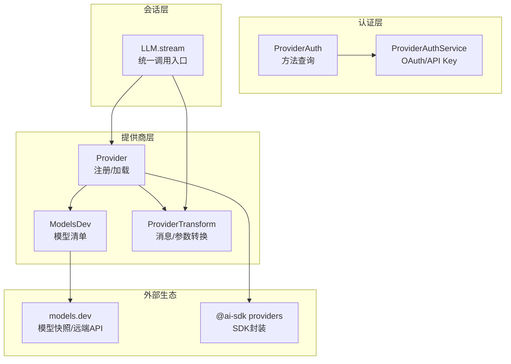
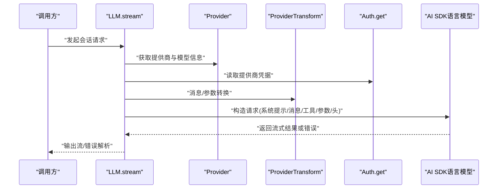
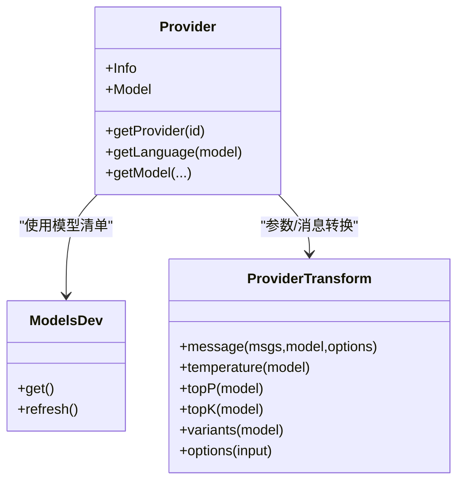
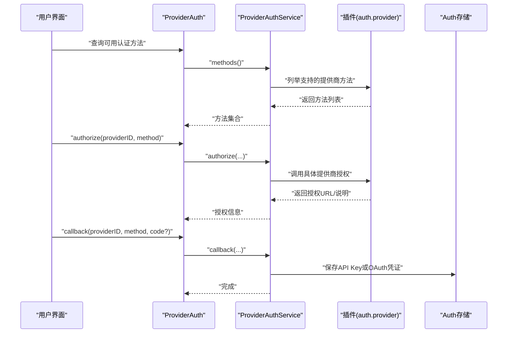
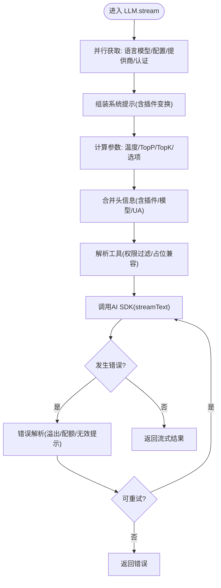
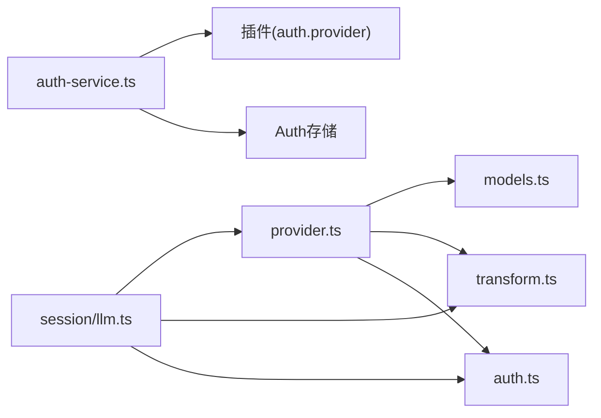

# 模型提供商集成

<cite>
**本文引用的文件**
- [packages/opencode/src/provider/provider.ts](file://packages/opencode/src/provider/provider.ts)
- [packages/opencode/src/provider/models.ts](file://packages/opencode/src/provider/models.ts)
- [packages/opencode/src/provider/auth.ts](file://packages/opencode/src/provider/auth.ts)
- [packages/opencode/src/provider/auth-service.ts](file://packages/opencode/src/provider/auth-service.ts)
- [packages/opencode/src/provider/error.ts](file://packages/opencode/src/provider/error.ts)
- [packages/opencode/src/provider/transform.ts](file://packages/opencode/src/provider/transform.ts)
- [packages/opencode/src/session/llm.ts](file://packages/opencode/src/session/llm.ts)
- [packages/opencode/src/provider/schema.ts](file://packages/opencode/src/provider/schema.ts)
- [packages/web/src/content/docs/zh-cn/providers.mdx](file://packages/web/src/content/docs/zh-cn/providers.mdx)
- [packages/opencode/test/session/llm.test.ts](file://packages/opencode/test/session/llm.test.ts)
- [packages/opencode/test/provider/provider.test.ts](file://packages/opencode/test/provider/provider.test.ts)
</cite>

## 目录
1. [简介](#简介)
2. [项目结构](#项目结构)
3. [核心组件](#核心组件)
4. [架构总览](#架构总览)
5. [详细组件分析](#详细组件分析)
6. [依赖关系分析](#依赖关系分析)
7. [性能考量](#性能考量)
8. [故障排查指南](#故障排查指南)
9. [结论](#结论)
10. [附录](#附录)

## 简介
本技术文档面向OpenCode的“模型提供商集成”能力，系统阐述如何接入并统一管理75+ LLM提供商（如Anthropic、OpenAI、Google、Azure、Bedrock、OpenRouter、GitHub Copilot等），覆盖认证流程、API密钥与凭据管理、安全存储、模型参数与能力映射、会话调用链路、错误解析与重试策略、以及新提供商的集成与兼容性测试方法。文档同时提供配置示例路径、最佳实践与成本优化建议，帮助开发者在多提供商环境下实现稳定、可控且高性能的推理服务。

## 项目结构
OpenCode将“提供商集成”拆分为以下关键模块：
- 提供商注册与加载：定义内置提供商清单、按需加载自定义提供商、动态注入SDK选项与环境变量
- 模型元数据与能力：从models.dev拉取/缓存模型清单，映射输入/输出模态、上下文窗口、计费与变体
- 认证与授权：统一OAuth与API Key两种方式，安全存储与回写
- 会话与调用：标准化消息转换、参数适配、工具调用、头信息注入与遥测
- 错误解析与重试：针对溢出、配额、无效提示等进行分类与提示

图表来源
- [packages/opencode/src/provider/provider.ts:109-132](file://packages/opencode/src/provider/provider.ts#L109-L132)
- [packages/opencode/src/provider/models.ts:84-121](file://packages/opencode/src/provider/models.ts#L84-L121)
- [packages/opencode/src/provider/transform.ts:20-45](file://packages/opencode/src/provider/transform.ts#L20-L45)
- [packages/opencode/src/provider/auth.ts:17-56](file://packages/opencode/src/provider/auth.ts#L17-L56)
- [packages/opencode/src/provider/auth-service.ts:55-168](file://packages/opencode/src/provider/auth-service.ts#L55-L168)
- [packages/opencode/src/session/llm.ts:46-256](file://packages/opencode/src/session/llm.ts#L46-L256)

章节来源
- [packages/opencode/src/provider/provider.ts:109-132](file://packages/opencode/src/provider/provider.ts#L109-L132)
- [packages/opencode/src/provider/models.ts:84-121](file://packages/opencode/src/provider/models.ts#L84-L121)
- [packages/opencode/src/provider/transform.ts:20-45](file://packages/opencode/src/provider/transform.ts#L20-L45)
- [packages/opencode/src/provider/auth.ts:17-56](file://packages/opencode/src/provider/auth.ts#L17-L56)
- [packages/opencode/src/provider/auth-service.ts:55-168](file://packages/opencode/src/provider/auth-service.ts#L55-L168)
- [packages/opencode/src/session/llm.ts:46-256](file://packages/opencode/src/session/llm.ts#L46-L256)

## 核心组件
- 提供商注册与加载
  - 内置提供商映射：集中声明对@ai-sdk系列提供商的创建函数，便于按需加载
  - 自定义加载器：针对特定提供商（如Anthropic、OpenAI、GitHub Copilot、Azure、Bedrock、OpenRouter、Vercel、Google Vertex、SAP AI Core、ZenMux、GitLab、Cloudflare Workers AI/AI Gateway、Cerebras、Kilo等）注入SDK选项、环境变量、模型选择逻辑与头部信息
  - 动态模型解析：根据模型能力与提供商差异，决定是否启用响应式或聊天接口、是否需要特殊头部或参数
- 模型元数据与能力
  - 模型清单来源：优先读取本地缓存/构建快照，其次访问models.dev远端API；定时刷新
  - 能力字段：温度、推理、附件、工具调用、输入/输出模态、交错内容（如reasoning）、上下文/输出限制、计费与实验性超大上下文计费、状态与变体
- 认证与授权
  - 方法枚举：OAuth与API Key两类
  - 授权流程：启动授权、回调交换凭证、保存到安全存储；API Key直接设置
  - 插件扩展：通过插件暴露的auth.provider钩子参与授权
- 会话与调用
  - 统一入口：LLM.stream负责拼装系统提示、消息、工具、参数与头信息，调用AI SDK
  - 参数适配：温度、TopP、TopK、最大输出、工具选择、重试次数、遥测开关
  - 中间件：消息规范化、缓存控制、工具调用ID规整、交错内容透传
- 错误解析与重试
  - 上下文溢出检测：正则匹配与状态码兜底
  - 错误分类：上下文溢出、API错误（含配额、无效提示等）
  - 可重试判定：OpenAI特定规则与通用重试标记

章节来源
- [packages/opencode/src/provider/provider.ts:109-132](file://packages/opencode/src/provider/provider.ts#L109-L132)
- [packages/opencode/src/provider/provider.ts:147-671](file://packages/opencode/src/provider/provider.ts#L147-L671)
- [packages/opencode/src/provider/models.ts:14-121](file://packages/opencode/src/provider/models.ts#L14-L121)
- [packages/opencode/src/provider/auth.ts:17-56](file://packages/opencode/src/provider/auth.ts#L17-L56)
- [packages/opencode/src/provider/auth-service.ts:55-168](file://packages/opencode/src/provider/auth-service.ts#L55-L168)
- [packages/opencode/src/session/llm.ts:46-256](file://packages/opencode/src/session/llm.ts#L46-L256)
- [packages/opencode/src/provider/error.ts:6-191](file://packages/opencode/src/provider/error.ts#L6-L191)
- [packages/opencode/src/provider/transform.ts:20-290](file://packages/opencode/src/provider/transform.ts#L20-L290)

## 架构总览
OpenCode通过“提供商注册—模型元数据—认证—会话调用—错误处理”的闭环，实现跨提供商的一致体验。核心流程如下：

图表来源
- [packages/opencode/src/session/llm.ts:46-256](file://packages/opencode/src/session/llm.ts#L46-L256)
- [packages/opencode/src/provider/provider.ts:109-132](file://packages/opencode/src/provider/provider.ts#L109-L132)
- [packages/opencode/src/provider/transform.ts:252-290](file://packages/opencode/src/provider/transform.ts#L252-L290)
- [packages/opencode/src/provider/auth.ts:17-56](file://packages/opencode/src/provider/auth.ts#L17-L56)

## 详细组件分析

### 提供商注册与加载（Provider）
- 内置提供商映射：集中声明对@ai-sdk系列提供商的创建函数，便于按需加载
- 自定义加载器：针对特定提供商注入SDK选项、环境变量、模型选择逻辑与头部信息
  - 示例：Anthropic、OpenAI、GitHub Copilot、Azure、Amazon Bedrock、OpenRouter、Vercel、Google Vertex、SAP AI Core、ZenMux、GitLab、Cloudflare Workers AI/AI Gateway、Cerebras、Kilo等
- 动态模型解析：根据模型能力与提供商差异，决定是否启用响应式或聊天接口、是否需要特殊头部或参数

图表来源
- [packages/opencode/src/provider/provider.ts:109-132](file://packages/opencode/src/provider/provider.ts#L109-L132)
- [packages/opencode/src/provider/provider.ts:147-671](file://packages/opencode/src/provider/provider.ts#L147-L671)
- [packages/opencode/src/provider/models.ts:14-121](file://packages/opencode/src/provider/models.ts#L14-L121)
- [packages/opencode/src/provider/transform.ts:20-290](file://packages/opencode/src/provider/transform.ts#L20-L290)

章节来源
- [packages/opencode/src/provider/provider.ts:109-132](file://packages/opencode/src/provider/provider.ts#L109-L132)
- [packages/opencode/src/provider/provider.ts:147-671](file://packages/opencode/src/provider/provider.ts#L147-L671)
- [packages/opencode/src/provider/models.ts:84-121](file://packages/opencode/src/provider/models.ts#L84-L121)

### 模型元数据与能力（ModelsDev）
- 数据来源：本地缓存/构建快照 → 远端models.dev → 定时刷新
- 字段映射：模型ID/名称/家族、API包名与URL、能力（温度/推理/附件/工具调用/输入输出模态）、上下文/输出限制、计费（输入/输出/缓存/实验性超大上下文）、状态、变体、头部与选项
- 使用场景：Provider在加载模型时，结合能力字段决定参数默认值与行为

章节来源
- [packages/opencode/src/provider/models.ts:14-121](file://packages/opencode/src/provider/models.ts#L14-L121)

### 认证与授权（ProviderAuth/ProviderAuthService）
- 方法枚举：OAuth与API Key
- 授权流程：启动授权、回调交换凭证、保存到安全存储；API Key直接设置
- 插件扩展：通过插件暴露的auth.provider钩子参与授权

图表来源
- [packages/opencode/src/provider/auth.ts:17-56](file://packages/opencode/src/provider/auth.ts#L17-L56)
- [packages/opencode/src/provider/auth-service.ts:55-168](file://packages/opencode/src/provider/auth-service.ts#L55-L168)

章节来源
- [packages/opencode/src/provider/auth.ts:17-56](file://packages/opencode/src/provider/auth.ts#L17-L56)
- [packages/opencode/src/provider/auth-service.ts:55-168](file://packages/opencode/src/provider/auth-service.ts#L55-L168)

### 会话与调用（LLM.stream）
- 并行初始化：语言模型、配置、提供商、认证信息
- 系统提示与插件：支持系统提示变换与头信息注入
- 参数适配：温度、TopP、TopK、最大输出、工具、重试次数、遥测
- 工具兼容：针对LiteLLM/Anthropic代理，必要时注入占位工具以满足校验
- 头信息注入：区分opencode自有、Anthropic与通用UA

图表来源
- [packages/opencode/src/session/llm.ts:46-256](file://packages/opencode/src/session/llm.ts#L46-L256)
- [packages/opencode/src/provider/error.ts:168-190](file://packages/opencode/src/provider/error.ts#L168-L190)

章节来源
- [packages/opencode/src/session/llm.ts:46-256](file://packages/opencode/src/session/llm.ts#L46-L256)

### 错误解析与重试（ProviderError）
- 上下文溢出：正则匹配与状态码兜底（如413）
- 错误分类：上下文溢出、API错误（含配额、无效提示等）
- 可重试判定：OpenAI特定规则与通用重试标记

章节来源
- [packages/opencode/src/provider/error.ts:6-191](file://packages/opencode/src/provider/error.ts#L6-L191)

### 消息与参数转换（ProviderTransform）
- 消息规范化：空内容过滤、工具调用ID规整（Anthropic/Mistral）、交错内容透传（如reasoning）
- 缓存控制：按提供商注入缓存控制参数
- 参数默认值：温度/TopP/TopK、推理努力级别（variants）与SDK键映射
- 选项适配：针对OpenRouter、Google/Gemini、OpenAI/Copilot、阿里系等注入特定参数

章节来源
- [packages/opencode/src/provider/transform.ts:20-290](file://packages/opencode/src/provider/transform.ts#L20-L290)
- [packages/opencode/src/provider/transform.ts:332-712](file://packages/opencode/src/provider/transform.ts#L332-L712)
- [packages/opencode/src/provider/transform.ts:714-800](file://packages/opencode/src/provider/transform.ts#L714-L800)

## 依赖关系分析
- Provider依赖ModelsDev（模型清单）、ProviderTransform（参数/消息转换）、Auth（凭据）、Plugin（系统提示/参数/头注入）
- LLM.stream依赖Provider、ProviderTransform、Auth、Plugin、SystemPrompt与遥测配置
- ProviderAuthService依赖插件体系与Auth存储，实现OAuth/API Key的统一管理

图表来源
- [packages/opencode/src/provider/provider.ts:109-132](file://packages/opencode/src/provider/provider.ts#L109-L132)
- [packages/opencode/src/provider/models.ts:84-121](file://packages/opencode/src/provider/models.ts#L84-L121)
- [packages/opencode/src/provider/transform.ts:20-45](file://packages/opencode/src/provider/transform.ts#L20-L45)
- [packages/opencode/src/session/llm.ts:46-256](file://packages/opencode/src/session/llm.ts#L46-L256)
- [packages/opencode/src/provider/auth-service.ts:55-168](file://packages/opencode/src/provider/auth-service.ts#L55-L168)

章节来源
- [packages/opencode/src/provider/provider.ts:109-132](file://packages/opencode/src/provider/provider.ts#L109-L132)
- [packages/opencode/src/session/llm.ts:46-256](file://packages/opencode/src/session/llm.ts#L46-L256)
- [packages/opencode/src/provider/auth-service.ts:55-168](file://packages/opencode/src/provider/auth-service.ts#L55-L168)

## 性能考量
- 输出令牌上限：统一输出令牌上限常量，避免无界输出导致资源浪费
- 缓存控制：针对Anthropic、OpenRouter、Bedrock、OpenAI-Compatible、Copilot等注入缓存控制参数，减少重复推理
- 交错内容透传：对支持reasoning的模型，将reasoning内容透传至对应字段，提升一致性
- 变体与推理努力：合理设置推理努力级别，平衡质量与成本
- 重试策略：基于错误类型与提供商特性进行有限重试，避免雪崩

章节来源
- [packages/opencode/src/provider/transform.ts:20-45](file://packages/opencode/src/provider/transform.ts#L20-L45)
- [packages/opencode/src/provider/transform.ts:174-212](file://packages/opencode/src/provider/transform.ts#L174-L212)
- [packages/opencode/src/provider/transform.ts:332-712](file://packages/opencode/src/provider/transform.ts#L332-L712)
- [packages/opencode/src/provider/error.ts:168-190](file://packages/opencode/src/provider/error.ts#L168-L190)

## 故障排查指南
- 上下文溢出
  - 现象：提示过长、超出上下文窗口、413等
  - 处理：检查模型上下文限制、裁剪历史消息、降低系统提示长度
- 配额不足
  - 现象：insufficient_quota
  - 处理：升级套餐、检查用量、等待重置
- 无效提示
  - 现象：invalid_prompt
  - 处理：修正输入格式、避免敏感内容
- 代理/网关错误
  - 现象：HTML错误页、401/403
  - 处理：确认认证令牌有效、检查代理配置与白名单

章节来源
- [packages/opencode/src/provider/error.ts:114-150](file://packages/opencode/src/provider/error.ts#L114-L150)
- [packages/opencode/src/provider/error.ts:168-190](file://packages/opencode/src/provider/error.ts#L168-L190)

## 结论
OpenCode通过“统一提供商注册、标准化模型元数据、可插拔认证与授权、一致的消息/参数转换、完善的错误解析与重试”，实现了对75+ LLM提供商的高效集成。该架构既保证了多提供商环境下的稳定性与可维护性，也为新提供商接入与成本优化提供了清晰路径。

## 附录

### 认证流程与API密钥管理
- OAuth流程
  - 查询可用方法 → 启动授权 → 回调交换凭证 → 保存到安全存储
- API Key流程
  - 直接设置API Key到安全存储
- 安全存储
  - 通过ProviderAuthService与Auth存储协作，避免明文泄露

章节来源
- [packages/opencode/src/provider/auth.ts:17-56](file://packages/opencode/src/provider/auth.ts#L17-L56)
- [packages/opencode/src/provider/auth-service.ts:55-168](file://packages/opencode/src/provider/auth-service.ts#L55-L168)

### 不同提供商的模型参数、性能特点与使用限制
- 温度/TopP/TopK默认值：按模型族与SDK差异设定
- 推理努力级别（variants）：针对支持reasoning的模型提供多种努力级别
- 附件与模态：根据模型能力过滤不支持的输入模态
- 上下文/输出限制：严格遵循模型限制，避免溢出
- 头部与选项：针对特定提供商注入必要头部与SDK选项

章节来源
- [packages/opencode/src/provider/transform.ts:292-327](file://packages/opencode/src/provider/transform.ts#L292-L327)
- [packages/opencode/src/provider/transform.ts:332-712](file://packages/opencode/src/provider/transform.ts#L332-L712)
- [packages/opencode/src/provider/transform.ts:714-800](file://packages/opencode/src/provider/transform.ts#L714-L800)
- [packages/opencode/src/provider/models.ts:14-70](file://packages/opencode/src/provider/models.ts#L14-L70)

### 模型切换、负载均衡与故障转移机制
- 模型切换：通过变更会话中的模型ID与变体，实现无缝切换
- 负载均衡与故障转移：当前实现未内置多提供商轮询/熔断；可通过上层路由策略与错误重试配合实现

章节来源
- [packages/opencode/src/session/llm.ts:95-109](file://packages/opencode/src/session/llm.ts#L95-L109)
- [packages/opencode/src/provider/error.ts:168-190](file://packages/opencode/src/provider/error.ts#L168-L190)

### 配置示例与最佳实践
- 配置示例路径
  - Z.AI与ZenMux的连接与模型选择示例：参见文档页面
- 最佳实践
  - 合理设置温度/TopP/TopK，平衡创造性与稳定性
  - 利用变体与推理努力，按任务类型选择合适参数
  - 对支持reasoning的模型启用交错内容透传
  - 使用缓存控制减少重复推理
  - 严格遵守上下文/输出限制，避免溢出

章节来源
- [packages/web/src/content/docs/zh-cn/providers.mdx:1724-1796](file://packages/web/src/content/docs/zh-cn/providers.mdx#L1724-L1796)

### 成本优化建议
- 选择合适模型：优先选择低输入/输出成本模型
- 控制上下文：裁剪历史消息、减少系统提示长度
- 合理使用推理：仅在必要时启用高努力级别
- 利用缓存：对重复输入启用缓存控制
- 监控用量：关注实验性超大上下文计费阈值

章节来源
- [packages/opencode/src/provider/models.ts:78-121](file://packages/opencode/src/provider/models.ts#L78-L121)
- [packages/opencode/src/provider/transform.ts:174-212](file://packages/opencode/src/provider/transform.ts#L174-L212)

### 新提供商的集成指南
- 步骤
  - 在Provider中添加内置映射或自定义加载器
  - 定义SDK选项、环境变量、模型选择逻辑与头部信息
  - 在ModelsDev中补充模型清单或通过models.dev同步
  - 如需OAuth/API Key，扩展ProviderAuthService与插件钩子
  - 编写单元测试与端到端测试，验证参数、消息转换与错误处理
- 兼容性测试方法
  - 单元测试：覆盖模型别名、默认值、变体与选项
  - 端到端测试：模拟会话流式输出、错误场景与工具调用

章节来源
- [packages/opencode/src/provider/provider.ts:109-132](file://packages/opencode/src/provider/provider.ts#L109-L132)
- [packages/opencode/src/provider/provider.ts:147-671](file://packages/opencode/src/provider/provider.ts#L147-L671)
- [packages/opencode/test/provider/provider.test.ts:1028-1072](file://packages/opencode/test/provider/provider.test.ts#L1028-L1072)
- [packages/opencode/test/session/llm.test.ts:504-547](file://packages/opencode/test/session/llm.test.ts#L504-L547)