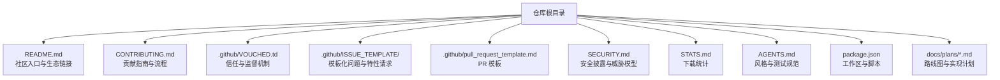
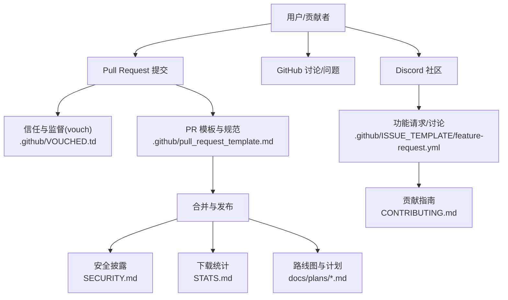
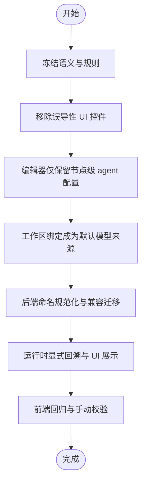
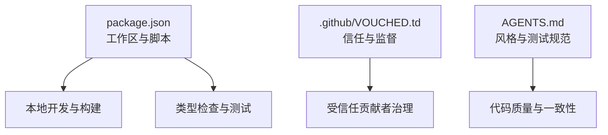

# 社区与生态

<cite>
**本文引用的文件**
- [README.md](file://README.md)
- [CONTRIBUTING.md](file://CONTRIBUTING.md)
- [.github/VOUCHED.td](file://.github/VOUCHED.td)
- [.github/ISSUE_TEMPLATE/feature-request.yml](file://.github/ISSUE_TEMPLATE/feature-request.yml)
- [.github/pull_request_template.md](file://.github/pull_request_template.md)
- [SECURITY.md](file://SECURITY.md)
- [STATS.md](file://STATS.md)
- [AGENTS.md](file://AGENTS.md)
- [package.json](file://package.json)
- [docs/plans/2026-04-12-workflow-session-agent-model-clarity.md](file://docs/plans/2026-04-12-workflow-session-agent-model-clarity.md)
- [docs/plans/2026-04-13-embedded-third-party-session-page.md](file://docs/plans/2026-04-13-embedded-third-party-session-page.md)
- [docs/plans/2026-06-24-project-manager-smartx-workflow-enforcement.md](file://docs/plans/2026-06-24-project-manager-smartx-workflow-enforcement.md)
</cite>

## 目录
1. [简介](#简介)
2. [项目结构](#项目结构)
3. [核心组件](#核心组件)
4. [架构总览](#架构总览)
5. [详细组件分析](#详细组件分析)
6. [依赖分析](#依赖分析)
7. [性能考虑](#性能考虑)
8. [故障排查指南](#故障排查指南)
9. [结论](#结论)
10. [附录](#附录)

## 简介
本章节面向社区与生态建设，系统性介绍 OpenCode 的社区建设、贡献流程、信任与监督机制、安全策略、下载统计与路线图，并对生态扩展（如 opencode-dashboard、opencode-mobile）进行说明，帮助用户与开发者建立高效沟通与协作。

## 项目结构
OpenCode 采用多包工作区组织，核心模块围绕“CLI/服务端 + 前端应用 + 桌面端 + 插件与SDK + 生态计划文档”展开。社区与生态相关内容主要分布在根目录的 README、贡献指南、信任与监督清单、安全策略、下载统计以及 docs/plans 路线图文档中。

图表来源
- [README.md](file://README.md)
- [CONTRIBUTING.md](file://CONTRIBUTING.md)
- [.github/VOUCHED.td](file://.github/VOUCHED.td)
- [.github/ISSUE_TEMPLATE/feature-request.yml](file://.github/ISSUE_TEMPLATE/feature-request.yml)
- [.github/pull_request_template.md](file://.github/pull_request_template.md)
- [SECURITY.md](file://SECURITY.md)
- [STATS.md](file://STATS.md)
- [AGENTS.md](file://AGENTS.md)
- [package.json](file://package.json)
- [docs/plans/2026-04-12-workflow-session-agent-model-clarity.md](file://docs/plans/2026-04-12-workflow-session-agent-model-clarity.md)
- [docs/plans/2026-04-13-embedded-third-party-session-page.md](file://docs/plans/2026-04-13-embedded-third-party-session-page.md)
- [docs/plans/2026-06-24-project-manager-smartx-workflow-enforcement.md](file://docs/plans/2026-06-24-project-manager-smartx-workflow-enforcement.md)

章节来源
- [README.md](file://README.md)
- [CONTRIBUTING.md](file://CONTRIBUTING.md)
- [package.json](file://package.json)

## 核心组件
- 社区入口与生态链接：README 提供 Discord、文档、安装与桌面应用下载等入口，并明确第三方项目命名规范与免责声明。
- 贡献指南与流程：CONTRIBUTING.md 规范 PR 期望、Issue 首先策略、UI/逻辑变更要求、标题规范、调试建议与信任监督机制。
- 信任与监督机制：VOUCHED.td 使用 vouch 系统维护受信任贡献者名单，Denounced 用户会被限制并自动关闭问题与 PR。
- 安全策略：SECURITY.md 明确不接受 AI 自动生成的安全报告，提供威胁模型、服务器模式安全配置与安全披露流程。
- 下载统计：STATS.md 展示 GitHub 与 npm 下载量趋势，反映社区活跃度与采用情况。
- 路线图与实现计划：docs/plans 下的三份计划文档分别覆盖会话代理与模型语义清晰化、嵌入式第三方会话页、SmartX 工作流强制执行等方向。

章节来源
- [README.md](file://README.md)
- [CONTRIBUTING.md](file://CONTRIBUTING.md)
- [.github/VOUCHED.td](file://.github/VOUCHED.td)
- [SECURITY.md](file://SECURITY.md)
- [STATS.md](file://STATS.md)
- [docs/plans/2026-04-12-workflow-session-agent-model-clarity.md](file://docs/plans/2026-04-12-workflow-session-agent-model-clarity.md)
- [docs/plans/2026-04-13-embedded-third-party-session-page.md](file://docs/plans/2026-04-13-embedded-third-party-session-page.md)
- [docs/plans/2026-06-24-project-manager-smartx-workflow-enforcement.md](file://docs/plans/2026-06-24-project-manager-smartx-workflow-enforcement.md)

## 架构总览
社区与生态的运行遵循“入口引导—贡献流程—信任治理—安全基线—路线图驱动”的闭环：

图表来源
- [README.md](file://README.md)
- [CONTRIBUTING.md](file://CONTRIBUTING.md)
- [.github/VOUCHED.td](file://.github/VOUCHED.td)
- [.github/ISSUE_TEMPLATE/feature-request.yml](file://.github/ISSUE_TEMPLATE/feature-request.yml)
- [.github/pull_request_template.md](file://.github/pull_request_template.md)
- [SECURITY.md](file://SECURITY.md)
- [STATS.md](file://STATS.md)
- [docs/plans/2026-04-12-workflow-session-agent-model-clarity.md](file://docs/plans/2026-04-12-workflow-session-agent-model-clarity.md)
- [docs/plans/2026-04-13-embedded-third-party-session-page.md](file://docs/plans/2026-04-13-embedded-third-party-session-page.md)
- [docs/plans/2026-06-24-project-manager-smartx-workflow-enforcement.md](file://docs/plans/2026-06-24-project-manager-smartx-workflow-enforcement.md)

## 详细组件分析

### 社区入口与生态链接
- 入口与导航：README 提供 Discord、文档、安装与桌面应用下载等入口，便于新用户快速加入与使用。
- 生态扩展声明：当第三方项目使用“opencode”作为名称时，需在 README 中声明其非官方、非关联，避免混淆。
- 多语言文档：README 提供多语言版本入口，促进全球用户参与。

章节来源
- [README.md](file://README.md)

### 贡献指南与参与方式
- 变更类型：常见可被接受的 PR 包括修复、新增 LSP/格式化器、LLM 性能优化、新提供商支持、环境特定问题修复、缺失标准行为与文档改进等。
- Issue 首策略：所有 PR 必须关联现有 Issue；可通过 help wanted、good first issue、bug、perf 等标签筛选适合新手的任务。
- 开发与构建：提供本地开发、运行不同目录、构建本地可执行、API 服务与 Web 应用、桌面应用运行与打包等步骤。
- PR 期望：小而聚焦、解释问题与修复方案、UI 变更需截图或录屏、逻辑变更需说明验证方法、标题遵循约定式提交、风格偏好与调试建议。
- 功能请求：新功能需先设计讨论，获得核心团队认可后再进入实现。
- 信任与监督：使用 vouch 系统管理受信任贡献者，维护 VOUCHED.td；可对用户进行 vouch、denounce、unvouch 等操作；被 denounce 的用户会被限制并自动关闭问题与 PR。
- Issue 要求：必须使用模板，空白 Issue 将被自动关闭；违规内容可能触发 denouncement。

章节来源
- [CONTRIBUTING.md](file://CONTRIBUTING.md)
- [.github/VOUCHED.td](file://.github/VOUCHED.td)
- [.github/ISSUE_TEMPLATE/feature-request.yml](file://.github/ISSUE_TEMPLATE/feature-request.yml)
- [.github/pull_request_template.md](file://.github/pull_request_template.md)

### 安全策略与风险治理
- 不接受 AI 自动生成的安全报告，避免资源浪费；收到后将自动封禁。
- 威胁模型：OpenCode 是本地运行的 AI 编码助手，无沙箱隔离；服务器模式需设置密码启用 HTTP Basic Auth；外部 MCP 服务器与恶意配置文件不在信任边界内。
- 披露流程：通过 GitHub Security Advisory 的“Report a Vulnerability”提交；安全团队会在一定工作日内响应并持续更新进展；超过时限可邮件联系安全邮箱。

章节来源
- [SECURITY.md](file://SECURITY.md)

### 下载统计与社区活跃度
- 统计维度：按日统计 GitHub 与 npm 下载量，展示整体增长趋势，反映社区采用与传播情况。
- 数据价值：可用于评估推广效果、版本迭代影响与社区健康度。

章节来源
- [STATS.md](file://STATS.md)

### 路线图与未来规划（社区驱动）
- 会话代理与模型语义清晰化：明确 workflow chat 由 workflow nodes 驱动 agent，模型默认来自创建工作区时绑定并在后续运行中可更改；移除误导性的 agent 选择器，强化 UI 清晰度。
- 嵌入式第三方会话页：提供独立入口 /embed/session 接收工作区路径，自动准备工作区、检测并初始化 Git、固定 agent 为 smartx-helper、将模型配置移至顶部齿轮菜单，保持简洁布局。
- SmartX 工作流强制执行：将 project-manager 从提示约定提升为可验证的 MCP 工具协议，强制要求恢复/初始化项目状态与最终保存手交状态，结合工作区基线状态形成三层门控。

图表来源
- [docs/plans/2026-04-12-workflow-session-agent-model-clarity.md](file://docs/plans/2026-04-12-workflow-session-agent-model-clarity.md)

章节来源
- [docs/plans/2026-04-12-workflow-session-agent-model-clarity.md](file://docs/plans/2026-04-12-workflow-session-agent-model-clarity.md)
- [docs/plans/2026-04-13-embedded-third-party-session-page.md](file://docs/plans/2026-04-13-embedded-third-party-session-page.md)
- [docs/plans/2026-06-24-project-manager-smartx-workflow-enforcement.md](file://docs/plans/2026-06-24-project-manager-smartx-workflow-enforcement.md)

### 生态扩展与命名规范
- 第三方项目命名：若项目名称包含“opencode”，请在 README 中声明其非官方、非关联，避免与官方产品混淆。
- 生态示例：README 中提及 opencode-dashboard、opencode-mobile 等第三方扩展项目，鼓励社区基于 OpenCode 进行二次开发与集成。

章节来源
- [README.md](file://README.md)

### 获取帮助与支持
- 社区渠道：通过 README 提供的 Discord 加入实时讨论；GitHub 讨论区用于深入交流与问题反馈。
- 安全支持：遇到安全问题，请通过 SECURITY.md 中的安全披露流程提交，避免公开讨论高风险细节。
- 文档与安装：参考 README 的安装与文档入口，快速上手与查阅使用说明。

章节来源
- [README.md](file://README.md)
- [SECURITY.md](file://SECURITY.md)

## 依赖分析
- 工作区与脚本：package.json 定义了多包工作区、常用脚本（开发、构建、类型检查、storybook 等），为社区贡献者提供统一的本地开发体验。
- 信任与监督：VOUCHED.td 与 CONTRIBUTING.md 的 vouch 系统共同构成贡献者的信任与监督机制，降低低质量贡献与滥用风险。
- 质量与风格：AGENTS.md 提供风格与测试规范，确保贡献代码的一致性与可维护性。

图表来源
- [package.json](file://package.json)
- [.github/VOUCHED.td](file://.github/VOUCHED.td)
- [AGENTS.md](file://AGENTS.md)

章节来源
- [package.json](file://package.json)
- [.github/VOUCHED.td](file://.github/VOUCHED.td)
- [AGENTS.md](file://AGENTS.md)

## 性能考虑
- 社区层面：通过 Issue 模板与 PR 规范减少无效讨论与重复劳动；信任与监督机制降低低质量贡献对维护成本的影响。
- 开发效率：统一的工作区脚本与类型检查工具链有助于缩短构建与验证周期，提升贡献效率。
- 路线图优先级：以明确的实现计划与验收标准推进功能落地，避免过度设计导致的性能退化。

## 故障排查指南
- PR 被拒或未审：检查是否满足 Issue 首策略、PR 模板与标题规范；关注 CONTRIBUTING.md 的 PR 期望与风格偏好。
- 贡献受限：若账户被 denounce，将无法打开 Issue 或 PR；可联系维护者在 Discord 解释情况并申请解除。
- 安全问题：严格遵循 SECURITY.md 的披露流程，避免在公开渠道讨论高风险细节。
- 开发调试：参考 CONTRIBUTING.md 的调试建议，优先使用推荐的调试方式与 VSCode 配置示例。

章节来源
- [CONTRIBUTING.md](file://CONTRIBUTING.md)
- [.github/VOUCHED.td](file://.github/VOUCHED.td)
- [SECURITY.md](file://SECURITY.md)

## 结论
OpenCode 的社区与生态以“入口清晰、流程规范、信任治理、安全基线、路线图驱动”为核心，既保障了贡献效率与质量，也建立了可持续的社区协作模式。通过明确的生态扩展命名规范与路线图文档，社区成员可以更好地参与共建、扩展与集成，推动项目长期演进。

## 附录
- 社区入口与生态链接：参见 README 的 Discord、文档、安装与桌面应用下载入口。
- 贡献指南与模板：参见 CONTRIBUTING.md、.github/ISSUE_TEMPLATE/feature-request.yml、.github/pull_request_template.md。
- 信任与监督：参见 .github/VOUCHED.td。
- 安全策略：参见 SECURITY.md。
- 下载统计：参见 STATS.md。
- 路线图与实现计划：参见 docs/plans 下的三份计划文档。