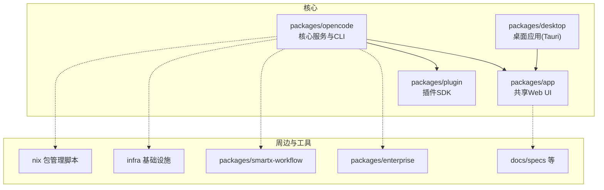
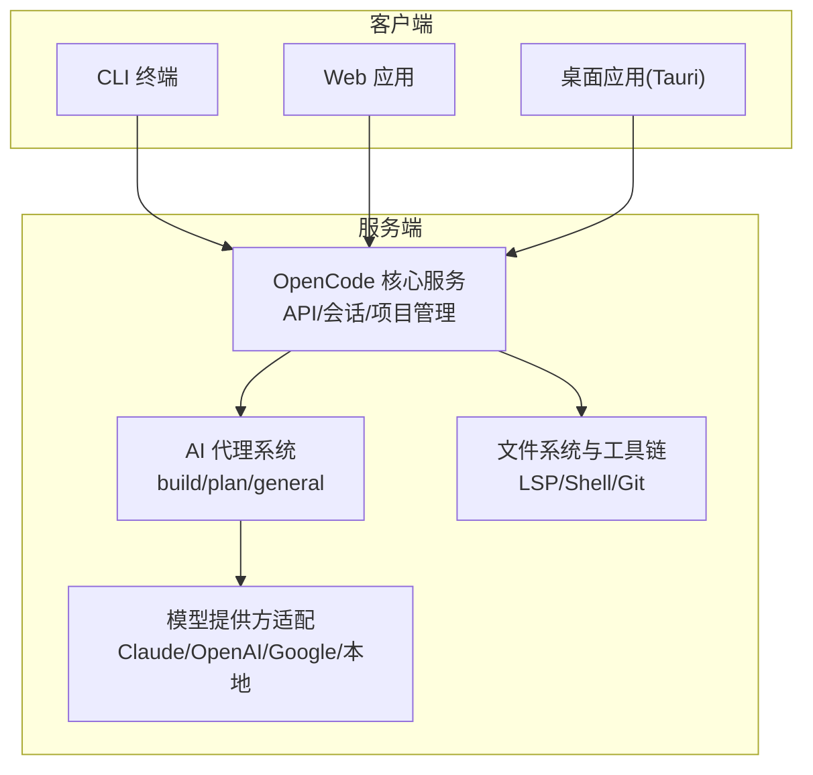
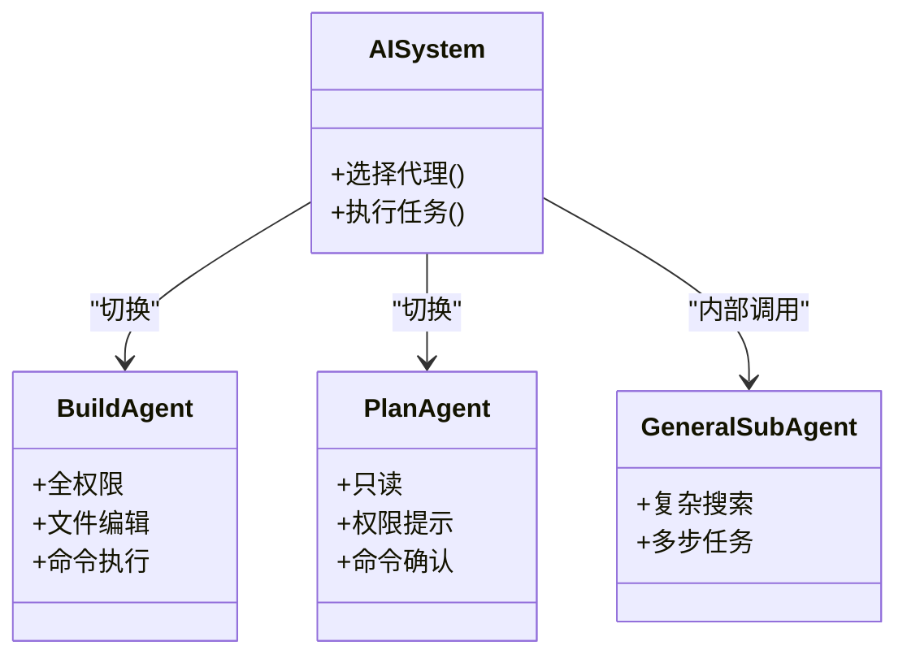
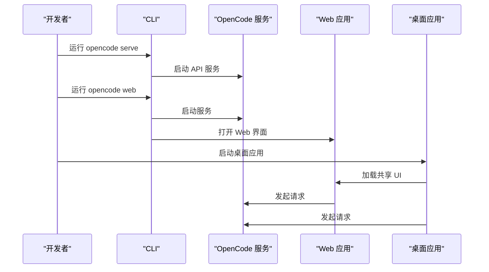
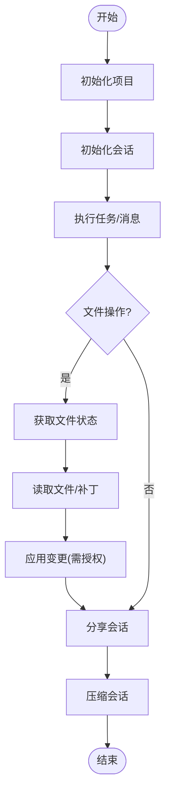
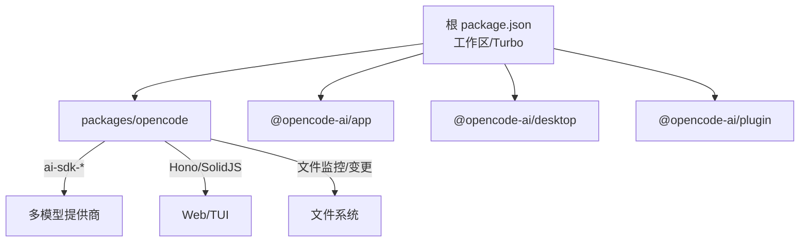

# 项目概述

<cite>
**本文档引用的文件**
- [README.md](file://README.md)
- [CONTRIBUTING.md](file://CONTRIBUTING.md)
- [AGENTS.md](file://AGENTS.md)
- [package.json](file://package.json)
- [packages/opencode/package.json](file://packages/opencode/package.json)
- [packages/app/package.json](file://packages/app/package.json)
- [packages/desktop/package.json](file://packages/desktop/package.json)
- [packages/plugin/package.json](file://packages/plugin/package.json)
- [specs/project.md](file://specs/project.md)
- [.github/VOUCHED.td](file://.github/VOUCHED.td)
- [SECURITY.md](file://SECURITY.md)
- [STATS.md](file://STATS.md)
</cite>

## 目录
1. [简介](#简介)
2. [项目结构](#项目结构)
3. [核心组件](#核心组件)
4. [架构总览](#架构总览)
5. [详细组件分析](#详细组件分析)
6. [依赖关系分析](#依赖关系分析)
7. [性能考量](#性能考量)
8. [故障排查指南](#故障排查指南)
9. [结论](#结论)
10. [附录](#附录)

## 简介
OpenCode 是一个开源的 AI 编码代理系统，旨在通过“客户端/服务器”架构在终端、桌面与 Web 多平台之间提供一致的智能开发体验。其核心价值主张包括：
- 完全开源且不绑定特定模型提供商，支持 Claude、OpenAI、Google、本地模型等多种后端
- 内置终端优先（TUI）界面，强调在终端中的极致交互体验
- 提供开箱即用的语言服务器协议（LSP）支持
- 支持多项目会话管理与工作树并行运行
- 可扩展的插件体系，便于二次开发与集成

目标用户包括：
- 偏好终端/命令行工具链的开发者与运维工程师
- 需要在多平台间统一使用的团队与个人
- 对数据主权与可移植性有要求的组织

使用场景涵盖：
- 在本地仓库中进行代码审查、重构与探索
- 通过多会话并行处理多个项目或工作树
- 使用插件扩展能力，如自定义工具与流程
- 通过 Web 或桌面应用获得更丰富的可视化交互

## 项目结构
本项目采用 Monorepo 结构，核心包与子项目分布如下：
- 核心服务与 CLI：packages/opencode
- 共享 Web UI 组件：packages/app
- 桌面应用（Tauri）：packages/desktop
- 插件 SDK：packages/plugin
- 企业与周边工具：packages/enterprise、packages/smartx-workflow 等
- 文档与规范：docs、specs
- 基础设施与部署：infra、nix
- VS Code 扩展：sdks/vscode

图表来源
- [package.json:21-27](file://package.json#L21-L27)
- [packages/opencode/package.json:1-146](file://packages/opencode/package.json#L1-L146)
- [packages/app/package.json:1-74](file://packages/app/package.json#L1-L74)
- [packages/desktop/package.json:1-45](file://packages/desktop/package.json#L1-L45)
- [packages/plugin/package.json:1-29](file://packages/plugin/package.json#L1-L29)

章节来源
- [package.json:21-27](file://package.json#L21-L27)
- [packages/opencode/package.json:1-146](file://packages/opencode/package.json#L1-L146)
- [packages/app/package.json:1-74](file://packages/app/package.json#L1-L74)
- [packages/desktop/package.json:1-45](file://packages/desktop/package.json#L1-L45)
- [packages/plugin/package.json:1-29](file://packages/plugin/package.json#L1-L29)

## 核心组件
- AI 代理系统
  - 内置 build 与 plan 两类代理，可通过 Tab 切换
  - build：默认全权限代理，适合开发工作
  - plan：只读代理，强调分析与探索，对文件编辑与命令执行有安全限制
  - general 子代理用于复杂搜索与多步任务
- 多平台支持
  - CLI：终端优先，支持 serve/web/tui 等模式
  - Web 应用：基于 SolidJS 的共享 UI 组件
  - 桌面应用：Tauri 包装 Web UI，提供原生体验
- 插件生态系统
  - 通过 @opencode-ai/plugin 提供工具与扩展能力
  - 插件导出接口与工具模块化封装
- 项目与会话管理
  - 支持单实例多项目、多工作树并行
  - 提供会话生命周期管理（初始化、中止、分享、压缩、消息与文件操作）

章节来源
- [README.md:100-114](file://README.md#L100-L114)
- [specs/project.md:1-65](file://specs/project.md#L1-L65)
- [packages/plugin/package.json:11-14](file://packages/plugin/package.json#L11-L14)

## 架构总览
OpenCode 采用“客户端/服务器”架构，核心服务运行在本地或受控环境中，通过统一 API 为 Web、桌面与 CLI 提供一致的能力。

图表来源
- [README.md:100-114](file://README.md#L100-L114)
- [specs/project.md:5-64](file://specs/project.md#L5-L64)
- [packages/opencode/package.json:58-141](file://packages/opencode/package.json#L58-L141)

## 详细组件分析

### 组件一：AI 代理系统
- 设计理念
  - 通过“代理”抽象实现能力与安全的分离
  - 以最小权限原则设计 plan 代理，增强安全性
  - 通过子代理 general 支持复杂任务编排
- 关键行为
  - 文件编辑与命令执行需授权或确认
  - 默认提供 LSP 能力，提升代码理解与补全
- 开发与贡献
  - 代码风格强调简洁、类型安全与函数式方法
  - 严格命名约定与变量使用规范

图表来源
- [README.md:100-114](file://README.md#L100-L114)
- [AGENTS.md:9-129](file://AGENTS.md#L9-L129)

章节来源
- [README.md:100-114](file://README.md#L100-L114)
- [AGENTS.md:9-129](file://AGENTS.md#L9-L129)

### 组件二：多平台支持（CLI/Web/桌面）
- CLI
  - 支持 serve（无头 API 服务）、web（启动服务并打开 Web）、直接目录进入 TUI
  - 开发与生产命令一致，便于调试与发布
- Web 应用
  - 基于 SolidJS 的共享 UI 组件库，便于跨平台复用
- 桌面应用
  - Tauri 包装 Web UI，提供原生窗口、剪贴板、深链、更新等系统能力

图表来源
- [CONTRIBUTING.md:72-154](file://CONTRIBUTING.md#L72-L154)
- [packages/app/package.json:11-24](file://packages/app/package.json#L11-L24)
- [packages/desktop/package.json:7-14](file://packages/desktop/package.json#L7-L14)

章节来源
- [CONTRIBUTING.md:72-154](file://CONTRIBUTING.md#L72-L154)
- [packages/app/package.json:11-24](file://packages/app/package.json#L11-L24)
- [packages/desktop/package.json:7-14](file://packages/desktop/package.json#L7-L14)

### 组件三：插件生态系统
- 插件 SDK
  - 导出入口与工具模块，便于扩展工具与流程
  - 类型安全与最小依赖设计
- 生态建设
  - 通过插件机制降低耦合，提升可维护性与可扩展性

图表来源
- [packages/plugin/package.json:11-14](file://packages/plugin/package.json#L11-L14)
- [packages/plugin/package.json:18-21](file://packages/plugin/package.json#L18-L21)

章节来源
- [packages/plugin/package.json:11-14](file://packages/plugin/package.json#L11-L14)
- [packages/plugin/package.json:18-21](file://packages/plugin/package.json#L18-L21)

### 组件四：项目与会话管理 API
- 多项目与多工作树
  - 单实例同时管理多个项目与工作树
- 会话生命周期
  - 初始化、中止、分享、压缩、消息与文件操作
- 文件与状态
  - 文件状态查询、原始内容/补丁内容获取

图表来源
- [specs/project.md:5-64](file://specs/project.md#L5-L64)

章节来源
- [specs/project.md:1-65](file://specs/project.md#L1-L65)

## 依赖关系分析
- 工作区与包管理
  - 顶层使用 Turborepo 管理多包构建与类型检查
  - 包含 @opencode-ai/* 生态相关包
- 核心依赖
  - ai-sdk-* 系列提供多模型提供商适配
  - Hono 作为轻量 Web 框架
  - SolidJS 与 @opentui 提供前端与 TUI 能力
  - @parcel/watcher、chokidar 等文件监控与变更检测
- 安全与合规
  - 信任与背书系统（vouch）管理贡献者信任度
  - 安全策略明确服务模式与权限边界

图表来源
- [package.json:21-72](file://package.json#L21-L72)
- [packages/opencode/package.json:58-141](file://packages/opencode/package.json#L58-L141)
- [packages/app/package.json:40-72](file://packages/app/package.json#L40-L72)
- [packages/desktop/package.json:15-35](file://packages/desktop/package.json#L15-L35)
- [packages/plugin/package.json:18-21](file://packages/plugin/package.json#L18-L21)

章节来源
- [package.json:21-72](file://package.json#L21-L72)
- [packages/opencode/package.json:58-141](file://packages/opencode/package.json#L58-L141)
- [packages/app/package.json:40-72](file://packages/app/package.json#L40-L72)
- [packages/desktop/package.json:15-35](file://packages/desktop/package.json#L15-L35)
- [packages/plugin/package.json:18-21](file://packages/plugin/package.json#L18-L21)

## 性能考量
- 并发与并行
  - 通过并行工具与任务调度提升多项目/多工作树下的响应速度
- 文件监控与增量更新
  - 使用文件监控库减少无效扫描，提高变更检测效率
- 前端渲染与状态管理
  - 基于 SolidJS 的细粒度响应与虚拟滚动等优化手段
- 服务端与网络
  - 本地服务模式避免远程延迟；必要时通过鉴权与隔离保障安全

## 故障排查指南
- 安全与权限
  - 服务模式需设置密码并启用基本认证；未设置时为非鉴权模式
  - 不提供沙箱隔离，建议在容器或 VM 中运行以获得更强隔离
- 贡献与信任
  - 使用 vouch 系统管理贡献者信任；被背书用户享有更高权限
  - 低质量 AI 自动生成内容将被拒绝，严重违规可能被背书
- 调试与开发
  - 推荐使用调试器附加方式定位问题；某些运行模式下断点映射可能异常
  - API 或 SDK 变更后需生成 SDK 与相关文件

章节来源
- [SECURITY.md:21-33](file://SECURITY.md#L21-L33)
- [.github/VOUCHED.td:1-24](file://.github/VOUCHED.td#L1-L24)
- [CONTRIBUTING.md:158-178](file://CONTRIBUTING.md#L158-L178)

## 结论
OpenCode 以“客户端/服务器”架构为核心，结合多平台前端与强大的插件体系，为开发者提供了在终端、Web 与桌面环境下一致的 AI 编码体验。其开源、可移植、可扩展的设计使其适用于个人开发者与团队协作场景。随着多项目/多工作树能力与插件生态的完善，OpenCode 将持续演进为更通用的智能开发助手。

## 附录
- 安装与入门
  - 支持 curl 安装脚本、包管理器安装与 Nix 等多种方式
  - 桌面应用提供多平台发行包
- 社区与生态
  - 提供多语言 README 与活跃的社区渠道
  - 下载统计显示用户规模稳步增长
- 发展与规划
  - 项目文档与计划文件持续更新，体现长期演进方向

章节来源
- [README.md:46-98](file://README.md#L46-L98)
- [README.md:67-83](file://README.md#L67-L83)
- [STATS.md:1-218](file://STATS.md#L1-L218)