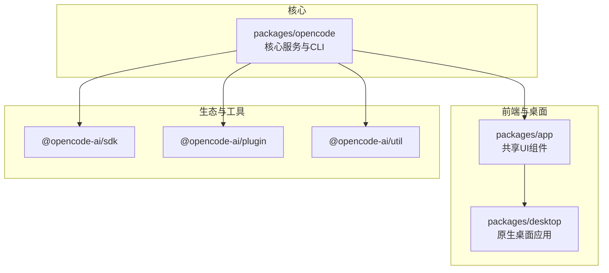
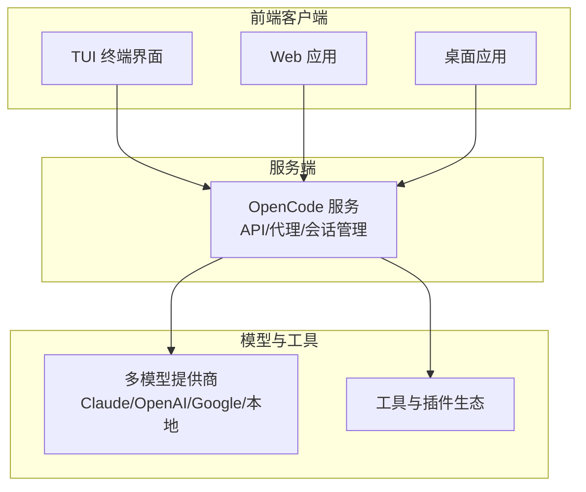
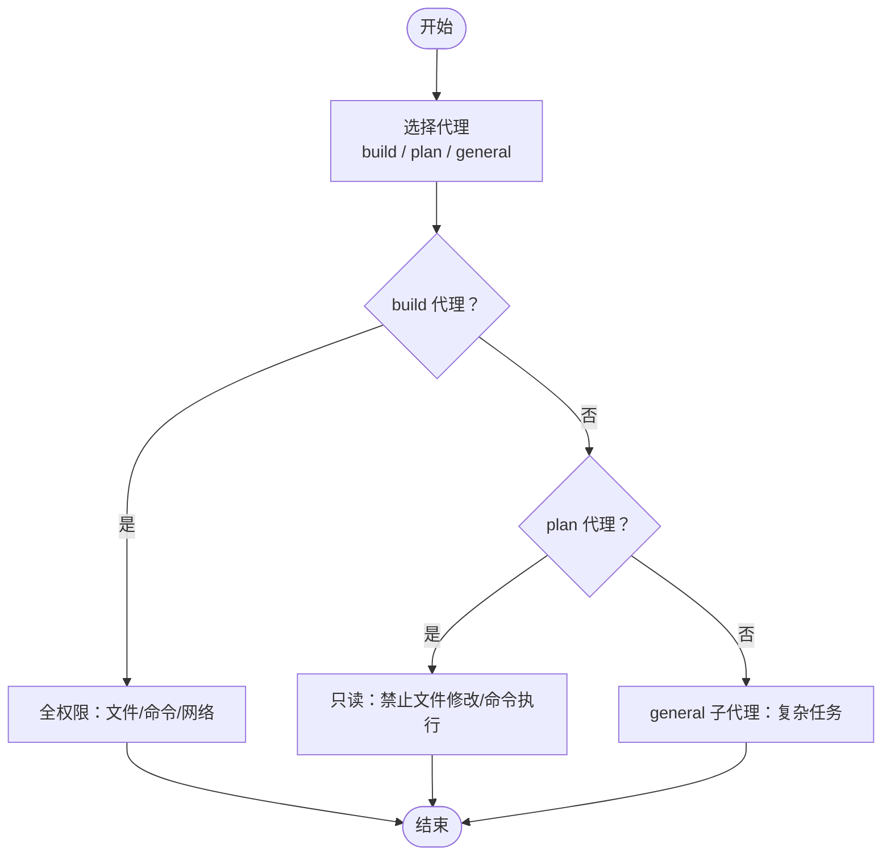
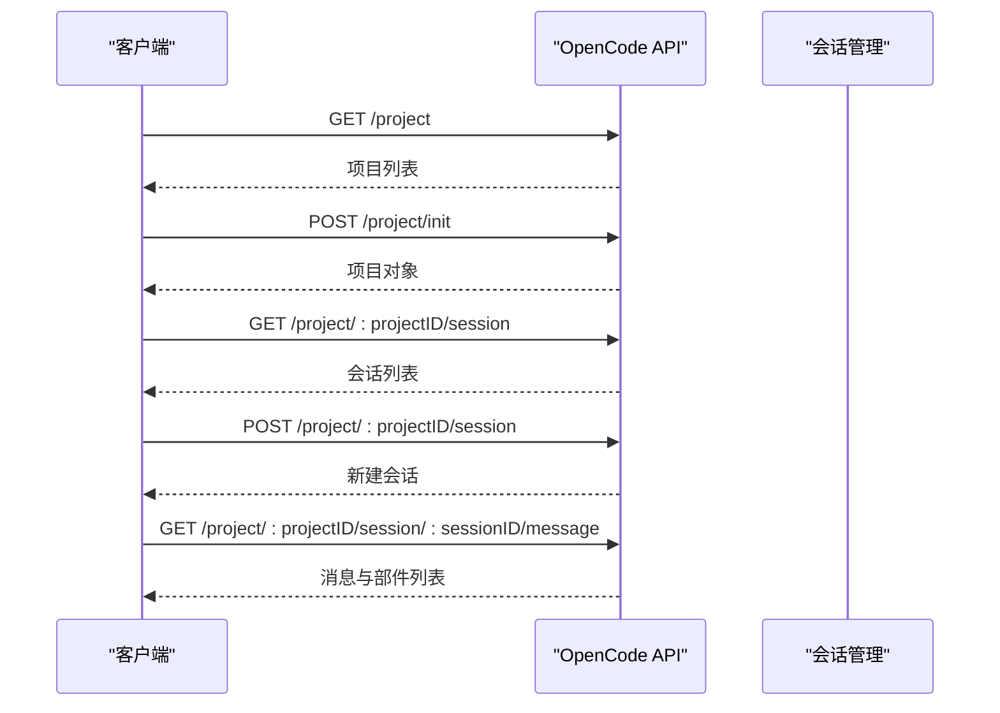
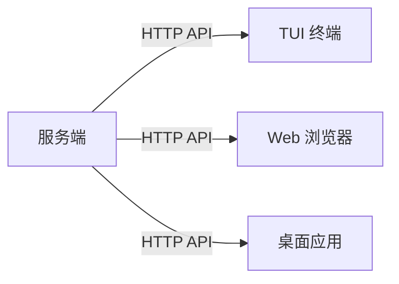
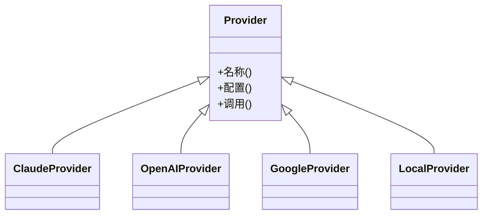
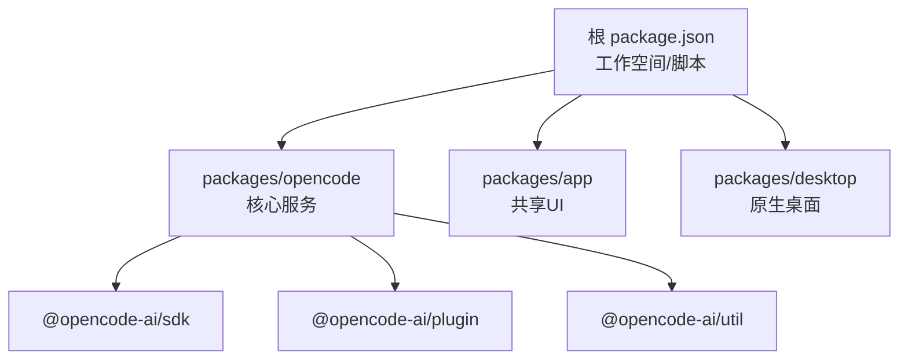

# 项目简介

<cite>
**本文档引用的文件**
- [README.md](file://README.md)
- [AGENTS.md](file://AGENTS.md)
- [CONTRIBUTING.md](file://CONTRIBUTING.md)
- [package.json](file://package.json)
- [packages/opencode/package.json](file://packages/opencode/package.json)
- [packages/app/package.json](file://packages/app/package.json)
- [specs/project.md](file://specs/project.md)
- [SECURITY.md](file://SECURITY.md)
- [STATS.md](file://STATS.md)
- [.opencode/opencode.jsonc](file://.opencode/opencode.jsonc)
</cite>

## 目录
1. [引言](#引言)
2. [项目结构](#项目结构)
3. [核心组件](#核心组件)
4. [架构总览](#架构总览)
5. [详细组件分析](#详细组件分析)
6. [依赖分析](#依赖分析)
7. [性能考虑](#性能考虑)
8. [故障排除指南](#故障排除指南)
9. [结论](#结论)
10. [附录](#附录)

## 引言
OpenCode 是一个面向开发者的开源 AI 编码代理平台，致力于通过“终端用户界面（TUI）+ 客户端/服务器架构”的方式，将强大的大模型能力直接带到开发者身边。项目强调“100% 开源、多模型提供商支持、终端优先体验、可扩展的客户端形态”，旨在降低 AI 编码工具的使用门槛，同时为不同场景提供灵活的部署与交互方式。

OpenCode 的价值主张体现在以下方面：
- 100% 开源：完全透明、可审计、可定制，避免供应商锁定。
- 多模型提供商支持：不限定单一模型或服务商，适配 Claude、OpenAI、Google、本地模型等多种生态。
- 终端优先体验：由 Neovim 用户与 terminal.shop 创作者打造，持续探索终端交互的边界。
- 客户端/服务器架构：服务端可独立运行，前端可为 TUI、Web 或桌面应用，实现跨设备、跨形态的统一体验。

## 项目结构
OpenCode 采用多包（monorepo）组织方式，围绕核心功能与多端体验进行模块化拆分：
- packages/opencode：核心业务逻辑与服务端实现，提供命令行接口、API 服务与代理能力。
- packages/app：共享 Web UI 组件，基于 SolidJS 构建，用于 Web 与桌面应用的前端基础。
- packages/desktop：基于 Tauri 的原生桌面应用，包装 Web UI，提供更贴近本地开发的体验。
- packages/sdk、packages/plugin、packages/util：SDK、插件与工具库，支撑生态扩展与二次开发。
- packages/console、packages/web、packages/strategy-*：控制台、Web 门户与策略工作流相关组件（根据仓库布局推断）。

图表来源
- [package.json:21-27](file://package.json#L21-L27)
- [packages/opencode/package.json:1-146](file://packages/opencode/package.json#L1-L146)
- [packages/app/package.json:1-74](file://packages/app/package.json#L1-L74)

章节来源
- [package.json:21-27](file://package.json#L21-L27)
- [packages/opencode/package.json:1-146](file://packages/opencode/package.json#L1-L146)
- [packages/app/package.json:1-74](file://packages/app/package.json#L1-L74)

## 核心组件
- 代理系统（Agents）
  - OpenCode 提供两种内置代理，可通过 Tab 切换：
    - build：默认全权限代理，适合日常开发任务。
    - plan：只读代理，禁止文件修改，默认拒绝执行 Bash 命令，适合探索与规划。
  - 另有 general 子代理，用于复杂检索与多步任务，内部使用。
- 客户端/服务器架构
  - 服务端可独立运行，支持通过 HTTP 接口对外提供能力。
  - 前端可为 TUI、Web 或桌面应用，实现跨设备统一体验。
- 多模型提供商支持
  - 通过统一的 AI SDK Provider 抽象，支持 Claude、OpenAI、Google、本地模型等多家提供商。
- 终端用户界面（TUI）
  - 由 SolidJS 与 opentui 驱动，专注在终端内的高效交互体验。
- 配置与权限
  - 通过 .opencode/opencode.jsonc 进行提供商、权限与工具的配置管理。

章节来源
- [README.md:100-113](file://README.md#L100-L113)
- [CONTRIBUTING.md:72-77](file://CONTRIBUTING.md#L72-L77)
- [packages/opencode/package.json:58-141](file://packages/opencode/package.json#L58-L141)
- [.opencode/opencode.jsonc:1-19](file://.opencode/opencode.jsonc#L1-L19)

## 架构总览
OpenCode 的整体架构围绕“服务端 + 多端前端”的模式展开，核心服务提供统一的 API 与代理能力，前端以 TUI、Web 或桌面形式呈现，满足不同使用场景。

图表来源
- [CONTRIBUTING.md:72-77](file://CONTRIBUTING.md#L72-L77)
- [packages/opencode/package.json:58-141](file://packages/opencode/package.json#L58-L141)
- [specs/project.md:5-64](file://specs/project.md#L5-L64)

## 详细组件分析

### 代理系统（Agents）
- build 代理
  - 默认全权限，适合编写、修改与运行代码。
- plan 代理
  - 只读模式，禁止文件修改与危险命令执行，适合探索与规划。
- general 子代理
  - 用于复杂检索与多步任务，内部调用。

图表来源
- [README.md:100-113](file://README.md#L100-L113)

章节来源
- [README.md:100-113](file://README.md#L100-L113)

### API 与会话管理
OpenCode 提供面向项目与会话的 REST API，支持多项目、多工作树场景下的会话生命周期管理与消息交互。

图表来源
- [specs/project.md:5-64](file://specs/project.md#L5-L64)

章节来源
- [specs/project.md:1-65](file://specs/project.md#L1-L65)

### 客户端/服务器架构与多端形态
- 服务端
  - 通过 bun dev serve 或生产环境的 opencode serve 启动，提供统一 API。
- 前端形态
  - TUI：在终端内运行，适合开发者日常编码。
  - Web：在浏览器中运行，便于协作与演示。
  - 桌面：基于 Tauri 的原生应用，提供更贴近本地开发的体验。

图表来源
- [CONTRIBUTING.md:97-154](file://CONTRIBUTING.md#L97-L154)

章节来源
- [CONTRIBUTING.md:72-154](file://CONTRIBUTING.md#L72-L154)

### 多模型提供商支持
- 通过统一的 AI SDK Provider 抽象，OpenCode 支持多种主流模型提供商，包括 Claude、OpenAI、Google 等，同时兼容本地模型与网关。
- 项目对提供商的集成遵循最小改动原则，便于扩展新的提供商。

图表来源
- [packages/opencode/package.json:62-81](file://packages/opencode/package.json#L62-L81)

章节来源
- [packages/opencode/package.json:58-141](file://packages/opencode/package.json#L58-L141)

### 终端用户界面（TUI）
- TUI 由 SolidJS 与 opentui 驱动，专注于在终端内的高效交互体验。
- 开发者可通过 bun dev <directory> 在指定目录启动 TUI，或通过 opencode <directory> 运行生产版本。

章节来源
- [CONTRIBUTING.md:72-95](file://CONTRIBUTING.md#L72-L95)

### 配置与权限管理
- 通过 .opencode/opencode.jsonc 进行提供商、权限与工具的配置管理。
- 权限系统提供 UX 层的安全提示，但不提供沙箱隔离，需要时应结合容器或虚拟机使用。

章节来源
- [.opencode/opencode.jsonc:1-19](file://.opencode/opencode.jsonc#L1-L19)
- [SECURITY.md:9-34](file://SECURITY.md#L9-L34)

## 依赖分析
- 核心依赖
  - OpenCode 服务端依赖丰富的 AI SDK Provider 生态，覆盖主流模型提供商与本地模型。
  - 使用 Hono 作为 Web 框架，配合 Zod 等工具进行参数校验与 OpenAPI 支持。
- 前端与桌面
  - packages/app 基于 SolidJS，提供共享 UI 组件与样式体系。
  - packages/desktop 基于 Tauri，封装 Web UI 形成原生应用。
- 工作空间与脚本
  - 顶层 package.json 定义了 monorepo 工作空间与常用脚本，便于统一开发与构建。

图表来源
- [package.json:21-27](file://package.json#L21-L27)
- [packages/opencode/package.json:89-94](file://packages/opencode/package.json#L89-L94)

章节来源
- [package.json:21-27](file://package.json#L21-L27)
- [packages/opencode/package.json:89-94](file://packages/opencode/package.json#L89-L94)

## 性能考虑
- 服务端默认端口为 4096，可通过 --port 参数调整。
- 开发调试建议使用 --inspect 系列参数，结合 spawn 模式以确保断点命中。
- 对于大型项目，建议合理划分会话与工作树，减少不必要的文件扫描与变更范围。

章节来源
- [CONTRIBUTING.md:97-178](file://CONTRIBUTING.md#L97-L178)

## 故障排除指南
- 安全模型与权限
  - OpenCode 不提供沙箱隔离，建议在受控环境中运行，或使用容器/虚拟机。
  - 服务端模式需设置 OPENCODE_SERVER_PASSWORD 以启用 HTTP Basic Auth。
- 配置与日志
  - 通过 .opencode/opencode.jsonc 管理提供商与权限。
  - 使用 /log 接口上报日志，便于问题定位。
- 常见问题
  - 若出现断点无法命中，尝试使用 bun dev spawn 或分离调试服务端与 TUI。
  - 若需要最小化依赖，参考 AGENTS.md 的风格指南，减少不必要的变量与分支。

章节来源
- [SECURITY.md:9-34](file://SECURITY.md#L9-L34)
- [specs/project.md:54-64](file://specs/project.md#L54-L64)
- [AGENTS.md:9-16](file://AGENTS.md#L9-L16)

## 结论
OpenCode 以“100% 开源 + 多模型提供商 + 终端优先 + 客户端/服务器架构”为核心理念，为开发者提供可定制、可扩展、可跨端使用的 AI 编码代理平台。通过清晰的代理体系、统一的 API 与多端前端形态，OpenCode 能够适应从个人开发者到团队协作的多样化场景，持续推动 AI 辅助开发体验的演进。

## 附录
- 安装与运行
  - 支持 curl 安装脚本、包管理器安装与桌面应用下载。
  - 服务端默认端口 4096，可通过 --port 自定义。
- 社区与贡献
  - 遵循 AGENTS.md 的风格指南与 CONTRIBUTING.md 的贡献流程。
  - 重大功能需经过设计评审，避免 UI 与核心产品功能未经评审的改动。

章节来源
- [README.md:46-118](file://README.md#L46-L118)
- [CONTRIBUTING.md:190-262](file://CONTRIBUTING.md#L190-L262)
- [AGENTS.md:9-16](file://AGENTS.md#L9-L16)