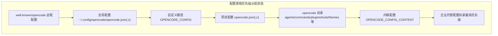
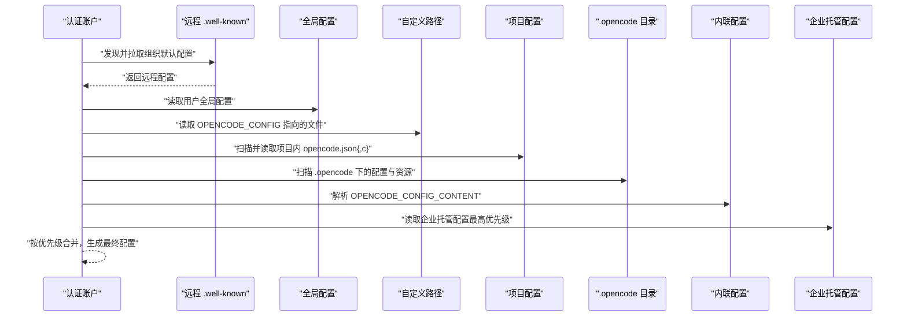
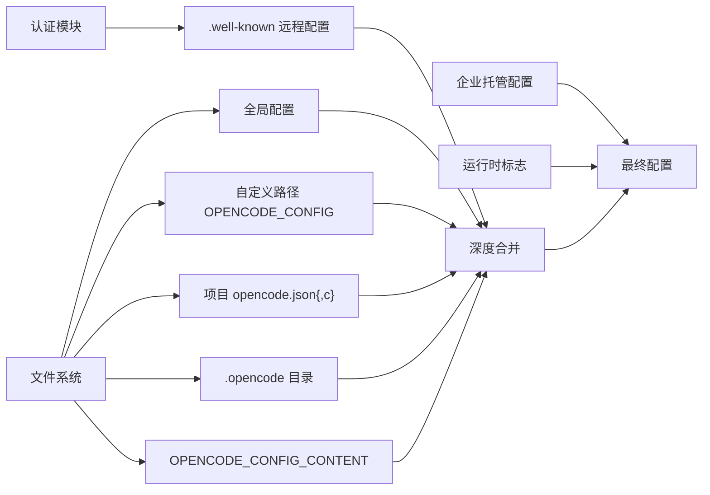

# 全局配置

<cite>
**本文引用的文件**
- [opencode.jsonc](file://.opencode/opencode.jsonc)
- [env.d.ts](file://.opencode/env.d.ts)
- [config.ts](file://packages/opencode/src/config/config.ts)
- [config.mdx（英文）](file://packages/web/src/content/docs/config.mdx)
- [mcp-servers.mdx（英文）](file://packages/web/src/content/docs/mcp-servers.mdx)
- [permissions.mdx（英文）](file://packages/web/src/content/docs/nb/permissions.mdx)
- [providers.mdx（英文）](file://packages/web/src/content/docs/providers.mdx)
- [server-errors.ts](file://packages/app/src/utils/server-errors.ts)
- [en.ts（应用国际化）](file://packages/app/src/i18n/en.ts)
- [types.gen.ts（SDK 类型定义）](file://packages/sdk/js/src/v2/gen/types.gen.ts)
- [index.ts（MCP 实现入口）](file://packages/opencode/src/mcp/index.ts)
- [flag.ts（运行时标志）](file://packages/opencode/src/flag/flag.ts)
- [translator.md（示例代理环境变量清单）](file://.opencode/agent/translator.md)
</cite>

## 目录
1. [简介](#简介)
2. [项目结构](#项目结构)
3. [核心组件](#核心组件)
4. [架构总览](#架构总览)
5. [详细组件分析](#详细组件分析)
6. [依赖关系分析](#依赖关系分析)
7. [性能考量](#性能考量)
8. [故障排查指南](#故障排查指南)
9. [结论](#结论)
10. [附录](#附录)

## 简介
本文件系统性阐述 OpenCode 的全局配置体系，涵盖配置文件格式与位置、加载顺序与优先级、各子配置段落（provider、permission、mcp、tools 等）的参数与语义、配置继承与默认值策略、配置验证与错误处理机制，并提供多环境模板与最佳实践建议。目标是帮助开发者与运维人员在不同场景下正确、安全地配置 OpenCode。

## 项目结构
OpenCode 的配置来源多样，支持合并而非替换，后加载项仅对冲突键进行覆盖。核心配置文件位于项目根目录或用户主目录下的配置文件，亦可通过环境变量注入或覆盖。

图示来源
- [config.ts:81-88](file://packages/opencode/src/config/config.ts#L81-L88)
- [config.ts:89-214](file://packages/opencode/src/config/config.ts#L89-L214)

章节来源
- [config.mdx（英文）:42-51](file://packages/web/src/content/docs/config.mdx#L42-L51)
- [config.ts:81-214](file://packages/opencode/src/config/config.ts#L81-L214)

## 核心组件
- 配置加载与合并：按优先级顺序加载多个配置源，使用深度合并策略，数组字段采用去重拼接方式；部分字段支持“追加式”合并（如插件列表）。
- 配置验证：基于 Zod Schema 对配置进行强类型校验，失败时抛出结构化错误，便于定位具体字段与原因。
- 运行时覆盖：支持通过环境变量动态覆盖部分配置（如 OPENCODE_CONFIG、OPENCODE_CONFIG_CONTENT、OPENCODE_CONFIG_DIR 等），以及通过 OPENCODE_PERMISSION 注入权限规则。
- 错误处理：对解析失败、字段不合法、远程配置拉取失败等情况提供明确的错误消息与回退策略。

章节来源
- [config.ts:66-76](file://packages/opencode/src/config/config.ts#L66-L76)
- [config.ts:226-242](file://packages/opencode/src/config/config.ts#L226-L242)
- [flag.ts:59-85](file://packages/opencode/src/flag/flag.ts#L59-L85)

## 架构总览
OpenCode 的配置加载流程如下：先拉取远程组织默认配置，再依次合并全局、自定义路径、项目、.opencode 目录、内联配置，最后由企业托管配置收口覆盖。同时，运行时标志与环境变量可作为补充或覆盖手段。

图示来源
- [config.ts:81-214](file://packages/opencode/src/config/config.ts#L81-L214)

章节来源
- [config.ts:81-214](file://packages/opencode/src/config/config.ts#L81-L214)

## 详细组件分析

### provider 提供商配置
- 作用：为不同模型提供商（如 OpenAI、Anthropic、Amazon Bedrock 等）提供统一的配置入口，支持选项覆盖与超时控制。
- 关键字段
  - provider.<providerId>.options.apiKey：提供商 API 密钥
  - provider.<providerId>.options.baseURL：自定义基础地址
  - provider.<providerId>.options.enterpriseUrl：企业版服务地址（如 GitHub Copilot）
  - provider.<providerId>.options.timeout：请求超时（毫秒），可设为 false 关闭
  - provider.<providerId>.options.chunkTimeout：流式分片超时（毫秒）
  - provider.<providerId>.options.setCacheKey：是否启用提示缓存键
  - provider.<providerId>.options.*：其他透传选项（catchall）
- 加载与优先级：provider 配置可来自远程、全局、自定义路径、项目、.opencode 目录与内联配置，后加载者覆盖同名键。
- 示例参考：项目示例展示了 Bedrock 的配置项与环境变量优先级测试用例。
- 注意事项
  - 配置文件选项优先于环境变量
  - 当同时提供 endpoint 与 baseURL 时，endpoint 优先（endpoint 为 baseURL 的别名）

章节来源
- [config.ts:1000-1036](file://packages/opencode/src/config/config.ts#L1000-L1036)
- [providers.mdx:220-246](file://packages/web/src/content/docs/providers.mdx#L220-L246)
- [amazon-bedrock.test.ts:137-168](file://packages/opencode/test/provider/amazon-bedrock.test.ts#L137-L168)

### permission 权限控制
- 作用：决定工具执行前是否自动放行、询问或拒绝，支持全局与细粒度规则。
- 支持的动作
  - allow：自动放行
  - ask：弹窗确认
  - deny：直接拒绝
- 语法
  - 字符串简写：permission: "allow" 表示所有工具默认允许
  - 对象语法：permission: { "*": "ask", "bash": "allow", "edit": "deny" }
  - 细粒度规则：针对特定工具（如 task、skill 等）提供基于输入的分支动作
- 兼容性
  - 旧版 tools 布尔配置已废弃并被整合进 permission；仍保留兼容以避免破坏
- 默认行为
  - 未显式声明的工具默认 ask
  - 未指定 agent 的任务默认 deny
- 示例参考：权限测试用例展示了混合配置与禁用工具集合的评估逻辑

章节来源
- [permissions.mdx（英文）:12-56](file://packages/web/src/content/docs/nb/permissions.mdx#L12-L56)
- [config.ts:226-242](file://packages/opencode/src/config/config.ts#L226-L242)
- [permission-task.test.ts:217-247](file://packages/opencode/test/permission-task.test.ts#L217-L247)

### mcp MCP 协议设置
- 作用：配置与外部 MCP 服务器的连接（本地或远程），支持 OAuth 授权与超时控制。
- 配置项
  - mcp.<serverId>.type：local 或 remote
  - mcp.<serverId>.url：远程服务器地址（remote 必填）
  - mcp.<serverId>.command：启动本地 MCP 服务器的命令（local 必填）
  - mcp.<serverId>.environment：启动时注入的环境变量（local 可选）
  - mcp.<serverId>.enabled：是否在启动时启用
  - mcp.<serverId>.timeout：请求超时（毫秒，默认 5000）
  - mcp.<serverId>.headers：请求头（remote 可选）
  - mcp.<serverId>.oauth：OAuth 客户端信息或显式关闭（false）
- 加载与覆盖
  - 本地配置可覆盖远程组织默认
  - 启动时若未启用或未配置，将抛出明确错误
- SDK 类型定义
  - McpLocalConfig/McpRemoteConfig/McpOAuthConfig 提供类型约束

章节来源
- [mcp-servers.mdx（英文）:44-92](file://packages/web/src/content/docs/mcp-servers.mdx#L44-L92)
- [config.ts:571-607](file://packages/opencode/src/config/config.ts#L571-L607)
- [types.gen.ts:1236-1292](file://packages/sdk/js/src/v2/gen/types.gen.ts#L1236-L1292)
- [index.ts:755-793](file://packages/opencode/src/mcp/index.ts#L755-L793)

### tools 工具开关（兼容层）
- 说明：旧版 tools 为布尔开关，现已废弃并被整合进 permission。仍保留兼容以保证向后兼容。
- 行为映射
  - tools.write/edit/patch/multiedit → 映射到 permission.edit
  - 其他工具 → 映射到同名 permission 键
- 最佳实践
  - 建议迁移到 permission 语法，以便获得更细粒度的控制

章节来源
- [config.ts:230-242](file://packages/opencode/src/config/config.ts#L230-L242)

### 其他常用配置段落
- model/skills/instructions/layout：模型选择、技能目录、指令文件与布局（已弃用）
- server：服务端口等（serve/web 命令相关）
- share/autoshare：分享行为控制（autoshare 已弃用）
- autoupdate：自动更新策略（true/false/'notify'）
- disabled_providers/enabled_providers：限制可用提供商
- lsp/formatter：语言服务器与格式化器配置
- enterprise：企业 URL

章节来源
- [config.ts:1039-1200](file://packages/opencode/src/config/config.ts#L1039-L1200)

## 依赖关系分析
- 配置加载依赖链
  - 认证模块 → 远程 .well-known 获取组织默认配置
  - 文件系统 → 全局、自定义路径、项目、.opencode 目录、内联配置
  - 企业托管目录 → 最终覆盖
  - 运行时标志 → 动态覆盖（如禁用项目配置、严格依赖安装等）
- 验证与错误传播
  - Zod 校验失败 → 抛出结构化错误
  - 应用侧捕获并转译为用户可读错误消息

图示来源
- [config.ts:81-214](file://packages/opencode/src/config/config.ts#L81-L214)
- [flag.ts:59-85](file://packages/opencode/src/flag/flag.ts#L59-L85)

章节来源
- [config.ts:81-214](file://packages/opencode/src/config/config.ts#L81-L214)
- [flag.ts:59-85](file://packages/opencode/src/flag/flag.ts#L59-L85)

## 性能考量
- 合并策略：数组字段采用去重拼接，避免重复依赖导致的安装与加载开销。
- 依赖安装：仅在可写目录安装依赖，避免在系统只读目录失败回退。
- 超时控制：为提供商与 MCP 服务器提供超时参数，防止长时间阻塞。
- 严格依赖安装：可通过运行时标志控制安装失败时的严格程度。

章节来源
- [config.ts:66-76](file://packages/opencode/src/config/config.ts#L66-L76)
- [config.ts:294-323](file://packages/opencode/src/config/config.ts#L294-L323)
- [config.ts:1006-1028](file://packages/opencode/src/config/config.ts#L1006-L1028)
- [config.ts:571-577](file://packages/opencode/src/config/config.ts#L571-L577)

## 故障排查指南
- 配置无效或字段不合法
  - 现象：启动时报错，提示配置文件无效或字段非法
  - 处理：根据错误消息定位具体字段路径与问题描述，修正后重试
  - 参考：应用侧提供可读的错误翻译与堆栈追踪
- 远程配置拉取失败
  - 现象：组织默认配置未生效
  - 处理：检查网络连通性与认证令牌，确认 .well-known 端点可用
- MCP 服务器未启用或配置缺失
  - 现象：调用 MCP 时抛出“服务器未找到/禁用/非远程”等错误
  - 处理：在本地配置中启用并完善 type/url/command/headers/oauth 等字段
- 权限策略导致工具被拒绝
  - 现象：工具执行被拒绝或要求确认
  - 处理：调整 permission 规则或在 OPENCODE_PERMISSION 中注入临时策略

章节来源
- [server-errors.ts:49-65](file://packages/app/src/utils/server-errors.ts#L49-L65)
- [en.ts（应用国际化）:503-509](file://packages/app/src/i18n/en.ts#L503-L509)
- [index.ts:755-793](file://packages/opencode/src/mcp/index.ts#L755-L793)

## 结论
OpenCode 的全局配置体系以“可合并、可覆盖、可验证”为核心设计原则，通过多源配置与严格的类型校验确保在复杂环境下仍具备良好的一致性与可维护性。建议在团队内统一采用 permission 的对象语法与 mcp 的显式配置，配合企业托管配置实现集中治理，并通过环境变量与运行时标志实现灵活的动态覆盖。

## 附录

### 配置加载顺序与优先级（摘要）
- 远程组织默认（.well-known/opencode）
- 全局用户配置（~/.config/opencode/opencode.json）
- 自定义路径（OPENCODE_CONFIG）
- 项目配置（opencode.json）
- .opencode 目录（agents/commands/plugins/tools/themes 等）
- 内联配置（OPENCODE_CONFIG_CONTENT）
- 企业托管配置（最高优先级）

章节来源
- [config.mdx（英文）:42-51](file://packages/web/src/content/docs/config.mdx#L42-L51)
- [config.ts:81-214](file://packages/opencode/src/config/config.ts#L81-L214)

### provider 配置参数说明（摘要）
- apiKey/baseURL/enterpriseUrl：认证与地址
- timeout/chunkTimeout/setCacheKey：超时与缓存
- 其他透传选项：catchall

章节来源
- [config.ts:1000-1036](file://packages/opencode/src/config/config.ts#L1000-L1036)

### permission 权限控制参数说明（摘要）
- 动作：allow/ask/deny
- 语法：字符串简写或对象语法
- 细粒度：按工具与输入分支控制

章节来源
- [permissions.mdx（英文）:12-56](file://packages/web/src/content/docs/nb/permissions.mdx#L12-L56)

### mcp 协议设置参数说明（摘要）
- type：local/remote
- url/command/environment：远程/本地连接参数
- enabled/timeout/headers/oauth：启停、超时、请求头与授权

章节来源
- [mcp-servers.mdx（英文）:44-92](file://packages/web/src/content/docs/mcp-servers.mdx#L44-L92)
- [types.gen.ts:1236-1292](file://packages/sdk/js/src/v2/gen/types.gen.ts#L1236-L1292)

### tools 工具开关（兼容层）
- 旧版布尔开关已废弃，映射至 permission

章节来源
- [config.ts:230-242](file://packages/opencode/src/config/config.ts#L230-L242)

### 配置文件示例与参数说明（路径指引）
- 全局示例文件：[opencode.jsonc](file://.opencode/opencode.jsonc)
- 环境类型声明：[env.d.ts](file://.opencode/env.d.ts)
- 示例代理环境变量清单：[translator.md](file://.opencode/agent/translator.md)

章节来源
- [.opencode/opencode.jsonc](file://.opencode/opencode.jsonc)
- [.opencode/env.d.ts](file://.opencode/env.d.ts)
- [.opencode/agent/translator.md](file://.opencode/agent/translator.md)

### 配置验证规则与错误处理机制
- 验证：Zod Schema 强类型校验，失败抛出结构化异常
- 错误翻译：应用侧将错误转为用户可读消息，包含字段路径与问题描述
- 回退策略：远程配置拉取失败时记录日志并继续使用本地配置

章节来源
- [config.ts:1039-1200](file://packages/opencode/src/config/config.ts#L1039-L1200)
- [server-errors.ts:49-65](file://packages/app/src/utils/server-errors.ts#L49-L65)

### 不同环境下的配置模板与最佳实践
- 开发环境
  - 使用 OPENCODE_CONFIG 指向本地开发配置文件
  - 在 OPENCODE_CONFIG_CONTENT 注入临时覆盖（如调试期开启某些实验特性）
- 生产环境
  - 将默认配置置于远程 .well-known/opencode，结合企业托管配置实现集中治理
  - 通过 OPENCODE_CONFIG_DIR 指定只读配置目录，避免意外写入
- 团队协作
  - 将通用权限策略放入远程配置，项目配置仅覆盖差异
  - 使用 permission 的对象语法细化工具权限，避免全量 allow

章节来源
- [config.mdx（英文）:42-51](file://packages/web/src/content/docs/config.mdx#L42-L51)
- [permissions.mdx（英文）:26-44](file://packages/web/src/content/docs/nb/permissions.mdx#L26-L44)
- [mcp-servers.mdx（英文）:44-92](file://packages/web/src/content/docs/mcp-servers.mdx#L44-L92)