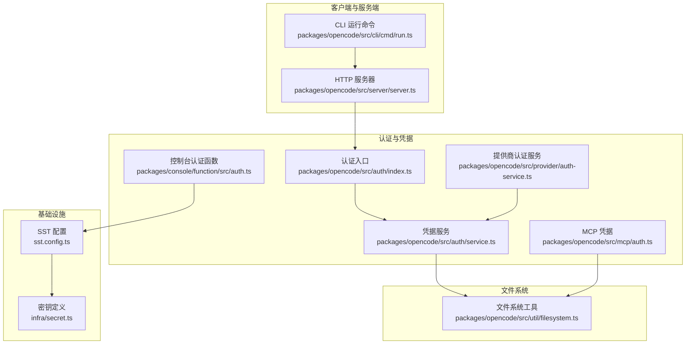
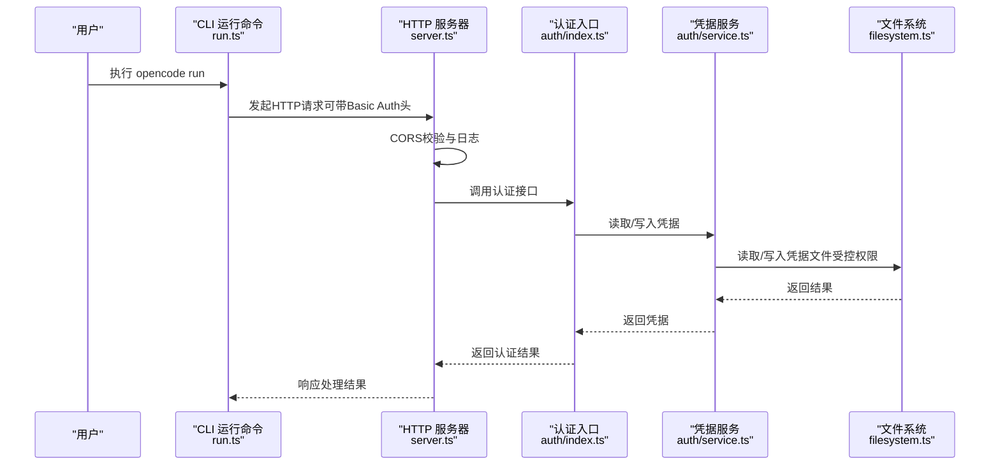
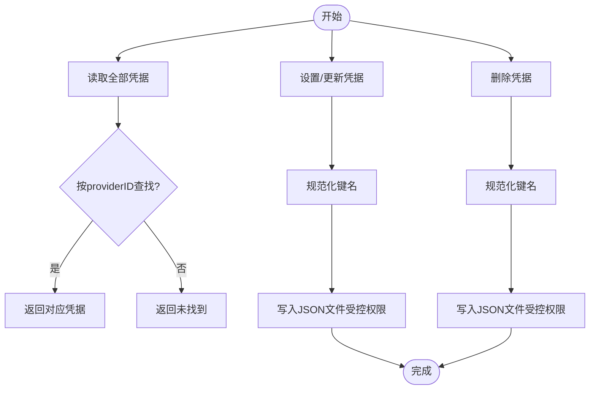
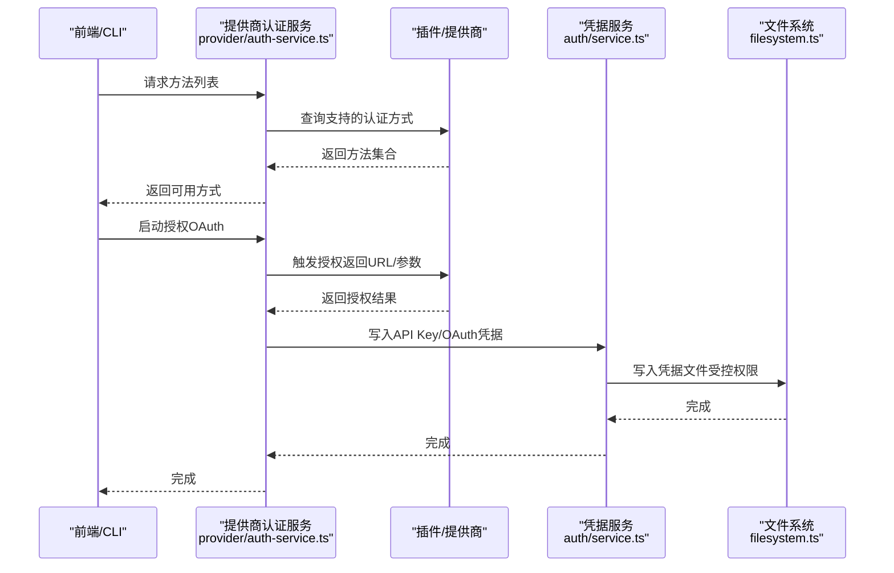
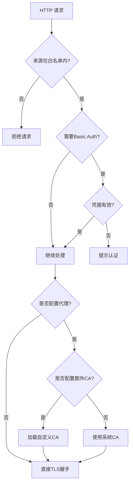
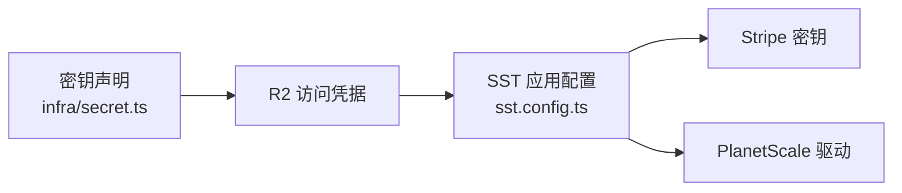
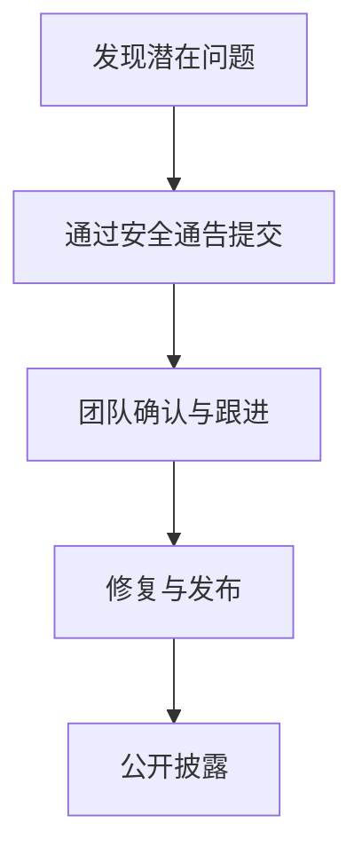
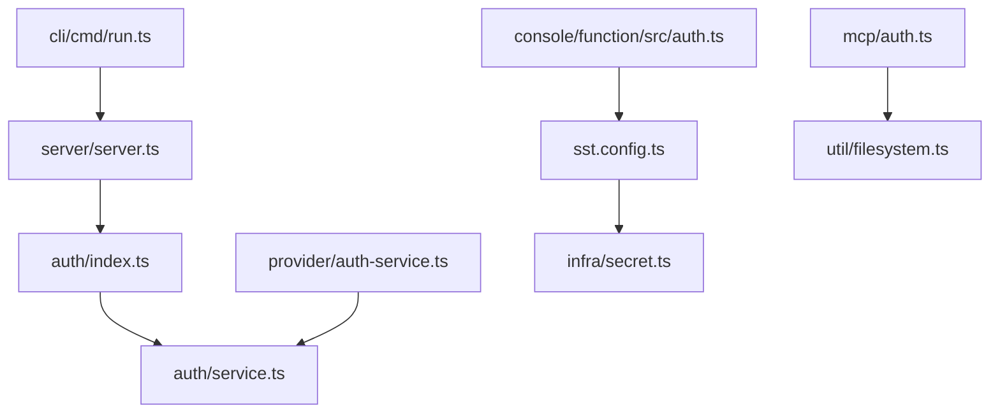

# 安全配置

<cite>
**本文引用的文件**
- [SECURITY.md](file://SECURITY.md)
- [README.md](file://README.md)
- [packages/opencode/src/auth/index.ts](file://packages/opencode/src/auth/index.ts)
- [packages/opencode/src/auth/service.ts](file://packages/opencode/src/auth/service.ts)
- [packages/opencode/src/mcp/auth.ts](file://packages/opencode/src/mcp/auth.ts)
- [packages/opencode/src/provider/auth-service.ts](file://packages/opencode/src/provider/auth-service.ts)
- [packages/opencode/src/util/filesystem.ts](file://packages/opencode/src/util/filesystem.ts)
- [packages/opencode/src/server/server.ts](file://packages/opencode/src/server/server.ts)
- [packages/opencode/src/cli/cmd/run.ts](file://packages/opencode/src/cli/cmd/run.ts)
- [packages/console/function/src/auth.ts](file://packages/console/function/src/auth.ts)
- [infra/secret.ts](file://infra/secret.ts)
- [sst.config.ts](file://sst.config.ts)
- [packages/web/src/content/docs/network.mdx](file://packages/web/src/content/docs/network.mdx)
- [packages/web/src/content/docs/zh-cn/agents.mdx](file://packages/web/src/content/docs/zh-cn/agents.mdx)
</cite>

## 目录
1. [简介](#简介)
2. [项目结构](#项目结构)
3. [核心组件](#核心组件)
4. [架构总览](#架构总览)
5. [详细组件分析](#详细组件分析)
6. [依赖关系分析](#依赖关系分析)
7. [性能考量](#性能考量)
8. [故障排查指南](#故障排查指南)
9. [结论](#结论)
10. [附录](#附录)

## 简介
本指南面向OpenCode的安全配置与运维实践，聚焦以下方面：
- 权限控制系统：文件访问权限、API访问控制、用户权限管理
- 认证与令牌管理：OAuth/OpenID Connect、API密钥、会话安全
- 网络与传输安全：SSL/TLS、证书信任链、代理与企业网络
- 数据保护：本地凭据存储权限、敏感信息隔离
- 审计与监控：请求日志、错误追踪、可观测性
- 合规与漏洞防护：威胁模型、责任边界、上报流程
- 最佳实践：最小权限、最小暴露面、默认安全

## 项目结构
OpenCode采用多包（monorepo）组织，安全相关能力分布在如下模块：
- 凭据与认证：packages/opencode/src/auth、packages/opencode/src/mcp、packages/opencode/src/provider、packages/console/function
- 服务器与路由：packages/opencode/src/server
- 文件系统与本地存储：packages/opencode/src/util/filesystem
- CLI与运行时：packages/opencode/src/cli/cmd/run
- 基础设施与密钥：infra/secret、sst.config
- 文档与网络配置：packages/web/src/content/docs/network.mdx
- 安全策略与威胁模型：SECURITY.md、README.md

图表来源
- [packages/opencode/src/cli/cmd/run.ts:657-676](file://packages/opencode/src/cli/cmd/run.ts#L657-L676)
- [packages/opencode/src/server/server.ts:88-134](file://packages/opencode/src/server/server.ts#L88-L134)
- [packages/opencode/src/auth/index.ts:1-58](file://packages/opencode/src/auth/index.ts#L1-L58)
- [packages/opencode/src/auth/service.ts:1-102](file://packages/opencode/src/auth/service.ts#L1-L102)
- [packages/opencode/src/mcp/auth.ts:1-131](file://packages/opencode/src/mcp/auth.ts#L1-L131)
- [packages/opencode/src/provider/auth-service.ts:1-169](file://packages/opencode/src/provider/auth-service.ts#L1-L169)
- [packages/console/function/src/auth.ts:1-224](file://packages/console/function/src/auth.ts#L1-L224)
- [sst.config.ts:1-24](file://sst.config.ts#L1-L24)
- [infra/secret.ts:1-5](file://infra/secret.ts#L1-L5)
- [packages/opencode/src/util/filesystem.ts:1-204](file://packages/opencode/src/util/filesystem.ts#L1-L204)

章节来源
- [README.md:1-142](file://README.md#L1-L142)
- [SECURITY.md:1-48](file://SECURITY.md#L1-L48)

## 核心组件
- 凭据存储与访问控制
  - 本地凭据文件：使用受控文件权限写入与读取，限制为当前用户可读写
  - 多种凭据类型：OAuth、API Key、Well-Known令牌
  - MCP凭据：支持令牌过期检测、URL绑定校验
- 认证与授权
  - 提供商认证服务：统一管理OAuth授权流程与API Key注入
  - 控制台认证函数：基于OpenAuthJS的OIDC/GitHub登录、主题与存储集成
- 服务器与网络
  - CORS白名单：严格限定来源，仅允许本地与官方域名
  - 可选Basic Auth：通过环境变量启用HTTP Basic认证
  - 代理与证书：支持标准代理变量与自定义CA证书
- 基础设施与密钥
  - SST应用配置：按阶段保护生产资源
  - 密钥声明：集中管理外部服务密钥

章节来源
- [packages/opencode/src/auth/service.ts:36-98](file://packages/opencode/src/auth/service.ts#L36-L98)
- [packages/opencode/src/mcp/auth.ts:32-130](file://packages/opencode/src/mcp/auth.ts#L32-L130)
- [packages/opencode/src/provider/auth-service.ts:75-168](file://packages/opencode/src/provider/auth-service.ts#L75-L168)
- [packages/console/function/src/auth.ts:42-223](file://packages/console/function/src/auth.ts#L42-L223)
- [packages/opencode/src/server/server.ts:104-129](file://packages/opencode/src/server/server.ts#L104-L129)
- [packages/opencode/src/cli/cmd/run.ts:657-662](file://packages/opencode/src/cli/cmd/run.ts#L657-L662)
- [packages/web/src/content/docs/network.mdx:10-57](file://packages/web/src/content/docs/network.mdx#L10-L57)
- [sst.config.ts:3-23](file://sst.config.ts#L3-L23)
- [infra/secret.ts:1-5](file://infra/secret.ts#L1-L5)

## 架构总览
下图展示从CLI到服务器、再到认证与凭据存储的整体交互路径。

图表来源
- [packages/opencode/src/cli/cmd/run.ts:657-676](file://packages/opencode/src/cli/cmd/run.ts#L657-L676)
- [packages/opencode/src/server/server.ts:88-134](file://packages/opencode/src/server/server.ts#L88-L134)
- [packages/opencode/src/auth/index.ts:42-57](file://packages/opencode/src/auth/index.ts#L42-L57)
- [packages/opencode/src/auth/service.ts:55-98](file://packages/opencode/src/auth/service.ts#L55-L98)
- [packages/opencode/src/util/filesystem.ts:54-77](file://packages/opencode/src/util/filesystem.ts#L54-L77)

## 详细组件分析

### 凭据存储与访问控制（auth.json/mcp-auth.json）
- 存储位置与权限
  - 本地JSON文件存放于数据目录，写入时设置严格权限以限制其他用户访问
  - 读取时进行解码与过滤，忽略无效条目
- 支持的凭据类型
  - OAuth：包含访问令牌、刷新令牌、过期时间等
  - API Key：直接存储密钥
  - Well-Known：键值与令牌组合
- MCP凭据扩展
  - 绑定服务器URL，防止凭据跨站点使用
  - 令牌过期检查，避免使用已失效令牌
- 写入一致性
  - 规范化键名，删除冗余斜杠后缀，确保唯一性

图表来源
- [packages/opencode/src/auth/service.ts:55-98](file://packages/opencode/src/auth/service.ts#L55-L98)
- [packages/opencode/src/mcp/auth.ts:60-85](file://packages/opencode/src/mcp/auth.ts#L60-L85)

章节来源
- [packages/opencode/src/auth/service.ts:36-98](file://packages/opencode/src/auth/service.ts#L36-L98)
- [packages/opencode/src/mcp/auth.ts:32-130](file://packages/opencode/src/mcp/auth.ts#L32-L130)
- [packages/opencode/src/util/filesystem.ts:54-77](file://packages/opencode/src/util/filesystem.ts#L54-L77)

### 认证与授权（提供商与控制台）
- 提供商认证服务
  - 列举可用认证方式（OAuth/API Key）
  - 启动OAuth授权流程并返回重定向URL
  - 回调完成后根据结果写入API Key或OAuth凭据
- 控制台认证函数
  - 使用OpenAuthJS集成GitHub/Google OIDC
  - 成功后解析用户主体与邮箱，创建账户与工作区关联
  - 生产环境外对邮箱域进行限制

图表来源
- [packages/opencode/src/provider/auth-service.ts:75-168](file://packages/opencode/src/provider/auth-service.ts#L75-L168)
- [packages/opencode/src/auth/service.ts:55-98](file://packages/opencode/src/auth/service.ts#L55-L98)
- [packages/console/function/src/auth.ts:42-223](file://packages/console/function/src/auth.ts#L42-L223)

章节来源
- [packages/opencode/src/provider/auth-service.ts:75-168](file://packages/opencode/src/provider/auth-service.ts#L75-L168)
- [packages/console/function/src/auth.ts:42-223](file://packages/console/function/src/auth.ts#L42-L223)

### 服务器与网络（CORS、Basic Auth、代理与证书）
- CORS策略
  - 仅允许本地来源（localhost/127.0.0.1）、Tauri本地协议、以及官方域名
  - 支持动态追加白名单来源
- Basic Auth
  - 通过环境变量启用，用户名可自定义，默认用户名为固定值
  - 自动构造Authorization头用于内部SDK调用
- 代理与证书
  - 支持HTTPS_PROXY/HTTP_PROXY/NO_PROXY
  - 支持NODE_EXTRA_CA_CERTS加载企业根证书
  - 明确要求绕过本地服务器代理以避免路由环

图表来源
- [packages/opencode/src/server/server.ts:104-129](file://packages/opencode/src/server/server.ts#L104-L129)
- [packages/opencode/src/cli/cmd/run.ts:657-662](file://packages/opencode/src/cli/cmd/run.ts#L657-L662)
- [packages/web/src/content/docs/network.mdx:10-57](file://packages/web/src/content/docs/network.mdx#L10-L57)

章节来源
- [packages/opencode/src/server/server.ts:88-134](file://packages/opencode/src/server/server.ts#L88-L134)
- [packages/opencode/src/cli/cmd/run.ts:657-676](file://packages/opencode/src/cli/cmd/run.ts#L657-L676)
- [packages/web/src/content/docs/network.mdx:10-57](file://packages/web/src/content/docs/network.mdx#L10-L57)

### 基础设施与密钥管理
- SST应用配置
  - 按阶段保留/清理资源，生产环境保护关键资源
  - 声明Stripe/PlanetScale等外部服务集成
- 密钥声明
  - 在基础设施层集中声明密钥，避免硬编码

图表来源
- [sst.config.ts:3-23](file://sst.config.ts#L3-L23)
- [infra/secret.ts:1-5](file://infra/secret.ts#L1-L5)

章节来源
- [sst.config.ts:3-23](file://sst.config.ts#L3-L23)
- [infra/secret.ts:1-5](file://infra/secret.ts#L1-L5)

### 安全审计与合规
- 威胁模型与责任边界
  - 不提供沙箱隔离；建议在容器/虚拟机中运行
  - 服务器模式需启用密码认证；否则视为未认证运行
  - LLM提供商与外部MCP服务器不在信任边界内
- 报告与响应
  - 通过GitHub Security Advisory提交漏洞
  - 提供邮件渠道作为升级路径

图表来源
- [SECURITY.md:21-47](file://SECURITY.md#L21-L47)

章节来源
- [SECURITY.md:9-47](file://SECURITY.md#L9-L47)

## 依赖关系分析
- 组件耦合
  - 认证入口依赖凭据服务；提供商认证服务依赖插件与实例状态
  - 服务器中间件依赖CORS与日志；Basic Auth依赖环境变量
  - 控制台认证函数依赖Cloudflare KV存储与数据库
- 外部依赖
  - OpenAuthJS用于OIDC/GitHub登录
  - Cloudflare Workers/KV用于认证状态存储
  - SST用于基础设施编排与密钥注入

图表来源
- [packages/opencode/src/auth/index.ts:1-58](file://packages/opencode/src/auth/index.ts#L1-L58)
- [packages/opencode/src/auth/service.ts:1-102](file://packages/opencode/src/auth/service.ts#L1-L102)
- [packages/opencode/src/provider/auth-service.ts:1-169](file://packages/opencode/src/provider/auth-service.ts#L1-L169)
- [packages/opencode/src/server/server.ts:88-134](file://packages/opencode/src/server/server.ts#L88-L134)
- [packages/opencode/src/cli/cmd/run.ts:657-676](file://packages/opencode/src/cli/cmd/run.ts#L657-L676)
- [packages/console/function/src/auth.ts:1-224](file://packages/console/function/src/auth.ts#L1-L224)
- [sst.config.ts:1-24](file://sst.config.ts#L1-L24)
- [infra/secret.ts:1-5](file://infra/secret.ts#L1-L5)
- [packages/opencode/src/mcp/auth.ts:1-131](file://packages/opencode/src/mcp/auth.ts#L1-L131)
- [packages/opencode/src/util/filesystem.ts:1-204](file://packages/opencode/src/util/filesystem.ts#L1-L204)

章节来源
- [packages/opencode/src/auth/index.ts:1-58](file://packages/opencode/src/auth/index.ts#L1-L58)
- [packages/opencode/src/provider/auth-service.ts:75-168](file://packages/opencode/src/provider/auth-service.ts#L75-L168)
- [packages/opencode/src/server/server.ts:104-129](file://packages/opencode/src/server/server.ts#L104-L129)
- [packages/opencode/src/cli/cmd/run.ts:657-662](file://packages/opencode/src/cli/cmd/run.ts#L657-L662)
- [packages/console/function/src/auth.ts:42-223](file://packages/console/function/src/auth.ts#L42-L223)
- [sst.config.ts:3-23](file://sst.config.ts#L3-L23)
- [infra/secret.ts:1-5](file://infra/secret.ts#L1-L5)
- [packages/opencode/src/mcp/auth.ts:32-130](file://packages/opencode/src/mcp/auth.ts#L32-L130)
- [packages/opencode/src/util/filesystem.ts:54-77](file://packages/opencode/src/util/filesystem.ts#L54-L77)

## 性能考量
- 文件I/O开销
  - 凭据读写为本地JSON文件，建议避免频繁写入；批量更新或合并后再写入
- CORS与日志
  - 日志记录在非特殊路径上开启，避免对高频路径产生显著延迟
- 代理与证书
  - 加载额外CA证书会增加启动时TLS握手成本，建议仅在必要时启用

## 故障排查指南
- 无法连接服务器或出现跨域错误
  - 检查CORS白名单是否包含当前来源
  - 确认本地服务器代理配置正确，避免路由环
- Basic Auth失败
  - 确认环境变量已设置且用户名正确
- 凭据未生效或丢失
  - 检查凭据文件权限与存在性
  - 确认键名规范化（去除尾部斜杠）导致的覆盖
- MCP凭据无效
  - 确认凭据绑定的服务器URL与当前一致
  - 检查令牌是否过期
- 控制台登录异常
  - 确认提供商回调成功并写入凭据
  - 生产环境外检查邮箱域限制

章节来源
- [packages/opencode/src/server/server.ts:104-129](file://packages/opencode/src/server/server.ts#L104-L129)
- [packages/web/src/content/docs/network.mdx:10-57](file://packages/web/src/content/docs/network.mdx#L10-L57)
- [packages/opencode/src/cli/cmd/run.ts:657-662](file://packages/opencode/src/cli/cmd/run.ts#L657-L662)
- [packages/opencode/src/auth/service.ts:55-98](file://packages/opencode/src/auth/service.ts#L55-L98)
- [packages/opencode/src/mcp/auth.ts:43-54](file://packages/opencode/src/mcp/auth.ts#L43-L54)
- [packages/console/function/src/auth.ts:104-219](file://packages/console/function/src/auth.ts#L104-L219)

## 结论
OpenCode的安全设计围绕“最小权限、最小暴露面”展开：本地凭据文件受控权限、严格的CORS白名单、可选Basic Auth、企业网络代理与证书支持、以及明确的威胁模型与漏洞上报流程。结合本文最佳实践与故障排查建议，可在保障功能可用的同时提升整体安全性与合规性。

## 附录
- 安全审计代理示例
  - 可参考文档中的安全审计代理配置，限制工具权限并聚焦识别输入验证、认证授权、数据暴露、依赖与配置安全等问题

章节来源
- [packages/web/src/content/docs/zh-cn/agents.mdx:728-746](file://packages/web/src/content/docs/zh-cn/agents.mdx#L728-L746)