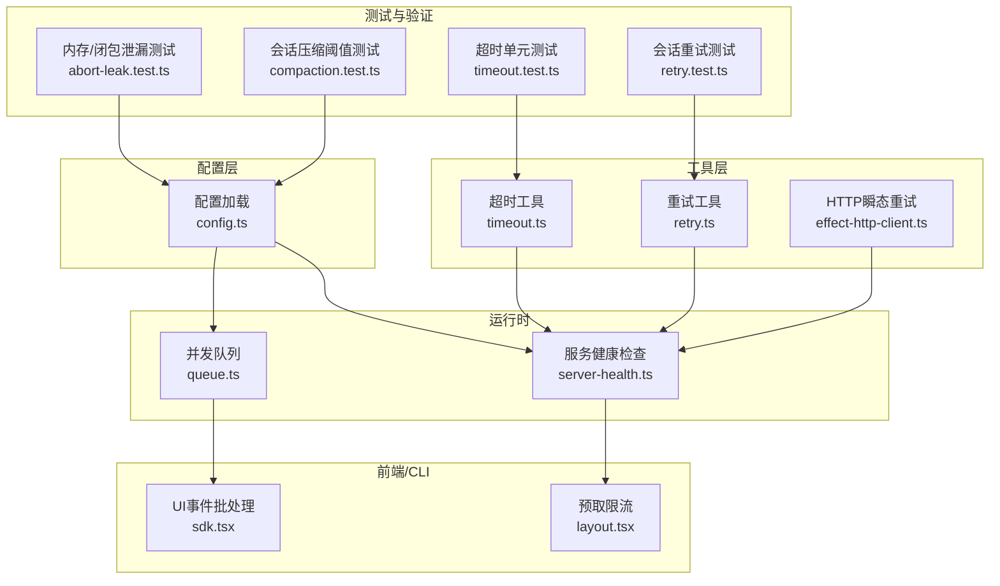
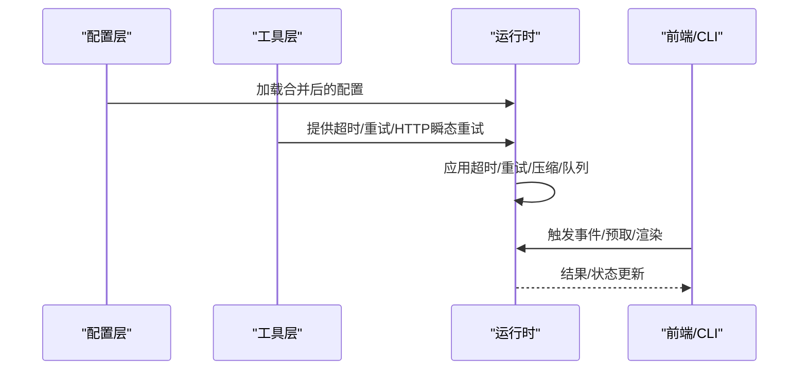
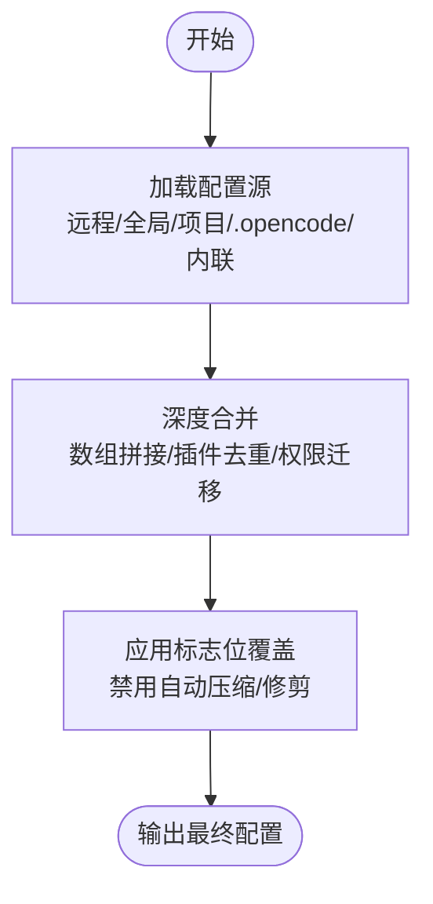
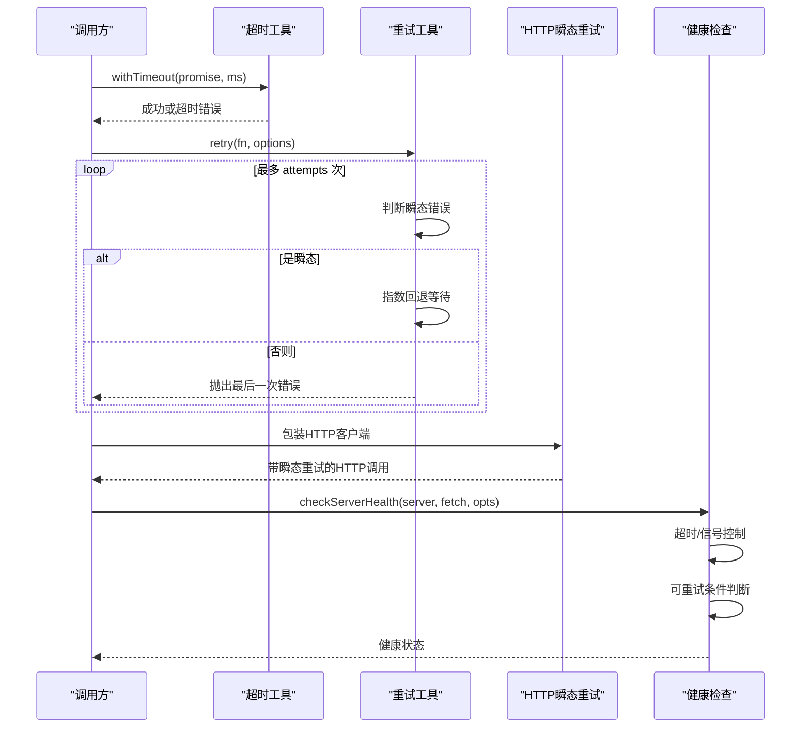
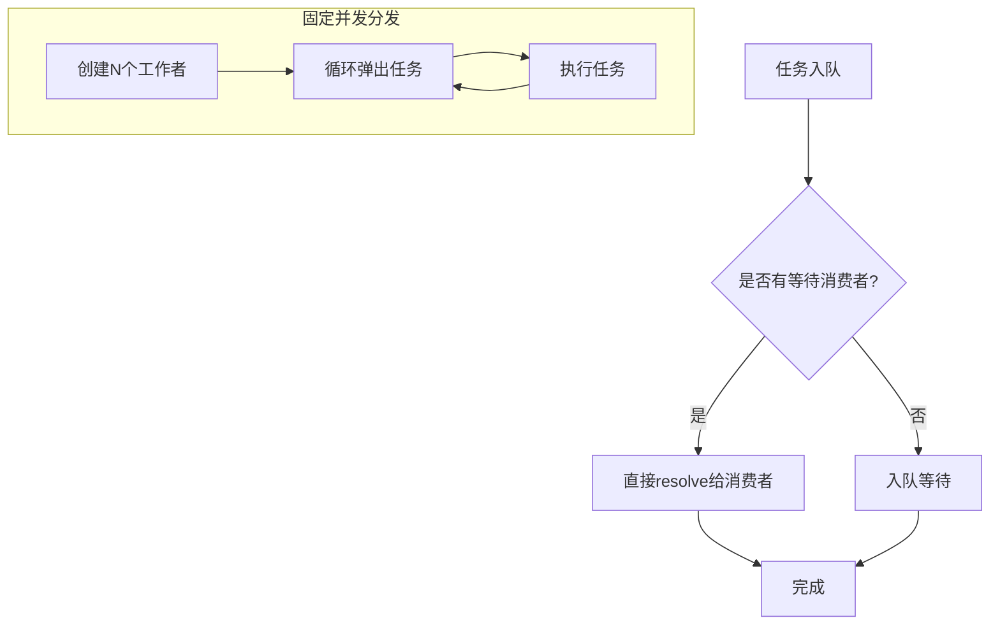
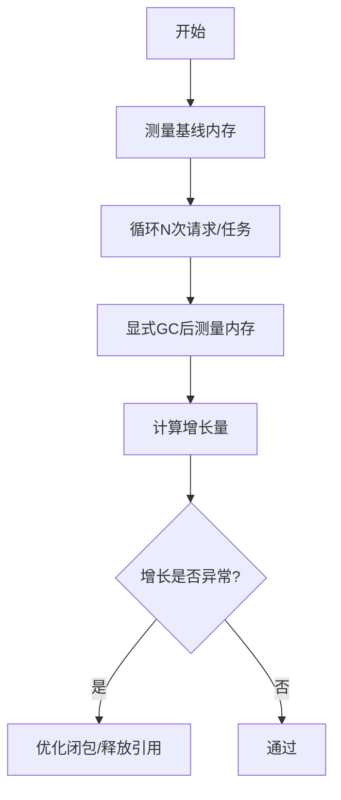
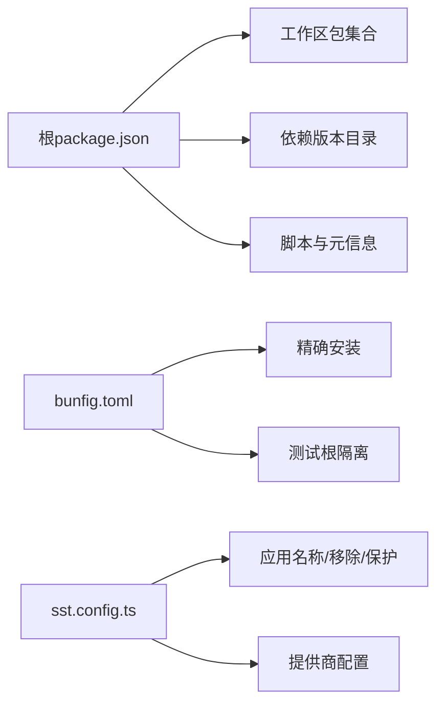

# 性能配置

<cite>
**本文引用的文件**
- [package.json](file://package.json)
- [bunfig.toml](file://bunfig.toml)
- [sst.config.ts](file://sst.config.ts)
- [packages/opencode/src/config/config.ts](file://packages/opencode/src/config/config.ts)
- [packages/opencode/src/util/timeout.ts](file://packages/opencode/src/util/timeout.ts)
- [packages/util/src/retry.ts](file://packages/util/src/retry.ts)
- [packages/opencode/src/util/effect-http-client.ts](file://packages/opencode/src/util/effect-http-client.ts)
- [packages/app/src/utils/server-health.ts](file://packages/app/src/utils/server-health.ts)
- [packages/opencode/test/memory/abort-leak.test.ts](file://packages/opencode/test/memory/abort-leak.test.ts)
- [packages/opencode/test/session/compaction.test.ts](file://packages/opencode/test/session/compaction.test.ts)
- [packages/opencode/test/util/timeout.test.ts](file://packages/opencode/test/util/timeout.test.ts)
- [packages/opencode/test/session/retry.test.ts](file://packages/opencode/test/session/retry.test.ts)
- [packages/opencode/src/util/queue.ts](file://packages/opencode/src/util/queue.ts)
- [packages/opencode/src/cli/cmd/tui/context/sdk.tsx](file://packages/opencode/src/cli/cmd/tui/context/sdk.tsx)
- [packages/app/src/pages/layout.tsx](file://packages/app/src/pages/layout.tsx)
</cite>

## 目录
1. [简介](#简介)
2. [项目结构](#项目结构)
3. [核心组件](#核心组件)
4. [架构总览](#架构总览)
5. [详细组件分析](#详细组件分析)
6. [依赖关系分析](#依赖关系分析)
7. [性能考量](#性能考量)
8. [故障排查指南](#故障排查指南)
9. [结论](#结论)
10. [附录](#附录)

## 简介
本指南面向OpenCode的性能配置与调优，聚焦以下方面：
- 内存管理参数与GC行为、闭包泄漏规避
- 并发控制与队列调度（并发度、队列长度、批处理）
- 资源限制与会话压缩阈值
- 代理执行的超时、重试与错误恢复策略
- 网络请求的超时、重试与连接复用
- 性能监控指标与基准测试方法
- 不同负载场景下的配置建议与调优策略

## 项目结构
OpenCode采用多包工作区，核心与性能相关的能力分布在以下模块：
- 配置加载与合并：packages/opencode/src/config/config.ts
- 超时工具：packages/opencode/src/util/timeout.ts
- 通用重试工具：packages/util/src/retry.ts
- 效率化HTTP客户端（含瞬态重试）：packages/opencode/src/util/effect-http-client.ts
- 服务健康检查与重试：packages/app/src/utils/server-health.ts
- 内存与并发测试：packages/opencode/test/memory/abort-leak.test.ts、packages/opencode/test/session/compaction.test.ts
- 并发队列与批处理：packages/opencode/src/util/queue.ts
- UI事件批处理与预取限流：packages/opencode/src/cli/cmd/tui/context/sdk.tsx、packages/app/src/pages/layout.tsx

图表来源
- [packages/opencode/src/config/config.ts:1-266](file://packages/opencode/src/config/config.ts#L1-L266)
- [packages/opencode/src/util/timeout.ts:1-15](file://packages/opencode/src/util/timeout.ts#L1-L15)
- [packages/util/src/retry.ts:1-42](file://packages/util/src/retry.ts#L1-L42)
- [packages/opencode/src/util/effect-http-client.ts:1-11](file://packages/opencode/src/util/effect-http-client.ts#L1-L11)
- [packages/app/src/utils/server-health.ts:40-73](file://packages/app/src/utils/server-health.ts#L40-L73)
- [packages/opencode/src/util/queue.ts:1-32](file://packages/opencode/src/util/queue.ts#L1-L32)
- [packages/opencode/src/cli/cmd/tui/context/sdk.tsx:43-92](file://packages/opencode/src/cli/cmd/tui/context/sdk.tsx#L43-L92)
- [packages/app/src/pages/layout.tsx:861-907](file://packages/app/src/pages/layout.tsx#L861-L907)
- [packages/opencode/test/memory/abort-leak.test.ts:44-82](file://packages/opencode/test/memory/abort-leak.test.ts#L44-L82)
- [packages/opencode/test/session/compaction.test.ts:74-213](file://packages/opencode/test/session/compaction.test.ts#L74-L213)
- [packages/opencode/test/util/timeout.test.ts:1-21](file://packages/opencode/test/util/timeout.test.ts#L1-L21)
- [packages/opencode/test/session/retry.test.ts:66-104](file://packages/opencode/test/session/retry.test.ts#L66-L104)

章节来源
- [package.json:1-118](file://package.json#L1-L118)
- [bunfig.toml:1-7](file://bunfig.toml#L1-L7)
- [sst.config.ts:1-24](file://sst.config.ts#L1-L24)

## 核心组件
- 配置系统：负责远程/全局/项目/目录级配置的合并与加载，支持企业托管配置覆盖，以及插件去重与权限迁移等。
- 超时工具：基于竞态Promise实现统一超时控制。
- 重试工具：指数回退、最大延迟、可配置重试条件，识别瞬态错误。
- HTTP瞬态重试：基于Effect的HTTP客户端包装，内置指数抖动与有限次数重试。
- 服务健康检查：带超时与可选信号的健康探测，结合重试策略。
- 并发队列：简单异步队列与固定并发的工作分发器。
- UI事件批处理：16ms窗口内批量刷新，降低渲染抖动。
- 预取限流：按目录限制并发预取会话数量，避免资源争用。

章节来源
- [packages/opencode/src/config/config.ts:1-266](file://packages/opencode/src/config/config.ts#L1-L266)
- [packages/opencode/src/util/timeout.ts:1-15](file://packages/opencode/src/util/timeout.ts#L1-L15)
- [packages/util/src/retry.ts:1-42](file://packages/util/src/retry.ts#L1-L42)
- [packages/opencode/src/util/effect-http-client.ts:1-11](file://packages/opencode/src/util/effect-http-client.ts#L1-L11)
- [packages/app/src/utils/server-health.ts:40-73](file://packages/app/src/utils/server-health.ts#L40-L73)
- [packages/opencode/src/util/queue.ts:1-32](file://packages/opencode/src/util/queue.ts#L1-L32)
- [packages/opencode/src/cli/cmd/tui/context/sdk.tsx:43-92](file://packages/opencode/src/cli/cmd/tui/context/sdk.tsx#L43-L92)
- [packages/app/src/pages/layout.tsx:861-907](file://packages/app/src/pages/layout.tsx#L861-L907)

## 架构总览
OpenCode的性能相关能力通过“配置—工具—运行时—前端/CLI”的分层组织，形成如下闭环：
- 配置层决定行为边界（如自动压缩、权限、MCP超时等）
- 工具层提供超时、重试、HTTP瞬态重试等通用能力
- 运行时层在会话、网络、UI事件等关键路径应用上述能力
- 前端/CLI层在交互与预取上做进一步的节流与批处理

图表来源
- [packages/opencode/src/config/config.ts:81-266](file://packages/opencode/src/config/config.ts#L81-L266)
- [packages/opencode/src/util/timeout.ts:1-15](file://packages/opencode/src/util/timeout.ts#L1-L15)
- [packages/util/src/retry.ts:1-42](file://packages/util/src/retry.ts#L1-L42)
- [packages/opencode/src/util/effect-http-client.ts:1-11](file://packages/opencode/src/util/effect-http-client.ts#L1-L11)
- [packages/app/src/utils/server-health.ts:40-73](file://packages/app/src/utils/server-health.ts#L40-L73)
- [packages/opencode/src/util/queue.ts:1-32](file://packages/opencode/src/util/queue.ts#L1-L32)
- [packages/opencode/src/cli/cmd/tui/context/sdk.tsx:43-92](file://packages/opencode/src/cli/cmd/tui/context/sdk.tsx#L43-L92)
- [packages/app/src/pages/layout.tsx:861-907](file://packages/app/src/pages/layout.tsx#L861-L907)

## 详细组件分析

### 配置系统与资源限制
- 配置优先级与合并：远程.well-known、全局、自定义路径、项目、.opencode目录、内联内容；企业托管目录最高优先级仅加载配置文件。
- 自动压缩与修剪开关：可通过标志位禁用自动压缩或修剪，以配合特定场景的稳定性需求。
- 插件去重：按规范名称去重，后出现者优先，避免重复加载。
- 权限与工具迁移：旧版tools字段迁移到permission，确保兼容性。
- MCP超时：MCP本地/远程配置支持超时字段，默认5秒，用于约束外部工具交互。

图表来源
- [packages/opencode/src/config/config.ts:81-266](file://packages/opencode/src/config/config.ts#L81-L266)

章节来源
- [packages/opencode/src/config/config.ts:1-266](file://packages/opencode/src/config/config.ts#L1-L266)

### 超时与重试机制
- 超时工具：通过Promise.race实现统一超时，超时后抛出带毫秒数的错误信息。
- 通用重试：默认最多3次，基础延迟500ms，指数回退因子2，最大延迟10000ms；仅对瞬态错误进行重试。
- HTTP瞬态重试：基于Effect的HttpClient包装，指数抖动+有限次数重试，适配网络波动。
- 服务健康检查：支持超时信号与可选AbortSignal，按可重试条件等待后再次尝试，避免瞬时失败影响判断。
- 会话重试：支持从响应头解析retry-after，上限保护避免TimeoutOverflowWarning。

图表来源
- [packages/opencode/src/util/timeout.ts:1-15](file://packages/opencode/src/util/timeout.ts#L1-L15)
- [packages/util/src/retry.ts:1-42](file://packages/util/src/retry.ts#L1-L42)
- [packages/opencode/src/util/effect-http-client.ts:1-11](file://packages/opencode/src/util/effect-http-client.ts#L1-L11)
- [packages/app/src/utils/server-health.ts:40-73](file://packages/app/src/utils/server-health.ts#L40-L73)
- [packages/opencode/test/session/retry.test.ts:66-104](file://packages/opencode/test/session/retry.test.ts#L66-L104)

章节来源
- [packages/opencode/src/util/timeout.ts:1-15](file://packages/opencode/src/util/timeout.ts#L1-L15)
- [packages/util/src/retry.ts:1-42](file://packages/util/src/retry.ts#L1-L42)
- [packages/opencode/src/util/effect-http-client.ts:1-11](file://packages/opencode/src/util/effect-http-client.ts#L1-L11)
- [packages/app/src/utils/server-health.ts:40-73](file://packages/app/src/utils/server-health.ts#L40-L73)
- [packages/opencode/test/util/timeout.test.ts:1-21](file://packages/opencode/test/util/timeout.test.ts#L1-L21)
- [packages/opencode/test/session/retry.test.ts:66-104](file://packages/opencode/test/session/retry.test.ts#L66-L104)

### 并发控制与批处理
- 异步队列：push时优先resolve等待中的消费者，否则入队；next时优先消费队列，否则挂起等待。
- 固定并发工作分发：按并发数创建工作者，循环从待处理列表弹出任务并执行，保证吞吐与资源占用平衡。
- UI事件批处理：16ms窗口内聚合事件，一次性批量触发渲染，降低抖动与重绘成本。
- 预取限流：按目录维护预取队列与LRU，超过阈值丢弃最旧项，高优先级任务可抢占头部。

图表来源
- [packages/opencode/src/util/queue.ts:1-32](file://packages/opencode/src/util/queue.ts#L1-L32)
- [packages/opencode/src/cli/cmd/tui/context/sdk.tsx:43-92](file://packages/opencode/src/cli/cmd/tui/context/sdk.tsx#L43-L92)
- [packages/app/src/pages/layout.tsx:861-907](file://packages/app/src/pages/layout.tsx#L861-L907)

章节来源
- [packages/opencode/src/util/queue.ts:1-32](file://packages/opencode/src/util/queue.ts#L1-L32)
- [packages/opencode/src/cli/cmd/tui/context/sdk.tsx:43-92](file://packages/opencode/src/cli/cmd/tui/context/sdk.tsx#L43-L92)
- [packages/app/src/pages/layout.tsx:861-907](file://packages/app/src/pages/layout.tsx#L861-L907)

### 内存管理与资源限制
- 内存增长测试：通过多次请求与显式GC测量堆内存增长，对比闭包捕获模式与绑定模式，验证闭包泄漏问题与修复效果。
- 会话压缩阈值：根据模型上下文/输入/输出限制计算是否溢出，支持无输入上限模型的退化场景，确保保留足够的输出空间。
- 会话压缩开关：可通过标志位禁用自动压缩/修剪，便于在高一致性场景下稳定行为。

图表来源
- [packages/opencode/test/memory/abort-leak.test.ts:44-82](file://packages/opencode/test/memory/abort-leak.test.ts#L44-L82)
- [packages/opencode/test/session/compaction.test.ts:74-213](file://packages/opencode/test/session/compaction.test.ts#L74-L213)
- [packages/opencode/src/config/config.ts:251-258](file://packages/opencode/src/config/config.ts#L251-L258)

章节来源
- [packages/opencode/test/memory/abort-leak.test.ts:44-82](file://packages/opencode/test/memory/abort-leak.test.ts#L44-L82)
- [packages/opencode/test/session/compaction.test.ts:74-213](file://packages/opencode/test/session/compaction.test.ts#L74-L213)
- [packages/opencode/src/config/config.ts:251-258](file://packages/opencode/src/config/config.ts#L251-L258)

## 依赖关系分析
- 工作区与包管理：根package.json声明工作区与依赖版本目录，统一类型与工具链版本。
- 安装策略：bunfig.toml启用精确安装，测试根目录隔离，减少意外副作用。
- 基础设施配置：sst.config.ts定义应用名称、移除策略、保护级别与提供商，为部署与环境变量提供基础。

图表来源
- [package.json:21-71](file://package.json#L21-L71)
- [bunfig.toml:1-7](file://bunfig.toml#L1-L7)
- [sst.config.ts:3-22](file://sst.config.ts#L3-L22)

章节来源
- [package.json:1-118](file://package.json#L1-L118)
- [bunfig.toml:1-7](file://bunfig.toml#L1-L7)
- [sst.config.ts:1-24](file://sst.config.ts#L1-L24)

## 性能考量
- CPU与内存优化
  - 闭包模式优化：避免在循环中创建捕获大对象的闭包，改用绑定或外提处理函数，参考内存泄漏测试结果。
  - GC与内存增长：定期显式触发GC并测量堆内存，确保长时间运行任务不会产生持续增长。
  - 会话压缩：合理设置模型上下文/输入/输出限制，避免频繁触发压缩；必要时禁用自动压缩以换取稳定性。
- 并发与队列
  - 并发度：根据CPU核数与IO特性设置并发工作者数量，避免过度竞争导致抖动。
  - 队列长度：限制预取/渲染队列长度，防止内存峰值过高；高优先级任务可抢占头部。
- 网络请求
  - 超时：为每个请求设置合理超时，避免阻塞；结合AbortSignal实现可取消。
  - 重试：对瞬态错误采用指数回退，设置最大延迟；从响应头解析retry-after以尊重服务端限流。
  - 连接复用：使用持久连接与连接池，减少握手开销；对长尾请求采用瞬态重试。
- 监控与基准
  - 指标：CPU使用率、内存占用、队列长度、请求延迟分布、重试次数、压缩触发次数。
  - 基准：在相同硬件与数据集上对比不同并发度、批大小、队列长度的吞吐与延迟。

## 故障排查指南
- 超时问题
  - 现象：操作在指定时间内未完成，抛出超时错误。
  - 排查：确认超时阈值是否过小；检查网络状况与上游服务延迟；使用AbortSignal取消长时间任务。
  - 参考：超时工具与单元测试。
- 重试风暴
  - 现象：瞬时网络波动引发大量重试，放大下游压力。
  - 排查：调整最大重试次数与最大延迟；区分瞬态错误与永久性错误；尊重服务端retry-after。
  - 参考：通用重试工具与会话重试测试。
- 内存泄漏
  - 现象：长时间运行后内存持续增长。
  - 排查：检查闭包捕获大对象；避免在循环中累积引用；定期GC并测量增长。
  - 参考：内存泄漏测试。
- 压缩误触发
  - 现象：会话频繁被压缩，影响稳定性。
  - 排查：检查模型上下文/输入/输出限制；必要时禁用自动压缩；评估输出空间预留。
  - 参考：会话压缩阈值测试与配置标志位。

章节来源
- [packages/opencode/src/util/timeout.ts:1-15](file://packages/opencode/src/util/timeout.ts#L1-L15)
- [packages/util/src/retry.ts:1-42](file://packages/util/src/retry.ts#L1-L42)
- [packages/opencode/test/session/retry.test.ts:66-104](file://packages/opencode/test/session/retry.test.ts#L66-L104)
- [packages/opencode/test/memory/abort-leak.test.ts:44-82](file://packages/opencode/test/memory/abort-leak.test.ts#L44-L82)
- [packages/opencode/test/session/compaction.test.ts:74-213](file://packages/opencode/test/session/compaction.test.ts#L74-L213)
- [packages/opencode/src/config/config.ts:251-258](file://packages/opencode/src/config/config.ts#L251-L258)

## 结论
通过配置系统、超时/重试、HTTP瞬态重试、并发队列与UI批处理等能力的协同，OpenCode在不同负载场景下具备良好的性能弹性。建议在生产环境中：
- 明确超时与重试策略，尊重服务端限流；
- 控制并发度与队列长度，避免内存峰值；
- 关注闭包与引用管理，防止内存泄漏；
- 使用压缩阈值与标志位在稳定性与效率间取得平衡；
- 建立指标与基准，持续迭代调优。

## 附录
- 不同负载场景建议
  - 低负载：保守并发度，较长队列容忍度，适度重试。
  - 中负载：中等并发，严格队列长度，指数回退+最大延迟。
  - 高负载：动态并发，严格的预取限流，瞬态重试+retry-after。
- 关键配置清单
  - 超时：请求超时、健康检查超时、UI批处理窗口
  - 重试：最大次数、基础延迟、回退因子、最大延迟、瞬态错误识别
  - 并发：工作者数量、队列长度、预取阈值
  - 压缩：自动压缩/修剪开关、上下文/输入/输出限制
  - 网络：连接池大小、keep-alive、瞬态重试策略