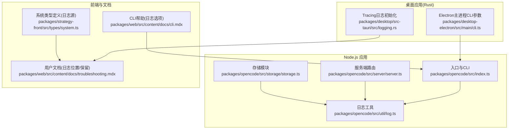
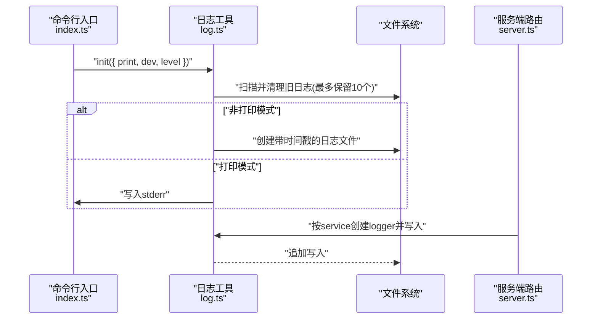
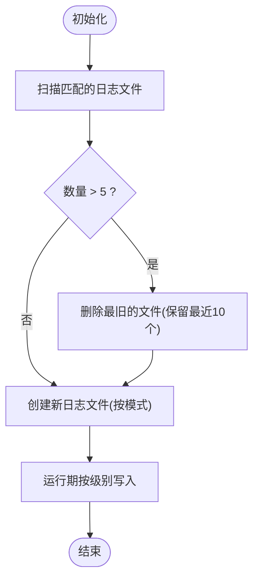
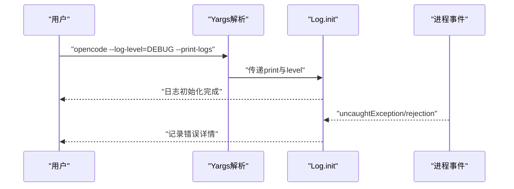
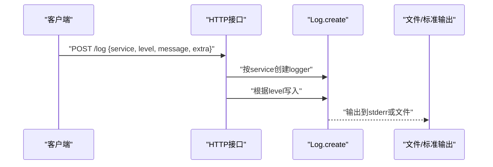
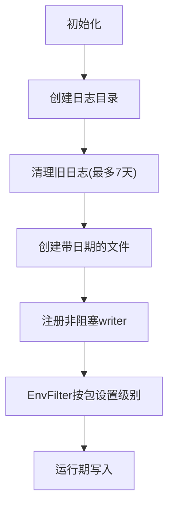
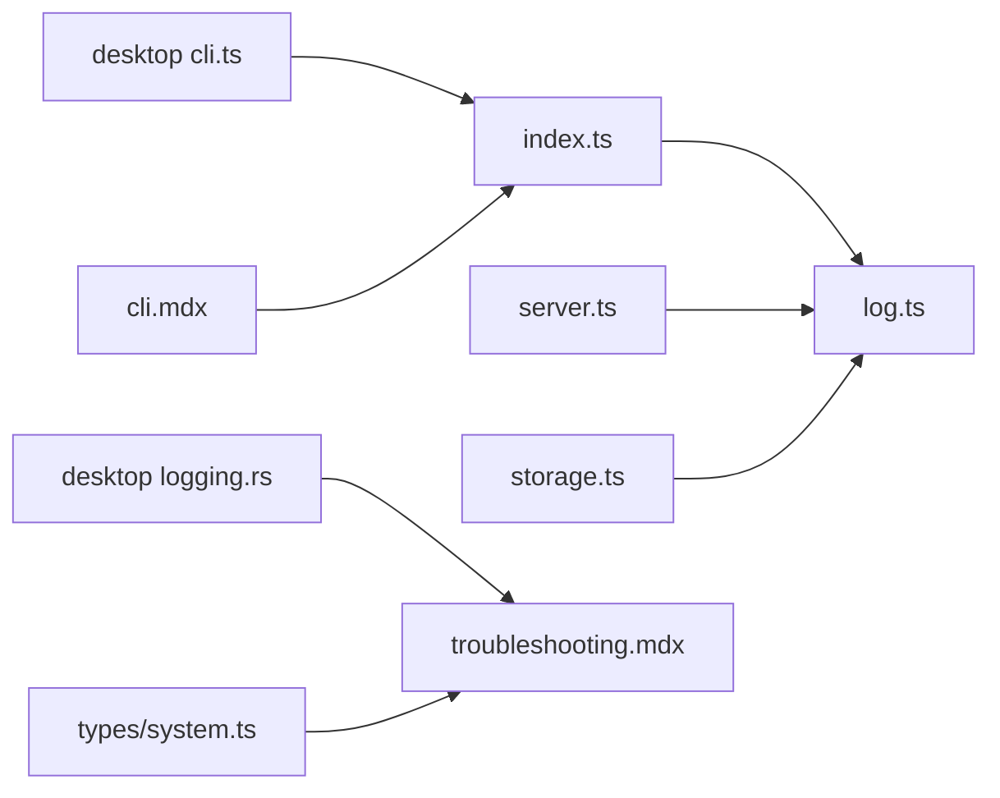

# 日志配置

<cite>
**本文引用的文件**
- [packages/opencode/src/util/log.ts](file://packages/opencode/src/util/log.ts)
- [packages/opencode/src/index.ts](file://packages/opencode/src/index.ts)
- [packages/opencode/src/server/server.ts](file://packages/opencode/src/server/server.ts)
- [packages/opencode/src/storage/storage.ts](file://packages/opencode/src/storage/storage.ts)
- [packages/desktop-electron/src/main/cli.ts](file://packages/desktop-electron/src/main/cli.ts)
- [packages/opencode/src/bus/global.ts](file://packages/opencode/src/bus/global.ts)
- [packages/web/src/content/docs/troubleshooting.mdx](file://packages/web/src/content/docs/troubleshooting.mdx)
- [packages/web/src/content/docs/cli.mdx](file://packages/web/src/content/docs/cli.mdx)
- [packages/desktop/src-tauri/src/logging.rs](file://packages/desktop/src-tauri/src/logging.rs)
- [packages/strategy-front/src/types/system.ts](file://packages/strategy-front/src/types/system.ts)
</cite>

## 目录
1. [简介](#简介)
2. [项目结构](#项目结构)
3. [核心组件](#核心组件)
4. [架构总览](#架构总览)
5. [详细组件分析](#详细组件分析)
6. [依赖关系分析](#依赖关系分析)
7. [性能考量](#性能考量)
8. [故障排查指南](#故障排查指南)
9. [结论](#结论)
10. [附录：配置模板与最佳实践](#附录配置模板与最佳实践)

## 简介
本指南面向OpenCode项目的日志配置与运维，覆盖以下主题：
- 日志级别设置与命令行开关
- 输出格式与结构化字段
- 日志轮转与保留策略
- 调试模式与详细日志
- 日志文件存储位置与清理
- 结构化日志与查询优化建议
- 日志聚合、远程传输与集中化管理思路
- 监控、告警与异常检测建议
- 多环境配置模板与运维最佳实践

## 项目结构
OpenCode在多语言运行时中实现日志能力：
- Node.js侧：统一的日志工具模块负责级别过滤、格式化、文件写入与轮转清理
- Rust侧（桌面应用）：使用tracing生态进行非阻塞日志与按天轮转
- Web文档：提供日志目录、文件命名与保留策略的用户级说明
- 前端类型：定义日志源、轮转状态与尾随行数等结构化元数据

图表来源
- [packages/opencode/src/index.ts:60-78](file://packages/opencode/src/index.ts#L60-L78)
- [packages/opencode/src/util/log.ts:60-90](file://packages/opencode/src/util/log.ts#L60-L90)
- [packages/opencode/src/server/server.ts:383-412](file://packages/opencode/src/server/server.ts#L383-L412)
- [packages/opencode/src/storage/storage.ts:14](file://packages/opencode/src/storage/storage.ts#L14)
- [packages/desktop-electron/src/main/cli.ts:122](file://packages/desktop-electron/src/main/cli.ts#L122)
- [packages/desktop/src-tauri/src/logging.rs:12-38](file://packages/desktop/src-tauri/src/logging.rs#L12-L38)
- [packages/strategy-front/src/types/system.ts:15-35](file://packages/strategy-front/src/types/system.ts#L15-L35)
- [packages/web/src/content/docs/troubleshooting.mdx:10-20](file://packages/web/src/content/docs/troubleshooting.mdx#L10-L20)
- [packages/web/src/content/docs/cli.mdx:544-548](file://packages/web/src/content/docs/cli.mdx#L544-L548)

章节来源
- [packages/opencode/src/index.ts:60-78](file://packages/opencode/src/index.ts#L60-L78)
- [packages/opencode/src/util/log.ts:60-90](file://packages/opencode/src/util/log.ts#L60-L90)
- [packages/opencode/src/server/server.ts:383-412](file://packages/opencode/src/server/server.ts#L383-L412)
- [packages/opencode/src/storage/storage.ts:14](file://packages/opencode/src/storage/storage.ts#L14)
- [packages/desktop-electron/src/main/cli.ts:122](file://packages/desktop-electron/src/main/cli.ts#L122)
- [packages/desktop/src-tauri/src/logging.rs:12-38](file://packages/desktop/src-tauri/src/logging.rs#L12-L38)
- [packages/strategy-front/src/types/system.ts:15-35](file://packages/strategy-front/src/types/system.ts#L15-L35)
- [packages/web/src/content/docs/troubleshooting.mdx:10-20](file://packages/web/src/content/docs/troubleshooting.mdx#L10-L20)
- [packages/web/src/content/docs/cli.mdx:544-548](file://packages/web/src/content/docs/cli.mdx#L544-L548)

## 核心组件
- 日志工具（Node.js）
  - 提供DEBUG/INFO/WARN/ERROR级别枚举与优先级映射
  - 支持按级别过滤、时间戳与耗时差、键值对标签、计时器辅助方法
  - 初始化时可选择打印到stderr或写入带时间戳的文件；支持开发/dev日志
  - 启动前执行清理，仅保留最近10个日志文件
- CLI与入口
  - 提供--print-logs与--log-level选项，将级别传递给日志工具
  - 异常与未处理拒绝通过默认日志记录
- 服务端路由
  - 暴露接收日志条目的HTTP接口，按服务名创建logger并写入
- 存储模块
  - 使用带service标签的logger记录迁移与操作信息
- 桌面应用（Rust）
  - 非阻塞文件日志，按日期生成文件，按天清理
  - 默认按包粒度设置EnvFilter，调试构建下更细粒度
- 前端类型
  - 定义日志源、格式(json/text)、是否轮转、可监视等元数据

章节来源
- [packages/opencode/src/util/log.ts:9-18](file://packages/opencode/src/util/log.ts#L9-L18)
- [packages/opencode/src/util/log.ts:100-181](file://packages/opencode/src/util/log.ts#L100-L181)
- [packages/opencode/src/index.ts:58-78](file://packages/opencode/src/index.ts#L58-L78)
- [packages/opencode/src/server/server.ts:383-412](file://packages/opencode/src/server/server.ts#L383-L412)
- [packages/opencode/src/storage/storage.ts:14](file://packages/opencode/src/storage/storage.ts#L14)
- [packages/desktop/src-tauri/src/logging.rs:7-38](file://packages/desktop/src-tauri/src/logging.rs#L7-L38)
- [packages/strategy-front/src/types/system.ts:15-35](file://packages/strategy-front/src/types/system.ts#L15-L35)

## 架构总览
OpenCode的日志体系由“Node.js日志工具 + 桌面Rust日志 + 文档与类型定义”构成，既满足命令行与服务端结构化日志，也提供桌面应用的非阻塞与轮转。

图表来源
- [packages/opencode/src/index.ts:60-78](file://packages/opencode/src/index.ts#L60-L78)
- [packages/opencode/src/util/log.ts:60-90](file://packages/opencode/src/util/log.ts#L60-L90)
- [packages/opencode/src/server/server.ts:392-408](file://packages/opencode/src/server/server.ts#L392-L408)

## 详细组件分析

### 组件A：Node.js日志工具（结构化与轮转）
- 级别与过滤
  - 级别枚举：DEBUG/INFO/WARN/ERROR
  - 优先级映射决定是否输出
- 格式化
  - 时间戳（ISO去除毫秒）、相对耗时(ms)、键值标签、消息
  - 错误对象序列化为可读字符串
- 文件写入
  - 开发模式使用固定文件名；生产模式使用时间戳文件名
  - 非打印模式下写入文件，打印模式写stderr
- 清理策略
  - 启动前扫描匹配模式的日志文件，仅保留最近10个

图表来源
- [packages/opencode/src/util/log.ts:80-90](file://packages/opencode/src/util/log.ts#L80-L90)
- [packages/opencode/src/util/log.ts:60-78](file://packages/opencode/src/util/log.ts#L60-L78)

章节来源
- [packages/opencode/src/util/log.ts:9-18](file://packages/opencode/src/util/log.ts#L9-L18)
- [packages/opencode/src/util/log.ts:100-181](file://packages/opencode/src/util/log.ts#L100-L181)
- [packages/opencode/src/util/log.ts:60-90](file://packages/opencode/src/util/log.ts#L60-L90)

### 组件B：CLI与入口（调试模式与级别控制）
- 命令行选项
  - --print-logs：直接输出到stderr
  - --log-level：设置DEBUG/INFO/WARN/ERROR
- 中间件
  - 在解析前调用日志初始化，传入级别与打印标志
- 全局错误捕获
  - 未处理拒绝与异常通过默认logger记录

图表来源
- [packages/opencode/src/index.ts:58-78](file://packages/opencode/src/index.ts#L58-L78)
- [packages/opencode/src/index.ts:38-48](file://packages/opencode/src/index.ts#L38-L48)

章节来源
- [packages/opencode/src/index.ts:58-78](file://packages/opencode/src/index.ts#L58-L78)
- [packages/opencode/src/index.ts:38-48](file://packages/opencode/src/index.ts#L38-L48)

### 组件C：服务端日志接口（结构化接收）
- 接口定义
  - 接收service、level、message、extra
  - 根据level分支写入对应级别
- 使用方式
  - SDK或外部客户端向该端点推送日志条目，便于集中化收集

图表来源
- [packages/opencode/src/server/server.ts:383-412](file://packages/opencode/src/server/server.ts#L383-L412)
- [packages/opencode/src/util/log.ts:100-181](file://packages/opencode/src/util/log.ts#L100-L181)

章节来源
- [packages/opencode/src/server/server.ts:383-412](file://packages/opencode/src/server/server.ts#L383-L412)

### 组件D：存储模块日志（结构化审计）
- 使用带service标签的logger记录迁移与项目操作
- 便于在集中日志系统中按服务维度检索

章节来源
- [packages/opencode/src/storage/storage.ts:14](file://packages/opencode/src/storage/storage.ts#L14)

### 组件E：桌面应用日志（Rust Tracing）
- 初始化
  - 创建目录、清理旧文件、生成带日期的时间戳文件
  - 非阻塞写入，EnvFilter按包粒度控制级别
- 轮转与保留
  - 按天轮转，最大保留7天

图表来源
- [packages/desktop/src-tauri/src/logging.rs:12-38](file://packages/desktop/src-tauri/src/logging.rs#L12-L38)

章节来源
- [packages/desktop/src-tauri/src/logging.rs:7-38](file://packages/desktop/src-tauri/src/logging.rs#L7-L38)

### 组件F：前端类型与日志源（结构化元数据）
- LogSource定义了日志源的标识、标签、格式(json/text)、路径、可监视、是否轮转等
- 用于前端展示与管理日志源，便于用户侧查看与筛选

章节来源
- [packages/strategy-front/src/types/system.ts:15-35](file://packages/strategy-front/src/types/system.ts#L15-L35)

## 依赖关系分析
- 入口依赖日志工具进行初始化与错误记录
- 服务端路由依赖日志工具按服务名创建logger
- 存储模块依赖日志工具进行操作审计
- 桌面应用独立于Node.js日志，采用Rust生态
- 前端类型为日志源管理提供结构化模型

图表来源
- [packages/opencode/src/index.ts:60-78](file://packages/opencode/src/index.ts#L60-L78)
- [packages/opencode/src/util/log.ts:60-90](file://packages/opencode/src/util/log.ts#L60-L90)
- [packages/opencode/src/server/server.ts:383-412](file://packages/opencode/src/server/server.ts#L383-L412)
- [packages/opencode/src/storage/storage.ts:14](file://packages/opencode/src/storage/storage.ts#L14)
- [packages/desktop-electron/src/main/cli.ts:122](file://packages/desktop-electron/src/main/cli.ts#L122)
- [packages/desktop/src-tauri/src/logging.rs:12-38](file://packages/desktop/src-tauri/src/logging.rs#L12-L38)
- [packages/strategy-front/src/types/system.ts:15-35](file://packages/strategy-front/src/types/system.ts#L15-L35)
- [packages/web/src/content/docs/troubleshooting.mdx:10-20](file://packages/web/src/content/docs/troubleshooting.mdx#L10-L20)
- [packages/web/src/content/docs/cli.mdx:544-548](file://packages/web/src/content/docs/cli.mdx#L544-L548)

章节来源
- [packages/opencode/src/index.ts:60-78](file://packages/opencode/src/index.ts#L60-L78)
- [packages/opencode/src/server/server.ts:383-412](file://packages/opencode/src/server/server.ts#L383-L412)
- [packages/opencode/src/storage/storage.ts:14](file://packages/opencode/src/storage/storage.ts#L14)
- [packages/desktop/src-tauri/src/logging.rs:12-38](file://packages/desktop/src-tauri/src/logging.rs#L12-L38)
- [packages/strategy-front/src/types/system.ts:15-35](file://packages/strategy-front/src/types/system.ts#L15-L35)
- [packages/web/src/content/docs/troubleshooting.mdx:10-20](file://packages/web/src/content/docs/troubleshooting.mdx#L10-L20)
- [packages/web/src/content/docs/cli.mdx:544-548](file://packages/web/src/content/docs/cli.mdx#L544-L548)

## 性能考量
- 写入路径
  - 打印模式直接写stderr，避免磁盘IO开销
  - 非打印模式写文件，注意磁盘I/O与fsync策略
- 过滤成本
  - 级别过滤为O(1)，开销极低
- 清理策略
  - 启动时批量扫描与删除，文件较多时可能产生短暂延迟
- 桌面应用
  - 非阻塞writer降低主线程阻塞风险
  - EnvFilter按包粒度过滤，减少冗余输出

## 故障排查指南
- 日志位置
  - 用户文档明确给出各平台日志目录与文件命名规则
- 保留策略
  - Node.js侧保留最近10个文件；桌面侧按天轮转，最多保留7天
- 调试步骤
  - 使用--log-level提升级别获取更详细信息
  - 使用--print-logs将日志输出到stderr便于快速定位
- 异常记录
  - 入口处捕获未处理异常与拒绝，并记录到默认日志

章节来源
- [packages/web/src/content/docs/troubleshooting.mdx:10-20](file://packages/web/src/content/docs/troubleshooting.mdx#L10-L20)
- [packages/opencode/src/util/log.ts:80-90](file://packages/opencode/src/util/log.ts#L80-L90)
- [packages/desktop/src-tauri/src/logging.rs:7-10](file://packages/desktop/src-tauri/src/logging.rs#L7-L10)
- [packages/opencode/src/index.ts:38-48](file://packages/opencode/src/index.ts#L38-L48)

## 结论
OpenCode的日志体系在Node.js与Rust两端分别实现了结构化、可轮转与可清理的日志能力，并通过CLI选项与服务端接口支持灵活的调试与集中化收集。结合前端类型定义，用户可在不同环境中高效地定位问题、评估性能并进行长期运维。

## 附录：配置模板与最佳实践

### 日志级别与调试模式
- 建议
  - 开发/本地：--log-level=DEBUG，必要时--print-logs
  - 生产：--log-level=INFO，避免过度I/O
  - 桌面应用：调试构建默认更细粒度，发布构建收敛到必要级别

章节来源
- [packages/web/src/content/docs/cli.mdx:544-548](file://packages/web/src/content/docs/cli.mdx#L544-L548)
- [packages/opencode/src/index.ts:60-78](file://packages/opencode/src/index.ts#L60-L78)
- [packages/desktop/src-tauri/src/logging.rs:28-34](file://packages/desktop/src-tauri/src/logging.rs#L28-L34)

### 输出格式与结构化字段
- 建议
  - 使用Log.create({ service: "..." })区分服务来源
  - 通过额外字段携带上下文，如duration、status等
  - 服务端接口统一走/日志端点，便于集中采集

章节来源
- [packages/opencode/src/util/log.ts:100-181](file://packages/opencode/src/util/log.ts#L100-L181)
- [packages/opencode/src/server/server.ts:383-412](file://packages/opencode/src/server/server.ts#L383-L412)

### 日志轮转与保留策略
- 建议
  - Node.js：保持默认保留最近10个文件
  - 桌面应用：按天轮转，保留7天
  - 如需扩展保留期，可在启动前调整清理逻辑

章节来源
- [packages/opencode/src/util/log.ts:80-90](file://packages/opencode/src/util/log.ts#L80-L90)
- [packages/desktop/src-tauri/src/logging.rs:7-10](file://packages/desktop/src-tauri/src/logging.rs#L7-L10)

### 日志文件存储位置
- 建议
  - 使用用户文档提供的平台路径作为基准
  - 桌面应用日志与CLI日志分离，避免互相干扰

章节来源
- [packages/web/src/content/docs/troubleshooting.mdx:10-20](file://packages/web/src/content/docs/troubleshooting.mdx#L10-L20)

### 结构化日志与查询优化
- 建议
  - 固定字段：timestamp、level、service、message、duration、status
  - 使用JSON格式便于索引与检索
  - 对高频字段建立索引，避免全量扫描

[本节为通用建议，无需特定文件引用]

### 日志聚合、远程传输与集中化管理
- 建议
  - Node.js：将--print-logs输出接入系统日志或集中式收集器
  - 桌面应用：将日志文件纳入收集器，或通过端口转发到中心节点
  - 服务端：将/日志端点对接到日志平台，统一采集

[本节为通用建议，无需特定文件引用]

### 监控、告警与异常检测
- 建议
  - 关注ERROR/WARN占比与峰值
  - 设置阈值告警与异常模式检测（如连续ERROR、超长耗时）
  - 结合服务名与上下文字段进行分组报警

[本节为通用建议，无需特定文件引用]