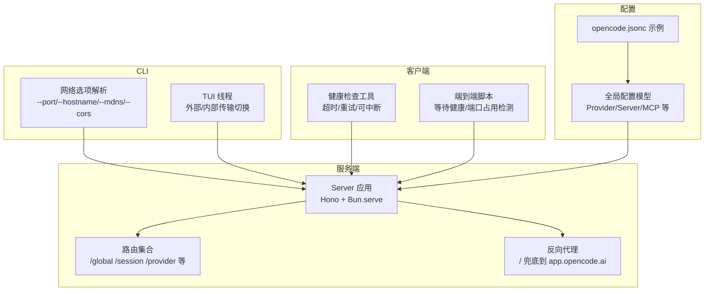
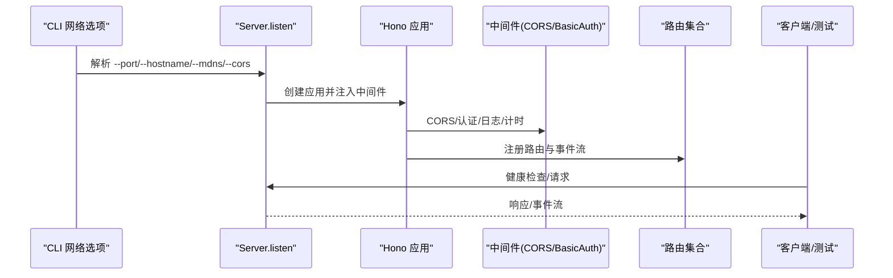
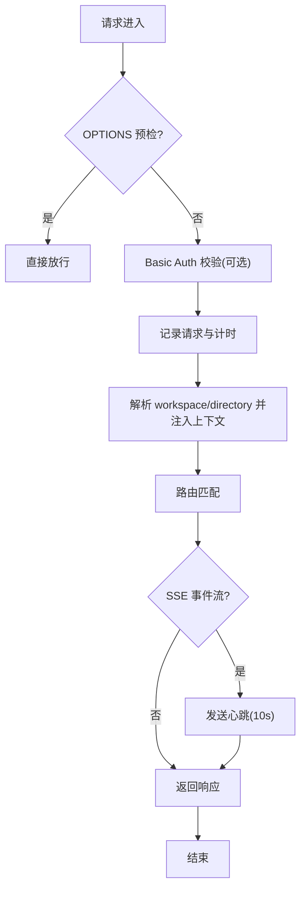
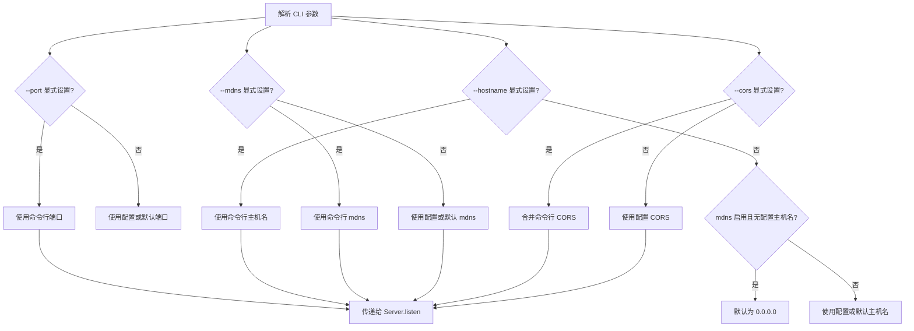
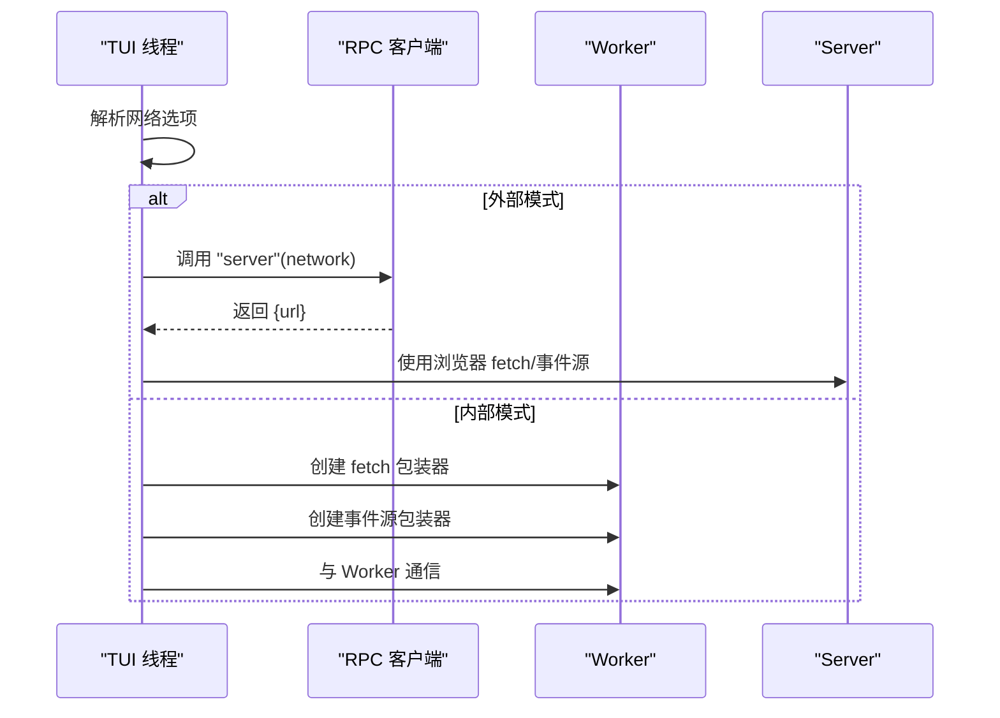
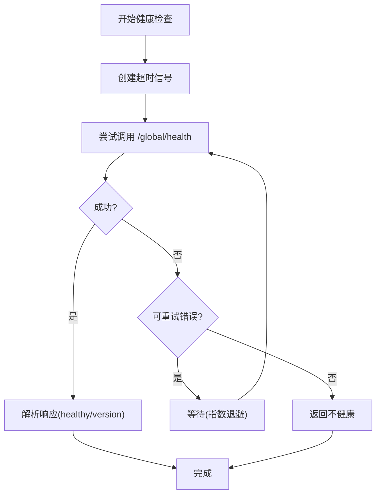
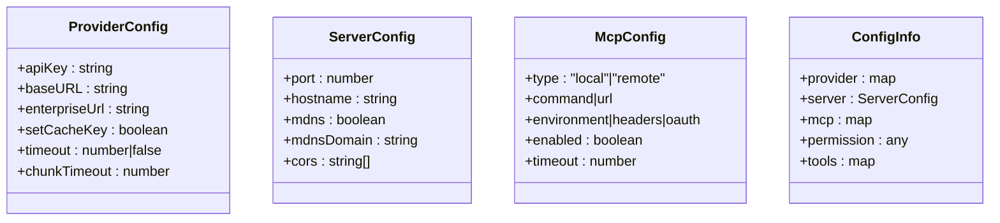
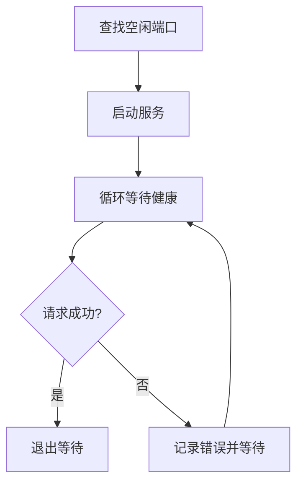
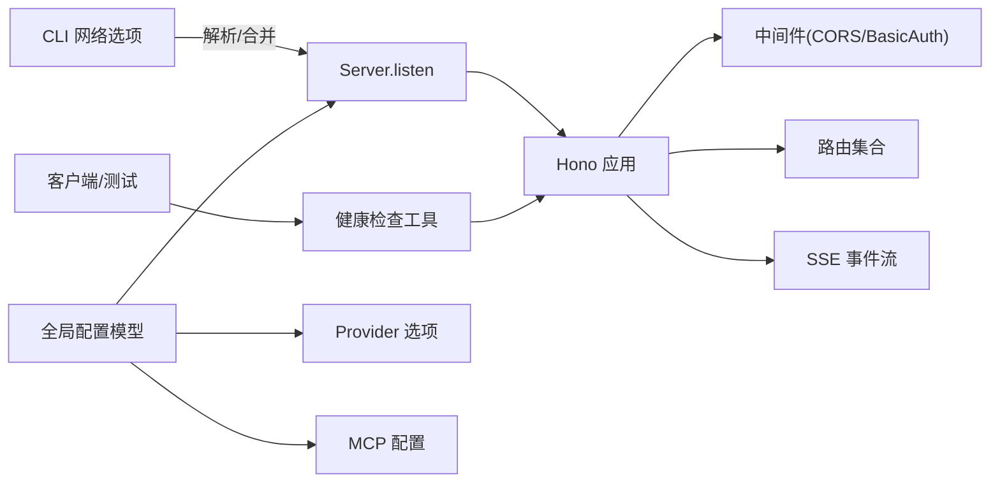

# 网络配置

<cite>
**本文档引用的文件**
- [packages/opencode/src/server/server.ts](file://packages/opencode/src/server/server.ts)
- [packages/opencode/src/cli/network.ts](file://packages/opencode/src/cli/network.ts)
- [packages/opencode/src/cli/cmd/tui/thread.ts](file://packages/opencode/src/cli/cmd/tui/thread.ts)
- [packages/app/src/utils/server-health.ts](file://packages/app/src/utils/server-health.ts)
- [packages/opencode/src/config/config.ts](file://packages/opencode/src/config/config.ts)
- [packages/app/script/e2e-local.ts](file://packages/app/script/e2e-local.ts)
- [packages/strategy-service/internal/oprun/manager.go](file://packages/strategy-service/internal/oprun/manager.go)
- [packages/opencode/src/lsp/client.ts](file://packages/opencode/src/lsp/client.ts)
- [.opencode/opencode.jsonc](file://.opencode/opencode.jsonc)
</cite>

## 目录
1. [简介](#简介)
2. [项目结构](#项目结构)
3. [核心组件](#核心组件)
4. [架构总览](#架构总览)
5. [详细组件分析](#详细组件分析)
6. [依赖关系分析](#依赖关系分析)
7. [性能考虑](#性能考虑)
8. [故障排查指南](#故障排查指南)
9. [结论](#结论)
10. [附录](#附录)

## 简介
本文件系统性梳理 OpenCode 的网络配置与运行机制，覆盖以下主题：
- 代理与转发：内置反向代理与静态资源代理行为
- 超时与重试：全局与分段超时、重试策略与中断信号
- 连接池与并发：Bun 服务器参数与空闲超时
- HTTP 客户端：请求头、SSE 心跳、CORS 与认证
- 防火墙与端口：监听地址、端口选择与 mDNS 发布
- 访问控制：Basic Auth、CORS 白名单与来源校验
- DNS 与服务发现：mDNS 域名与发布策略
- 负载均衡与健康检查：多实例健康探测与快速存活判断
- 监控与诊断：心跳、日志与健康状态轮询
- 模板与优化：不同网络环境下的配置建议

## 项目结构
OpenCode 的网络相关能力主要分布在服务端路由、CLI 网络选项、TUI 线程传输层、健康检查工具以及全局配置模型中。

**图表来源**
- [packages/opencode/src/server/server.ts:57-573](file://packages/opencode/src/server/server.ts#L57-L573)
- [packages/opencode/src/cli/network.ts:1-60](file://packages/opencode/src/cli/network.ts#L1-L60)
- [packages/opencode/src/cli/cmd/tui/thread.ts:176-226](file://packages/opencode/src/cli/cmd/tui/thread.ts#L176-L226)
- [packages/app/src/utils/server-health.ts:59-92](file://packages/app/src/utils/server-health.ts#L59-L92)
- [packages/opencode/src/config/config.ts:1039-1229](file://packages/opencode/src/config/config.ts#L1039-L1229)
- [.opencode/opencode.jsonc:1-19](file://.opencode/opencode.jsonc#L1-L19)

**章节来源**
- [packages/opencode/src/server/server.ts:57-573](file://packages/opencode/src/server/server.ts#L57-L573)
- [packages/opencode/src/cli/network.ts:1-60](file://packages/opencode/src/cli/network.ts#L1-L60)
- [packages/opencode/src/cli/cmd/tui/thread.ts:176-226](file://packages/opencode/src/cli/cmd/tui/thread.ts#L176-L226)
- [packages/app/src/utils/server-health.ts:1-92](file://packages/app/src/utils/server-health.ts#L1-L92)
- [packages/opencode/src/config/config.ts:1039-1229](file://packages/opencode/src/config/config.ts#L1039-L1229)
- [.opencode/opencode.jsonc:1-19](file://.opencode/opencode.jsonc#L1-L19)

## 核心组件
- 服务器应用与路由：基于 Hono 构建，统一错误处理、CORS、Basic Auth、工作区上下文注入与事件流（SSE）
- CLI 网络选项：支持端口、主机名、mDNS、自定义域名与 CORS 列表，并与全局配置合并
- TUI 线程传输：根据网络选项决定使用外部 HTTP 服务还是 Worker 内部 fetch 与事件源
- 健康检查：带超时、可中断、指数退避重试的健康探测，支持 SSE 心跳保活
- 全局配置模型：Provider 与超时、MCP、权限、实验特性等网络相关字段
- 端到端脚本：端口占用检测与健康等待逻辑

**章节来源**
- [packages/opencode/src/server/server.ts:57-573](file://packages/opencode/src/server/server.ts#L57-L573)
- [packages/opencode/src/cli/network.ts:1-60](file://packages/opencode/src/cli/network.ts#L1-L60)
- [packages/opencode/src/cli/cmd/tui/thread.ts:176-226](file://packages/opencode/src/cli/cmd/tui/thread.ts#L176-L226)
- [packages/app/src/utils/server-health.ts:59-92](file://packages/app/src/utils/server-health.ts#L59-L92)
- [packages/opencode/src/config/config.ts:1039-1229](file://packages/opencode/src/config/config.ts#L1039-L1229)
- [packages/app/script/e2e-local.ts:1-45](file://packages/app/script/e2e-local.ts#L1-L45)

## 架构总览
OpenCode 的网络栈由“CLI 选项 → 服务端启动 → 路由与中间件 → 客户端健康检查”构成，支持本地开发与跨平台部署场景。

**图表来源**
- [packages/opencode/src/cli/network.ts:39-60](file://packages/opencode/src/cli/network.ts#L39-L60)
- [packages/opencode/src/server/server.ts:593-638](file://packages/opencode/src/server/server.ts#L593-L638)
- [packages/app/src/utils/server-health.ts:59-92](file://packages/app/src/utils/server-health.ts#L59-L92)

## 详细组件分析

### 服务器与路由（HTTP 客户端、请求头、响应处理）
- 错误处理：统一捕获 NamedError、HTTPException 与未知错误，返回结构化错误体
- 中间件链：OPTIONS 预检放行、Basic Auth（用户名可配置）、请求计时与日志
- CORS：允许 localhost/127.0.0.1、Tauri 本地域与指定白名单；支持动态传入 CORS 列表
- 工作区上下文：从查询或头部解析 workspace/directory，注入 WorkspaceContext
- 事件流：SSE 流输出事件与心跳，防止代理层断开
- 反向代理：兜底将未匹配路径代理至 app.opencode.ai，并设置 CSP

**图表来源**
- [packages/opencode/src/server/server.ts:78-129](file://packages/opencode/src/server/server.ts#L78-L129)
- [packages/opencode/src/server/server.ts:193-220](file://packages/opencode/src/server/server.ts#L193-L220)
- [packages/opencode/src/server/server.ts:500-556](file://packages/opencode/src/server/server.ts#L500-L556)
- [packages/opencode/src/server/server.ts:560-572](file://packages/opencode/src/server/server.ts#L560-L572)

**章节来源**
- [packages/opencode/src/server/server.ts:57-573](file://packages/opencode/src/server/server.ts#L57-L573)

### CLI 网络选项与 mDNS 发布
- 支持的选项：--port、--hostname、--mdns、--mdns-domain、--cors
- 合并策略：显式命令行参数优先于全局配置；当启用 mDNS 且未显式设置 hostname 时，默认 0.0.0.0
- mDNS 发布：仅在非回环地址且启用 mdns 时发布；停止服务时自动取消发布

**图表来源**
- [packages/opencode/src/cli/network.ts:39-60](file://packages/opencode/src/cli/network.ts#L39-L60)
- [packages/opencode/src/server/server.ts:618-628](file://packages/opencode/src/server/server.ts#L618-L628)

**章节来源**
- [packages/opencode/src/cli/network.ts:1-60](file://packages/opencode/src/cli/network.ts#L1-L60)
- [packages/opencode/src/server/server.ts:593-638](file://packages/opencode/src/server/server.ts#L593-L638)

### TUI 线程传输层（外部/内部）
- 外部模式：通过 RPC 获取服务 URL，使用浏览器 fetch 与事件源
- 内部模式：Worker 内部创建 fetch 包装器与事件源，避免跨进程通信开销
- 传输选择：依据网络选项与端口/主机名/是否启用 mdns 决定

**图表来源**
- [packages/opencode/src/cli/cmd/tui/thread.ts:176-226](file://packages/opencode/src/cli/cmd/tui/thread.ts#L176-L226)

**章节来源**
- [packages/opencode/src/cli/cmd/tui/thread.ts:1-226](file://packages/opencode/src/cli/cmd/tui/thread.ts#L1-L226)

### 健康检查与超时重试
- 超时信号：优先使用 AbortSignal.timeout，否则回退到手动定时器
- 重试策略：对网络类错误进行有限次数重试，指数退避
- 可中断：支持传入 AbortSignal，便于上层取消
- SSE 心跳：保持长连接不被代理层中断

**图表来源**
- [packages/app/src/utils/server-health.ts:18-31](file://packages/app/src/utils/server-health.ts#L18-L31)
- [packages/app/src/utils/server-health.ts:51-57](file://packages/app/src/utils/server-health.ts#L51-L57)
- [packages/app/src/utils/server-health.ts:59-92](file://packages/app/src/utils/server-health.ts#L59-L92)
- [packages/opencode/src/server/server.ts:516-556](file://packages/opencode/src/server/server.ts#L516-L556)

**章节来源**
- [packages/app/src/utils/server-health.ts:1-92](file://packages/app/src/utils/server-health.ts#L1-L92)
- [packages/opencode/src/server/server.ts:500-556](file://packages/opencode/src/server/server.ts#L500-L556)

### 全局配置模型（Provider/Server/MCP/权限）
- Provider 选项：apiKey、baseURL、enterpriseUrl、timeout、chunkTimeout
- Server 字段：port、hostname、mdns、mdnsDomain、cors
- MCP：本地/远程连接、OAuth、超时
- 权限与工具：webfetch/websearch/codesearch 等细粒度权限控制

**图表来源**
- [packages/opencode/src/config/config.ts:1000-1036](file://packages/opencode/src/config/config.ts#L1000-L1036)
- [packages/opencode/src/config/config.ts:1039-1229](file://packages/opencode/src/config/config.ts#L1039-L1229)

**章节来源**
- [packages/opencode/src/config/config.ts:1000-1036](file://packages/opencode/src/config/config.ts#L1000-L1036)
- [packages/opencode/src/config/config.ts:1039-1229](file://packages/opencode/src/config/config.ts#L1039-L1229)

### 端到端脚本（端口占用与健康等待）
- 自动查找空闲端口，避免冲突
- 健康等待循环：定期发起 GET 请求，直到响应成功或超时

**图表来源**
- [packages/app/script/e2e-local.ts:6-45](file://packages/app/script/e2e-local.ts#L6-L45)

**章节来源**
- [packages/app/script/e2e-local.ts:1-45](file://packages/app/script/e2e-local.ts#L1-L45)

### Go 策略服务健康检查（短超时快速存活）
- 使用短超时上下文执行 /global/health 探测
- 成功状态码 2xx 视为存活，否则视为异常

**章节来源**
- [packages/strategy-service/internal/oprun/manager.go:451-475](file://packages/strategy-service/internal/oprun/manager.go#L451-L475)

### LSP 客户端（网络超时与重连）
- LSP 初始化阶段存在固定超时与重试逻辑，确保在弱网环境下仍能建立连接

**章节来源**
- [packages/opencode/src/lsp/client.ts:223-251](file://packages/opencode/src/lsp/client.ts#L223-L251)

## 依赖关系分析

**图表来源**
- [packages/opencode/src/cli/network.ts:39-60](file://packages/opencode/src/cli/network.ts#L39-L60)
- [packages/opencode/src/server/server.ts:57-573](file://packages/opencode/src/server/server.ts#L57-L573)
- [packages/app/src/utils/server-health.ts:59-92](file://packages/app/src/utils/server-health.ts#L59-L92)
- [packages/opencode/src/config/config.ts:1039-1229](file://packages/opencode/src/config/config.ts#L1039-L1229)

**章节来源**
- [packages/opencode/src/server/server.ts:57-573](file://packages/opencode/src/server/server.ts#L57-L573)
- [packages/opencode/src/config/config.ts:1039-1229](file://packages/opencode/src/config/config.ts#L1039-L1229)

## 性能考虑
- 连接与并发：Bun.serve 默认 idleTimeout=0，适合高并发交互；如需限制空闲连接，可在部署层调整
- SSE 心跳：每 10 秒发送一次心跳，降低代理层误判导致的连接中断风险
- 超时与重试：合理设置 Provider.timeout 与 chunkTimeout，避免长尾请求阻塞
- CORS 与认证：仅在必要时开启 Basic Auth，减少鉴权开销
- mDNS：仅在局域网共享场景启用，避免不必要的网络广播

[本节为通用指导，无需特定文件引用]

## 故障排查指南
- 健康检查失败
  - 检查超时与重试策略，确认网络波动是否触发重试
  - 使用 AbortSignal 中断长时间等待
- CORS 跨域问题
  - 在 CLI 或配置中添加允许的来源列表
  - 确认来源格式为“协议+主机+端口”
- mDNS 发布失败
  - 确认 hostname 非回环地址且已启用 mdns
  - 检查防火墙与网络权限
- Basic Auth 密码错误
  - 校验 OPENCODE_SERVER_USERNAME/PASSWORD 环境变量
- 端口占用
  - 使用端口占用检测脚本自动分配空闲端口
- 代理与静态资源
  - 确认兜底代理路径与 CSP 设置

**章节来源**
- [packages/app/src/utils/server-health.ts:1-92](file://packages/app/src/utils/server-health.ts#L1-L92)
- [packages/opencode/src/server/server.ts:104-129](file://packages/opencode/src/server/server.ts#L104-L129)
- [packages/opencode/src/cli/network.ts:1-60](file://packages/opencode/src/cli/network.ts#L1-L60)
- [packages/app/script/e2e-local.ts:1-45](file://packages/app/script/e2e-local.ts#L1-L45)

## 结论
OpenCode 的网络配置以“可配置、可观测、可恢复”为核心设计原则：通过 CLI 选项与全局配置灵活组合，结合健康检查与 SSE 心跳保障连接稳定性；在不同网络环境下（本地开发、局域网共享、跨平台部署）均能提供一致的体验与可控的性能表现。

[本节为总结，无需特定文件引用]

## 附录

### 不同网络环境下的配置模板
- 本地开发（仅本机）
  - hostname: 127.0.0.1
  - port: 0（自动选择）
  - mdns: false
  - cors: 留空
- 局域网共享（mDNS）
  - hostname: 0.0.0.0
  - port: 4096（或其它空闲端口）
  - mdns: true
  - mdnsDomain: 自定义域名（如 myproject.local）
  - cors: 添加前端应用来源
- 生产部署（反向代理）
  - 通过反向代理暴露 HTTPS，服务端仅监听内网 127.0.0.1
  - 在反代侧配置 CORS 与缓存策略

**章节来源**
- [packages/opencode/src/cli/network.ts:1-60](file://packages/opencode/src/cli/network.ts#L1-L60)
- [packages/opencode/src/server/server.ts:618-628](file://packages/opencode/src/server/server.ts#L618-L628)

### 连接优化策略
- 合理设置 Provider.timeout 与 chunkTimeout，避免长连接阻塞
- 使用 SSE 心跳维持长连接稳定
- 在弱网环境下启用健康检查重试与超时回退
- 仅在需要时启用 Basic Auth，减少鉴权开销
- mDNS 仅用于局域网共享，避免公网广播

**章节来源**
- [packages/opencode/src/config/config.ts:1006-1028](file://packages/opencode/src/config/config.ts#L1006-L1028)
- [packages/opencode/src/server/server.ts:516-556](file://packages/opencode/src/server/server.ts#L516-L556)
- [packages/app/src/utils/server-health.ts:18-31](file://packages/app/src/utils/server-health.ts#L18-L31)