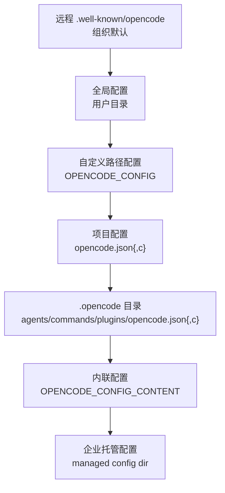
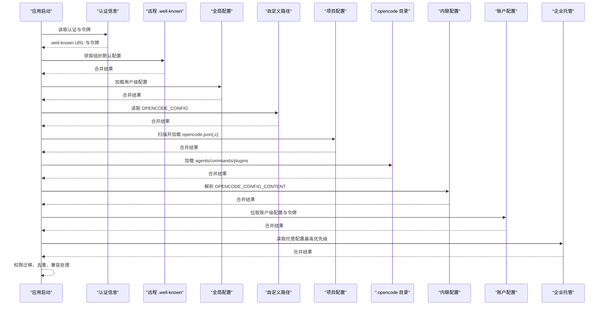
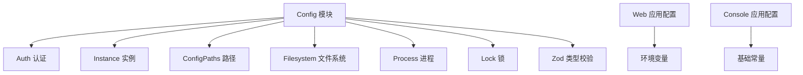

# 高级配置

<cite>
**本文引用的文件**
- [packages/opencode/src/config/config.ts](file://packages/opencode/src/config/config.ts)
- [.opencode/opencode.jsonc](file://.opencode/opencode.jsonc)
- [packages/opencode/src/cli/cmd/debug/config.ts](file://packages/opencode/src/cli/cmd/debug/config.ts)
- [packages/web/config.mjs](file://packages/web/config.mjs)
- [packages/console/app/src/config.ts](file://packages/console/app/src/config.ts)
- [packages/opencode/test/config/config.test.ts](file://packages/opencode/test/config/config.test.ts)
- [packages/web/src/content/docs/providers.mdx](file://packages/web/src/content/docs/providers.mdx)
- [.opencode/agent/translator.md](file://.opencode/agent/translator.md)
</cite>

## 目录
1. [简介](#简介)
2. [项目结构](#项目结构)
3. [核心组件](#核心组件)
4. [架构总览](#架构总览)
5. [详细组件分析](#详细组件分析)
6. [依赖关系分析](#依赖关系分析)
7. [性能考虑](#性能考虑)
8. [故障排除指南](#故障排除指南)
9. [结论](#结论)
10. [附录](#附录)

## 简介
本指南面向需要深度定制与企业级部署的用户，系统讲解 OpenCode 的配置体系：配置文件结构、环境变量、运行时参数、性能调优、并发控制、网络与代理、SSL 证书、安全策略、日志与调试、配置继承与覆盖规则，以及配置验证与动态重载机制。内容基于仓库中的实际实现与文档，确保可操作性与准确性。

## 项目结构
OpenCode 的配置体系由多层来源构成，按优先级从低到高依次加载，并通过深度合并策略进行叠加。典型结构包括：
- 远程 .well-known/opencode（组织默认）
- 全局配置（用户目录）
- 自定义路径配置
- 项目级配置
- 工作区 .opencode 目录（技能、命令、插件等）
- 内联配置（进程内字符串）
- 企业托管配置（最高优先级）

图表来源
- [packages/opencode/src/config/config.ts:81-88](file://packages/opencode/src/config/config.ts#L81-L88)

章节来源
- [packages/opencode/src/config/config.ts:81-88](file://packages/opencode/src/config/config.ts#L81-L88)

## 核心组件
- 配置加载器与合并策略：支持数组字段拼接去重、对象字段深度合并、键序保留与回填。
- 模型与提供商配置：通过 provider 字段声明模型与提供商选项，支持 AWS Bedrock 等。
- 权限系统：统一的权限动作与规则，兼容旧版 tools 配置迁移。
- MCP 配置：本地或远程 MCP 服务器连接，含超时与认证选项。
- 命令与智能体：从 Markdown 中解析命令与智能体定义，支持模板与提示词。
- 插件系统：按优先级去重，支持本地与远端插件。

章节来源
- [packages/opencode/src/config/config.ts:66-76](file://packages/opencode/src/config/config.ts#L66-L76)
- [packages/opencode/src/config/config.ts:626-692](file://packages/opencode/src/config/config.ts#L626-L692)
- [packages/opencode/src/config/config.ts:563-624](file://packages/opencode/src/config/config.ts#L563-L624)
- [packages/opencode/src/config/config.ts:384-420](file://packages/opencode/src/config/config.ts#L384-L420)
- [packages/opencode/src/config/config.ts:422-495](file://packages/opencode/src/config/config.ts#L422-L495)
- [packages/opencode/src/config/config.ts:497-561](file://packages/opencode/src/config/config.ts#L497-L561)

## 架构总览
下图展示配置加载的完整流程与优先级：

图表来源
- [packages/opencode/src/config/config.ts:78-266](file://packages/opencode/src/config/config.ts#L78-L266)

章节来源
- [packages/opencode/src/config/config.ts:78-266](file://packages/opencode/src/config/config.ts#L78-L266)

## 详细组件分析

### 配置文件结构与字段
- provider：声明提供商与模型选项，如 Amazon Bedrock 的 region/profile/baseURL 等。
- permission：统一权限动作与规则，支持按路径、工具类型、能力维度配置。
- mcp：MCP 服务器配置（本地/远程），含超时与认证。
- tools：遗留字段，会自动迁移到 permission。
- 其他顶层字段：如 model、username、share、compaction 等。

示例参考
- [packages/web/src/content/docs/providers.mdx:200-212](file://packages/web/src/content/docs/providers.mdx#L200-L212)
- [.opencode/opencode.jsonc:1-19](file://.opencode/opencode.jsonc#L1-L19)

章节来源
- [.opencode/opencode.jsonc:1-19](file://.opencode/opencode.jsonc#L1-L19)
- [packages/web/src/content/docs/providers.mdx:200-212](file://packages/web/src/content/docs/providers.mdx#L200-L212)

### 环境变量与运行时参数
- 认证与提供商：AWS_*、OPENCODE_API_KEY、OPENCODE_AUTH_JSON 等。
- 配置注入：OPENCODE_CONFIG、OPENCODE_CONFIG_CONTENT、OPENCODE_CONFIG_DIR。
- 行为开关：OPENCODE_DISABLE_*、OPENCODE_ENABLE_*、OPENCODE_EXPERIMENTAL_*。
- 网络与代理：HTTP_PROXY、HTTPS_PROXY、NO_PROXY、NODE_EXTRA_CA_CERTS。
- 服务端口与凭据：OPENCODE_PORT、OPENCODE_SERVER_USERNAME、OPENCODE_SERVER_PASSWORD。
- 其他：XDG_CONFIG_HOME、CI_PROJECT_DIR、CI_WORKLOAD_REF 等。

参考清单
- [.opencode/agent/translator.md:536-632](file://.opencode/agent/translator.md#L536-L632)

章节来源
- [.opencode/agent/translator.md:536-632](file://.opencode/agent/translator.md#L536-L632)

### 性能调优与并发控制
- 自动压缩与清理：可通过 OPENCODE_DISABLE_AUTOCOMPACT、OPENCODE_DISABLE_PRUNE 调整 compaction 行为。
- 实验特性：OPENCODE_EXPERIMENTAL_* 提供实验性功能开关，如输出上限、格式化、计划模式等。
- 并发安装：依赖安装使用写锁避免并发冲突；在 CI 或代理环境下自动禁用缓存以保证一致性。
- LSP 与工具：可通过实验性标志控制 LSP 工具行为与文件监听器。

章节来源
- [packages/opencode/src/config/config.ts:251-257](file://packages/opencode/src/config/config.ts#L251-L257)
- [packages/opencode/src/config/config.ts:293-323](file://packages/opencode/src/config/config.ts#L293-L323)
- [.opencode/agent/translator.md:602-617](file://.opencode/agent/translator.md#L602-L617)

### 网络配置、代理与 SSL 证书
- 代理：HTTP_PROXY、HTTPS_PROXY、NO_PROXY 支持标准代理链路。
- SSL 证书：NODE_EXTRA_CA_CERTS 可注入额外 CA 证书，用于私有 CA 或自签名场景。
- VPC 端点：Amazon Bedrock 支持 endpoint/baseURL 选项，便于内网直连。

章节来源
- [.opencode/agent/translator.md:572-582](file://.opencode/agent/translator.md#L572-L582)
- [packages/web/src/content/docs/providers.mdx:225-246](file://packages/web/src/content/docs/providers.mdx#L225-L246)

### 安全配置最佳实践
- 最小权限原则：通过 permission 细粒度控制 read/edit/grep/list/task 等能力。
- 令牌注入：账户级配置会注入 OPENCODE_CONSOLE_TOKEN，避免明文存储。
- 企业托管：managed config 目录仅加载配置文件，不执行安装，降低权限风险。
- 迁移兼容：tools 字段自动映射到 permission，避免遗漏权限导致的安全问题。

章节来源
- [packages/opencode/src/config/config.ts:226-242](file://packages/opencode/src/config/config.ts#L226-L242)
- [packages/opencode/src/config/config.ts:180-204](file://packages/opencode/src/config/config.ts#L180-L204)
- [packages/opencode/src/config/config.ts:206-214](file://packages/opencode/src/config/config.ts#L206-L214)

### 日志级别与调试模式
- 日志：RUST_LOG 控制后端日志级别，适用于调试与生产排障。
- 调试命令：使用内置 config 子命令打印已解析配置，便于核对最终生效值。
- 环境变量替换：支持在配置中使用 {env:VAR} 形式进行环境变量替换。

章节来源
- [.opencode/agent/translator.md:628-628](file://.opencode/agent/translator.md#L628-L628)
- [packages/opencode/src/cli/cmd/debug/config.ts:10-16](file://packages/opencode/src/cli/cmd/debug/config.ts#L10-L16)
- [packages/opencode/test/config/config.test.ts:181-208](file://packages/opencode/test/config/config.test.ts#L181-L208)

### 配置继承、覆盖与环境特定配置
- 优先级顺序：远程 → 全局 → 自定义路径 → 项目 → .opencode → 内联 → 企业托管。
- 数组字段策略：插件与指令采用去重与拼接，避免重复加载。
- 键序保留：权限对象在解析前后保持原始键序，确保配置意图不被破坏。
- 账户与组织：账户级配置与组织默认共同作用，后者优先于前者。

章节来源
- [packages/opencode/src/config/config.ts:66-76](file://packages/opencode/src/config/config.ts#L66-L76)
- [packages/opencode/src/config/config.ts:641-659](file://packages/opencode/src/config/config.ts#L641-L659)
- [packages/opencode/src/config/config.ts:81-88](file://packages/opencode/src/config/config.ts#L81-L88)

### 配置验证与错误诊断
- 类型校验：Zod Schema 对 Agent、Permission、Mcp 等进行严格校验。
- 解析错误：jsonc-parser 提供精确的解析错误码与编辑建议。
- 运行时错误：命令/智能体解析失败会发布会话错误事件并记录日志。
- 测试覆盖：包含环境变量替换、$schema 回填、优先级覆盖等场景。

章节来源
- [packages/opencode/src/config/config.ts:694-800](file://packages/opencode/src/config/config.ts#L694-L800)
- [packages/opencode/src/config/config.ts:16-22](file://packages/opencode/src/config/config.ts#L16-L22)
- [packages/opencode/test/config/config.test.ts:160-212](file://packages/opencode/test/config/config.test.ts#L160-L212)

### 动态重载机制
- 配置状态：Config.state 返回延迟初始化的配置状态，支持等待依赖安装完成。
- 依赖安装：按需安装插件依赖，避免重复安装与版本不一致。
- 重载触发：当配置文件变更或环境变量变化时，重新加载配置并合并。

章节来源
- [packages/opencode/src/config/config.ts:78-271](file://packages/opencode/src/config/config.ts#L78-L271)
- [packages/opencode/src/config/config.ts:273-324](file://packages/opencode/src/config/config.ts#L273-L324)

## 依赖关系分析
- 配置加载依赖认证、实例、路径、文件系统、进程与锁等模块。
- 权限系统与工具迁移依赖 Zod 类型系统与深度合并工具。
- Web 与 Console 应用共享基础配置常量，但各自有独立的运行时配置入口。

图表来源
- [packages/opencode/src/config/config.ts:1-41](file://packages/opencode/src/config/config.ts#L1-L41)
- [packages/web/config.mjs:1-15](file://packages/web/config.mjs#L1-L15)
- [packages/console/app/src/config.ts:1-30](file://packages/console/app/src/config.ts#L1-L30)

章节来源
- [packages/opencode/src/config/config.ts:1-41](file://packages/opencode/src/config/config.ts#L1-L41)
- [packages/web/config.mjs:1-15](file://packages/web/config.mjs#L1-L15)
- [packages/console/app/src/config.ts:1-30](file://packages/console/app/src/config.ts#L1-L30)

## 性能考虑
- 合理使用实验性标志，避免开启过多实验特性导致性能波动。
- 在代理或 CI 环境下禁用缓存安装，确保依赖一致性。
- 控制插件数量与指令集合，减少加载与解析开销。
- 使用企业托管配置集中管理默认值，减少每台机器的差异化配置。

## 故障排除指南
- 配置未生效：使用调试命令查看最终配置，确认优先级是否符合预期。
- 权限不足：检查 managed config 目录权限，必要时切换到用户目录。
- 代理问题：确认 HTTP_PROXY/HTTPS_PROXY/NO_PROXY 设置正确，必要时注入 NODE_EXTRA_CA_CERTS。
- 依赖安装失败：查看严格模式下的错误日志，定位具体命令与退出码。
- 环境变量替换：确保 {env:VAR} 引用的变量存在且拼写正确。

章节来源
- [packages/opencode/src/cli/cmd/debug/config.ts:10-16](file://packages/opencode/src/cli/cmd/debug/config.ts#L10-L16)
- [packages/opencode/src/config/config.ts:300-323](file://packages/opencode/src/config/config.ts#L300-L323)
- [packages/opencode/test/config/config.test.ts:181-208](file://packages/opencode/test/config/config.test.ts#L181-L208)

## 结论
OpenCode 的配置体系以“分层优先级 + 深度合并 + 类型校验”为核心，既满足个人开发者灵活定制，也支持企业级集中管控与安全合规。通过合理设置环境变量、网络代理与 SSL 证书，结合权限最小化与日志调试，可实现稳定高效的运行环境。建议在生产环境中优先使用企业托管配置与严格的权限策略，并定期通过调试命令核对最终配置。

## 附录
- 示例配置文件位置与参考
  - 企业默认配置：.well-known/opencode（远程）
  - 用户配置：全局目录下的 opencode.json{,c}
  - 项目配置：项目根目录下的 opencode.json{,c}
  - 工作区配置：.opencode 目录下的 agents/commands/plugins/opencode.json{,c}
  - 内联配置：OPENCODE_CONFIG_CONTENT
  - 企业托管：managed config 目录（最高优先级）

章节来源
- [packages/opencode/src/config/config.ts:81-88](file://packages/opencode/src/config/config.ts#L81-L88)
- [packages/opencode/src/config/config.ts:134-166](file://packages/opencode/src/config/config.ts#L134-L166)
- [packages/opencode/src/config/config.ts:206-214](file://packages/opencode/src/config/config.ts#L206-L214)