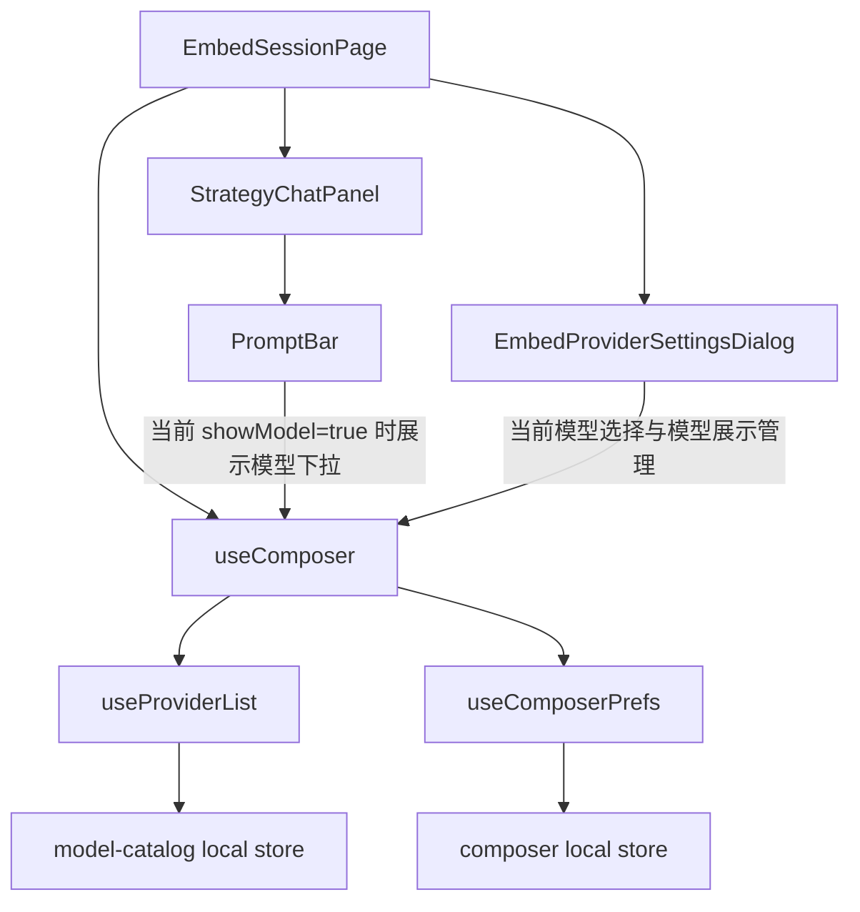
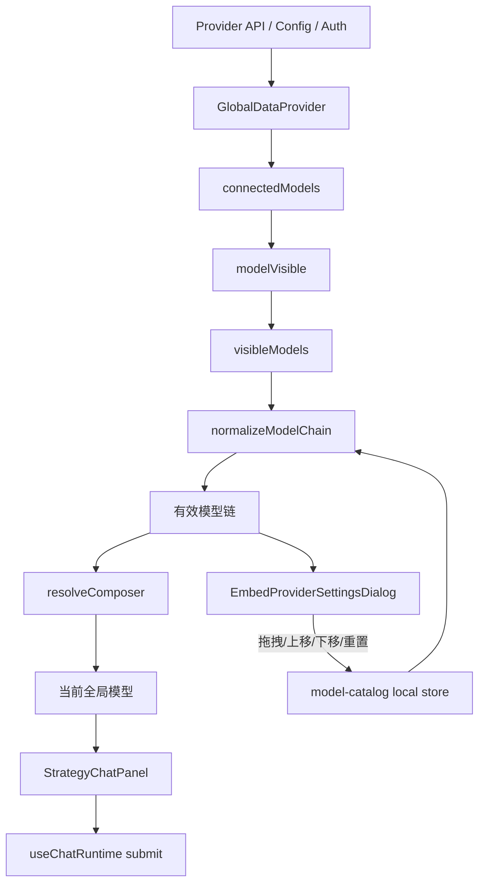
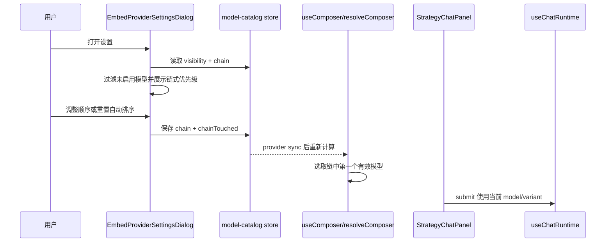

# Embed Session 全局链式模型选择架构设计

2026-05-20 13:42:47 - 设计 [`EmbedSessionPage`](../packages/strategy-front/src/pages/embed-session.tsx:37) 中嵌入会话的全局链式模型选择方案。

## 背景

当前 [`EmbedSessionPage`](../packages/strategy-front/src/pages/embed-session.tsx:287) 将 [`showModel`](../packages/strategy-front/src/pages/embed-session.tsx:304) 设为 `true`，导致 [`StrategyChatPanel`](../packages/strategy-front/src/components/strategy/strategy-chat-panel.tsx:40) 下的 [`PromptBar`](../packages/strategy-front/src/components/chat/prompt-bar.tsx:43) 仍在输入区展示模型选择。用户希望将模型选择从输入区移除，改为在 [`EmbedProviderSettingsDialog`](../packages/strategy-front/src/components/chat/embed-provider-settings-dialog.tsx:141) 中配置全局链式模型优先级。

目标是：

- [`PromptBar`](../packages/strategy-front/src/components/chat/prompt-bar.tsx:43) 不再承担嵌入页模型切换职责。
- [`EmbedProviderSettingsDialog`](../packages/strategy-front/src/components/chat/embed-provider-settings-dialog.tsx:141) 成为嵌入页全局模型链配置入口。
- 模型链只包含客户已启动/已连接且当前展示可用的模型。
- 初始排序由程序自动生成：客户自定义模型优先，其次 Claude 系列，其次 GPT 系列，再其次其他模型。
- 客户可以自主排序；断开 provider 或隐藏模型后，对应模型必须退出排序链。
- 需要注意 [`StrategyChatPanel`](../packages/strategy-front/src/components/strategy/strategy-chat-panel.tsx:40) 仍被 [`strategy-detail.tsx`](../packages/strategy-front/src/pages/strategy-detail.tsx:181) 复用，不能破坏其他页面的模型选择行为。

## 现状关系



## 设计原则

1. **页面级隔离**：只在嵌入会话页关闭输入区模型选择，保留 [`StrategyChatPanel`](../packages/strategy-front/src/components/strategy/strategy-chat-panel.tsx:40) 的通用能力，避免影响 [`strategy-detail.tsx`](../packages/strategy-front/src/pages/strategy-detail.tsx:181)。
2. **全局单一模型来源**：运行时提交仍由 [`useComposer`](../packages/strategy-front/src/hooks/use-composer.ts:6) 输出最终 [`model`](../packages/strategy-front/src/hooks/use-composer.ts:19)，但其解析顺序改为优先读取模型链。
3. **只排序启用模型**：排序候选来自 [`visibleModels`](../packages/strategy-front/src/types/composer.ts:19)，也就是已连接 provider 且未隐藏的模型；断开 provider 或隐藏模型后自动剔除。
4. **用户排序优先于自动排序**：首次或链为空时按规则自动生成；用户拖拽排序后持久化；候选集变化时只清理无效项并追加新增项，不重置用户顺序。
5. **外部配置无密钥**：模型链只保存 provider/model 标识和顺序，不保存 API Key、Base URL、Header 等敏感配置。

## 新增/调整的数据模型

建议扩展 [`model-catalog.ts`](../packages/strategy-front/src/lib/model-catalog.ts:13) 的 local store，仍使用 [`strategy-front.provider-models.v1`](../packages/strategy-front/src/lib/model-catalog.ts:13)，避免新增多处存储源。

```ts
type ModelChainItem = {
  providerID: string
  modelID: string
}

type ModelCatalogStore = {
  user?: Record<string, Vis>
  chain?: ModelChainItem[]
  chainTouched?: boolean
}
```

字段语义：

- `user`：沿用现有模型展示/隐藏状态。
- `chain`：全局链式模型顺序，只保存模型引用。
- `chainTouched`：客户是否手动排序过。为 `false` 或缺省时可按自动规则重建；为 `true` 时保留用户顺序。

## 自动排序规则

候选集：[`catalog.visibleModels`](../packages/strategy-front/src/hooks/use-composer.ts:58)。

推荐 rank：

1. provider source 为 `custom` 或 provider 配置来自自定义提供商。
2. 模型或 provider 名称/id 命中 `claude` / `anthropic`。
3. 模型或 provider 名称/id 命中 `gpt` / `openai`。
4. 其他已启用模型。
5. 同级按 provider 名称、模型名称稳定排序。

伪代码：

```ts
function rank(row: ComposerModel) {
  const text = `${row.provider.id} ${row.provider.name} ${row.id} ${row.name}`.toLowerCase()
  if (row.provider.source === "custom") return 0
  if (text.includes("claude") || text.includes("anthropic")) return 1
  if (text.includes("gpt") || text.includes("openai")) return 2
  return 3
}
```

## 链解析数据流



## 提交时序



## 组件改造方案

### 1. [`EmbedSessionPage`](../packages/strategy-front/src/pages/embed-session.tsx:37)

- 将嵌入页传给 [`StrategyChatPanel`](../packages/strategy-front/src/components/strategy/strategy-chat-panel.tsx:40) 的 [`showModel`](../packages/strategy-front/src/pages/embed-session.tsx:304) 改为 `false`。
- 继续传入 `model` / `variant` / `onModel` / `onVariant`，因为提交与设置弹窗仍依赖这些值。
- 设置按钮继续打开 [`EmbedProviderSettingsDialog`](../packages/strategy-front/src/components/chat/embed-provider-settings-dialog.tsx:141)。

### 2. [`StrategyChatPanel`](../packages/strategy-front/src/components/strategy/strategy-chat-panel.tsx:40)

- 保持通用接口，不删除 `showModel`，避免影响 [`strategy-detail.tsx`](../packages/strategy-front/src/pages/strategy-detail.tsx:181)。
- 不在这里实现链式模型逻辑，只负责透传到 [`PromptBar`](../packages/strategy-front/src/components/chat/prompt-bar.tsx:43)。

### 3. [`PromptBar`](../packages/strategy-front/src/components/chat/prompt-bar.tsx:43)

- 保留已有 `showModel` 条件渲染。
- 当前 [`useEffect`](../packages/strategy-front/src/components/chat/prompt-bar.tsx:62) 会在模型不可见时调用 `onModel(pick)`，若嵌入页 `showModel=false` 后仍会执行自动切换；建议调整为仅在 `showModel` 为真时由输入框纠偏，链式纠偏交给 [`useComposer`](../packages/strategy-front/src/hooks/use-composer.ts:6)。
- 避免隐藏了下拉但仍由 [`PromptBar`](../packages/strategy-front/src/components/chat/prompt-bar.tsx:43) 修改全局模型，造成不可见副作用。

### 4. [`model-catalog.ts`](../packages/strategy-front/src/lib/model-catalog.ts:13)

新增：

- `readModelChain()`：读取链配置。
- `writeModelCatalog()` 扩展支持写入 `chain` 与 `chainTouched`，保留现有 `user`。
- `normalizeModelChain(rows, saved)`：过滤无效模型、保留用户顺序、追加新增可见模型。
- `autoModelChain(rows)`：按自定义 > Claude > GPT > 其他排序。

### 5. [`global-data-provider.tsx`](../packages/strategy-front/src/data/global-data-provider.tsx:247)

- 在 [`buildProvider`](../packages/strategy-front/src/data/global-data-provider.tsx:247) 中基于 `visibleModels` 派生 `chainModels`。
- 建议把 [`ProviderCatalogState`](../packages/strategy-front/src/types/composer.ts:15) 扩展为包含 `chainModels: ComposerModel[]`。
- 候选集变更时不直接写 store，避免 render/load 阶段产生副作用；写入动作放在 Dialog 保存或专门 action 中。

### 6. [`chat-composer.ts`](../packages/strategy-front/src/lib/chat-composer.ts:46)

- 将模型选择顺序调整为：
  1. `state.model` 且仍在有效链中。
  2. `chainModels[0]`。
  3. agent 默认模型且仍可用。
  4. provider config model。
  5. provider default model。
  6. first connected/visible model。
- 如果用户当前 `state.model` 已被隐藏或断开，应自动回退到链首。

> 关键点：是否继续让 `state.model` 优先。建议保留，但前提是它必须仍在有效链中；否则链首接管。这可以兼容客户手动选择某个链内模型的需求，同时保证未启用模型不参与。

### 7. [`EmbedProviderSettingsDialog`](../packages/strategy-front/src/components/chat/embed-provider-settings-dialog.tsx:141)

- 将“当前模型”卡片改造成“链式模型优先级”。
- 显示有效链列表，支持：上移、下移、置顶、移除展示/隐藏、重置自动排序。
- 明确提示：只有已连接 provider 且展示中的模型会参与排序。
- 变体选择仍绑定当前链首模型或当前全局模型；当模型变化导致 variants 不匹配时由 [`resolveComposer`](../packages/strategy-front/src/lib/chat-composer.ts:46) 回退。

## 引用关系风险与规避

| 风险                                                                                                   | 影响                                                                                       | 规避                                                                                                                                                                                           |
| ------------------------------------------------------------------------------------------------------ | ------------------------------------------------------------------------------------------ | ---------------------------------------------------------------------------------------------------------------------------------------------------------------------------------------------- |
| 直接删除 [`PromptBar`](../packages/strategy-front/src/components/chat/prompt-bar.tsx:43) 模型选择      | 影响 [`strategy-detail.tsx`](../packages/strategy-front/src/pages/strategy-detail.tsx:181) | 只在 [`EmbedSessionPage`](../packages/strategy-front/src/pages/embed-session.tsx:37) 设置 `showModel=false`                                                                                    |
| [`PromptBar`](../packages/strategy-front/src/components/chat/prompt-bar.tsx:62) 隐藏后仍自动 `onModel` | 隐性覆盖全局链模型                                                                         | 纠偏 effect 加 `showModel` 条件，链逻辑放到 composer                                                                                                                                           |
| 链中包含已断开 provider                                                                                | 提交失败或模型不可用                                                                       | 每次基于 [`visibleModels`](../packages/strategy-front/src/types/composer.ts:19) normalize                                                                                                      |
| 用户手动排序被刷新覆盖                                                                                 | 使用体验不稳定                                                                             | 通过 `chainTouched` 区分自动链和用户链                                                                                                                                                         |
| 只改嵌入页导致工作区创建页面不一致                                                                     | 新建工作区仍用旧排序                                                                       | [`useWorkspaceCreate`](../packages/strategy-front/src/hooks/use-workspace-create.ts:34) 若依赖 [`resolveComposer`](../packages/strategy-front/src/lib/chat-composer.ts:46)，可自然复用链首模型 |

## 推荐落地顺序

1. 在 [`model-catalog.ts`](../packages/strategy-front/src/lib/model-catalog.ts:13) 增加链读写、自动排序、normalize 工具。
2. 扩展 [`ProviderCatalogState`](../packages/strategy-front/src/types/composer.ts:15) 与 [`buildProvider`](../packages/strategy-front/src/data/global-data-provider.tsx:247)，输出 `chainModels`。
3. 调整 [`resolveComposer`](../packages/strategy-front/src/lib/chat-composer.ts:46)，优先使用有效链首。
4. 调整 [`EmbedProviderSettingsDialog`](../packages/strategy-front/src/components/chat/embed-provider-settings-dialog.tsx:141)，将模型选择改为链式排序 UI。
5. 将 [`EmbedSessionPage`](../packages/strategy-front/src/pages/embed-session.tsx:304) 的 `showModel` 改为 `false`。
6. 调整 [`PromptBar`](../packages/strategy-front/src/components/chat/prompt-bar.tsx:62) 的纠偏 effect，避免隐藏下拉时覆盖链选择。
7. 在 [`packages/strategy-front`](../packages/strategy-front) 执行 `bun typecheck`，重点验证 [`strategy-detail.tsx`](../packages/strategy-front/src/pages/strategy-detail.tsx:181) 与 [`embed-session.tsx`](../packages/strategy-front/src/pages/embed-session.tsx:287) 的接口兼容。
