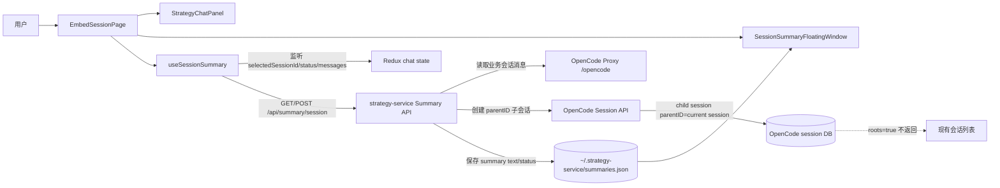
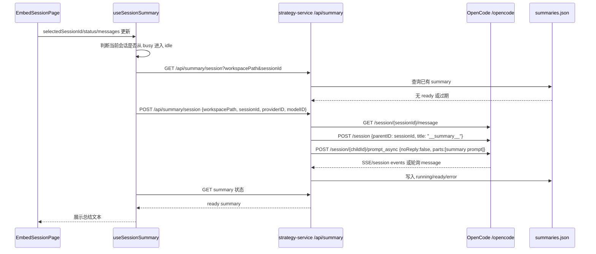

# Embed Session 左侧全局总结浮窗架构设计

2026-05-19 09:30:00 - 针对 `/app/embed/session` 页面新增左侧全局总结浮窗的架构分析与方案。

## 背景

用户希望在嵌入会话页左侧增加一个全局浮动小窗口，功能只做一件事：等当前会话区域完成后自动总结。现有页面存在会话列表，用户明确要求总结会话不要出现在会话列表中。

## 现状分析

- 前端嵌入页入口在 `packages/strategy-front/src/pages/embed-session.tsx`，当前页面顶部含会话选择、创建会话、问题面板、代码区开关、设置与刷新。
- 当前聊天运行态来自 `useStrategySession(workspace?.path)`，它封装会话列表、当前会话详情、会话状态与忙闲判断。
- 会话列表使用 `chatApi.listSessions(path)`，请求 `/session?directory=<workspace>&roots=true`，因此只展示 root session。
- OpenCode 核心的 `Session.create()` 支持 `parentID`，`Session.list({ roots: true })` 会过滤 `parent_id is null`，因此 parent session 不为空的子会话不会进入 root 会话列表。
- `strategy-service` 对 `/opencode` 采用反向代理，前端的大部分会话读写实际透传到 OpenCode 服务。
- OpenCode 已有 `POST /session/:sessionID/summarize`，但它是 compaction 语义，会把 summary assistant message 写回同一个业务会话，不适合做“独立的总结小窗口且不污染当前会话时间线”。

## 设计目标

1. 左侧浮窗为全局 UI，绑定当前工作区和当前选中业务会话。
2. 仅在业务会话完成后触发总结，运行中不触发。
3. 总结过程不能出现在现有会话列表中。
4. 不污染当前业务会话消息时间线，不影响用户继续对话。
5. 不在前端硬编码密钥、模型凭证或服务地址，继续依赖已有外部配置与模型选择。
6. 保持改动边界清晰：前端新增浮窗与 hook，后端新增总结编排接口，OpenCode 尽量复用现有 session child 能力。

## 推荐方案

采用“隐藏子会话总结 + 后端 summary 存储 + 前端浮窗展示”的方式。

核心原则：

- 不使用 root session 作为总结会话。
- 每个业务会话最多绑定一个 summary child session。
- summary child session 创建时传 `parentID = 当前业务会话 id`，因此不会被 `/session?roots=true` 返回。
- 总结结果由 `strategy-service` 持久化到独立 summary 存储，不依赖前端本地状态。
- 前端只展示 summary 存储中的文本、状态、更新时间和手动重试入口。

## Mermaid 架构图



## Mermaid 数据流



## 前端集成点

### `EmbedSessionPage`

在 `packages/strategy-front/src/pages/embed-session.tsx` 的主框架左侧增加浮动组件，建议放在 `relative min-h-0 flex-1` 容器内，与 `WorkspaceQuestionsTrigger` 同级，使用 `absolute left-3 top-3 z-20`。

建议新增组件：

- `packages/strategy-front/src/components/chat/session-summary-floating-window.tsx`
- `packages/strategy-front/src/hooks/use-session-summary.ts`
- `packages/strategy-front/src/api/modules/summary.ts`
- `packages/strategy-front/src/types/summary.ts`

触发条件：

- `workspace.path` 存在。
- `chat.selectedSessionId` 存在。
- `chat.status.type === "idle"`。
- 最近一次状态从 busy/retry 进入 idle，或当前 sessionId 切换后已有可读 summary。
- 当前会话消息中至少包含一次 user message 和一次已完成 assistant message。

UI 状态：

- `empty`: 当前会话还没有可总结内容。
- `waiting`: 当前会话运行中，提示“会话完成后自动总结”。
- `running`: 正在生成总结。
- `ready`: 展示总结内容。
- `error`: 展示错误与重试按钮。

### 会话列表隔离

无需改 `SessionSidebarPanel` 的列表渲染逻辑，因为它读取的是 `useChatSessions(path)` 返回的 root sessions。关键在于 summary session 必须由后端创建为 child session：

```json
{
  "parentID": "业务会话 id",
  "title": "__summary__"
}
```

现有 list 请求带 `roots=true`，OpenCode 会过滤掉 `parentID` 非空的 session，因此总结会话不会出现在会话下拉框与侧边会话列表。

## 后端集成点

建议在 `strategy-service` 新增 `internal/summary` 包并挂载 `/api/summary`，而不是把总结逻辑放在前端直接调用 OpenCode。原因：

- 后端可以集中控制 summary child session 的创建与复用。
- 后端可以持久化业务 session 与 summary session 的绑定关系。
- 后端可以防重复触发，避免前端刷新或多窗口导致多条总结会话。
- 后端可以隐藏“总结会话”实现细节，前端只关心摘要状态。

建议 API：

```http
GET /api/summary/session?workspacePath=<path>&sessionId=<id>
POST /api/summary/session
```

`POST` body：

```json
{
  "workspacePath": "外部传入工作区路径",
  "sessionId": "业务会话 id",
  "providerID": "当前配置 provider",
  "modelID": "当前配置 model",
  "variant": "可选"
}
```

返回模型：

```ts
type SummaryState = "empty" | "running" | "ready" | "error"

type SessionSummary = {
  workspacePath: string
  sessionId: string
  summarySessionId?: string
  state: SummaryState
  text?: string
  messageCount: number
  updatedAt: number
  err?: string
}
```

持久化建议：

- 路径：`config.ServerRootDir()/summaries.json`
- key：`workspacePath + sessionId`
- 写入字段：`workspacePath`, `sessionId`, `summarySessionId`, `messageCount`, `state`, `text`, `updatedAt`, `err`

## 总结生成策略

不建议调用 OpenCode 的 `POST /session/:sessionID/summarize` 作为主方案，因为该接口做的是 compaction，会影响当前业务会话上下文。推荐独立 prompt：

1. 后端读取业务会话消息。
2. 将消息转换为压缩文本上下文。
3. 创建或复用 child summary session。
4. 给 child session 发送总结 prompt。
5. 从 child session 的 assistant message text parts 提取总结结果。
6. 保存到 `summaries.json`。

总结 prompt 应明确：

- 只总结当前业务会话。
- 输出结构化短文本：目标、已完成、关键决策、待处理事项、风险。
- 不执行工具、不修改文件。
- 不泄露密钥或凭证。

## 关键边界

- 总结浮窗不参与会话选择，不调用 `chat.selectSession(summarySessionId)`。
- Summary child session 只作为后台生成载体，不展示在业务 UI。
- 会话列表继续请求 `roots=true`。
- 不要新增前端本地缓存作为唯一数据源；刷新页面后应能从后端恢复总结。
- 多次触发时以后端存储中的 `messageCount` 或最近 assistant completed time 判断是否过期。

## 实施顺序

1. 后端新增 `internal/summary` 模型、store、service。
2. 后端新增 `summary_api.go` 并在 `API.Register()` 挂载 `/api/summary`。
3. 后端通过反向代理目标或内部 HTTP client 调用 OpenCode session/message API。
4. 前端新增 `summaryApi` 与 `useSessionSummary`。
5. 前端新增 `SessionSummaryFloatingWindow`。
6. 在 `EmbedSessionPage` 左侧挂载浮窗。
7. 执行 `packages/strategy-front` 下 `bun typecheck`，`packages/strategy-service` 下 `go test ./...`。

## 风险与规避

- 风险：前端多窗口重复触发总结。
  - 规避：后端按 `workspacePath + sessionId` 加运行锁或状态 CAS。
- 风险：child session 被其他入口展示。
  - 规避：业务会话列表必须保持 `roots=true`，必要时前端额外过滤 `parentID`。
- 风险：总结 prompt 写入业务会话。
  - 规避：总结只写入 child session，绝不向业务 session 发送 prompt。
- 风险：总结会话自身触发问题记录或其他业务统计。
  - 规避：问题记录 append 只发生在前端 `chatApi.sendPrompt()`，后端 summary 调 OpenCode 不走前端问题记录逻辑。
