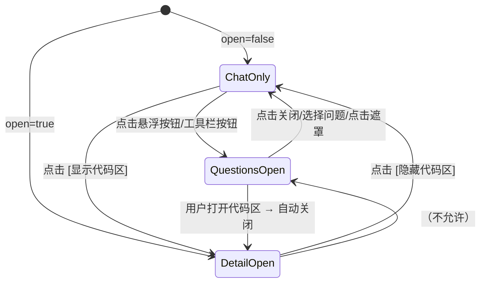

# 工作区全局问题面板设计方案 v3

## 1. 概述

在 [`packages/strategy-front/src/pages/embed-session.tsx`](packages/strategy-front/src/pages/embed-session.tsx) 中添加 **工作区全局问题面板**（Workspace Questions Panel），聚合整个工作区所有 Session 中用户输入的所有 Prompt（User Messages）。

**核心策略：写入时记录，读取时懒加载，不追溯历史。**

---

## 2. 背景分析

### 2.1 当前 EmbedSessionPage 布局

页面使用 `ResizablePanelGroup` 分为左右两栏，由 `open` 状态控制右栏显隐：

```
┌──────────────────────────────────────────────────────┐
│ Toolbar: [Session Select] [创建] [代码区] [设置] [刷新]   │
├──────────────────────────┬───────────────────────────┤
│                         │                           │
│  StrategyChatPanel      │  WorkspaceDetailPane      │
│  (100% / 62%)           │  (0% / 38%)               │
│                         │  (open=false 时隐藏)       │
│  Messages               │  Files / Diff Viewer      │
│  PromptBar              │                           │
│                         │                           │
└──────────────────────────┴───────────────────────────┘
```

### 2.2 数据模型

**Session** ([`ChatSessionSummary`](packages/strategy-front/src/types/chat.ts:1)):

- `id`, `title`, `directory`, `time.created`, `time.updated`

**UserMessage** ([`ChatUserMessage`](packages/strategy-front/src/types/chat.ts:325)):

- `id`, `sessionID`, `role: "user"`, `time.created`, `summary.title`, `summary.body`

### 2.3 提交链路

用户提交 Prompt 时的链路（在 [`useChatRuntime`](packages/strategy-front/src/hooks/use-chat-runtime.ts:422) 中）:

```
用户输入 → useChatRuntime.submit()
         → useSubmit.submit()
           → chatApi.sendPrompt()  → POST /session/{id}/prompt_async
           → draft.clear()          ← 清理草稿
```

插入点：在 `chatApi.sendPrompt()` 成功后，同步将问题写入缓存文件。

---

## 3. 设计方案

### 3.1 核心策略

```
写入时机                              读取时机
──────────────────────────            ──────────────────────
每次用户提交 Prompt，同步记录          打开面板时直接读文件

用户输入 "帮我设计一个策略"
  ↓
chatApi.sendPrompt()
  ↓
写入 .strategy/workspace-questions.json   ← 新增
  ├─ sessionId: {当前session}
  ├─ messageId: {本次消息}
  ├─ text: "帮我设计一个策略"
  └─ timestamp: now
                                        ↓
                                   打开问题面板
                                      ↓
                                   workspaceApi.getWorkspaceFileContent()
                                      ↓
                                   渲染列表
```

### 3.2 为什么不追溯历史

| 方案                        | 复杂度 | 性能       | 效果               |
| --------------------------- | ------ | ---------- | ------------------ |
| ✅ **写入时记录（本方案）** | 极低   | **零开销** | 只有"以后的"问题   |
| ❌ 首次全量遍历             | 高     | 10~30 秒   | 能拿到"以前的"问题 |
| ❌ 后端新增 API             | 中     | 快         | 需要后端改动       |

**结论**：用户说"去掉历史，以后每条新建"，意味着不需要追溯历史对话。只在用户提交新 Prompt 时记录即可。

- 如果用户想看到之前的问题 → 从**当下开始**积累，以后自然会越来越多
- 如果刚开始空的看起来不好看 → 可以在空状态显示提示文案

### 3.3 文件格式

文件路径：`.strategy/workspace-questions.json`

```json
{
  "version": 2,
  "workspacePath": "/home/user/my-workspace",
  "questions": [
    {
      "sessionId": "sess_abc123",
      "sessionTitle": "日内突破策略设计",
      "messageId": "msg_def456",
      "text": "帮我设计一个日内突破策略",
      "createdAt": 1714980000000
    },
    {
      "sessionId": "sess_abc123",
      "sessionTitle": "日内突破策略设计",
      "messageId": "msg_ghi789",
      "text": "帮我加一个移动止损",
      "createdAt": 1714980100000
    }
  ]
}
```

注意：没有 `updatedAt` 字段（增量更新不再需要，因为根本就不遍历了）。

### 3.4 组件架构

```
packages/strategy-front/src/
├── hooks/
│   ├── use-chat-runtime.ts              # 修改：submit成功后追加记录到文件
│   └── use-workspace-questions.ts        # 新增：读取 + 追加写入
├── components/chat/
│   ├── workspace-questions-panel.tsx      # 新增：浮层面板（Sheet）
│   └── workspace-questions-trigger.tsx    # 新增：右侧悬浮按钮
├── pages/
│   └── embed-session.tsx                 # 修改：集成浮层
```

### 3.5 数据流

```mermaid
flowchart TD
    subgraph "写入（每次提交 Prompt）"
        U[用户输入问题] --> S[chatApi.sendPrompt]
        S --> W[写入缓存文件<br/>.strategy/workspace-questions.json]
        W --> D[draft.clear]
    end

    subgraph "读取（每次打开面板）"
        O[用户点击悬浮按钮] --> R[workspaceApi.getWorkspaceFileContent]
        R --> P[渲染问题列表]
    end

    subgraph "点击跳转"
        C[用户点击某问题] --> J[chat.selectSession(sessionId)]
        J --> K[关闭面板]
    end
```

### 3.6 写入时机：Hook 到 `useSubmit`

在 [`useChatRuntime`](packages/strategy-front/src/hooks/use-chat-runtime.ts:422) 中，`useSubmit` 的 `submit` 函数执行成功后，追加一条记录：

```typescript
// useSubmit 中新增回调
const submit = useCallback(async (msg: PromptInputMessage) => {
  // ... 原有逻辑 ...
  await chatApi.sendPrompt(...)

  // 新增：写入工作区问题记录
  await appendQuestion(workspacePath, {
    sessionId,
    messageId: parts[0]?.id,  // 第一条 part 的 id 作为 messageId
    text: msg.text,
  })

  input.onSubmitted?.()
}, [...])
```

或者更优雅的方式：在 `StrategyChatPanel` 的 `onSubmit` 外部包装一层，由 `embed-session.tsx` 来负责记录。

### 3.7 新 Hook：`use-workspace-questions.ts`

```typescript
// === 类型定义 ===
interface QuestionEntry {
  sessionId: string
  sessionTitle?: string
  messageId: string
  text: string
  createdAt: number
}

interface QuestionsIndex {
  version: number
  workspacePath: string
  questions: QuestionEntry[]
}

// === Hook 接口 ===
function useWorkspaceQuestions(workspacePath: string) {
  return {
    questions: QuestionEntry[],         // 所有问题（按时间倒序）
    loaded: boolean,                     // 是否已加载
    refresh: () => Promise<void>,        // 刷新读取
    append: (entry: Omit<QuestionEntry, "createdAt">) => Promise<void>,  // 追加记录
    selectQuestion: (q: QuestionEntry) => {
      chat.selectSession(q.sessionId)
    },
  }
}
```

**核心逻辑**:

```typescript
const FILE_PATH = ".strategy/workspace-questions.json"

async function readCache(workspacePath: string): Promise<QuestionsIndex | null> {
  try {
    const data = await workspaceApi.getWorkspaceFileContent(workspacePath, FILE_PATH)
    return JSON.parse(data.content)
  } catch {
    return null // 文件不存在或解析失败 → 空索引
  }
}

async function writeCache(workspacePath: string, index: QuestionsIndex) {
  await workspaceApi.saveWorkspaceFileContent(workspacePath, FILE_PATH, JSON.stringify(index, null, 2))
}

async function appendQuestion(
  workspacePath: string,
  sessionTitle: string,
  entry: { sessionId: string; messageId: string; text: string },
) {
  const cache = (await readCache(workspacePath)) ?? {
    version: 2,
    workspacePath,
    questions: [],
  }

  cache.questions.push({
    ...entry,
    sessionTitle,
    createdAt: Date.now(),
  })

  await writeCache(workspacePath, cache)
}
```

**关键细节**:

- 读取 `${WORKSPACE_PATH}/.strategy/workspace-questions.json`
- 文件不存在 → 返回空数组（首次使用）
- 每次 `append` 都是 **读取全量 → append → 写回全量**（文件本身很小，几 KB）
- 不需要去重（每条提交都不同）

### 3.8 新组件：`workspace-questions-trigger.tsx`

```
┌──────────────┐
│              │
│    🗨️       │   ← 悬浮在聊天面板右侧边缘
│    12        │   ← 问题数量
│              │
└──────────────┘
```

- `position: absolute`，仅 `open === false` 时渲染
- 展示问题总数
- 点击打开浮层面板

### 3.9 新组件：`workspace-questions-panel.tsx`

使用 [`Sheet`](packages/strategy-front/src/components/ui/sheet.tsx) 从右侧滑出（380px）：

```
┌──────────────────────────────────────────────┐
│ [← 关闭]  工作区问题记录   刷新   总数: 12     │
├──────────────────────────────────────────────┤
│ [🔍 搜索问题...]                              │
├──────────────────────────────────────────────┤
│ 🗨️ 帮我设计一个日内突破策略...     - 2小时前    │
│   日内突破策略设计                              │
├──────────────────────────────────────────────┤
│ 🗨️ 帮我加一个移动止损               - 3小时前   │
│   日内突破策略设计                              │
├──────────────────────────────────────────────┤
│ ...                                           │
└──────────────────────────────────────────────┘
```

**空状态**（首次使用时）：

```
┌──────────────────────────────────────────────┐
│             还没有任何问题记录                  │
│                                              │
│       📝                                    │
│                                              │
│   所有你提交的问题会自动记录在这里              │
│   方便你随时查看和跳转到对应的会话              │
│                                              │
└──────────────────────────────────────────────┘
```

Props:

```typescript
interface Props {
  open: boolean
  onOpenChange: (open: boolean) => void
  questions: QuestionEntry[]
  loaded: boolean
  onRefresh: () => void
  onSelect: (entry: QuestionEntry) => void
}
```

### 3.10 EmbedSessionPage 修改要点

```typescript
export default function EmbedSessionPage() {
  // ... 现有状态 ...
  const [questionsOpen, setQuestionsOpen] = useState(false)
  const qHook = useWorkspaceQuestions(workspace?.path)

  // 包装 submit：提交后记录问题
  const onQuestionSubmit = useCallback((text: string, sessionId: string, title: string) => {
    void qHook.append({
      sessionId,
      text,
      sessionTitle: title,
    })
  }, [qHook])

  // 监听 open 变化：打开 DetailPane 时自动关闭问题面板
  useEffect(() => {
    if (open) setQuestionsOpen(false)
  }, [open])

  return (
    <div className="embed-session-shell relative ...">
      <Toolbar>
        <Button onClick={() => setQuestionsOpen(true)}>
          <MessageSquare className="size-4" />
          问题 ({qHook.questions.length})
        </Button>
      </Toolbar>

      <div className="relative min-h-0 flex-1">
        <ResizablePanelGroup>
          <ResizablePanel>
            <StrategyChatPanel
              // ... 现有 props ...
              // 注入记录回调
            />
          </ResizablePanel>
          {open && <>
            <ResizableHandle />
            <ResizablePanel>
              <WorkspaceDetailPane ... />
            </ResizablePanel>
          </>}
        </ResizablePanelGroup>

        {!open && (
          <WorkspaceQuestionsTrigger
            count={qHook.questions.length}
            onClick={() => setQuestionsOpen(true)}
          />
        )}

        <WorkspaceQuestionsPanel
          open={questionsOpen}
          onOpenChange={setQuestionsOpen}
          questions={qHook.questions}
          loaded={qHook.loaded}
          onRefresh={() => void qHook.refresh()}
          onSelect={(entry) => {
            chat.selectSession(entry.sessionId)
            setQuestionsOpen(false)
          }}
        />
      </div>
    </div>
  )
}
```

---

## 4. 实施计划

### Step 1: 创建 `use-workspace-questions.ts`

- `readCache()` / `writeCache()` / `append()`
- 使用 `loads Map` 做请求去重

### Step 2: 创建 `workspace-questions-trigger.tsx`

- 右侧悬浮按钮
- 仅在 `open === false` 时渲染

### Step 3: 创建 `workspace-questions-panel.tsx`

- Sheet 滑出面板
- 搜索过滤 + 列表渲染 + 空状态

### Step 4: 修改 `use-chat-runtime.ts` 或 `StrategyChatPanel`

- 在 `submit` 成功后调用 `append`
- 或将记录逻辑放在 `embed-session.tsx` 层

### Step 5: 修改 `embed-session.tsx`

- 集成 Hook + 悬浮按钮 + 浮层面板

---

## 5. 状态机



---

## 6. 总结

v3 方案与 v2 的核心区别：

| 维度         | v2（全量遍历）               | v3（写入时记录）                |
| ------------ | ---------------------------- | ------------------------------- |
| 数据来源     | 遍历所有 Session 的 Messages | 仅记录 **本次提交之后** 的问题  |
| 首次加载速度 | 10~30 秒（全量遍历）         | **<100ms**（直接读文件）        |
| 是否追溯历史 | ✅ 能看到历史记录            | ❌ 只能看到 **本次之后** 的问题 |
| 增量更新     | SSE + sessionTimestamps 对比 | **不需要**，每次提交自然写入    |
| 后端依赖     | 依赖 OpenCode API            | 仅依赖 workspaceApi（文件读写） |
| 复杂度       | 高                           | **极低**                        |

**一句话总结**：不追溯历史，从当下开始记录。每次用户提交 Prompt 时同步写入 `.strategy/workspace-questions.json`，打开问题面板时直接读取 — 快，简单，没有性能顾虑。
