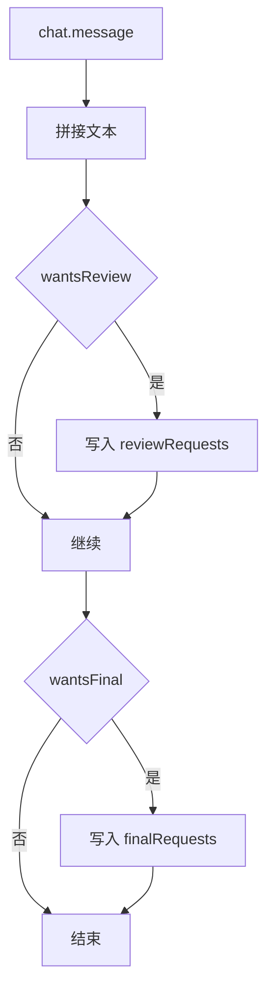
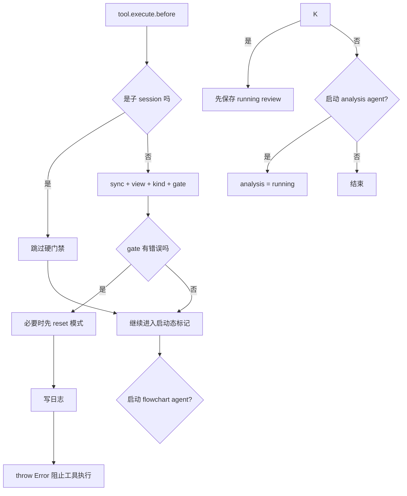
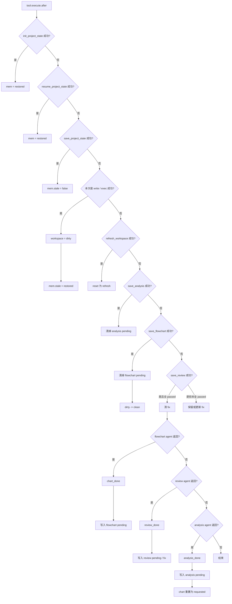

# SmartX Workflow 触发时机流程图

这份文档只回答一个问题：

`smartx-workflow` 在什么时机触发，触发后先看什么，再推进什么状态。

你可以把它理解成 4 层入口：

1. `event`
2. `chat.message`
3. `experimental.chat.system.transform`
4. `tool.execute.before` / `tool.execute.after`

---

## 总览图

```mermaid
flowchart TD
  A[插件加载 build] --> B[event]
  A --> C[chat.message]
  A --> D[experimental.chat.system.transform]
  A --> E[tool.execute.before]
  A --> F[tool.execute.after]

  B --> B1[记录子 session]
  C --> C1[识别 review / final 意图]
  D --> D1[workspace.system]
  D1 --> D2{是否已处理}
  D2 -->|是| D3[注入 workspace 提示]

## 1. `event` 触发时机

### 触发点

- opencode 发出 `session.created`

### 作用

- 只做一件事：识别“这个 session 是不是子 session”
- 如果是子 session，就记到 `subs` 集合里

### 为什么要单独记

- 因为后面的 `workspace.before` / `workspace.system` 有很多强门禁
- 这些门禁只应该卡主 session
- 不应该把基线刷新、project memory 恢复之类的约束错误地下放给 reviewer / analyzer / flowchart 这些子 agent

```mermaid
flowchart TD
  A[event: session.created] --> B{有 parentID 吗}
  B -->|否| C[忽略]
  B -->|是| D[把 session id 放进 subs]
```

---

## 2. `chat.message` 触发时机

### 触发点

- 用户或模型消息进入 `chat.message`

### 作用

- 不直接拦截
- 只做“意图预判”
- 把结果留给下一次 `system.transform` 使用

### 这里识别两类意图

1. 用户想做 `review`
2. 用户想做 `final wrap-up`

### 写入的状态

- `reviewRequests`
- `finalRequests`



---

## 3. `experimental.chat.system.transform` 触发时机

这是最关键的一层。

你可以把它理解成：

- “模型正式回答前的最后一道编排入口”
- 这里决定这轮要不要插系统提示
- 也决定插哪一种提示

### 实际调用顺序

1. 先跑 `workspace.system`
2. 如果 `workspace.system` 已经注入了提示，就直接结束

## 4. `tool.execute.before` 触发时机

这一层是“工具真的执行前”的硬门禁。

### 它做两类事

1. 硬拦截
2. 给即将启动的子 agent 标记运行中状态

### 硬门禁逻辑

#### 先做这几步

1. `sync`
2. `view`
3. `kind`
4. `gate`

#### 然后根据 gate 结果决定

- 如果允许：继续
- 如果不允许：直接 `throw new Error(...)`

### 这里的典型拦截场景

- project memory 还没恢复，就想写代码 / 调试 / review / 收尾
- baseline 还没建完，就想实现
- dirty 状态下直接 review



---

## 5. `tool.execute.after` 触发时机

这一层是状态推进器。

你可以把它理解成：

- 工具执行成功后，workflow 怎么更新内存里的状态图

### 优先级顺序

这里也是按 `step(...)` 顺序依次命中：

1. `project_init`
2. `project_resume`
3. `project_save`
4. `dirty`
5. `refresh`
6. `save_analysis`
7. `save_chart`
8. `save_review`
9. `chart_done`
10. `review_done`
11. `analysis_done`



---


## 7. 你可以怎么读这套触发时机

最实用的读法是：

1. 先看 `chat.message`
   - 它只负责“记住用户想 review / final”

2. 再看 `system.transform`
   - 它负责“这一轮正式回答前，到底该提醒什么”

3. 再看 `tool.execute.before`
   - 它负责“哪些动作现在根本不允许做”

4. 最后看 `tool.execute.after`
   - 它负责“动作做完以后，状态怎么推进”

也就是说：

- `chat.message` 记意图
- `system` 出提示
- `before` 卡动作
- `after` 推状态

---

## 8. 最短心智模型

如果你只想记一句话，可以记这个：

```text
chat.message 负责记需求意图
system.transform 负责决定下一步该做什么
tool.execute.before 负责阻止现在不能做的事
tool.execute.after 负责把已经发生的事写回状态机
- 不再维护 session 级调试顺序约束
workspace 负责 baseline / review / final / project memory 约束
```

