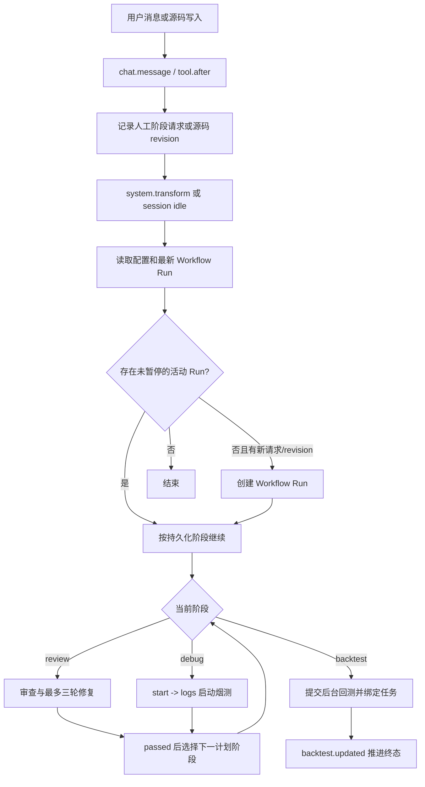
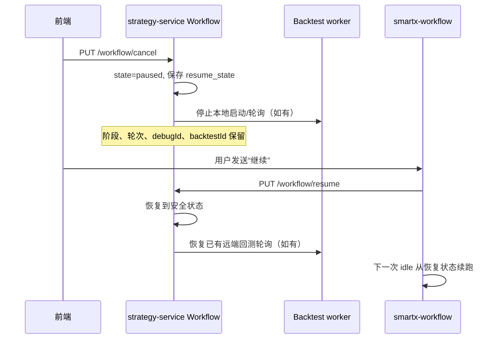

# SmartX Workflow 触发流程

这份文档描述 `smartx-workflow` 如何串起人工/自动审查、调试和回测，以及中断后如何恢复。

## 核心原则

- baseline 与 project memory 只注入提示，不对普通工具做通用硬门禁。
- 审查、调试、回测都进入 strategy-service 持久化的 `workflow_runs`。
- 阶段顺序固定为 `review -> debug -> backtest`，未计划的阶段跳过。
- 前端停止会把最新活动 Run 写成 `paused`，不是永久失败。
- 用户发送精确的“继续/接着/恢复/resume”时，恢复最近未完成 Run。
- SQLite 和 HTTP 是恢复事实来源，插件内 Map 只做当前进程缓存。

## 总览



## 1. `chat.message`

用户消息进入后，插件识别四类明确意图：

- 人工审查：写入 `reviewRequests` 和 `StageRequest.review`。
- 人工调试：写入 `StageRequest.debug`。
- 人工回测：写入 `StageRequest.backtest`。
- 精确继续：只在最新 Run 为 `paused` 或历史 `cancelled` 时调用恢复 API。

一条消息同时要求多个阶段时，它们合并到同一个 `StageRequest`，使用稳定 revision `manual:<messageID>`。例如“先调试，再回测”会创建只包含 debug 和 backtest 的 Run。

“继续修改策略”不等于恢复命令，不会误恢复暂停流程。

## 2. `experimental.chat.system.transform`

模型正式回答前，`workspace.system` 会：

1. 读取本轮 workflow 配置。
2. 从 strategy-service 读取当前 session 最新 Run。
3. 有人工阶段请求或新源码 revision 且没有活动 Run 时，幂等创建 Run。
4. 注入当前需要处理的提示，例如审查报告保存、修复、baseline 或 project memory 提示。

这些提示负责引导，不阻断普通读写、Shell、Python 或手工工具调用。

## 3. `session.status=idle`

idle 是可靠续跑入口。即使模型在源码写入后直接停止、插件重启或没有再次发生 system transform，idle 驱动仍会：

1. 排除子 session。
2. 重新读取配置和服务端最新 Run。
3. 为当前 session 拥有的新源码 revision 创建 Run。
4. 从持久化的 `stage/state` 继续 review、debug 或 backtest。

活动 Run 使用创建时固化的阶段计划，不受之后开关变化影响。

## 4. `tool.execute.before`

before hook 不做通用生命周期门禁，主要负责两件事：

1. 绑定可信的 workspace、session、workflowId 和 requestKey。
2. 在副作用发生前校验阶段顺序并持久化声明状态。

具体规则：

- 用户明确请求后实际启动 reviewer 时会补建审查 Run；`smartx_start` 或 `smartx_run_backtest` 即使文本识别遗漏，也会补建人工 Run。
- 活动 Run 尚在 review 时调用 debug/backtest，会在工具产生副作用前拒绝。
- `smartx_start/logs` 只绑定 debug 阶段 Run。
- `smartx_run_backtest` 只绑定 backtest 阶段 Run。
- baseline 专属 agent/MCP 在 baseline 配置关闭时仍会被拒绝，因为该能力明确未启用。
- 子 session 不能启动主工作区的调试、回测或自动流水线。

## 5. `tool.execute.after`

after hook 根据已经成功发生的事实推进状态：

- 源码写入生成新的 code revision；普通 Bash/Python 运行只记录活动，不生成 revision。
- reviewer 返回普通中文报告后建立 pending，等待主 agent 调用 `smartx_save_review`。
- review 全部通过后进入下一计划阶段；未通过进入 fixing，第三轮仍失败进入 `review_exhausted`。
- debug start 成功进入 `debug/running`；增量 logs 无 fatal 后先写 `debug/passed`，再进入下一阶段。
- 回测由 strategy-service worker 和 `backtest.updated` 推进，浏览器与模型不轮询维持生命周期。

## 6. 暂停与继续



安全恢复点：

- review `dispatching/running -> requested`，重新调度 reviewer。
- review `fixing -> fixing`，继续已有修复上下文。
- debug 有 debugId 时恢复 `running`，继续检查日志；否则回到 `requested`。
- backtest 有已绑定任务时恢复 `running` 并重新接管本地轮询；否则回到 `requested`。

SmartX 当前没有按回测任务取消远端任务的接口。暂停已提交回测时只能停止本地轮询；远端可能继续运行，恢复后会重新对账，不会再次提交已有远端 ID 的任务。如果暂停时远端 ID 尚未返回，提交结果无法安全判断，恢复会明确失败并要求重新发起，而不会冒险重复提交。

## 7. 最短心智模型

```text
chat.message       记录人工阶段请求或恢复意图
system.transform   创建/恢复 Run 并注入下一步提示
session idle       从持久化状态可靠续跑
tool.before        绑定可信上下文并阻止阶段越序
tool.after         按真实工具结果推进 Run
strategy-service   持久化状态、暂停/恢复并驱动回测 worker
strategy-front     展示同一 Run 的阶段、暂停和终态
```
